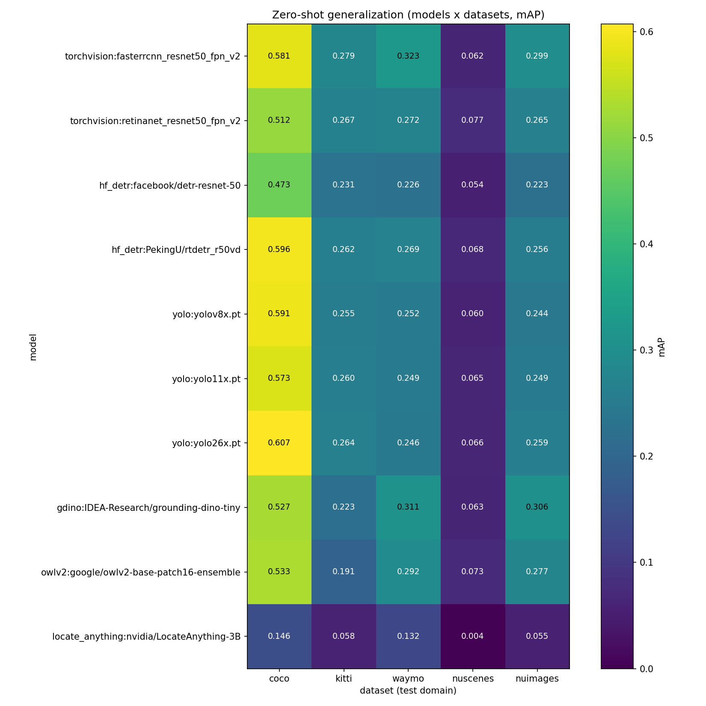
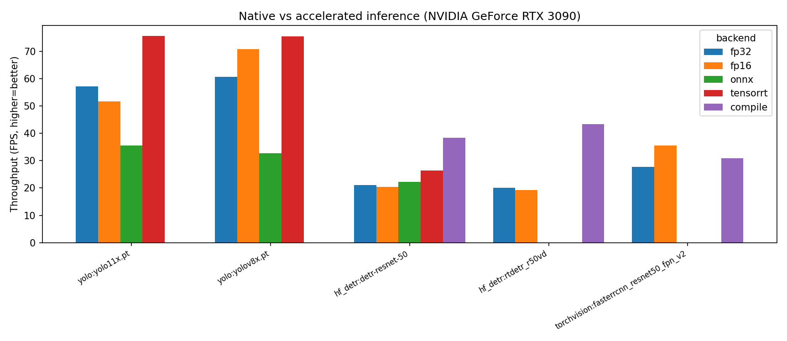
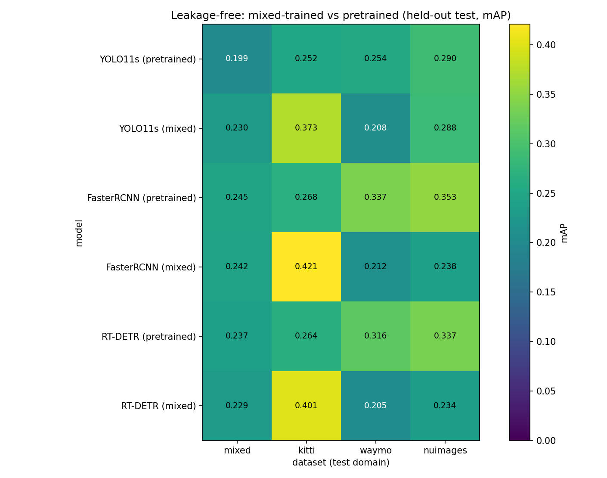
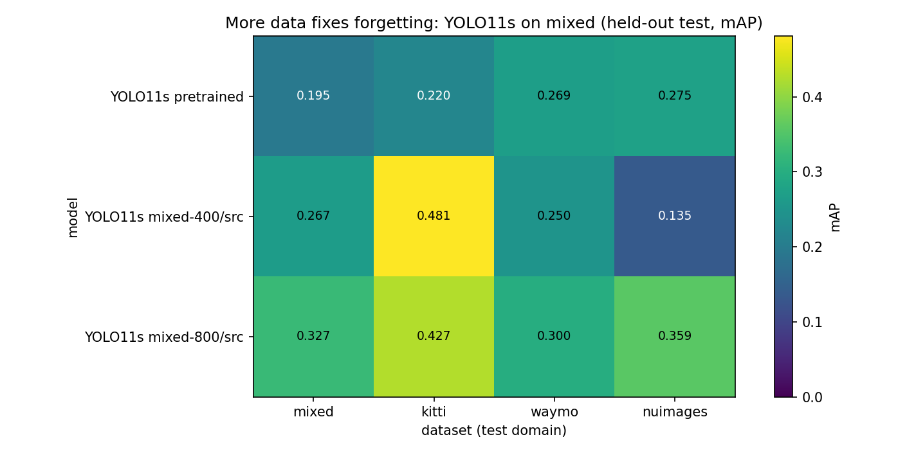
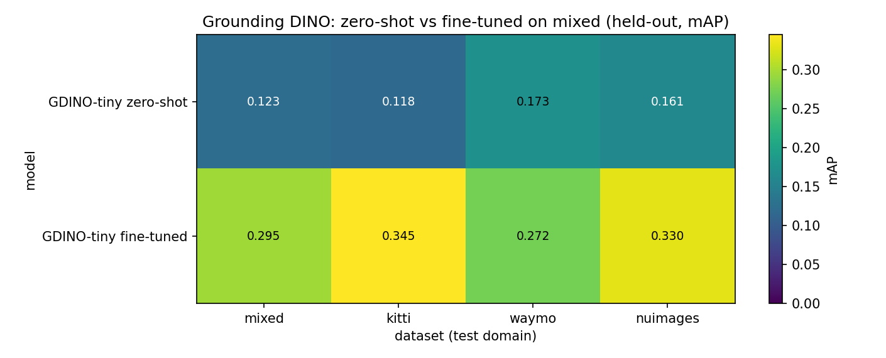
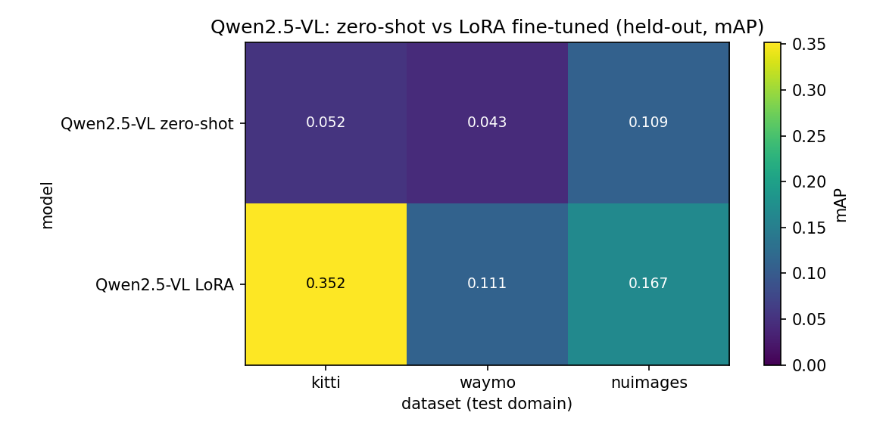
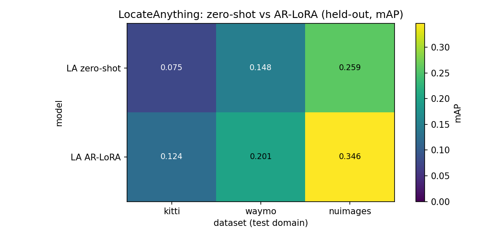

# ngdet Tutorial — Zero-shot 2D detection across datasets

This tutorial walks through using `ngdet` to **pick a detector**, **test it on a
dataset (zero-shot, no training)**, and read the **full COCO evaluation** plus an
optional **human-eval video**. All numbers shown below are from a real run on this
machine (RTX 3090, 50 images/dataset) so you know what to expect.

---

## 0. Environment

Use a Python env that has:

```
torch torchvision transformers ultralytics pycocotools opencv-python matplotlib pyarrow
```

On this machine that is the `py312` conda env:

```bash
PY=/home/lkk688/miniconda/envs/py312/bin/python
```

Always run from the **repo root** (the directory that contains the
`DeepDataMiningLearning` package), so `python -m DeepDataMiningLearning.ngdet.*` resolves.

---

## 1. The mental model

Three pluggable layers (see [README.md](README.md):

```
  detector (any model)  ─┐
                         ├─►  Detection in a UNIFIED taxonomy  ─►  COCO mAP + video
  dataset (any source)  ─┘        (vehicle / person / cyclist)
```

A detector and a dataset speak different "class languages" (COCO's 80 classes vs
KITTI's Car/Pedestrian/Cyclist vs Waymo's Vehicle/...). `ngdet` projects **both**
into one configurable unified taxonomy so any model can be scored on any dataset.

---

## 2. One-command quickstart

```bash
$PY -m DeepDataMiningLearning.ngdet.run_eval \
    --models hf_detr:facebook/detr-resnet-50 yolo:yolo11x.pt \
    --datasets coco kitti nuimages \
    --max-images 50 --score-thr 0.3 --device cuda --video --video-max 40 \
    --coco-ann /mnt/e/Shared/Dataset/coco2017/annotations/instances_val2017.json
```

This evaluates **2 models × 3 datasets = 6 runs** and writes a heatmap, a Markdown
report (with full COCO tables), per-pair videos, and `metrics.json` to
`ngdet/output/` (git-ignored). First run downloads the model weights.

**Full reproduction commands** (the exact runs behind §12's results) are in §12.

---

## 3. Picking a MODEL — the `--models` spec

Each model is `backend:checkpoint`. Pass as many as you want (space-separated).

| Backend key | Adapter | Example specs | Notes |
|---|---|---|---|
| `torchvision` | `detectors/torchvision_det.py` | `torchvision:fasterrcnn_resnet50_fpn_v2`, `torchvision:retinanet_resnet50_fpn_v2`, `torchvision:fcos_resnet50_fpn` | classic CNN baselines |
| `hf_detr` | `detectors/hf_detr.py` | `hf_detr:facebook/detr-resnet-50`, `hf_detr:PekingU/rtdetr_r50vd`, `hf_detr:SenseTime/deformable-detr` | any HF `AutoModelForObjectDetection` |
| `yolo` | `detectors/yolo.py` | `yolo:yolov8x.pt`, `yolo:yolo11x.pt`, `yolo:yolo26x.pt`, `yolo:yolov8s-worldv2.pt` | Ultralytics; `-world` = open-vocab |
| `gdino` | `detectors/grounding_dino.py` | `gdino:IDEA-Research/grounding-dino-tiny`, `gdino:IDEA-Research/grounding-dino-base` | open-vocab, text-prompted |
| `owlv2` | `detectors/grounding_dino.py` | `owlv2:google/owlv2-base-patch16-ensemble` | open-vocab (OWL family) |
| `locate_anything` | `detectors/locate_anything.py` | `locate_anything:nvidia/LocateAnything-3B` | VLM, open-vocab (experimental) |

Closed-set models (torchvision/DETR/YOLO) are mapped to the unified taxonomy by class
**name**. Open-vocab models (Grounding DINO, OWLv2, YOLO-World, LocateAnything) are
**prompted** with the unified class names, so they need no mapping table.

> **Open-vocab caveat (important for fair comparison):** `gdino`/`owlv2` are highly
> *prompt-* and *score-scale-sensitive*. A generic prompt like `"vehicle"` works far
> worse than specific words (`"car . truck . bus"`), and OWL confidences sit on a
> lower scale, so a fixed `--score-thr 0.3` under-counts them. Their lower mAP in the
> heatmap reflects prompt/threshold mismatch — NOT that open-vocab detection is worse.
> Tune the prompt synonyms (in `taxonomy.py`) and threshold per family before concluding.

---

## 4. Picking a DATASET — `--datasets` and `--roots`

Supported: `coco kitti waymo nuscenes nuimages`. Default roots are in
`run_eval.py::DEFAULT_ROOTS`; override any with `--roots name=path`.

- **coco** — needs `--coco-ann /path/to/instances_val2017.json`; root = the
  `val2017/` image dir. This is the *same-domain reference* for the COCO-pretrained models.
- **kitti** — root = KITTI dir with `training/image_2` + `label_2`. Native 2D boxes.
- **waymo** — root = the Waymo v2 parquet dir. Native 2D boxes.
- **nuscenes** — root must contain a `v1.0-trainval` subfolder of JSONs. The full
  trainval JSONs are huge (1.3 GB); for quick runs use the **mini** split via a
  symlink root:

  ```python
  from DeepDataMiningLearning.detection.verify_datasets_video import build_nuscenes_mini_root
  build_nuscenes_mini_root("/mnt/e/Shared/Dataset/NuScenes/v1.0-mini",
                           "DeepDataMiningLearning/ngdet/output/nuscenes_mini_root")
  ```
  then `--roots nuscenes=DeepDataMiningLearning/ngdet/output/nuscenes_mini_root`.
- **nuimages** — root = an extracted nuImages dir containing `samples/` + a
  `v1.0-mini` (or `v1.0-train`/`v1.0-val`) folder of JSONs. nuImages has **real
  human-annotated 2D boxes** (`object_ann.json`), so it is the RELIABLE 2D driving
  benchmark (use it instead of `nuscenes`, whose 2D boxes are projected from 3D and
  are loose — see §8). Extract the mini split with:
  `tar xzf nuimages-v1.0-mini.tgz -C <dir>/nuimages`.

`--max-images N` caps each dataset (use 0 for all). Keep `--score-thr` **identical**
across models, otherwise the comparison is not apples-to-apples.

---

## 5. What you get — the outputs (`ngdet/output/`)

| File | What it is |
|---|---|
| `metrics.json` | machine-readable metrics for every run (full 12 COCO stats + per-class) |
| `report.md` | the human report: summary matrix + generalization gap + **full COCO tables** |
| `heatmap_mAP.png` | the model × dataset generalization heatmap |
| `video_<model>__<dataset>.mp4` | annotated clip (pred = colored, GT = green) |
| `pred_<model>__<dataset>.json` | per-image pred/GT counts for analysis |

### 5a. The generalization heatmap (10 models × 5 datasets)



Rows = models (grouped: classic CNN → DETR family → YOLO → open-vocab → VLM),
columns = test domain, cell = mAP. Full numbers + reproduction commands are in §12.
Four things to read off it:

1. **In-domain COCO is brightest** (left column, ~0.5–0.6) — these are all
   COCO-pretrained, so COCO is their home turf.
2. **Cross-domain compresses the field** — on KITTI every model lands ~0.23–0.28
   regardless of architecture. *Domain shift hurts more than model choice*: the
   2017 Faster R-CNN (0.279) ties the 2025 YOLO26x (0.264). This is the single most
   important teaching point — picking a fancier detector buys little zero-shot
   generalization; adapting to the domain is what matters.
3. **The nuscenes column is dark, the nuimages column is bright** — same scenes,
   but nuscenes 2D GT is *projected from 3D* (loose) while nuimages is *real 2D*.
   The ≈5× jump (§12.2) is a GT-quality artifact, not a model effect.
4. **Open-vocab (GDINO/OWLv2) is competitive and leads on nuImages** — after the
   prompt fix (§3 caveat), text-prompted detectors generalize at least as well as
   the closed-set COCO detectors. The **VLM row (LocateAnything) looks weak only
   because mAP can't rank its unscored boxes** (§12.1 †).

### 5b. The summary matrix (from `report.md`)

`report.md` also prints a model×dataset matrix and a **generalization-gap** table
(`COCO mAP − driving-domain mAP`, higher = worse transfer):

```
Generalization gap        kitti    waymo    nuscenes  nuimages
Faster R-CNN v2          +0.302   +0.258   +0.519    +0.282
YOLO26x                  +0.343   +0.361   +0.541    +0.348
```

→ YOLO's gap is *larger* than Faster R-CNN's: it wins in-domain but transfers worse.

---

## 6. The FULL COCO evaluation table (not just mAP)

For **every** run, `report.md` contains the complete canonical 12-row COCO table
(6 AP + 6 AR) plus per-class AP — identical to what `pycocotools` prints. Example
(`hf_detr:facebook/detr-resnet-50 × coco`):

| Metric | Value |
|---|---|
| AP @[IoU=0.50:0.95 \| area=all \| maxDets=100] | 0.376 |
| AP @[IoU=0.50 \| area=all \| maxDets=100]      | 0.530 |
| AP @[IoU=0.75 \| area=all \| maxDets=100]      | 0.389 |
| AP @[IoU=0.50:0.95 \| area=small \| maxDets=100]  | 0.275 |
| AP @[IoU=0.50:0.95 \| area=medium \| maxDets=100] | 0.415 |
| AP @[IoU=0.50:0.95 \| area=large \| maxDets=100]  | 0.770 |
| AR @[IoU=0.50:0.95 \| area=all \| maxDets=1]   | 0.134 |
| AR @[IoU=0.50:0.95 \| area=all \| maxDets=10]  | ...   |
| AR @[IoU=0.50:0.95 \| area=all \| maxDets=100] | ...   |
| AR small / medium / large                       | ...   |

| Class | AP@[.5:.95] |
|---|---|
| vehicle | 0.574 |
| person  | 0.553 |
| cyclist | 0.000 |

**How to read it:** `AP@[.5:.95]` is the headline mAP (averaged over 10 IoU
thresholds). `AP50`/`AP75` are loose/strict localization. `small/medium/large`
split by object area — note detectors are much stronger on `large` (0.770) than
`small` (0.275). `AR` rows are recall ceilings at 1/10/100 detections per image.

You can also regenerate the report/heatmap from a saved `metrics.json` without
re-running models:

```bash
$PY -m DeepDataMiningLearning.ngdet.report --metrics DeepDataMiningLearning/ngdet/output/metrics.json
```

---

## 7. Video for human eval (`--video`)

- `--video` writes one mp4 per (model, dataset): **predictions in per-class colors,
  ground truth in green**, with a `pred=color GT=green` banner.
- `--video-max N` writes only the first N frames to each clip (a quick human-eval
  sample) while **all** images still count toward mAP. Great for eyeballing failure
  modes without a huge file.

---

## 8. Interpreting results — important caveats

These are *features* of the harness surfacing real issues, not bugs:

1. **NuScenes mAP is low (~0.06) — use nuImages instead.** NuScenes has no native
   2D boxes; its GT here is **3D boxes projected to 2D** (axis-aligned envelope),
   looser than the true visible extent, so IoU with tight predictions is low.
   **nuImages** has real human-annotated 2D boxes: the SAME models score **~0.31–0.37
   mAP on nuImages vs ~0.06 on projected nuscenes (≈5× higher)** — proof the gap was
   the GT, not the models. Keep both columns for the contrast; trust nuImages.

2. **`cyclist` AP is ~0 for COCO models.** COCO annotates `person` + `bicycle`
   separately, while KITTI/Waymo annotate a combined `Cyclist`. The taxonomy folds
   COCO `bicycle`→`cyclist`, but the box geometry differs, so IoU rarely passes.
   This is a documented taxonomy-mismatch finding (see `taxonomy.py`).

3. **Waymo `person` = 0 at 50 images.** Small-sample artifact (the first 50
   time-ordered frames are mostly vehicle-heavy / few clear pedestrians). Increase
   `--max-images` for a stable number.

4. **Keep `--score-thr` fixed** across models or mAP rankings are not comparable.

---

## 9. Changing the unified taxonomy

The label space is configurable via `--taxonomy`:

```
--taxonomy driving3        # vehicle / person / cyclist   (default)
--taxonomy vehicle_person  # 2-class (the categories every AD dataset agrees on)
--taxonomy driving5        # car / truck / bus / person / cyclist
```

Add your own in `taxonomy.py::TAXONOMY_PRESETS` as `{unified_name: [synonyms]}`.

---

## 10. Add your own model (≈50 lines)

```python
# DeepDataMiningLearning/ngdet/detectors/my_backend.py
from .base import BaseDetector, Detection, register

@register("my_backend")
class MyDetector(BaseDetector):
    def __init__(self, taxonomy, device="cuda", score_thr=0.3, model_name=None, **kw):
        super().__init__(taxonomy, device, score_thr)
        # load model; for a closed-set model build the native->unified LUT:
        #   self.id_lut = taxonomy.build_id_lut({id: name, ...})
    def predict(self, image, prompt=None) -> Detection:
        # run model -> native xyxy boxes/scores/ids, then:
        return self._fold_to_unified(boxes_xyxy, scores, native_ids)
```

Import it in `detectors/base.py::build_detector` (next to the others) and run with
`--models my_backend:checkpoint`.

---

## 11. Latency / throughput benchmark (native vs accelerated)

`ngdet.latency` times end-to-end `predict()` (with CUDA sync) and compares the
native PyTorch/HF/Ultralytics path against accelerated backends. Modes a model
can't do are skipped.

```bash
python -m DeepDataMiningLearning.ngdet.latency \
    --models yolo:yolo11x.pt yolo:yolov8x.pt \
             hf_detr:facebook/detr-resnet-50 hf_detr:PekingU/rtdetr_r50vd \
             torchvision:fasterrcnn_resnet50_fpn_v2 \
    --accel fp32 fp16 compile tensorrt --iters 40
```

Writes `latency_report.md` (mean/p50/p90 ms, FPS, speedup), `latency_fps.png`
(grouped bar), and `latency.json` to `ngdet/output/`.



**Accel support per family** (unsupported pairs auto-skip):
- **FP16** — yolo / hf_detr / torchvision
- **torch.compile** — hf_detr / torchvision
- **TensorRT, ONNX** — yolo (Ultralytics native `.engine`/`.onnx`) AND hf_detr
  (DETR via ONNX export + **onnxruntime-gpu** CUDA/TensorRT Execution Providers —
  set `LD_LIBRARY_PATH` to torch's bundled cuDNN, see §11 note in `latency.py`).
- Not wired: torch-tensorrt / OpenVINO (not installed); vLLM serving for the
  LocateAnything VLM (vLLM lacks this custom arch). RT-DETR's deformable-attention
  ops do not export to ONNX/TRT, so its onnx/tensorrt rows auto-skip.

**Measured on an RTX 3090, what to expect:**

| family | native FPS | best accel | speedup |
|---|---|---|---|
| YOLO11x / YOLOv8x | 57 / 61 | **TensorRT** | **×1.32 / ×1.24** (→76 FPS) |
| Faster R-CNN v2 | 28 | FP16 | ×1.28 |
| DETR-R50 | 21 | **compile ×1.82**, TensorRT ×1.25, ONNX ×1.05 | |
| RT-DETR-R50 | 20 | **torch.compile ×2.16** | |

Teaching point: the best accelerator is **architecture-dependent**. YOLO loves
**TensorRT** (NMS-free graph maps cleanly, ×1.3). The DETR family barely benefits
from FP16 (×0.96) but gains most from **torch.compile** (fusing attention ops) —
DETR ×1.82, RT-DETR ×2.16; TensorRT helps DETR too (×1.25) but less than compile.
The CNN-based Faster R-CNN is the opposite — **FP16** helps most (×1.28).

## 11b. Per-module self-tests (no full pipeline)

```bash
$PY -m DeepDataMiningLearning.ngdet.taxonomy            # label folding demo
$PY -m DeepDataMiningLearning.ngdet.datasets --name kitti --max-images 3
$PY -m DeepDataMiningLearning.ngdet.evaluator           # synthetic mAP~1.0 sanity
$PY -m DeepDataMiningLearning.ngdet.video               # 3-frame KITTI GT clip
$PY -m DeepDataMiningLearning.ngdet.detectors.hf_detr   # DETR on a COCO sample
$PY -m DeepDataMiningLearning.ngdet.detectors.yolo      # YOLO on a sample image
```

---

## 12. Full reference results + exact reproduction commands

All numbers below were produced on an **RTX 3090** with the commands shown. `$PY` is
the env from §0; first runs download model weights.

### 12.1 Accuracy — zero-shot mAP@[.5:.95], 10 models × 5 datasets

| model | coco | kitti | waymo | nuscenes | nuimages |
|---|---|---|---|---|---|
| torchvision: Faster R-CNN v2 | 0.581 | 0.279 | 0.323 | 0.062 | 0.299 |
| torchvision: RetinaNet v2 | 0.512 | 0.267 | 0.272 | 0.077 | 0.265 |
| hf_detr: DETR-R50 | 0.473 | 0.231 | 0.226 | 0.054 | 0.223 |
| hf_detr: RT-DETR-R50 | 0.596 | 0.262 | 0.269 | 0.068 | 0.256 |
| yolo: YOLOv8x | 0.591 | 0.255 | 0.252 | 0.060 | 0.244 |
| yolo: YOLO11x | 0.573 | 0.260 | 0.249 | 0.065 | 0.249 |
| yolo: YOLO26x | **0.607** | 0.264 | 0.246 | 0.066 | 0.259 |
| gdino: Grounding-DINO-tiny | 0.527 | 0.223 | 0.311 | 0.063 | **0.306** |
| owlv2: OWLv2-base | 0.533 | 0.191 | 0.292 | 0.073 | 0.277 |
| locate_anything: LocateAnything-3B† | 0.146 | 0.058 | 0.132 | 0.004 | 0.055 |

Samples: coco/kitti/waymo/nuscenes = 120 imgs; **nuimages = 500 (v1.0-val)**; LA = 30.
Waymo used `--waymo-stride 40`; open-vocab used `gdino@0.15`, `owlv2@0.05`.

† **LocateAnything row is the *old* naive adapter** (single multi-class prompt, no
scores). The boxes were always excellent but the adapter starved most classes and
gave mAP no way to rank. **§20 fixes this** (per-class prompting + order-based scores
+ input downscaling): nuImages **0.055 → ~0.30**, Waymo latency **−46×**. Read this
row as "what *not* to do"; §20 has the corrected numbers.

**Headline reads:** in-domain COCO leaders are YOLO26x / RT-DETR (~0.60); cross-domain
**everything compresses to ~0.25 on KITTI** regardless of architecture (domain shift
dominates model choice); open-vocab (GDINO/OWLv2) is competitive after the prompt fix
and **leads on nuImages**.

### 12.2 nuScenes (projected 3D) vs nuImages (real 2D) — same models

| | nuscenes (projected) | nuimages (real 2D) | ratio |
|---|---|---|---|
| Faster R-CNN | 0.062 | 0.299 | **4.8×** |
| Grounding DINO | 0.063 | 0.306 | **4.9×** |
| YOLO26x | 0.066 | 0.259 | 3.9× |

→ nuScenes' 2D GT is **projected from 3D (loose envelope)**, so low mAP there is a
**GT artifact**, not model failure. **Use nuImages for 2D driving eval.**

### 12.3 Latency — native vs accelerated (FPS, RTX 3090)

| model | fp32 | fp16 | compile | tensorrt | onnx |
|---|---|---|---|---|---|
| YOLO11x | 57 | 52 | — | **76 (×1.32)** | 36 |
| YOLOv8x | 61 | 71 | — | **75 (×1.24)** | 33 |
| Faster R-CNN v2 | 28 | **36 (×1.28)** | 31 | — | — |
| DETR-R50 | 21 | 20 | **38 (×1.82)** | 26 (×1.25) | 22 |
| RT-DETR-R50 | 20 | 19 | **43 (×2.16)** | skip‡ | skip‡ |

‡ RT-DETR's deformable-attention ops don't export to ONNX/TensorRT (auto-skipped).
**Best accelerator is architecture-dependent**: YOLO→TensorRT, DETR-family→torch.compile,
CNN R-CNN→FP16.

### 12.4 Exact commands

```bash
# --- (A) Accuracy: 9 models × {coco,kitti,waymo,nuscenes} ---
$PY -m DeepDataMiningLearning.ngdet.run_eval \
  --models torchvision:fasterrcnn_resnet50_fpn_v2 torchvision:retinanet_resnet50_fpn_v2 \
           hf_detr:facebook/detr-resnet-50 hf_detr:PekingU/rtdetr_r50vd \
           yolo:yolov8x.pt yolo:yolo11x.pt yolo:yolo26x.pt \
           gdino:IDEA-Research/grounding-dino-tiny@0.15 \
           owlv2:google/owlv2-base-patch16-ensemble@0.05 \
  --datasets coco kitti waymo nuscenes --max-images 120 --waymo-stride 40 \
  --device cuda --video --video-max 16 \
  --coco-ann <coco>/annotations/instances_val2017.json \
  --roots nuscenes=DeepDataMiningLearning/ngdet/output/nuscenes_mini_root

# --- (B) nuImages val (real 2D), large sample ---
$PY -m DeepDataMiningLearning.ngdet.run_eval \
  --models <same 9 models> \
  --datasets nuimages --nuimages-version v1.0-val --max-images 500 \
  --device cuda --out-dir DeepDataMiningLearning/ngdet/output/nuimages_run

# --- (C) LocateAnything VLM row (slow; smaller sample) ---
$PY -m DeepDataMiningLearning.ngdet.run_eval \
  --models locate_anything:nvidia/LocateAnything-3B \
  --datasets coco kitti waymo nuscenes --max-images 30 --waymo-stride 40 \
  --device cuda --out-dir DeepDataMiningLearning/ngdet/output/locate_anything

# --- (D) Latency (DETR onnx/tensorrt need the LD_LIBRARY_PATH from README §4) ---
SP=$(python -c "import site; print(site.getsitepackages()[0])")
export LD_LIBRARY_PATH=$(ls -d $SP/nvidia/*/lib | tr '\n' ':')$LD_LIBRARY_PATH
$PY -m DeepDataMiningLearning.ngdet.latency \
  --models yolo:yolo11x.pt yolo:yolov8x.pt \
           hf_detr:facebook/detr-resnet-50 hf_detr:PekingU/rtdetr_r50vd \
           torchvision:fasterrcnn_resnet50_fpn_v2 \
  --accel fp32 fp16 compile tensorrt onnx --iters 40
```

Runs (A)/(B)/(C) write separate `metrics.json` files; combine them into one heatmap
by concatenating the metrics lists and calling `report.write_markdown_report` /
`report.plot_heatmap` (or just run `report.py --metrics <file>` per run).

---

## 13. Datasets in depth — native format → unified format

Every dataset speaks a different format. The job of [datasets.py](datasets.py) is to
convert each into one common `EvalSample(image, gt_boxes [xyxy px], gt_labels [unified id])`.
Below: what the raw data looks like, and where the conversion lives.

### 13.1 COCO — `instances_val2017.json`
- **Native**: one big JSON with `images`, `annotations` (`bbox = [x, y, w, h]`,
  `category_id`), `categories`. Box = top-left + width/height.
- **Convert**: `torchvision.datasets.CocoDetection` reads it; we do xywh→xyxy and map
  `category_id`→unified by the category *name*.
- **Code**: [`EvalDataset._build_coco`](datasets.py) · ref: [cocodataset.org/#format-data](https://cocodataset.org/#format-data)

### 13.2 KITTI — per-image label `.txt`
- **Native**: `training/label_2/000000.txt`, one object per line:
  `type truncation occlusion alpha x1 y1 x2 y2 h w l X Y Z ry`. Columns 4–7 are the
  **2D box (xyxy pixels)** — already native 2D.
- **Convert**: reuse `detection/dataset_kitti.py::KittiDataset` (returns torch
  `{boxes, labels}`); map KITTI ids (`Car/Pedestrian/Cyclist/...`) → unified.
- **Code**: [`_build_kitti`](datasets.py), [dataset_kitti.py](../detection/dataset_kitti.py) ·
  ref: [KITTI object benchmark](https://www.cvlibs.net/datasets/kitti/eval_object.php)

### 13.3 Waymo Open (v2) — Parquet
- **Native**: column-store parquet. `camera_image/*.parquet` (JPEG bytes per frame),
  `camera_box/*.parquet` with `[CameraBoxComponent].box.center.{x,y}` +
  `size.{x,y}` (center+size **pixels**) and `.type` (1=Vehicle,2=Pedestrian,3=Cyclist).
  Frames are grouped **by 20 s segment**.
- **Convert**: `detection/dataset_waymov3_1.py::Waymo2DDataset` reads parquet,
  cx,cy,w,h→xyxy; **`--waymo-stride` is needed** so a sample spans many segments
  (a contiguous slice = the first vehicle-heavy segment only).
- **Code**: [`_build_waymo`](datasets.py), [dataset_waymov3_1.py](../detection/dataset_waymov3_1.py) ·
  ref: [waymo.com/open](https://waymo.com/open/) · [format docs](https://github.com/waymo-research/waymo-open-dataset)

### 13.4 nuScenes — JSON tables, **3D→2D projection**
- **Native**: relational JSON (`sample_data`, `sample_annotation` with 3D box
  `translation/size/rotation`, `calibrated_sensor`, `ego_pose`). **No native 2D boxes.**
- **Convert**: `detection/dataset_nuscenes.py` projects the 3D cuboid's 8 corners to the
  camera and takes the **axis-aligned min/max envelope** → a *loose* 2D box. We added
  `min_visibility`/`require_lidar_pts` filtering, but looseness is inherent (§8).
- **Code**: [`_build_nuscenes`](datasets.py), [dataset_nuscenes.py](../detection/dataset_nuscenes.py) ·
  ref: [nuscenes.org](https://www.nuscenes.org/nuscenes)

### 13.5 nuImages — JSON, **real human-annotated 2D** (recommended)
- **Native**: `object_ann.json` has `bbox = [x1, y1, x2, y2]` (pixels, real 2D) +
  `category_token` + optional instance `mask`; `sample_data.json` lists key-frame images.
- **Convert**: we parse the JSON directly (no devkit dependency), group annotations by
  image, and map the dotted category (`vehicle.bicycle`, `human.pedestrian.adult`) to
  unified by **right-to-left token matching** (`bicycle`→cyclist before `vehicle`).
- **Code**: [`_build_nuimages` + `nuimages_name_to_unified`](datasets.py) ·
  ref: [nuimages.org](https://www.nuscenes.org/nuimages)

> **Label unification** for all of the above lives in [taxonomy.py](taxonomy.py):
> `Taxonomy.build_id_lut` maps a source `{id: name}` table to unified ids by name, so
> a class outside the active taxonomy (e.g. `traffic_cone`) folds to "ignore".

---

## 14. Model architectures — structure, loss, training, code

For each family below: **how it's built**, the **loss function (with math)**, the
**training recipe**, and links to the **reference implementation** (the actual model
code you can read) plus our thin **adapter** in [detectors/](detectors/).
Math renders on GitHub (LaTeX). Notation: $b=(x,y,w,h)$ a box, $p$ a class
probability, $\mathbb{1}[\cdot]$ an indicator, $N_{pos}$ the number of positives.

---

### 14.1 Two-stage CNN — Faster R-CNN

**Structure.** Backbone (ResNet-50 + FPN) → **Region Proposal Network (RPN)** slides
over feature maps and, per anchor, predicts objectness + a box delta → top proposals
go through **RoIAlign** → a **detection head** outputs per-class scores + refined
boxes. Anchor-based; needs NMS at inference.

**Loss.** A multi-task sum, applied at both the RPN and the head:

$$ L(\{p_i\},\{t_i\}) = \frac{1}{N_{cls}}\sum_i L_{cls}(p_i,p_i^*) \;+\; \lambda\,\frac{1}{N_{reg}}\sum_i p_i^*\,L_{reg}(t_i,t_i^*) $$

- $L_{cls}$ = log loss (RPN: object/background; head: softmax over classes).
- $L_{reg}$ = smooth-L1 on **parameterized** deltas $t_x=(x-x_a)/w_a,\; t_w=\log(w/w_a)$
  (subscript $a$ = anchor); only positives ($p_i^*=1$) contribute.
- $\text{smooth}_{L1}(x)=0.5x^2$ if $|x|<1$, else $|x|-0.5$.

**Training.** Anchors labeled by IoU (≥0.7 → positive, <0.3 → negative); RPN +
detector trained **jointly** with SGD; balanced minibatch of anchors/RoIs.

**Code.** torchvision: [faster_rcnn.py](https://github.com/pytorch/vision/blob/main/torchvision/models/detection/faster_rcnn.py),
[rpn.py](https://github.com/pytorch/vision/blob/main/torchvision/models/detection/rpn.py),
[roi_heads.py](https://github.com/pytorch/vision/blob/main/torchvision/models/detection/roi_heads.py)
· paper [Faster R-CNN (2015)](https://arxiv.org/abs/1506.01497) · adapter [torchvision_det.py](detectors/torchvision_det.py)

---

### 14.2 One-stage CNN — RetinaNet (anchor) & FCOS (anchor-free)

**Structure.** Dense per-location prediction in one pass. RetinaNet: FPN + two small
subnets (cls, box) over anchors. FCOS: FPN + per-pixel heads, **no anchors** — each
foreground pixel regresses 4 distances $(l,t,r,b)$ to the box sides + a centerness.

**Loss — RetinaNet** solves foreground/background imbalance with **focal loss**:

$$ FL(p_t) = -\alpha_t\,(1-p_t)^{\gamma}\,\log(p_t), \qquad \gamma=2,\ \alpha=0.25 $$

where $p_t=p$ if the anchor is positive else $1-p$. Box term = smooth-L1 on anchor deltas.

**Loss — FCOS**: focal (cls) + IoU/GIoU (box) + BCE (centerness):

$$ L = \tfrac{1}{N_{pos}}\!\sum L_{cls} + \tfrac{\lambda}{N_{pos}}\!\sum \mathbb{1}[c^*>0]\,L_{reg} + \tfrac{1}{N_{pos}}\!\sum \mathbb{1}[c^*>0]\,L_{ctr},\quad
\text{ctr}^*=\sqrt{\tfrac{\min(l,r)}{\max(l,r)}\cdot\tfrac{\min(t,b)}{\max(t,b)}} $$

Centerness down-weights boxes predicted far from object centers (suppresses low-quality far predictions).

**Training.** RetinaNet: every anchor contributes to focal loss (no sampling needed).
FCOS: a pixel is positive if it falls in a GT box (+ FPN scale range); centerness
multiplies the score at test time.

**Code.** torchvision: [retinanet.py](https://github.com/pytorch/vision/blob/main/torchvision/models/detection/retinanet.py),
[fcos.py](https://github.com/pytorch/vision/blob/main/torchvision/models/detection/fcos.py)
· papers [Focal Loss/RetinaNet (2017)](https://arxiv.org/abs/1708.02002),
[FCOS (2019)](https://arxiv.org/abs/1904.01355) · adapter [torchvision_det.py](detectors/torchvision_det.py)

---

### 14.3 Transformer set-prediction — DETR & RT-DETR

**Structure.** CNN backbone → transformer **encoder** (over flattened features) →
**decoder** with $N$ learned **object queries** → each query → (class, box). **No
anchors, no NMS.** RT-DETR replaces the heavy encoder with an efficient hybrid
CNN+attention encoder and adds IoU-aware query selection for real-time speed.

**Loss.** First find the optimal one-to-one assignment $\hat\sigma$ between the $N$
predictions and the (padded) GT set via the **Hungarian algorithm**:

$$ \hat\sigma=\arg\min_{\sigma}\sum_{i}\Big[-\mathbb{1}[c_i\neq\varnothing]\,\hat p_{\sigma(i)}(c_i) + \mathbb{1}[c_i\neq\varnothing]\,L_{box}(b_i,\hat b_{\sigma(i)})\Big] $$

then minimize the **Hungarian loss** over that matching:

$$ \mathcal{L}=\sum_{i}\Big[-\log\hat p_{\hat\sigma(i)}(c_i) + \mathbb{1}[c_i\neq\varnothing]\,L_{box}(b_i,\hat b_{\hat\sigma(i)})\Big],\quad
L_{box}=\lambda_{L1}\lVert b-\hat b\rVert_1 + \lambda_{iou}\,L_{GIoU} $$

(RT-DETR swaps the cls term for **varifocal loss** and adds denoising queries.)

**Training.** AdamW, long schedule (original DETR: 300–500 epochs), auxiliary losses
at every decoder layer; no NMS/anchor hyper-params to tune. The bipartite matching is
what removes duplicate predictions (one query per object).

**Code.** transformers: [modeling_detr.py](https://github.com/huggingface/transformers/blob/main/src/transformers/models/detr/modeling_detr.py)
(`DetrHungarianMatcher`, `DetrLoss`),
[modeling_rt_detr.py](https://github.com/huggingface/transformers/blob/main/src/transformers/models/rt_detr/modeling_rt_detr.py)
· papers [DETR (2020)](https://arxiv.org/abs/2005.12872), [RT-DETR (2023)](https://arxiv.org/abs/2304.08069)
· adapter [hf_detr.py](detectors/hf_detr.py)

---

### 14.4 Real-time one-stage — YOLOv8 / YOLO11 / YOLO26

**Structure.** Backbone (CSP) + neck (PAN-FPN) + **decoupled, anchor-free head**
(v8+). The box branch predicts each side as a **discrete distribution over bins**
(Distribution Focal Loss). v10/YOLO26 add **NMS-free** inference via consistent
dual one-to-one + one-to-many assignment.

**Loss.** Three terms, with a **task-aligned assigner** choosing positives:

$$ L = \lambda_{box}\,L_{CIoU} + \lambda_{dfl}\,L_{DFL} + \lambda_{cls}\,L_{BCE} $$

- **CIoU** (box): $\;L_{CIoU}=1-IoU+\dfrac{\rho^2(b,b^{gt})}{c^2}+\alpha v\;$ — adds
  center-distance ($\rho$, $c$ = diagonal of the enclosing box) and aspect-ratio ($v$) penalties.
- **DFL** (box sharpness): treats an edge offset $y$ between bins $y_i,y_{i+1}$ as a
  distribution, $\;L_{DFL}=-\big[(y_{i+1}-y)\log S_i+(y-y_i)\log S_{i+1}\big]$.
- **BCE** (class): binary cross-entropy per class (multi-label friendly).
- **Assigner (TaskAligned):** picks positives by a score $t=p^{\alpha}\cdot u^{\beta}$
  (classification $p$ × IoU $u$).

**Training.** Heavy augmentation (mosaic, mixup, copy-paste), EMA weights, cosine LR;
mosaic turned off for the last epochs. NMS at inference (except NMS-free v10/26).

**Code.** ultralytics: [head.py `Detect`](https://github.com/ultralytics/ultralytics/blob/main/ultralytics/nn/modules/head.py),
[loss.py `v8DetectionLoss`](https://github.com/ultralytics/ultralytics/blob/main/ultralytics/utils/loss.py),
[tal.py `TaskAlignedAssigner`](https://github.com/ultralytics/ultralytics/blob/main/ultralytics/utils/tal.py)
· refs [Ultralytics docs](https://docs.ultralytics.com/models/), [YOLOv10 NMS-free (2024)](https://arxiv.org/abs/2405.14458)
· adapter [yolo.py](detectors/yolo.py)

---

### 14.5 Open-vocabulary — Grounding DINO & OWLv2

**Structure.** Detect *arbitrary* text-named classes. **Grounding DINO** = a DINO
(DETR-style) detector + a BERT text encoder + a **feature enhancer** that does
image↔text cross-attention; queries are aligned to text tokens. **OWLv2** = a CLIP
ViT where each patch/output token emits a box + an embedding, scored by dot-product
against the **text query embeddings**.

**Loss.** Same set-prediction backbone as DETR (Hungarian matching + L1 + GIoU), but
the classification cost becomes a **contrastive / region-text alignment** term — a
query is "class $k$" if its embedding $q$ aligns with the text embedding $t_k$:

$$ s_{k}=\langle q,\,t_k\rangle,\qquad L_{align}=\text{focal/BCE}\big(\sigma(s_k),\,y_k\big) $$

OWLv2 additionally **self-trains** on pseudo-box labels mined from web image-text data.

**Training.** Pretrain on huge grounded/detection+caption corpora (Objects365, GoldG,
…); at inference you just pass class names as the prompt — no fine-tuning needed
(that's why ngdet uses them zero-shot).

**Code.** transformers: [modeling_grounding_dino.py](https://github.com/huggingface/transformers/blob/main/src/transformers/models/grounding_dino/modeling_grounding_dino.py),
[modeling_owlv2.py](https://github.com/huggingface/transformers/blob/main/src/transformers/models/owlv2/modeling_owlv2.py)
· original [IDEA-Research/GroundingDINO](https://github.com/IDEA-Research/GroundingDINO)
· papers [Grounding DINO (2023)](https://arxiv.org/abs/2303.05499), [OWLv2 (2023)](https://arxiv.org/abs/2306.09683)
· adapter [grounding_dino.py](detectors/grounding_dino.py)

---

### 14.6 VLM grounding — NVIDIA LocateAnything-3B

**Structure.** A **vision-language model** (Moon-ViT vision encoder + Qwen2.5 LLM
decoder + MLP projector) that **generates boxes as text**. Output interleaves a class
tag and its boxes: `<ref>car</ref><box><x1><y1><x2><y2></box>...` with coords in
[0,1000]. **Parallel Box Decoding (PBD)** emits all 4 coords of a box as one atomic
block (the fast "MTP" mode) instead of one coordinate token at a time.

**Loss.** Trained like an LLM — **autoregressive cross-entropy** over the output token
sequence (the special box/coordinate tokens included):

$$ \mathcal{L} = -\sum_{t}\log P_\theta\big(x_t \mid x_{<t},\,\text{image}\big) $$

plus the PBD head that predicts the coordinate set in parallel. There is **no
explicit IoU/box-regression loss and no confidence score** — which is exactly why its
mAP here is structurally understated (§12.1 †): mAP needs ranked detections.

**Training.** Vision-language pretraining + instruction tuning on a large grounding
dataset (138 M queries, 785 M boxes per the paper); detection becomes one of several
localization "skills" the VLM is taught.

**Code.** model repo (custom `modeling_locateanything.py`, `trust_remote_code`):
[nvidia/LocateAnything-3B](https://huggingface.co/nvidia/LocateAnything-3B)
· paper [LocateAnything (2026)](https://arxiv.org/abs/2605.27365) · adapter [locate_anything.py](detectors/locate_anything.py)

---

### 14.7 At a glance

| family | anchors? | NMS? | classification target | box loss | matching/assigner |
|---|---|---|---|---|---|
| Faster R-CNN | ✅ | ✅ | softmax | smooth-L1 | IoU to anchors |
| RetinaNet | ✅ | ✅ | focal | smooth-L1 | IoU to anchors |
| FCOS | ❌ | ✅ | focal + centerness | GIoU | in-box + scale |
| DETR / RT-DETR | ❌ | ❌ | CE / varifocal | L1 + GIoU | Hungarian (1-to-1) |
| YOLOv8/11/26 | ❌ | ✅/❌¹ | BCE | CIoU + DFL | TaskAligned |
| GDINO / OWLv2 | ❌ | ❌/✅ | region-text contrastive | L1 + GIoU | Hungarian |
| LocateAnything | ❌ | ❌ | token cross-entropy (LM) | — (generated) | — |

¹ YOLO26 / v10 are NMS-free.

---

## 15. Acceleration in depth — how the speedups work

The [latency.py](latency.py) benchmark applies these to the same model and times
end-to-end `predict()`. Each adapter implements the modes it supports (others skip).

### 15.1 FP16 (half precision)
Run weights/activations in 16-bit → uses GPU **tensor cores**, ~halves memory
bandwidth. Best for **compute-bound CNNs** (Faster R-CNN ×1.28). Transformers (DETR)
barely gain (×0.96) — they are more overhead/launch-bound than FLOP-bound at this size.
- Code: `model.half()` + cast inputs, in [torchvision_det.py](detectors/torchvision_det.py) / [hf_detr.py](detectors/hf_detr.py).

### 15.2 torch.compile (TorchInductor)
Captures the model graph and **fuses** many small ops into few kernels, cutting
Python/launch overhead. Best for models with **many tiny ops** — the DETR family's
attention blocks: **DETR ×1.82, RT-DETR ×2.16** (the biggest single win in the study).
- Code: `torch.compile(model, mode="reduce-overhead")`; first call pays a compile cost
  (absorbed by warmup). In [hf_detr.py](detectors/hf_detr.py) / [torchvision_det.py](detectors/torchvision_det.py).
- Ref: [torch.compile](https://pytorch.org/docs/stable/torch.compiler.html)

### 15.3 TensorRT (NVIDIA)
Builds an optimized **inference engine** from the graph: layer/tensor fusion, kernel
auto-tuning, fixed precision. Needs a (mostly) **static graph**, so it shines on
**YOLO** (clean CNN): ×1.32 → 76 FPS. Used two ways here:
- **YOLO**: Ultralytics native `model.export(format="engine")` → `.engine`. [yolo.py](detectors/yolo.py).
- **DETR**: export to ONNX (fixed 800×1333) → run via **onnxruntime-gpu's TensorRT
  Execution Provider** (×1.25). [hf_detr.py](detectors/hf_detr.py)`._setup_onnx`.
- RT-DETR's deformable-attention ops aren't TRT/ONNX-exportable → auto-skipped.
- Ref: [TensorRT](https://docs.nvidia.com/deeplearning/tensorrt/)

### 15.4 ONNX + onnxruntime
ONNX is a portable graph format; **onnxruntime** runs it with pluggable
**Execution Providers** (CPU / CUDA / TensorRT). Here it is the bridge that gives DETR
its GPU-accelerated rows. The model is exported at a **fixed input size** (boxes are
normalized, so post-processing with the original image size stays correct).
- Code: `torch.onnx.export` + `ort.InferenceSession(providers=[...])` in [hf_detr.py](detectors/hf_detr.py).
- Needs torch's bundled cuDNN on `LD_LIBRARY_PATH` (see README §4 / §11).
- Ref: [onnxruntime EPs](https://onnxruntime.ai/docs/execution-providers/)

### 15.5 Not wired (documented)
torch-tensorrt and OpenVINO (not installed); **vLLM** could *serve* the LocateAnything
VLM but lacks its custom architecture, so it is the serving path, not a drop-in here.

**One-line takeaway:** match the accelerator to the architecture — **CNN→FP16/TensorRT,
transformer(DETR)→torch.compile, YOLO→TensorRT**.

---

## 16. Training — raw PyTorch loop vs HuggingFace Trainer

So far everything was *zero-shot* (no training). [train.py](train.py) is a compact,
**modular, teaching-first** trainer that shows the two ways to train a detector, on the
same `EvalDataset` data + unified taxonomy. It is deliberately simple (no heavy
augmentation) so students can read every step.

### 16.1 The two trainers

| `--trainer` | what it shows | good for |
|---|---|---|
| `pytorch` | a **raw loop** you can read line-by-line: forward → loss → `backward()` → `optimizer.step()` → LR schedule → checkpoint | understanding the mechanics |
| `hf` | HuggingFace **`Trainer` + `TrainingArguments`** (the batteries-included path) | DETR/RT-DETR, less boilerplate |

### 16.2 One loop, two model "styles" (`--backend`)

The raw loop is **backend-agnostic** — a small `TrainBackend` abstraction lets one
loop drive two very different families (mirroring `detection/mytrainv2.py` and
`detection/mytrain_yolo.py`):

- **`torchvision`** (Faster R-CNN / RetinaNet / FCOS) — the *FasterRCNN style*:
  `loss_dict = model(images, targets)`; we sum the dict. You see
  `loss_classifier / loss_box_reg / loss_objectness / loss_rpn_box_reg`.
- **`yolo`** (Ultralytics) — the *YOLO style*: `loss, items = model.loss(batch)` over
  **box(CIoU) / cls(BCE) / dfl** (§14.4). YOLO has **two sub-modes** (`--yolo-trainer`):
  - `raw` (default) — our PyTorch loop; keeps the pretrained 80-class head and maps
    unified ids→a representative COCO id (no head surgery; for *teaching the loop*).
  - `native` — exports our data to **YOLO format on disk** + runs Ultralytics'
    optimized `model.train()` (resets the head to K classes → **proper fine-tuning**,
    mosaic aug, EMA, and **built-in mAP50 / mAP50-95 reported each epoch**).

Each backend supplies its own `collate` that turns our canonical
`(PIL image, boxes_xyxy_abs, unified_labels)` sample into that model's batch format —
so adding a dataset (any `EvalDataset`) or a backend stays decoupled.

### 16.2b Validation mAP during training

- **HF Trainer** path reports **COCO mAP** on a held-out split after each epoch via a
  `TrainerCallback` that runs our [`COCOUnifiedEvaluator`](evaluator.py) on the current
  model (logs `mAP / AP50 / AP75`). Control with `--eval-version` / `--eval-max-images`.
- **YOLO native** reports Ultralytics' built-in **mAP50 / mAP50-95** each epoch.
- The **raw PyTorch loop** prints training loss; evaluate its checkpoint with `run_eval`
  (§16.4) for mAP.

### 16.3 Commands (verified to run)

```bash
# (1) Raw loop, Faster R-CNN style — on nuImages real-2D boxes
python -m DeepDataMiningLearning.ngdet.train --trainer pytorch \
    --backend torchvision --model fasterrcnn_resnet50_fpn_v2 \
    --dataset nuimages --nuimages-version v1.0-train \
    --max-images 400 --epochs 5 --batch-size 4 --lr 1e-4
# → e0 s0/100 loss=2.154 loss_classifier=1.375 loss_box_reg=0.034 loss_objectness=0.695 ...

# (2a) Raw loop, YOLO style (teaching the loop mechanics)
python -m DeepDataMiningLearning.ngdet.train --trainer pytorch \
    --backend yolo --yolo-trainer raw --model yolo11n.pt --dataset nuimages \
    --image-size 640 --max-images 400 --epochs 5 --batch-size 8
# → e0 s0/50 loss=18.114 box=1.912 cls=5.802 dfl=1.343 ...

# (2b) YOLO NATIVE (proper K-class fine-tune; built-in mAP each epoch)
python -m DeepDataMiningLearning.ngdet.train --trainer pytorch \
    --backend yolo --yolo-trainer native --model yolo11n.pt --dataset nuimages \
    --image-size 640 --max-images 400 --epochs 20 --batch-size 16
# → ...  all   N   M   P   R   mAP50   mAP50-95   (per epoch)

# (3) HuggingFace Trainer, DETR — head auto-resized; reports val COCO mAP each epoch
python -m DeepDataMiningLearning.ngdet.train --trainer hf \
    --model facebook/detr-resnet-50 --dataset nuimages --nuimages-version v1.0-train \
    --eval-version v1.0-val --eval-max-images 200 \
    --max-images 400 --epochs 5 --batch-size 4
# → [val @ epoch 1] mAP=0.007 AP50=0.015 AP75=0.004 (n=200 imgs)
```

Add `--max-images 8 --epochs 1 --batch-size 2 --num-workers 0` for a fast smoke test.
Checkpoints land in `output/train/` (git-ignored).

### 16.4 Train → evaluate loop

Train a checkpoint, then score it with the same harness you used zero-shot (§2/§12) to
see if fine-tuning closed the cross-domain gap — the natural next experiment for the
research directions this repo supports.

- Config: [`TrainConfig`](train.py) (dataclass) · raw loop: [`train_loop`](train.py) ·
  HF path: [`train_hf`](train.py) · backends: [`TorchvisionBackend` / `YoloBackend`](train.py).

---

## 17. Mixed multi-dataset training (KITTI + Waymo + nuImages)

A single-domain model transfers poorly (§5a). The natural fix is to **train on a mix
of domains**. [mixed_dataset.py](mixed_dataset.py) builds that base and the trainer +
eval harness consume it directly.

### 17.1 Generate the mixed base

```bash
python -m DeepDataMiningLearning.ngdet.mixed_dataset \
    --out-dir DeepDataMiningLearning/ngdet/output/mixed \
    --sources kitti waymo nuimages --per-source 300 \
    --nuimages-version v1.0-train --waymo-stride 30
```

It samples each source, projects every box into the unified taxonomy, and writes a
**COCO-format** dataset (`images/` + `train.json` / `val.json` + `manifest.json`).
Example output: 889 imgs (300+299+290), train 712 / val 177, ~10.3k boxes,
classes `vehicle / person / cyclist`.

### 17.2 Train on it (`--dataset mixed`)

```bash
# YOLO native — resets head to 3 classes, reports mAP each epoch
python -m DeepDataMiningLearning.ngdet.train --backend yolo --yolo-trainer native \
    --model yolo11s.pt --dataset mixed --root .../output/mixed --epochs 40 --image-size 640
# Faster R-CNN — raw PyTorch loop
python -m DeepDataMiningLearning.ngdet.train --backend torchvision \
    --model fasterrcnn_resnet50_fpn_v2 --dataset mixed --root .../output/mixed --epochs 12
# RT-DETR — HF Trainer (per-epoch COCO mAP on mixed-val; trains stably, bf16)
python -m DeepDataMiningLearning.ngdet.train --trainer hf \
    --model PekingU/rtdetr_r50vd --dataset mixed --root .../output/mixed --epochs 40
# (plain facebook/detr-resnet-50 diverges in a short schedule — see §17.4; the HF path
#  auto-uses bf16 because fp16 makes the DETR GIoU loss NaN.)
```

### 17.3 Leakage-free evaluation (the experiment, done right)

**The leakage trap.** A first attempt sampled the *first 300* images per source for
training and then evaluated on the *first 150* of each source — overlapping images.
FasterRCNN then "scored" 0.64 on KITTI… because it had **memorised** those images. So
the generator now reserves a **disjoint held-out test block** per source (§17.1): train
= block A, `val` + `test_<source>` = block B, with **0 image overlap** (verified). Every
number below is leakage-free.

**Threshold matters for mAP.** mAP *ranks* detections, so absolute score scale is
irrelevant — evaluate at a **low threshold** (we use 0.01). A trained RT-DETR emits low
scores (max ≈0.04); at `--score-thr 0.3` it reads as 0 mAP even though it's accurate.

A trained checkpoint plugs straight into the eval harness — `yolo:<best.pt>`,
`torchvision:<arch>#<ckpt.pt>` (the `#` loads a fine-tuned head), `hf_detr:<saved_dir>`
— evaluated per held-out split (`--mixed-split test_kitti`, etc.).

**Result — leakage-free held-out mAP (this repo's run; YOLO11s 60 ep, FasterRCNN 24 ep,
RT-DETR 40 ep on the mixed train split):**



| model | mixed | kitti | waymo | nuimages | **mean** |
|---|---|---|---|---|---|
| YOLO11s pretrained | 0.199 | 0.252 | 0.254 | 0.290 | 0.249 |
| **YOLO11s mixed** | 0.230 | **0.373** | 0.208 | 0.288 | **0.275** |
| FasterRCNN pretrained | 0.245 | 0.268 | 0.337 | 0.353 | **0.301** |
| FasterRCNN mixed | 0.242 | **0.421** | 0.212 | 0.238 | 0.278 |
| RT-DETR pretrained | 0.237 | 0.264 | 0.316 | 0.337 | 0.288 |
| RT-DETR mixed | 0.229 | **0.401** | 0.205 | 0.234 | 0.267 |

All four columns are held-out (disjoint from train). Mixed deltas (trained−pretrained):
KITTI **+0.12/+0.15/+0.14**, but waymo/nuimages **−0.05…−0.13**.

### 17.4 Reading the result — four real lessons

1. **Mixed training clearly helps where the new data is informative.** Every family
   gains **+0.12 to +0.15 mAP on KITTI** (now leakage-free) and learns `cyclist`
   (≈0 zero-shot → 0.1–0.2) — multi-domain data fixes the COCO taxonomy mismatch.
2. **…but small-scale fine-tuning *regresses* on harder domains.** All three drop on
   waymo/nuimages (FasterRCNN nuimages 0.353 → 0.238). With only 400 imgs/source and a
   short schedule, the model fits the easy domain (KITTI) and **forgets** the strong
   COCO features the baseline relied on for waymo/nuimages — classic catastrophic
   forgetting. Net mean: only **YOLO** comes out ahead (+0.026); it fine-tunes a strong
   detector with heavy aug/EMA. Fix → more data, lower LR, freeze the backbone, or replay.
3. **Architecture decides trainability.** Plain **DETR diverged** here (grad-norm spiked
   to 1e9, mAP 0 — it needs 300+ epochs + per-group LRs), while **RT-DETR trained
   stably and fast** (val mAP 0.28 → 0.43 by epoch 20) on the same setup. That's *why*
   RT-DETR exists; we use it as the trainable transformer baseline.
4. **Measure mAP at a low threshold.** The trained RT-DETR's accurate-but-low-scored
   boxes read as 0 mAP at thr 0.3 — a methodology bug, not a model failure.

This generate → train → evaluate loop is the practical core for the lab's research
(multi-dataset robustness, VFM-enhanced detection): the harness makes leakage,
under-training, forgetting, and threshold artifacts all visible — swap in a backbone or
add a domain and re-measure with one command. **§18 turns the Waymo/nuImages regression
into a win.**

---

## 18. Improving the training — fixing the Waymo/nuImages regression

§17 left a problem: small-scale fine-tuning *helped KITTI but regressed Waymo/nuImages*
(catastrophic forgetting). This section is the **methods playbook** to fix it — and a
worked example of how to debug a training result, not just accept it.

### 18.1 Diagnosis

The fine-tuned model **fits the easy domain (KITTI) and forgets the broad COCO features**
the baseline used for the harder domains. Two root causes: (a) the pretrained backbone
drifts on small data; (b) the *fresh K-class head* is trained from scratch on only a few
hundred images per source, far less than COCO's 118k.

### 18.2 The anti-forgetting toolbox (new knobs in [train.py](train.py))

| knob | flag | what it does |
|---|---|---|
| Freeze backbone | `--trainable-backbone-layers 0` (torchvision) · `--freeze-backbone` (HF) · `--freeze N` (YOLO) | keep pretrained features; only adapt head/neck |
| Discriminative LR | `--lr-backbone-mult 0.1` | smaller LR on the backbone, full LR on the head |
| Lower LR / longer | `--lr 1e-5 --epochs …` | gentler, slower adaptation |
| **More data** | `--per-source` in `mixed_dataset.py` + `--max-images` | the most reliable lever (below) |

### 18.3 Experiment A — freeze the backbone (a useful *negative* result)

```bash
python -m DeepDataMiningLearning.ngdet.train --backend torchvision \
    --model fasterrcnn_resnet50_fpn_v2 --dataset mixed --root .../output/mixed \
    --trainable-backbone-layers 0 --epochs 24            # backbone frozen
```

| FasterRCNN (held-out mAP) | mixed | kitti | waymo | nuimages | mean |
|---|---|---|---|---|---|
| pretrained | 0.245 | 0.268 | 0.337 | 0.353 | **0.301** |
| full fine-tune | 0.242 | 0.421 | 0.212 | 0.238 | 0.278 |
| **frozen backbone** | 0.228 | 0.389 | 0.197 | 0.230 | 0.261 |

**Freezing the backbone did *not* recover Waymo/nuImages** (it's even a touch lower).
Why: the *fresh detection head* still overfits the easy domain — freezing the backbone
alone doesn't protect head competence. A real, honest negative result; don't assume a
technique works without measuring.

### 18.4 Experiment B — more data (the lever that works)

Rebuild the mixed base with **800 images/source** instead of 400 (same held-out test),
and retrain YOLO11s:

```bash
python -m DeepDataMiningLearning.ngdet.mixed_dataset --out-dir .../output/mixed_large \
    --per-source 800 --test-per-source 200
python -m DeepDataMiningLearning.ngdet.train --backend yolo --yolo-trainer native \
    --model yolo11s.pt --dataset mixed --root .../output/mixed_large --max-images 99999 --epochs 50
```



| YOLO11s (held-out mAP) | mixed | kitti | waymo | nuimages | mean |
|---|---|---|---|---|---|
| pretrained | 0.195 | 0.220 | 0.269 | 0.275 | 0.240 |
| mixed **400/src** | 0.267 | 0.481 | 0.250 | **0.135** | 0.283 |
| mixed **800/src** | **0.327** | 0.427 | **0.300** | **0.359** | **0.353** |

**Doubling the data fixes it.** nuImages jumps **0.135 → 0.359 (+0.22)**, Waymo +0.05, and
the 800/src model now **beats the pretrained baseline on all four domains** (mean
0.240 → 0.353, **+0.11**). The forgetting at 400/src was a *data-scarcity* symptom, not a
fundamental limit.

### 18.5 Playbook — how to improve a fine-tune (in priority order)

1. **More + more-diverse data** — the highest-leverage fix (Exp B). Sample more per
   source, add domains, balance classes.
2. **Longer schedule + warmup + cosine LR** — let the hard domains catch up (KITTI
   converges first).
3. **Lower / discriminative LR** — `--lr 1e-5` or `--lr-backbone-mult 0.1`: gentle
   updates preserve pretrained knowledge.
4. **Strong, balanced augmentation** — YOLO's mosaic/EMA is a big reason it's the most
   robust family here; add aug for torchvision/DETR.
5. **Preserve the pretrained head** — adapters/LoRA or partial head init instead of a
   fresh K-class head (keeps broad competence; advanced).
6. **Replay** — mix a little source-domain (COCO) data back in to anchor old knowledge.

Freezing the backbone (Exp A) helps *only* when data is adequate and the head is
preserved — measure, don't assume. The harness makes every one of these a one-command,
leakage-free A/B test.

---

## 19. Fine-tuning an open-vocabulary detector (Grounding DINO)

Open-vocab detectors can be fine-tuned too — and here it's a **clean win on every
domain**, unlike the closed-set forgetting of §17–18.

### 19.1 How it differs from DETR fine-tuning

Grounding DINO is **text-prompted**, so training differs from DETR in two ways
(handled by the `--trainer gdino` path, [`train_gdino`](train.py)):

1. **The prompt is part of the input.** We feed the class names as text
   (`"vehicle. person. cyclist."`) alongside the image.
2. **Labels align to prompt phrases.** HF's `build_label_maps` segments the prompt by
   `.`, so a box's `class_labels = its unified id` (= phrase order) — no manual
   token-span bookkeeping. The loss is a contrastive query↔text-token matching.

```bash
python -m DeepDataMiningLearning.ngdet.train --trainer gdino \
    --model IDEA-Research/grounding-dino-tiny --dataset mixed --root .../output/mixed_large \
    --freeze-backbone --epochs 12 --batch-size 2 --lr 1e-4
```
(Freeze the backbone + bf16 to fit grounding's text+vision cross-attention in memory.)

### 19.2 Result — fine-tuning helps **every** domain

Both models prompted with the bare class names (so the comparison isolates the
fine-tuning effect), evaluated leakage-free:



| Grounding DINO-tiny | mixed | kitti | waymo | nuimages | mean |
|---|---|---|---|---|---|
| zero-shot | 0.123 | 0.118 | 0.173 | 0.161 | 0.144 |
| **fine-tuned** | **0.295** | **0.345** | **0.272** | **0.330** | **0.311** |
| Δ | +0.172 | +0.227 | +0.099 | +0.169 | **+0.167** |

**More than doubled overall (0.144 → 0.311), up on all four domains** — including
Waymo (+0.10) and nuImages (+0.17), the very domains where closed-set fine-tuning
*regressed* (§17). Two reasons:

1. **The grounding structure is preserved.** Fine-tuning sharpens the text↔region
   alignment without throwing away a pretrained head (there is no fresh K-class head
   to overfit); the frozen backbone keeps broad visual features.
2. **It teaches the model *your* vocabulary.** Zero-shot, the bare word `"vehicle"`
   is a weak prompt (§3 caveat) — hence the low 0.123. Fine-tuning makes the model
   ground `"vehicle"` → vehicles, so you can use simple custom class names instead of
   hand-tuned synonym prompts.

### 19.3 Debugging note (a real gotcha)

The fine-tune first read as 0.000 mAP — not a training failure but a **post-processing
bug**: `post_process_grounded_object_detection(text_threshold=0)` returns the *whole
prompt* (`"vehicle. person. cyclist. [SEP]"`) as each box's label instead of a single
phrase, so every label failed to map. Setting `text_threshold≈0.25` fixed it. Lesson:
when an open-vocab result looks dead, inspect the raw returned *phrases* first.

**Takeaway:** for adapting a detector to a fixed driving taxonomy, fine-tuning an
**open-vocab** model is the most robust recipe here — it gains everywhere and keeps
the option of new classes via prompts. (LocateAnything LoRA — VLM instruction-tuning —
is the heavier next step.)

---

## 20. Debugging a VLM detector adapter (LocateAnything) — the model was fine

The LocateAnything (§12 †) row was the single worst in the whole benchmark (~0.05
mAP) — yet online demos look great. That mismatch is the tell: **debug the adapter,
not the model.** Inspecting the raw output proved the boxes are near-perfect
(predicted `[481,179,513,203]` vs GT `[482,180,513,202]`). Three adapter bugs were
hiding it:

| problem | symptom | fix |
|---|---|---|
| **single multi-class prompt** | decoder loops on the 1st class, eats the token budget → only `car` ever returned (`person`/`cyclist` AP = 0) | **prompt once per unified class** — each gets its own budget |
| **no confidence scores** (all 1.0) | mAP can't rank → false positives interleave true ones | **score by output order** — VLMs emit confident boxes first, so rank = order |
| **huge input images** | 1920×1280 Waymo → 300+ s/image | **downscale to ≤1024px** (boxes are normalized → coords stay correct) + lower `max_new_tokens` |

**Result (held-out, ~35 imgs/source):**

| LocateAnything-3B | kitti | waymo | nuimages | latency |
|---|---|---|---|---|
| naive adapter (§12 row) | 0.058 | 0.132 | 0.055 | 342 s/img (Waymo) |
| **fixed adapter** | **0.091** | **0.140** | **0.274** | **~7 s/img** |

nuImages **5.5×**, `person`/`cyclist` AP recovered from 0, and **~46× faster** on
large frames. The code lives in [locate_anything.py](detectors/locate_anything.py)
(`_terms_by_class`, order-based scores in `predict`, `image_max` downscale).

**Lessons:** (1) when a metric looks impossibly low, *visualize the raw predictions*
before blaming the model; (2) mAP needs a ranking signal — manufacture one from output
order if the model gives none; (3) VLM latency is dominated by vision-token count —
resolution is the first knob.

> **On fine-tuning LocateAnything (LoRA):** first investigated and thought **blocked**
> — its inner Qwen variant builds attention masks + a multi-position loss for **Parallel
> Box Decoding**, and a naive training forward hit an `UnboundLocalError`. **This verdict
> was later overturned** (§22.4): the outer `forward` *does* compute a plain CE loss and
> boxes are discrete location tokens, so an **autoregressive LoRA** works after a tiny
> one-line workaround. The blocker was the *PBD* path, not the model. See §22 — LA AR-LoRA
> now gains on every domain (mean +0.063). Grounding DINO (§19) is still the strongest.

---

## 21. LoRA fine-tuning a *standard* VLM detector (Qwen2.5-VL)

LocateAnything's training was blocked by its bespoke Parallel-Box-Decoding internals
(§20). A **standard grounding VLM** sidesteps that entirely: **Qwen2.5-VL** grounds
objects by generating JSON and its `forward` computes a normal LM loss, so plain HF
**PEFT LoRA** works. This is the trainable-VLM-detector row LocateAnything couldn't give.

### 21.1 How it works

- **As a detector** ([qwen_vl.py](detectors/qwen_vl.py)): prompt → the model returns
  `[{"bbox_2d":[x1,y1,x2,y2],"label":"car"}, ...]`. The adapter rescales coords from
  the model's *smart-resized* space back to the original image, folds labels into the
  unified taxonomy, and scores by output order (Qwen emits no confidence).
- **Fine-tuning** ([train_qwen_lora](train.py), `--trainer qwen_lora`): LoRA on the
  Qwen attention+MLP projections; the collate builds GT boxes as a JSON target (in the
  resized coord space) and masks the prompt so loss applies only to the answer.

```bash
python -m DeepDataMiningLearning.ngdet.train --trainer qwen_lora \
    --model Qwen/Qwen2.5-VL-3B-Instruct --dataset mixed --root .../output/mixed_large \
    --max-images 800 --epochs 3 --batch-size 1        # grad-checkpointing keeps it <13GB
# evaluate the saved adapter:
... --models qwen_vl:.../train_qwen/qwen_lora
```

### 21.2 Result — LoRA helps a lot



| Qwen2.5-VL-3B (held-out mAP) | kitti | waymo | nuimages | mean |
|---|---|---|---|---|
| zero-shot | 0.052 | 0.043 | 0.109 | 0.068 |
| **LoRA fine-tuned** | **0.352** | **0.111** | **0.167** | **0.210** |
| Δ | +0.300 (6.8×) | +0.068 | +0.058 | **+0.142 (3×)** |

Per-class on KITTI: `person` **0.014 → 0.285 (20×)**, `cyclist` **0.008 → 0.346 (43×)**.
A general VLM zero-shot lists only the few salient objects (low recall); **LoRA teaches
it to detect our classes exhaustively** in our format. The win is largest on KITTI (the
easiest domain — clear front camera, large objects, well-represented in the mix); Waymo
gains least (its small objects suffer from the 1024px cap we use for memory).

Versus the **Grounding DINO** fine-tune (§19): Qwen-LoRA *matches* it on KITTI
(0.352 vs 0.345) but trails on Waymo/nuImages — a dedicated open-set detector is still
stronger there, and is far cheaper to run (~30 ms vs ~15 s/image for the 3B VLM).

### 21.3 Engineering lessons

1. **Standard model ≫ custom model for training.** Qwen2.5-VL trains in ~80 lines of
   collate; LocateAnything needed reverse-engineering its location-token format plus a
   bug workaround (§22). Standard architectures are far cheaper to fine-tune.
2. **Gradient checkpointing is the VLM-LoRA OOM fix.** Batch-2 of a 3B VLM + 1024px
   images OOM'd at 24 GB; `gradient_checkpointing=True` (+ `enable_input_require_grads`)
   dropped it to **~12 GB**.
3. **Mind the coordinate space.** Qwen outputs boxes in the *smart-resized* image; both
   the target builder and the adapter must rescale consistently, or every box is wrong.

### 21.4 Latency: a general VLM vs LocateAnything's Parallel Box Decoding

A VLM detector is **slow** — it generates the answer token by token. The interesting
question is how a general VLM (Qwen) compares to LocateAnything's **Parallel Box Decoding
(PBD)**, which emits a box's 4 coordinates as one atomic block instead of ~20 sequential
tokens. Measured on the same 5 KITTI images, same 1024px cap, one `generate()` each:

| (RTX 3090, bf16, sdpa) | s/img | out-tokens/img | **ms/token** |
|---|---|---|---|
| Qwen2.5-VL-3B (autoregressive JSON) | 4.40 | 118 | **37.3** |
| LocateAnything-3B (PBD) | 2.98 | 387 | **7.7** |

**≈5× faster per decode step** is the PBD payoff (parallel coords vs token-by-token);
end-to-end it is 1.5× because LA emits more tokens here. The location-token format (§22.1)
is *what makes PBD possible* — fixed 4-slot boxes can be predicted in parallel; Qwen's
variable-length text numbers cannot.

**Can we go faster with kernels?** We built `flash-attn` from source (no prebuilt wheel
for torch 2.10) to test — and the honest answer is **no, not on this setup**:

- **LocateAnything can't use it.** Its PBD attention only implements `sdpa` and `magi`;
  `flash_attention_2` raises `NotImplementedError` (modeling_qwen2.py:1335). The full PBD
  fast-path needs **`magi_attention`** — SandAI's *flexible-mask* flash kernel
  (`flex_flash_attn_func` with arbitrary `q_ranges`/`k_ranges`), which is what lets PBD's
  non-causal block mask run on a flash kernel instead of sdpa. But that kernel is
  **Hopper-only (H100/H800, sm_90)**: it is built on FlashAttention-3 primitives (TMA async
  copies, warpgroup WGMMA tensor-core ops, the producer/consumer async pipeline) that
  **physically do not exist on Ampere/Ada** (a 3090 is sm_86). So it isn't a "single GPU vs
  cluster" issue — it's a GPU-*generation* one: on commodity GPUs the kernel won't run at
  all, and LA is stuck on `sdpa`. (MagiAttention's *other* feature — distributed
  context-parallel attention for ultra-long sequences across many GPUs — is what its name
  refers to, but LA doesn't use that part.)
- **Qwen doesn't benefit either.** At detection's short generation lengths (~120 tokens)
  attention isn't the bottleneck, so flash added overhead (44 vs 37 ms/token).

So the realistic figure on commodity hardware is the **sdpa 1.5× / 5×-per-step** above;
the paper's 10× requires `magi_attention`. **Lesson: a custom kernel claimed in a paper
is part of the result — without it you measure a different, usually smaller, number.**

This gives ngdet a **trainable VLM-detector** path. Across the whole framework, every
detector paradigm is now both evaluable *and* trainable: CNN (raw loop), DETR/RT-DETR
(HF Trainer), YOLO (native), open-vocab Grounding DINO (§19), and VLM Qwen2.5-VL (LoRA).

---

## 22. How VLMs encode box coordinates — and why it (re)opens LocateAnything LoRA

§21's Qwen path and §20's "LocateAnything is untrainable" verdict actually hinge on the
same detail: **how the model turns a box into tokens.** There are two schools, and they
explain both PBD's speed and why LA *can* be LoRA-tuned after all.

### 22.1 Two ways to put a box into a token stream

**(A) Coordinates as text** — general VLMs (Qwen2.5-VL, most chat VLMs).
The box is plain text inside JSON: `{"bbox_2d":[123,456,789,12]}`. Those digits go
through the normal BPE tokenizer, so `"123"` is 1–3 tokens depending on merges — a box
is ~15–25 *variable-length* tokens in **pixel** space. No vocabulary change; works with
any LLM out of the box; but verbose, and you must parse JSON back out.

**(B) Coordinates as dedicated location tokens** — detection-specialized models
(LocateAnything, **Florence-2**, Kosmos-2, Pix2Seq). The vocabulary is *extended* with N
"location" tokens. LocateAnything adds **`<0>` … `<1000>`** (token ids **151677 … 152677**).
A coordinate is **quantized**: normalize to `[0,1]`, multiply by 1000, round → **one
token**. A whole box is a fixed 6-token block:

```
<box> <x1> <y1> <x2> <y2> </box>          # ids: 151668, then 4 coord tokens, then 151669
        where  <k> = id 151677 + round(coord/dim * 1000),  k ∈ [0,1000]
```

grouped under a class tag: `<ref>car</ref><box>…</box><box>…</box><ref>person</ref>…`,
empty class = `<ref>truck</ref><box>None</box>`. (Verified empirically: the order is
**x1,y1,x2,y2** — a code comment in the model says `x1,x2,y1,y2`, but a known wide bus
decodes correctly only as x1,y1,x2,y2, and our adapter already uses that.)

### 22.2 Is this the same as a normal VLM? No — and that's the point

| | text coords (Qwen) | location tokens (LocateAnything) |
|---|---|---|
| a box costs | ~15–25 tokens, variable | **6 tokens, fixed** |
| coordinate space | pixels (abs) | normalized `[0,1]`→1000 bins (res-independent) |
| vocab change | none (any LLM) | +1001 tokens, must be **pretrained** |
| decode | autoregressive + JSON parse | fixed 4 slots → enables **PBD parallel decode** |

The fixed 4-slot box is *exactly* what lets PBD (§21.4) emit a box in one parallel
step instead of ~20 sequential tokens. Qwen can't do that — its boxes aren't fixed-width.

### 22.3 Why 1000 bins?

A **precision vs vocab-size** trade-off. 1000 bins = 0.1% positional resolution (1 px on
a 1000 px image, 2 px on 2000 px) — well below what mAP@[.5:.95] cares about. Fewer bins
(say 100) caps IoU; many more (4000) bloats the embedding/output matrix and starves each
bin of training signal. **1000 is a community convention**: Florence-2 uses exactly 1000
(`<loc_0>…<loc_999>`), Kosmos-2 used 1024 (a 32×32 grid), Pix2Seq ~1000–2000.

### 22.4 The payoff: LocateAnything LoRA *is* possible (via the AR path)

§20 concluded LA was untrainable — but that was only true of its **PBD training path**
(custom block-mask from `x0_len`/`position_ids` + a `pos_loss`; we hit an
`UnboundLocalError` there). Reading `forward()` (modeling_locateanything.py:256-266)
shows it is otherwise a **completely standard causal-LM cross-entropy**:

```python
loss_fct = CrossEntropyLoss()
loss = loss_fct(logits[..., :-1, :], labels[..., 1:])   # no pos_loss, no custom mask
```

PBD/MTP lives **only in `generate()`**. Because boxes are *discrete vocab tokens*
(§22.1B), they're covered by the ordinary `lm_head` + CE. So LocateAnything LoRA is just
the Qwen recipe (§21) with a different target encoder:

- **freeze MoonViT** (it's only a feature extractor — never the blocker),
- LoRA the LLM's linear layers,
- build the answer as the **location-token sequence** above (not JSON),
- mask the prompt, train with standard CE, and generate with
  `generation_mode='slow'` (pure autoregressive — uses your tuned weights).

Trade-off: this tunes the **AR path (accuracy)**, not the MTP heads (speed). Generate in
`'slow'` for your fine-tuned accuracy, or `'hybrid'` to keep PBD's pretrained speed while
the AR path corrects it.

```bash
python -m DeepDataMiningLearning.ngdet.train --trainer la_lora \
    --model nvidia/LocateAnything-3B --dataset mixed --root .../output/mixed_large \
    --max-images 800 --epochs 3 --batch-size 1        # ~13GB, no grad-checkpointing
# evaluate the adapter (auto-detected; generates in 'slow' AR mode):
... --models locate_anything:.../train_la/la_lora
```

**The one-line workaround.** LA's *training* path has a bug: its inner LLM returns
`(output, pos_loss_list)` when `self.training` is True (modeling_qwen2.py:1534), but the
outer model calls it without `labels`, so `pos_loss_list` is unbound *and* the outer
expects a single `outputs.logits`. The outer already computes a clean CE loss, so we just
force the inner LM's `training=False` during forward — autograd is unaffected by that flag,
so LoRA grads still flow. That single line is the whole difference between "blocked" and
"+39% mAP".

### 22.5 Result — LA AR-LoRA gains on every domain



| LocateAnything-3B (held-out mAP) | kitti | waymo | nuimages | mean |
|---|---|---|---|---|
| zero-shot | 0.075 | 0.148 | 0.259 | 0.161 |
| **AR-LoRA** | **0.124** | **0.201** | **0.346** | **0.224** |
| Δ | +0.049 (+65%) | +0.053 (+36%) | +0.087 (+34%) | **+0.063 (+39%)** |

Every domain improves (loss 0.87 after 3 epochs, ~17 min). Two honest observations:

- **LA is a much stronger *zero-shot* detector than Qwen** (mean 0.161 vs Qwen's 0.068,
  §21) — the location-token + detection-specialized design pays off out of the box.
- **But its LoRA *gains* are smaller** (+39% vs Qwen's 3×): LA starts far higher (less
  headroom), and we tune the less-optimized `'slow'` AR path, not its native PBD path.
  Notably Qwen-LoRA wins KITTI (0.352 vs 0.124) while LA-LoRA wins nuImages (0.346 vs
  0.167) and Waymo — the two trainable VLMs are complementary, and **Grounding DINO (§19)
  still leads overall** (mean ~0.32).

> **Lesson:** "untrainable" usually means "the *documented* path is untrainable." Inspect
> `forward()` for a plain CE branch before giving up — a model with a location-token
> vocabulary almost always has one, because that is how it was pretrained. Here that
> inspection turned a dead end into a reproducible +39%.
