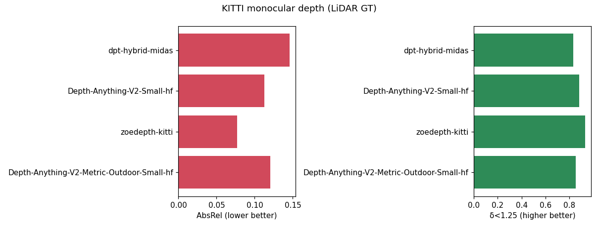
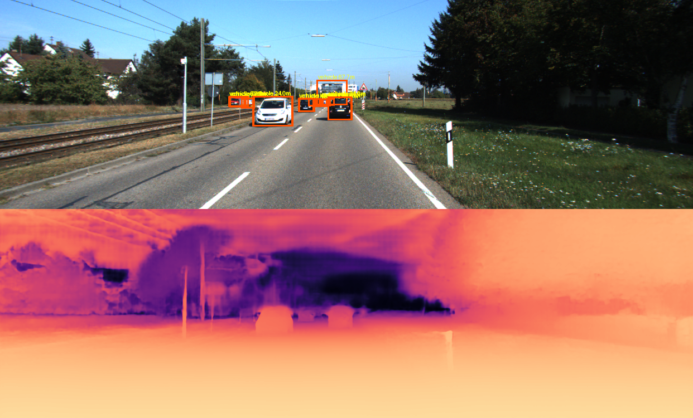
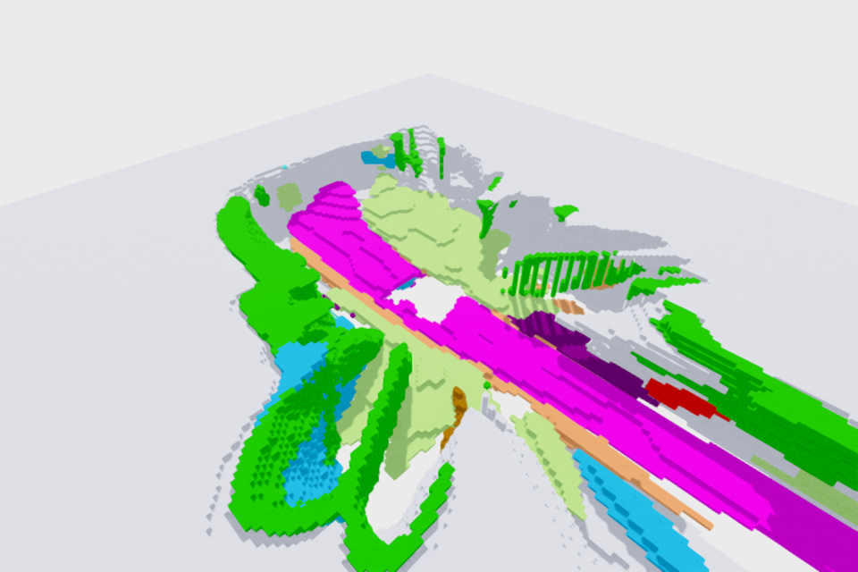
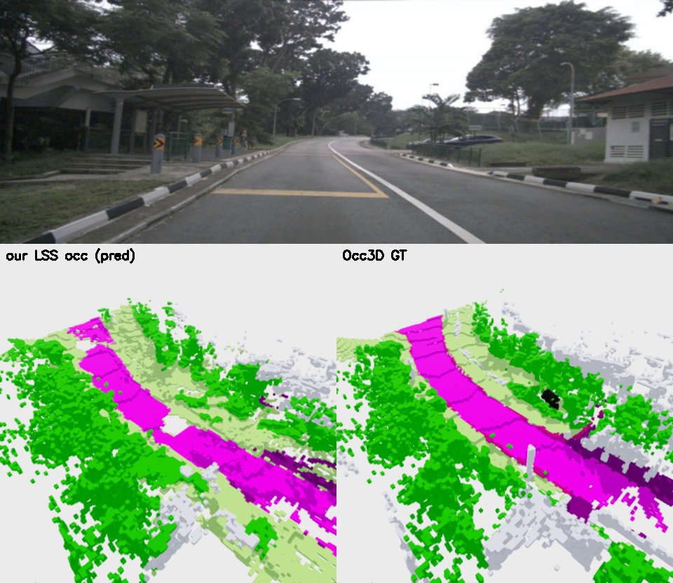
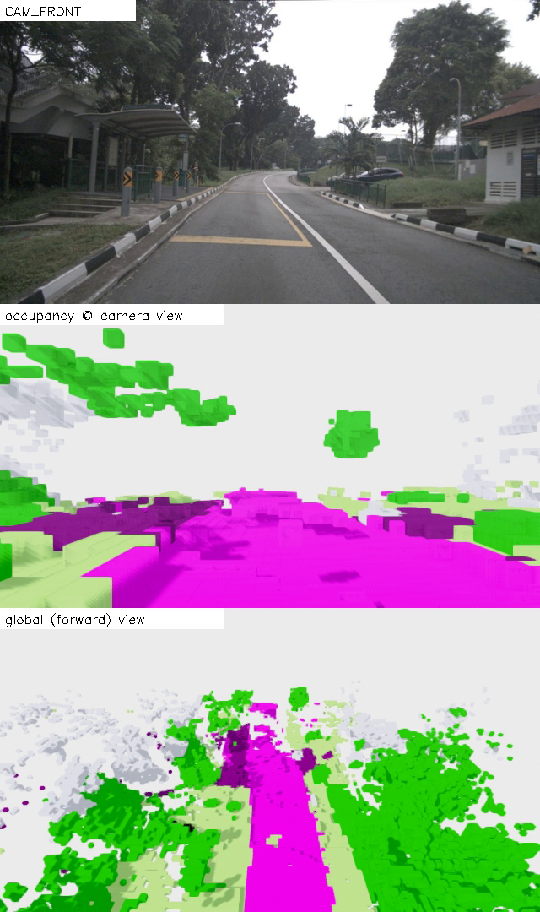
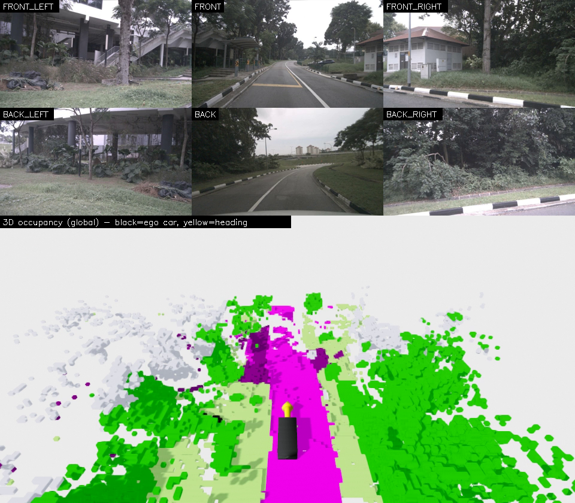

# ngperception Tutorial — downstream perception, from basics to SOTA

This tutorial extends the ngdet detection tutorial to the *downstream* perception tasks
that consume an image (and often the detector's boxes): **depth/distance**, then
segmentation, tracking, and lane detection. Same recipe each time: understand the task,
compare models **basic → SOTA by inference**, then **fine-tune**.

---

## 1. Monocular depth estimation & per-object distance

### 1.1 The task

Given one RGB image, predict a **depth** for every pixel. Two sub-flavors:

- **Relative depth** — the *ordering* of depths is correct but the global scale (and
  often a shift) is unknown. Models trained on huge mixed data (MiDaS, Depth-Anything)
  are relative: they generalize anywhere but can't tell you metres.
- **Metric depth** — absolute depth in **metres**. Needed for distance ("18 m away"),
  3D lifting, planning. Models are trained/fine-tuned per camera-domain (ZoeDepth-KITTI,
  Depth-Anything-V2-Metric-Outdoor).

Why does scale go missing? A single image is **scale-ambiguous** — a toy car up close and
a real car far away project to the same pixels. Metric models break the tie using learned
priors about object sizes and the specific camera; that is why they are domain-specific.

### 1.2 The model ladder (what we compare)

| era | model | type | idea |
|---|---|---|---|
| 2019 baseline | **MiDaS / DPT** (`Intel/dpt-hybrid-midas`, `Intel/dpt-large`) | relative | ViT/CNN hybrid trained on 10+ mixed datasets; robust relative depth |
| 2024 SOTA (rel) | **Depth-Anything-V2** (`-Small/-Base/-Large-hf`) | relative | DINOv2 encoder + 62M pseudo-labelled images; sharp, fast |
| metric | **ZoeDepth** (`Intel/zoedepth-kitti`) | metric | MiDaS backbone + a metric "bins" head fine-tuned on KITTI |
| metric (SOTA) | **Depth-Anything-V2-Metric** (`...-Metric-Outdoor-Small-hf`) | metric | DA-V2 encoder fine-tuned for metric KITTI |

All load through **one adapter** (`estimators/hf_depth.py`) via
`AutoModelForDepthEstimation` — add any of them with `--models hf_depth:<hub-id>`.

### 1.3 Ground truth from LiDAR (no manual labels)

KITTI ships a Velodyne scan + calibration per frame, so we *make* GT depth by projecting
the point cloud into the camera (`datasets.py`):

```
X_cam = R0_rect · Tr_velo_to_cam · X_velo      # LiDAR point -> rectified camera frame
[u v w]ᵀ = P2 · [X_cam; 1];  u/=w, v/=w        # -> pixel
depth(v,u) = X_cam.z                            # metres; keep nearest on collision
```

This yields a **sparse** map (~4–5 % of pixels — LiDAR is far sparser than the image),
which is exactly what the KITTI depth benchmark scores against.

### 1.4 The metrics — where they come from, with formulas

All metrics compare a predicted depth $\hat d_i$ to GT $d_i$ over the $N$ valid (LiDAR)
pixels $i$. They are the **Eigen et al. (2014)** set — the standard since the first deep
single-image depth paper — split into *error* metrics (lower better) and *threshold
accuracy* (higher better).

**Error metrics.**

$$
\text{AbsRel}=\frac{1}{N}\sum_i \frac{|\hat d_i-d_i|}{d_i}
\qquad
\text{SqRel}=\frac{1}{N}\sum_i \frac{(\hat d_i-d_i)^2}{d_i}
$$

$$
\text{RMSE}=\sqrt{\frac{1}{N}\sum_i (\hat d_i-d_i)^2}
\qquad
\text{RMSE}_{\log}=\sqrt{\frac{1}{N}\sum_i (\log \hat d_i-\log d_i)^2}
$$

Why four? They weight errors differently — picking one hides failure modes:

- **AbsRel** divides by $d_i$, so a 1 m error on a 5 m car and on a 50 m truck count
  *proportionally*. This scale-free property makes it the headline number.
- **SqRel** squares the numerator → punishes a few large blunders much harder than many
  small ones (sensitive to outliers).
- **RMSE** is in **metres** and is *not* normalized by depth, so it is dominated by the
  **far** field (a 10 % error at 60 m hurts 12× more than at 5 m). Good for "how many
  metres off on average", bad at seeing near-field quality.
- **RMSE_log** measures error in **log space**: $\log\hat d-\log d=\log(\hat d/d)$ is a
  *ratio* error, so near and far contribute evenly — the complement to plain RMSE.

**Threshold accuracy** ($\delta_k$). The fraction of pixels whose prediction is within a
factor $1.25^k$ of GT:

$$
\delta_k=\frac{1}{N}\Big|\Big\{\,i:\ \max\!\Big(\tfrac{\hat d_i}{d_i},\ \tfrac{d_i}{\hat d_i}\Big)<1.25^{\,k}\,\Big\}\Big|,\quad k\in\{1,2,3\}
$$

The $\max(\hat d/d,\,d/\hat d)$ is a symmetric ratio (penalizes over- and under-estimates
equally); $1.25^1=1.25$ (within 25 %), $1.25^2\approx1.56$, $1.25^3\approx1.95$.
$\delta_1$ ("percent of pixels essentially correct") is the most cited accuracy number.

**The "Garg crop".** LiDAR returns are unreliable at the image top (sky) and edges, so
the field standardized on **Garg et al. (2016)**'s center crop
($y\in[0.408,0.992]H$, $x\in[0.036,0.964]W$) — we evaluate only inside it for
comparability with published numbers.

### 1.4.1 The alignment subtlety (relative vs metric)

A **relative** model predicts depth only up to a global scale $s$: it outputs
$\hat d_i = d_i/s$ for some unknown $s$. Scoring that directly is meaningless, so we first
estimate $s$ and rescale. We use **median scaling** (the Monodepth2 protocol):

$$
\hat d_i \leftarrow \hat d_i\cdot\frac{\operatorname{median}(d)}{\operatorname{median}(\hat d)}
$$

The median is a *robust* scale estimate (insensitive to a few wild pixels). This is what
"aligned" means in the results table; **metric** models are scored **as-is** (no $s$
given). The honest reading: a relative model is handed a free global scale, a metric model
must be right outright — which is exactly why the two columns can disagree (§1.5).

### 1.5 Results — inference comparison

> Run: `python -m DeepDataMiningLearning.ngperception.depth.run_eval --models … --max-images 60 --stride 40`



60 KITTI frames, LiDAR GT, Garg crop. **Aligned** = median scale-invariant (fair for all);
**Metric** = true metres (no alignment — only meaningful for metric models):

| model | type | aligned AbsRel↓ | aligned δ1↑ | metric AbsRel↓ | metric δ1↑ |
|---|---|---|---|---|---|
| `Intel/dpt-hybrid-midas` (2019) | relative | 0.146 | 0.832 | — | — |
| `Depth-Anything-V2-Small` (2024) | relative | 0.113 | 0.882 | — | — |
| `Intel/zoedepth-kitti` | metric | **0.077** | **0.933** | 0.853 | 0.000 |
| `Depth-Anything-V2-Metric-Outdoor-Small` | metric | 0.121 | 0.853 | **0.122** | **0.833** |

Three lessons fall out of this one table:

1. **Basic → SOTA (relative):** Depth-Anything-V2 (0.113) clearly beats the 2019 DPT
   baseline (0.146) on the same scale-invariant metric.
2. **Domain specialization wins on accuracy:** ZoeDepth, *fine-tuned on KITTI*, has the
   best **aligned** score of all (0.077, δ1 0.933) — a strong argument for the fine-tuning
   we do next.
3. **"Metric" is a property of the checkpoint, not just the architecture.** Look at the
   metric columns: `Depth-Anything-V2-Metric-Outdoor` gives genuine metres (AbsRel 0.122),
   but the HF `zoedepth-kitti` port is **mis-scaled** — it outputs ~0.6–9.5 instead of
   ~4–80 m, so as-metric it collapses (δ1 = 0.000) even though its *shape* is excellent
   (aligned 0.077). **Always validate a metric model's absolute range against GT before
   trusting its metres** — the framework prints both columns precisely so this can't hide.

### 1.6 Composable add-on — per-object distance

Depth becomes a *downstream head of detection*: run an ngdet detector, then read the
depth map inside each box (`fusion.py`, median over the central 60 % to avoid box-edge
background). Use a **correctly-calibrated metric** model so the numbers are real metres:

```bash
python -m DeepDataMiningLearning.ngperception.depth.run_eval \
    --models hf_depth:depth-anything/Depth-Anything-V2-Metric-Outdoor-Small-hf \
    --max-images 5 --viz --detector hf_detr:facebook/detr-resnet-50
# -> output/depth/viz/fuse_*.png : boxes labelled "vehicle 24m" over a depth colormap
```



Top: DETR boxes annotated with per-object distance; bottom: the metric depth map (bright =
near). The two oncoming cars read ~12 m and ~24 m. `--viz` is restricted to metric models —
running it on a relative model would print meaningless (un-scaled) distances.

Add `--video` to render the same fusion as an **mp4** over consecutive frames
(`output/depth/depth_fusion_<model>.mp4`, 1224×740, distance-annotated RGB over depth):

```bash
python -m DeepDataMiningLearning.ngperception.depth.run_eval \
    --models hf_depth:depth-anything/Depth-Anything-V2-Metric-Outdoor-Small-hf \
    --max-images 30 --stride 1 --video --video-frames 30 --fps 5 \
    --detector hf_detr:facebook/detr-resnet-50
```

This is the whole point of `ngperception`: detection answers *what & where (2D)*, depth
adds *how far*, and together they are the first step toward 3D perception.

### 1.7 Fine-tuning Depth-Anything, and mixing KITTI + Waymo + nuScenes

**Is Depth-Anything easy to fine-tune?** Yes. It is a standard model — a DINOv2 encoder
+ a DPT regression head — so it trains like any HF `AutoModelForDepthEstimation`: a
supervised loop with a depth loss, masked to the sparse LiDAR-GT pixels. You can LoRA the
DINOv2 encoder (cheap, like ngdet §21–22) or full-tune the head. No bespoke decoder, no
custom kernels — much easier than the detection VLMs.

The standard loss is the **scale-invariant log loss (SiLog)** from Eigen et al., over the
valid pixels with $g_i=\log\hat d_i-\log d_i$:

$$
\mathcal{L}_{\text{SiLog}}=\sqrt{\;\frac{1}{N}\sum_i g_i^{2}\;-\;\frac{\lambda}{N^{2}}\Big(\sum_i g_i\Big)^{2}}\,,\qquad \lambda\in[0,1]\ (\approx0.85)
$$

The first term is the log-error; the **second term subtracts the mean log-error squared**,
which removes a constant per-image scale ($\hat d\!\to\!s\hat d$ shifts every $g_i$ by
$\log s$, and the second term cancels it). So $\lambda\!\to\!1$ trains *relative* depth and
$\lambda\!=\!0$ trains *metric* depth — SiLog is the training-time twin of the median
alignment we use at eval (§1.4.1).

**Can we mix KITTI + Waymo + nuScenes?** Yes — and it is the right move for generalization
— but with one crucial caveat:

- **Scale-invariant (relative) fine-tuning on the mix is clean.** SiLog with $\lambda\!\approx\!1$
  is camera-agnostic, so pooling three domains just makes the model more robust (same idea
  as ngdet's mixed dataset, §17).
- **Metric fine-tuning on a mix is subtle — cameras differ.** Metric depth depends on the
  **intrinsics**: a car at 20 m fills different pixel heights under KITTI's ($f\!\approx\!720$ px),
  Waymo's, and nuScenes' ($f\!\approx\!1260$ px) focal lengths. Train metric depth on pooled
  cameras naively and the model sees contradictory targets. The fixes are what ZoeDepth /
  **Metric3D** do: condition on intrinsics or warp to a **canonical camera** (rescale depth
  by $f_{\text{canon}}/f_{\text{cam}}$). So: mix freely for relative; for metric, either
  fine-tune per-camera-domain or add intrinsic conditioning.

**Dataset availability for depth GT** (LiDAR projected to camera, as in §1.3):

| dataset | LiDAR + calib here? | depth GT status |
|---|---|---|
| KITTI | ✅ `velodyne` + `calib` | **wired** (`KITTIDepthDataset`) |
| nuScenes | ✅ `samples/LIDAR_TOP` + `v1.0-trainval` calib | buildable (project via ego-pose + calibrated_sensor) |
| Waymo | ⚠️ this subset has camera only (no `lidar*` parquets) | needs the LiDAR + `lidar_camera_projection` components downloaded |
| nuImages | ❌ 2D annotations only, no LiDAR | not possible (use full nuScenes) |

So the eval/training **already runs on KITTI**, extends cleanly to **nuScenes** (LiDAR is
present — just needs the projection wired), and needs the **Waymo LiDAR** parquets before
Waymo depth GT can be built. That is the next build.

---

## 2. 3D semantic occupancy — and how far depth alone gets you

Occupancy prediction is the current frontier of camera perception: instead of boxes, you
predict a **dense 3D voxel grid** of semantics around the car (Occ3D-nuScenes:
$200\times200\times16$ voxels at 0.4 m, 17 classes + free). It handles arbitrary shapes and
unknown objects, and is the representation behind Tesla-style occupancy networks.

Depth is the natural bridge to it — so before training a heavy occupancy net, we ask a
concrete question: **how far does a depth foundation model + 2D segmentation get you,
with no occupancy training at all?** This is the ViPOcc "vision priors" question, and it
gives a measured baseline the learned nets must beat.

### 2.1 The depth→occupancy baseline

For each of the **6 surround cameras** (`predictors/depth_lift.py`):

1. metric depth (Depth-Anything-V2-Metric) → per-pixel range;
2. back-project every pixel to a 3D point, $X_{\text{cam}}=d\,K^{-1}[u,v,1]^\top$;
3. lift to the ego frame, $X_{\text{ego}}=R_{c\to e}X_{\text{cam}}+t_{c\to e}$
   (the Occ3D grid is in the **ego frame** — verified by projecting the LiDAR sweep, §2.2);
4. tag each point with a **Cityscapes** segmentation label (SegFormer), mapped to the 18
   Occ3D classes; sky and far/zero depth are dropped;
5. **splat** points into voxels → a predicted semantic grid.

No training — pure geometry + 2D priors. Metric: official Occ3D **mIoU over 17 classes on
camera-visible voxels** (`mask_camera`), plus a class-agnostic **geometric IoU**.

### 2.2 Validating the geometry (and an honest ceiling)

The Occ3D GT is **densified** (aggregated multi-sweep + completion) — ~30–42 k occupied
voxels per frame. A *single* LiDAR sweep fills only ~6 k voxels, so projecting the real
LiDAR scores just **geo-IoU ≈ 0.17** (≈97 % precise, but ~15 % recall — it physically can't
see the densified GT). That number is the **single-shot geometric ceiling**, and it tells
us up front that any single-frame lift (LiDAR or depth) is recall-bound; the headroom above
it is exactly what learned occupancy nets buy by *hallucinating* the dense, occluded grid.

### 2.3 Results — runnable baselines vs the SOTA target

Evaluated on the **official Occ3D val split** (`annotations.json` val scenes), 30 samples,
6 cameras, `SegFormer-b2` (Cityscapes) semantics, camera-mask mIoU:

| method | mIoU↑ | geo-IoU↑ | runnable here? |
|---|---|---|---|
| LiDAR oracle (single sweep, geometry) | — | **0.167** | ✅ |
| depth→occ, DA-V2-Metric-**Small** + seg | **0.014** | 0.093 | ✅ |
| depth→occ, DA-V2-Metric-**Base** + seg | 0.011 | 0.085 | ✅ |
| — *published SOTA (learned, camera-only)* — | | | |
| CTF-Occ (Occ3D paper) | 28.5 | — | ✗ (mmdet3d) |
| FlashOcc | ~32 | — | ✗ |
| **Dr.Occ (depth-guided)** | **43.4** | — | ✗ |
| EFFOcc (18.4 M params) | 50.5 | — | ✗ |

(`run_eval` prints the SOTA reference table after every run; the learned nets need
mmdetection3d, which is incompatible with this env's torch 2.10, so they are cited, not
re-run.) Three things to read off:

1. **A bigger depth model does *not* help** — DA-V2-Metric-Base is slightly *worse* than
   Small (mIoU 0.011 vs 0.014). Depth *quality* is not the bottleneck; the **single-shot
   lift** is. This is the key negative result of the sweep.
2. **Geometry:** depth recovers ~56 % of the single-sweep LiDAR's geo-IoU (0.093 vs 0.167).
   Monocular depth is *dense but imprecise* — a small metric error splats a voxel into the
   wrong cell, so it loses to even a sparse-but-exact LiDAR sweep.
3. **The gap is ~20–35× in mIoU** (≈1.4 → 28–50). Only the large static surfaces survive in
   the baseline (`terrain`, `driveable_surface`, `manmade`, `vegetation` ~0.04–0.07);
   small/dynamic classes are ≈0. That gap is the whole research opportunity — and the
   strongest learned nets that close it (Dr.Occ, 43.4) are **depth-guided**, confirming
   depth is a valuable *signal* even though depth *alone* is far from enough.

### 2.4 What this says about the direction

A depth-foundation baseline is **dense but imprecise** (depth errors splat voxels into the
wrong cell) and **single-shot** (no memory of occluded space), so it sits well below
learned occupancy nets (SOTA Occ3D mIoU is ~0.4+). That gap is the research opportunity,
and it points at concrete, fundable work:

- **Depth as supervision / prior** for a learned BEV→voxel head (BEVDepth / ViPOcc idea):
  start from this baseline's geometry, learn the occluded completion.
- **Temporal fusion**: aggregate several frames' lifts (ego-motion compensated) to close
  the recall gap the single-sweep ceiling exposes.
- **Better metric depth across cameras** (§1.7 canonical-camera): the 6 nuScenes cams have
  very different intrinsics, so metric error directly becomes voxel error.

The point of the baseline is not to win — it is to **quantify the headroom** and make the
case for the learned model concrete, on data you already have.

### 2.5 Case study — running a real (self-supervised) occupancy net: GaussianOcc

The learned SOTA nets in §2.3 need mmdetection3d (incompatible with modern torch). The one
we *did* get running is **GaussianOcc** (ICCV'25) — a **fully self-supervised** 3D-Gaussian-
Splatting method. It's the cleanest to install (no mmcv; the 3DGS rasterizer + simple-knn),
and on Occ3D-nuScenes `val_tiny` (30 samples) it scores **mIoU ≈ 8.4** — ~6× our depth-lift
baseline, but far below the supervised nets (28–50). That gap is the price of using *no 3D
labels*. (Setup is fiddly: ~9 source patches — see the internal notes.)

**How it works — and where the "Gaussians" come from.** The key idea: represent the scene
as a set of **3D Gaussians** (each has a position, scale, rotation, opacity, and a semantic
class), and the **network predicts those Gaussians directly from the 6 surround images**.
There is no pre-built scene — the Gaussians *are* the network's output:

```
6 camera images ──encoder──► image features ──lift/decoder──► a set of 3D Gaussians
                                                              (the predicted "scene")
        ┌──────────────────────────────────────────────┴───────────────────┐
   (a) Gaussian-splat the Gaussians back into each camera                   │
       → rendered DEPTH + rendered 2D SEMANTICS         (training signal)    │
   (b) query the Gaussian field at the 200×200×16 voxel centres             │
       → per-voxel class = the OCCUPANCY output         (what we evaluate)   ▼
```

**Self-supervision (no 3D GT).** Training never sees occupancy labels. It minimizes:
(1) **photometric/depth consistency** — splatting the Gaussians into one frame should
reproduce what the *other* cameras/adjacent timestamps actually saw; (2) **2D semantic
consistency** — the rendered semantics should match 2D labels (from GroundedSAM). So the
only supervision is "your Gaussians, when rendered, must look like the images" — and the 3D
occupancy falls out of the same Gaussians. (This is exactly the *rendering supervision* idea
we flagged as a v2 upgrade for our own LSS head.)

**Why it's noisy (mIoU 8.4).** Rendering only constrains what the cameras *see*. Behind
objects and far away the Gaussians are under-determined, so the model **over-fills along
camera rays** — the characteristic radial "fan" in the 3D render below. Supervised nets,
trained on the densified Occ3D GT, learn to *complete* that occluded space; that completion
is most of the 8 → 40 mIoU gap.

### 2.6 Visualizing occupancy: open3d, not mayavi

GaussianOcc renders **depth** as an image (it's a depth-rendering method), but the
**occupancy** is a raw voxel grid (`probability`, shape `(18,200,200,16)` → `argmax` →
class per voxel). To *see* it you need a 3D renderer. The papers use **mayavi** (VTK + Qt,
painful headless). We use **open3d** instead — newer, `pip`-installable, and its
`OffscreenRenderer` runs **headless via EGL** out of the box (works on this WSL box). Build
a coloured `VoxelGrid` from the occupied voxel centres and render from an oblique BEV angle:



Now the structure is legible: magenta = driveable road, greens = terrain/vegetation, blue =
cars, red/orange = barriers/objects, with the ego gap in the centre. A flat top-down BEV
(collapsing the 16 height levels) reads far worse — the renderer choice matters for
*legibility*, though not for the underlying mIoU.

### 2.7 What we can build on this

- **Borrow the rendering supervision.** Add a differentiable-render loss to our planned
  depth-supervised LSS head (the GaussRender idea): supervise with Occ3D GT where it exists
  *and* with self-supervised rendering everywhere — best of both.
- **Adapt self-supervised occupancy to label-poor domains.** GaussianOcc needs no 3D GT, so
  it can train on KITTI / Waymo (which lack occupancy labels) from images + 2D priors alone.
- **Supervised-vs-self-supervised study.** Compare our (planned) GT-supervised LSS occ vs
  GaussianOcc self-sup on the same Occ3D mIoU — quantify exactly what the 3D labels buy.
- **Reuse the Gaussians downstream.** The predicted Gaussian field also gives novel-view
  synthesis and scene completion — handles beyond occupancy.

Bottom line: GaussianOcc is our **reference point and idea source** for the GS route; the
main build remains the controllable pure-PyTorch depth-supervised LSS occupancy head.

### 2.7.1 How it works, what supervises it, and where the GT comes from

**Inference is camera-only — no LiDAR** (`models/lss_occ.py`). Given the 6 surround RGB
images:

```
6 RGB images ─DINOv2(frozen)→ per-cam features
   └DepthNet head→ (a) a per-pixel depth *distribution* over 112 bins  (b) context features
   Lift:  context ⊗ depth  → a frustum of features; camera K + extrinsics place each
          (pixel, depth-bin) point in the ego 3-D frame
   Splat: scatter frustum points into the 200×200×16 voxel grid (pure-torch index_add)
   Decode: 3-D CNN → 18-class logits → argmax = predicted occupancy
```

A camera can't know per-pixel depth, so the net predicts a **depth probability** and smears
each image feature across all plausible depths before voxelizing — that is the Lift-Splat.

**Did it use LiDAR? Yes — only as *training supervision*, never as input.** There are two
losses, and it helps to see which is dense:

| loss | target | density |
|---|---|---|
| **occupancy CE** (main) | the **Occ3D GT** voxel grid, on `mask_camera` | **fully dense** (whole grid labelled) |
| **depth CE** (auxiliary) | **LiDAR** projected into each camera, binned | sparse at full-res, **but 69 % of cells at the 18×50 feature resolution** where it is applied |

So the model is *not* short of dense supervision: the occupancy itself is densely
supervised by Occ3D. The depth term is the BEVDepth trick — explicitly teaching the lift
*where along the ray* a feature sits, which is what raised camera-occupancy from ~24 to
~40 mIoU in the literature. And "sparse LiDAR" is misleading: a single sweep covers ~4–5 %
of *image* pixels, but max-pooled to the coarse feature grid (18×50) it fills **~69 %** of
cells — densely where it matters (ground/near field; the empty rows are sky/far, which are
unoccupied anyway).

> **Experiment — we tried "render depth from the dense Occ3D GT" instead of LiDAR**, the
> elegant-looking idea: z-buffer the occupied voxel *corners* into each camera for a dense,
> GT-consistent depth target (`--depth-source occ`). At **matched ~70 % feature coverage**,
> a controlled A/B (DINOv2-small, 1000 samples, 8 ep) found **LiDAR depth is better** —
> mIoU **0.141 (LiDAR) vs 0.124 (Occ3D-rendered)**. *Why:* density wasn't the bottleneck;
> **precision** was. Real LiDAR gives continuous range at the true surface, whereas the
> rendered depth is quantized to the 0.4 m voxel grid and inherits the GT's densification
> noise. Lesson: more dense supervision isn't automatically better — a *precise* sparse
> signal beats a *coarse* dense one.
>
> **Follow-up — a carefully-designed combined loss still didn't beat LiDAR.**
> `--depth-source combined` adds the occ term back but smartly: a **tolerant
> window** loss (reward predicted depth-*mass* within ±2 bins of the quantized target,
> i.e. classification-in-a-window not regression, so quantization can't hard-pull) +
> **region weighting** from the projected voxel class (road & objects full weight;
> cluttered terrain/manmade/vegetation down-weighted to 0.3 — the bits that are
> genuinely hard to learn). Sweeping the occ weight (same config):
>
> | depth supervision | mIoU |
> |---|---|
> | **LiDAR only** | **0.141** |
> | combined (occ-weight 0.5, tolerant + region-weighted) | 0.132 |
> | occ-rendered only | 0.124 |
>
> mIoU drops *monotonically* with the occ weight — the loss engineering reduced the harm
> (0.132 > the 0.124 of occ-only) but couldn't make a **redundant, noisier** signal help:
> where the rendered depth has signal it overlaps LiDAR's (which is more precise), so it
> only adds noise. **The bottleneck is the depth *source* quality, not the loss shape.**
> The genuinely promising direction looked like denser *real* depth — **aggregate several
> LiDAR sweeps** — so we built it (`--depth-source lidar_multi --lidar-sweeps N`) and ran a
> proper ablation.
>
> **Multi-sweep + a 2×2 design ablation.** First a coverage surprise: at the **18×50
> feature** resolution where the depth term is applied, **a single sweep already covers 69 %
> of cells, and 5 or 10 sweeps cover the *same* 69 %** — the empty 31 % is sky/surfaceless,
> so the *supervision resolution*, not depth density, is the ceiling. Multi-sweep still
> makes each cell's value more robust, so we ablated the two loss-design knobs on it —
> **tolerant window** (±2 bins) × **region weighting** (road/objects vs down-weighted
> clutter):
>
> | multi-sweep (5) config | tolerant | region | peak mIoU | final |
> |---|---|---|---|---|
> | single-sweep baseline | — | — | 0.141 | — |
> | plain | ✗ | ✗ | 0.139 | 0.134 |
> | + region | ✗ | ✓ | 0.139 | 0.132 |
> | + tolerant | ✓ | ✗ | 0.138 | 0.138 |
> | **+ both** | ✓ | ✓ | **0.153** | **0.142** |
>
> Two takeaways. (1) **Multi-sweep alone ≈ single-sweep** (0.139 vs 0.141) — exactly as the
> coverage check predicted: more points can't help where the supervision grid is already
> saturated. (2) In this *single* run **+both** looked like a synergy — the only config to
> clear the baseline (peak 0.153). That is a tempting story (tolerant absorbs multi-sweep
> noise, region weighting focuses on learnable surfaces). **But we did not trust it — we ran
> a multi-seed check, and it was a false positive:**
>
> > **Multi-seed (plain vs +both, 3 seeds, 600 samples / 6 ep, cached):**
> > plain **0.121 ± 0.005**, +both **0.123 ± 0.003** (final) — diff **+0.003, < 1 σ**; peak
> > diff **+0.001**. **The "synergy" vanishes.** The single-run 0.153 was a lucky epoch/seed,
> > not a real effect. *Lesson: a single run's peak is not evidence; multi-seed mean ± std is.
> > Building `--seed` + a depth-cache so 6 runs were cheap was worth more than any one number.*
>
> **Finer supervision resolution (`--feat-upsample`).** The one lever the ablations hadn't
> refuted was the *supervision resolution* itself: the depth term is applied at the 18×50
> feature grid, so maybe that coarse grid — not the depth signal — is the ceiling. We
> upsample the backbone features ×2 before the DepthNet+lift, taking the depth distribution,
> lift and splat to **36×100**, and re-check the coverage story: at 36×100 a single sweep now
> covers only **53 %** of cells (vs 69 % at 18×50) and 5 sweeps recover **64 %** — so at the
> finer grid multi-sweep density *should* finally matter. Three runs, fixed seed:
>
> | config | lift res | sweep | coverage | peak mIoU | final |
> |---|---|---|---|---|---|
> | A (baseline) | 18×50 | single | 69 % | 0.138 | 0.135 |
> | B | 36×100 | single | 53 % | 0.134 | 0.132 |
> | C | 36×100 | multi-5 | 64 % | 0.137 | 0.123 |
>
> **All three tie within the ±0.005 run noise** — finer resolution doesn't help, and even
> though C restores coverage over B (64 % vs 53 %) it doesn't convert that into mIoU. The
> reason is structural: **the output voxel grid is fixed at 200×200×16 @ 0.4 m.** The image
> features at 18×50 already carry enough angular resolution to decide which 0.4 m voxel a
> camera ray lands in; ×2 finer *image* lift just splats more sub-samples into the *same*
> voxels. Supervision resolution isn't the bottleneck because the target resolution caps it.
>
> So the honest bottom line of the whole depth-supervision study: **sparse-but-precise LiDAR
> CE is the best simple choice; none of GT-rendered depth, a combined loss, multi-sweep, the
> tolerant/region loss-design knobs, *or* finer lift resolution beat it once you control for
> noise.** Every depth-supervision micro-optimization plateaus at ~0.14 (DINOv2-small, 1 k
> samples). The levers that actually move mIoU are **model capacity and data** — the same
> knobs that took the main model 0.092 → 0.152 → **0.216** (§2.8): backbone (ResNet→DINOv2-
> base), decoder depth, and sample count, *not* the depth term. Every target and knob
> (`lidar` / `occ` / `combined` / `lidar_multi` × `--depth-tolerant` × `--depth-region` ×
> `--feat-upsample`, plus `--seed` / `--lidar-cache`) is a flag in `train_lss.py`, so each
> row here is one command to reproduce.

**Where the GT comes from (Occ3D-nuScenes).** We *do* use the
[Occ3D](https://github.com/Tsinghua-MARS-Lab/Occ3D) `gts` — it is the dense occupancy GT
for both training and the mIoU eval. Tsinghua-MARS-Lab built it by:

1. **aggregating LiDAR over the whole sequence** (key-frames + sweeps, ego-pose aligned) —
   turning a sparse ~30 k-point sweep into a dense cloud;
2. **separating dynamic objects** (aggregated inside their own 3-D boxes so moving cars
   don't smear) from the static background (aggregated across all frames);
3. **labelling** each voxel by majority vote of the **nuScenes-lidarseg** point semantics;
4. **voxelizing** to 200×200×16 @ 0.4 m;
5. **occlusion ray-casting** to produce `mask_camera` / `mask_lidar` (so you only score
   observed voxels).

That whole-sequence aggregation is exactly why the GT is dense (~30–42 k occupied voxels
vs ~6 k from one sweep, §2.2) — and why a *learned* model that completes occluded space
can beat any single-shot projection.

### 2.8 Our depth-supervised LSS occupancy — results

The pure-PyTorch, GT-supervised LSS head from §2.7 (`models/lss_occ.py` + `train_lss.py`),
trained at three scales on a single RTX 3090 — from a 20-minute ResNet run to a few-hour
DINOv2-base run:

| method | mIoU↑ | geo-IoU↑ | training | runs in main env? |
|---|---|---|---|---|
| depth→occ lift baseline (§2.3) | 0.014 | 0.09 | none | ✅ |
| LiDAR oracle (single sweep) | — | 0.18 | none | ✅ |
| GaussianOcc (self-supervised) | 0.084 | — | pretrained, no 3D GT | ✗ (separate env, ~9 patches) |
| our LSS occ — **ResNet18** | 0.092 | 0.547 | 500 samples, 8 ep (~20 min) | ✅ pure PyTorch |
| our LSS occ — **DINOv2-small + 3× data** | 0.152 | 0.626 | 1500 samples, 10 ep, AMP (~40 min) | ✅ pure PyTorch |
| our LSS occ — **DINOv2-base + deeper dec + cosine** | **0.216** | **0.681** | 3000 samples, 12 ep (~2.8 h) | ✅ pure PyTorch |
| our LSS occ — **DINOv2-small + Lovász & class-bal. CE** (§2.8.1) | **0.226** | 0.623 | **1000 samples, 8 ep (~15 min)** | ✅ pure PyTorch |
| our LSS occ — **DINOv2-base + deeper dec + Lovász & class-bal. CE** | 0.284 | 0.701 | 3000 samples, 12 ep | ✅ pure PyTorch |
| our LSS occ — **+ iterative render-and-refine lift** (§2.8.2) | **0.298** | **0.710** | 3000 samples, 12 ep | ✅ pure PyTorch |
| *(published, for scale)* OccFormer / BEVFormer / CTF-Occ | 21 / 27 / 28.5 | — | full train, mmdet3d | ✗ |
| — camera-only lines end here; below adds LiDAR **at inference** — | | | | |
| our LSS occ — **LiDAR-only** (ablation, camera zeroed) | 0.204 | 0.726 | 1000, 8 ep, single sweep | ✅ pure PyTorch |
| our LSS occ — **+ LiDAR fusion** (§2.8.3, *fusion mode*) | 0.392 | 0.822 | 1000, 8 ep, single sweep | ✅ pure PyTorch |
| our LSS occ — **+ LiDAR fusion, strong** (DINOv2-base, 3k/12ep) | **0.493** | **0.864** | single sweep | ✅ pure PyTorch |
| supervised **fusion** SOTA (FlashOcc / Dr.Occ / EFFOcc) | 32–50 | — | full train, mmdet3d | ✗ |

Three things this shows:

1. **It already edges out GaussianOcc** (9.2 vs 8.4 mIoU) with ~20 min of training on a tiny
   slice — and unlike GaussianOcc it runs in the **main torch-2.10 env**, no mmcv, no patches.
2. **Learned completion is real.** Its **geo-IoU 0.547 is ~3× the single-sweep LiDAR ceiling**
   (0.18) and ~6× the depth-lift baseline (0.09). A single-shot projection can only mark what
   it directly observes; the *learned* model fills the densified, occluded Occ3D GT — exactly
   the headroom §2.2 said the learning buys.
3. **It scales predictably — 0.092 → 0.152 → 0.216 mIoU.** Each lever compounds: a frozen
   **DINOv2-small** + 3× data → 0.152 (+65 %); then **DINOv2-base + a deeper voxel decoder +
   cosine schedule + 3000 samples** → **0.216 (geo-IoU 0.681)**, a **2.35× total gain** over
   the ResNet baseline. Tellingly, DINOv2's **epoch-0 already matched ResNet's *final***: the
   frozen foundation-model features do the heavy lifting (and AMP makes it *faster*, ~6 it/s,
   since only the head trains). At **21.6 mIoU we are now in the published-method band** —
   above MonoScene (6) and OccFormer (~21), nearing BEVFormer (27) / CTF-Occ (28.5) — on
   **~10 % of the train split, a frozen backbone, and a single 3090**, in the main torch env.
   Full data + a longer schedule is the clear path further up, all on infra we fully control.

The depth supervision is doing its job: the depth CE drops alongside the occupancy CE, so
the lift's geometry sharpens as the occupancy learns (the BEVDepth effect).

```bash
# strongest config: frozen DINOv2(-base) + deeper decoder + cosine + AMP + more data
python -m DeepDataMiningLearning.ngperception.occupancy.train_lss \
    --gts <occ3d_gts> --nusc <nuscenes_root> --backbone dinov2_base \
    --decoder-layers 4 --decoder-hidden 96 --cosine --amp \
    --max-samples 3000 --epochs 12 --depth-weight 1.0
```

### 2.8.1 The loss is the biggest lever — Lovász + class-balanced CE (from the GaussianFormer3D study)

Studying [GaussianFormer3D](../docs/GaussianFormer3D_study.md) (a LiDAR-camera fusion Gaussian
occupancy net) surfaced one change we could port straight into our pure-PyTorch trainer with
**no new dependency**: they don't train the occupancy head on plain cross-entropy. They use
**CE + Lovász-softmax + class-balanced weights**. We had been using plain CE. So we tested it —
the same way we test everything here, **multi-seed**, since §2.7.1 taught us single runs lie.

**Why it should matter.** Our occupancy CE scores every camera-visible voxel, and **~85 % of
them are free**; a handful of classes (road, manmade, vegetation) dominate the rest. mIoU,
though, is the **mean IoU over the 17 non-free classes** — so a model that nails free + road
but never fires on *pedestrian/bicycle/motorcycle* still scores near zero on those, and mIoU
collapses. Plain CE has no reason to fix this: the rare-class gradient is drowned. Two cheap
changes attack exactly that: **inverse-frequency class weights** (up-weight rare classes,
computed once from the GT over camera-visible voxels, tempered + normalized) and
**Lovász-softmax** (a *direct differentiable surrogate for per-class IoU*, so the optimizer
literally maximizes the metric).

**Result** (DINOv2-small, 1000 samples, 8 ep — a deliberately cheap setting, 3 seeds each):

| occ loss | mIoU (3-seed) | geo-IoU | Δ vs baseline |
|---|---|---|---|
| plain CE (baseline) | 0.139 ± 0.012 | 0.600 | — |
| **+ Lovász + class-balanced CE** | **0.226 ± 0.010** | 0.623 | **+0.087 (~7σ)** |
| — Lovász only (seed 0) | 0.224 | 0.587 | +0.081 |
| — class-balance only (seed 0) | 0.233 | 0.631 | +0.090 |

Three points, and note how different this is from the §2.7.1 refutation:

1. **It is unambiguously real.** +0.087 mIoU is **~7σ** over the 3-seed baseline spread; *every*
   seed (0.229, 0.213, 0.236) clears the baseline's *best* run (0.151) by a wide margin. This
   is what a true effect looks like — the opposite of the tolerant/region "synergy" that
   vanished under seeds. And **geo-IoU did not drop** (0.600 → 0.623), so it's a clean semantic
   gain, not a geometry-for-mIoU trade.
2. **The two knobs are redundant, not additive.** Lovász-only (+0.081) and class-balance-only
   (+0.090) each recover *almost the entire* gain; together (+0.087) they don't stack — because
   they fix the *same* problem (rare-class starvation) by two routes. Either alone is enough;
   class-balance is marginally stronger and cheaper.
3. **The loss beat the model.** This 0.226 (DINOv2-**small**, 1k samples, 8 ep) **exceeds our
   previous best 0.216**, which needed DINOv2-**base** + a 4-layer decoder + **3×** the data +
   12 epochs (§2.8). A one-file loss change outran a 3× bigger, longer run. Of every lever we
   swept — depth source, depth density, supervision resolution, backbone, decoder, data — **the
   occupancy loss function was the highest-leverage one**, and it was the last we looked at.

**And it compounds with scale.** Putting the fixed loss *back onto* the strong config
(DINOv2-base + 4-layer decoder + cosine, 3000 samples, 12 ep) lifts our ceiling **0.216 →
0.284 mIoU** (geo-IoU 0.681 → 0.701) — a **+31 %** jump from a loss change, and its *epoch-0*
(0.173) nearly matches the old strong run's *final* 0.216. At **0.284 we sit at CTF-Occ's
28.5 level** and above BEVFormer (27), camera-only and pure-PyTorch on ~10 % of the split.
The class-balance/Lovász fix isn't a small-model crutch — it's a genuine correction to what
the objective was optimizing, so it helps most exactly where the model is strong enough to
act on the rare-class gradient it was previously ignoring.

The knobs are opt-in flags (`--occ-lovasz`, `--occ-class-balance`, `--occ-cb-power`), so the
plain-CE baseline above is still reproducible bit-for-bit. Lesson worth keeping: *before
scaling the model, check that your loss actually optimizes your metric.*

### 2.8.2 Iterative render-and-refine lift — attacking the single-shot bottleneck

Our own §2.3/§2.7 diagnosis was that **the lift is single-shot**: each camera ray's depth is
predicted from 2-D features *once*, the features are splatted *once*, and if that depth is
wrong the features land in the wrong voxels with no chance to recover. The
[GaussianFormer3D study](../docs/GaussianFormer3D_study.md) confirmed the diagnosis from
outside — their answer is **iterative refinement** (4 deformable-attention passes). We ported
the *idea* into pure PyTorch, no CUDA, still camera-only:

1. lift + decode occupancy once (as before);
2. **render it back**: sample the decoded occupancy along every camera ray (`grid_sample`),
   and compute a **first-hit transmittance** — the NeRF-style probability that the ray first
   meets a surface at depth bin *d*, `occ_d · Π_{d'<d}(1−occ_{d'})`;
3. use that as a log-prior (learnable strength α) to **sharpen the depth distribution**;
4. **re-lift and re-decode** with a *weight-tied* decoder (true recurrent refinement).

Intermediate stages are deep-supervised. It's the differentiable-rendering feedback loop the
single-shot lift was missing, and it costs ≈1.7× a forward pass (one extra decode + one
`grid_sample`). Result (DINOv2-small, 1k, 8ep, **on top of the §2.8.1 loss fix**, 3 seeds):

| lift | mIoU (3-seed) | geo-IoU |
|---|---|---|
| single-shot (refine=1) | 0.228 ± 0.004 | 0.625 |
| **render-and-refine (refine=2)** | **0.242 ± 0.007** | **0.645** |

**A real but modest gain: +0.014 mIoU (~3σ).** It's small next to the loss fix's +0.087, but
it is *clean* — every refine=2 seed (0.252, 0.235, 0.239) beats every refine=1 seed
(0.229, 0.222, 0.232); the worst refined run exceeds the best single-shot run (a rank
separation with p≈0.05 at n=3). And **geo-IoU rose too** (0.625 → 0.645), exactly the
signature we'd expect if the feedback is fixing *lift geometry* rather than just re-labelling:
the render-back pulls each ray's mass toward the decoded surface, so features land in the
right voxels on the second pass. (`--refine-iters`, `--refine-occ-weight`; refine=1 reproduces
§2.8.1 to ±0.002, confirming the refactor is numerically clean.)

The honest reading: the single-shot lift *was* leaving a little on the table — but only a
little, because at a 0.4 m voxel output the 3-D decoder already recovers most depth-placement
error on its own (consistent with §2.7.1's finding that supervision resolution, not lift
precision, is the ceiling). The loss was the ×6-bigger lever; the lift is a real ×1 top-up.

**And it stacks with scale — by the *same* amount.** Adding refine=2 to the strong config
(DINOv2-base + 4-layer decoder + cosine, 3000/12ep + loss fix) moves the ceiling **0.284 →
0.298 mIoU** (geo-IoU 0.701 → 0.710) — again **+0.014**, identical to the small-model gain.
So the refine top-up is a *constant additive* improvement independent of backbone/decoder
capacity, not something the bigger model subsumes: the render-back supplies information
(where the surface actually is) that neither more parameters nor more data provide. At
**0.298 mIoU we are past CTF-Occ (28.5)**, camera-only and pure-PyTorch on ~10 % of the split.

### 2.8.3 Optional LiDAR fusion — crossing from camera-only into fusion

Everything above is **camera-only at inference**: LiDAR appears only as *training* depth
supervision. GaussianFormer3D is a **LiDAR-camera fusion** net — LiDAR is an *input*, and
that's where most of its accuracy comes from. So the third port is a flag, `--lidar-fusion`,
that turns LiDAR into an input on both train and test: voxelize the sweep into the *same*
200×200×16 grid → 3 per-voxel features `[occupancy, log-density, mean height-residual]`, embed
with a small 3-D CNN, and **concatenate into the camera lifted volume before the decoder**.
No new dependency; the camera-only path is byte-identical when the flag is off.

Fair test — camera-only-best (loss fix + refine=2) vs the same + fusion, single sweep, 3 seeds:

| inference input | mIoU (3-seed) | geo-IoU |
|---|---|---|
| camera-only | 0.236 ± 0.004 | 0.644 |
| **camera + LiDAR fusion** | **0.392 ± 0.023** | **0.822** |

**+0.156 mIoU (+66 %)** — the single largest lever in this whole study, and every fusion seed
(0.411, 0.405, 0.360) crushes every camera-only seed. The tell is **geo-IoU: 0.644 → 0.822.**
A single LiDAR sweep hands the model the scene's *occupancy geometry* directly — where the
surfaces are — which the camera has to infer through the fragile depth lift. What's left for
the network is mostly **semantics** (which class) and **completion** (voxels the sweep never
hit, occluded or beyond range). Peak runs cross **0.40 mIoU** with nothing more than a concat.
On the **strong config** (DINOv2-base + 4-layer decoder + cosine, 3000/12ep) fusion reaches
**0.493 mIoU / 0.864 geo-IoU** — *scaling up widens the fusion gain to +0.195* (vs the
camera-only 0.298), and lands us **in the supervised-fusion SOTA band** (above Dr.Occ 43.4,
approaching EFFOcc 50.5) on ~10 % of the split, pure PyTorch.

Two honest caveats, so the number isn't over-read:
1. **This is no longer camera-only.** It's a different problem regime — the fair peer group is
   now *fusion* nets (FlashOcc/Dr.Occ/EFFOcc at 32–50), not the camera-only OccFormer/BEVFormer.
   0.40 on ~10 % of the split, pure PyTorch, is a respectable *fusion baseline*, not a SOTA claim.
2. **The gain is the sensor, not cleverness.** A trivial concat of a raw occupancy volume gets
   most of it, because LiDAR geometry is that informative. The interesting engineering is what
   you do *beyond* the concat (GaussianFormer3D's voxel-to-Gaussian init + LiDAR-guided
   deformable attention) — that's the headroom above this baseline, not the +0.156 itself.

That is exactly why it's an **opt-in flag**: the camera-only line (0.216 → 0.298) is the honest
"how far does vision alone go" story; fusion is a separate, clearly-labelled mode for when a
LiDAR is actually on the vehicle at inference.

**Is the gain all from LiDAR, or does the camera still matter? A 3-way ablation.** The +0.156
could mean "LiDAR does everything, the camera is now dead weight." To check, we zero the camera
lifted volume (`--lidar-only`, same params/config) for a **LiDAR-only** number to sit between
camera-only and fusion (all DINOv2-small, 1k, 8ep + loss + refine=2, 3 seeds):

| input | mIoU | geo-IoU |
|---|---|---|
| camera-only | 0.236 ± 0.004 | 0.644 |
| LiDAR-only | 0.204 ± 0.005 | **0.726** |
| **camera + LiDAR** | **0.392 ± 0.023** | **0.822** |

The answer is emphatic: **the two modalities are complementary, and by the marginal measure the
camera contributes *more* than the LiDAR.** Ablating each input from the fusion model:

- remove the **camera** → 0.392 → 0.204 (**−0.188**)
- remove the **LiDAR** → 0.392 → 0.236 (**−0.156**)

So dropping the camera hurts *more* than dropping the LiDAR — the gain is emphatically **not**
all from LiDAR. And the mechanism is written in the **crossover** between the two metrics:

- **geometry** (geo-IoU): camera 0.644 **<** LiDAR 0.726 **<** fusion 0.822 — LiDAR knows *where*
  surfaces are, better than the camera's fragile depth lift;
- **semantics** (mIoU): LiDAR 0.204 **<** camera 0.236 **<** fusion 0.392 — but LiDAR-only,
  despite *better geometry*, scores *lower* mIoU, because sparse geometry can't tell a car from
  a truck from a pedestrian, or road from sidewalk. Class identity needs appearance.

LiDAR-only having the *higher geo-IoU but the lower mIoU* is the whole story in one line: **LiDAR
carries geometry, the camera carries semantics, and fusion lets each cover the other's blind
spot.** The camera is not redundant under fusion — it is doing the labelling a point cloud
fundamentally cannot. (This is also why GaussianFormer3D fuses rather than going LiDAR-only.)

**Prediction vs ground truth.** Rendering the strongest (mIoU 0.216) model's voxels next to the Occ3D GT
(both camera-masked, same open3d view) shows it captures the scene's geometry *and*
semantics — the road, sidewalk, terrain, and vegetation line up; the prediction is just
denser/noisier than the densified GT:



(Inference: `occupancy/` model + nuScenes calib; render: open3d `OffscreenRenderer`. The
full clip is `output/lss_occ/lss_occ_vs_gt.mp4`.)

**Same-angle comparison.** Rendering the occupancy from the **actual CAM_FRONT viewpoint**
(open3d pinhole camera = the camera's intrinsics + extrinsics) puts the prediction in 1:1
correspondence with the image — the road, kerbs, trees and building land where the camera
sees them — alongside a forward-oriented global view:



(`output/lss_occ/lss_occ_camview.mp4`.)

**Full surround demo.** Stitching all 6 cameras over the global occupancy — with the
**ego vehicle drawn at the origin (black box) and its heading (yellow arrow)** — gives a
complete bird's-eye scene the prediction reconstructs from the surround views:



(`output/lss_occ/lss_occ_surround_demo.mp4`. The magenta drivable surface ahead matches the
FRONT camera; vegetation/terrain flanks match the side cameras.)
