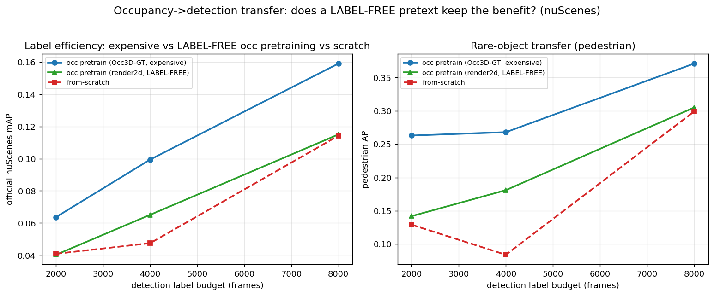

# Label-free occupancy pretraining → label-efficient detection

Can we get the detection **label-efficiency** benefit of occupancy pretraining *without paying for
occupancy labels*? Occ3D-GT occupancy is expensive (it is built on top of 3D boxes + LiDAR
segmentation), so "occ pretraining makes detection label-efficient" is partly circular. This doc
tests two **label-free** occupancy pretexts and transfers each to detection. Companion to
[PUBLICATION_DIRECTION.md](PUBLICATION_DIRECTION.md) and [OCC3D_SOTA_AND_VGGT_DIRECTION.md](OCC3D_SOTA_AND_VGGT_DIRECTION.md).

**Baselines to beat/approach** (official nuScenes mAP, det-ablation harness, fp32/refine-1/fusion,
2k/4k/8k detection-label budgets — see PUBLICATION_DIRECTION §1):

| budget | Occ3D-GT pretrained (expensive labels) | from-scratch |
|---|---|---|
| 2k | 0.064 | 0.041 |
| 4k | 0.099 | 0.048 |
| 8k | 0.159 | 0.114 |

---

## 1. Free 2D pseudo-labels (the shared ingredient)

Both pretexts need cheap supervision. We generate it with **`ngdet/labelgen`** — a training-free
engine of frozen foundation models (TUTORIAL §24):

- **semantic** = SegFormer *stuff* ∪ Grounded-SAM *things*, emitted **directly in the Occ3D 17-class
  space** (`NUSC_TAXONOMY`). Pedestrians/cars are crisp (Grounded-SAM), exactly the rare classes
  that carry the transfer benefit.
- **metric depth** = DepthAnything relative shape + a global affine to projected LiDAR + a
  per-SAM-segment shift → dense, object-consistent, metric.

No training, no 3D labels, no human annotation. Build the cache (2044 frames used here):

```bash
# 6 parallel shards (GPU is otherwise idle — the FMs are partly CPU-bound); --no-viz for bulk npz
python -m DeepDataMiningLearning.ngdet.labelgen.run --source nuscenes \
    --dataroot <nuscenes> --start <S> --num <N> --image-h 252 --image-w 700 \
    --depth-ckpt depth-anything/Depth-Anything-V2-Small-hf --save-npz --no-viz --out <labelgen_cache>
# -> <token>.npz per keyframe: sem (6,252,700) uint8 [Occ3D classes] + depth (6,252,700) f16 [metric]
```

## 2. Pretext A — `render2d` (our architecture, apples-to-apples)

**Idea (GaussianOcc-style 2D-render supervision, but with our high-quality pseudo-labels):** lift
cameras to a voxel semantic field with our LSS model, **render it back to 2D** along camera rays,
and match the pseudo-labels — never using 3D occupancy GT.

- **`models/lss_occ.py::render_2d(occ, geom)`** (new) — volume-composites the predicted voxel
  semantics + occupancy along the camera frustum (first-hit transmittance) → per-camera 2D semantic
  probs + expected depth.
- **`occupancy/train_occ_render2d.py`** (new) — the pretext trainer. Losses (all label-free):
  2D-semantic CE vs labelgen sem, 2D-depth L1 vs LiDAR depth, LiDAR-voxel-occupancy BCE. **No Occ3D
  GT.** Same architecture as the det-ablation (dinov2_base, decoder 4×96, refine-1, fusion) so the
  backbone warm-starts detection.

```bash
# pretrain (label-free), 2044 frames, 24 epochs:
python -m DeepDataMiningLearning.ngperception.occupancy.train_occ_render2d \
    --gts <gts> --nusc <nuscenes> --pseudo-cache <labelgen_cache> \
    --backbone dinov2_base --decoder-layers 4 --decoder-hidden 96 \
    --sem-weight 1.0 --depth-weight 0.1 --occ-weight 1.0 --epochs 24 --batch-size 4 --amp \
    --out-dir output/occ_render2d
# -> occ_render2d.pth (sem CE 3.4->0.5, LiDAR-occ BCE ->0.007; NO 3D/det/human labels)

# transfer to detection (warm-start the det ablation), per budget b in {2000,4000,8000}:
python -m DeepDataMiningLearning.ngperception.occupancy.train_det_ablation \
    --gts <gts> --nusc <nuscenes> --lidar-fusion --refine-iters 1 --batch-size 8 --epochs 12 \
    --pretrained output/occ_render2d/occ_render2d.pth --occ-weight 0.1 --max-samples b \
    --out-dir output/det_curveF/r2d_b
# eval: eval_det_ablation_official.py --ckpt .../det_abl.pth  (official nuScenes DetectionEval)
```

### Result — 3-way, official nuScenes mAP



| budget | Occ3D-GT (expensive) | **render2d (LABEL-FREE)** | from-scratch | pedestrian GT/r2d/scr |
|---|---|---|---|---|
| 2k | 0.064 | 0.040 | 0.041 | 0.263 / 0.142 / 0.129 |
| 4k | 0.099 | **0.065** | 0.048 | 0.268 / **0.181** / 0.084 |
| 8k | 0.159 | 0.115 | 0.114 | 0.371 / 0.305 / 0.299 |

**Verdict — real but partial.** The label-free pretext clearly helps at **4k** (+35 % mAP over
scratch, **pedestrian 2.2×**) and pedestrian-AP beats scratch at 2k/4k — the rare-object transfer is
there. But it **washes to ≈ scratch at 2k and 8k** and stays **below the expensive Occ3D-GT
ceiling**. The concept is proven; the limiter is the small, render-weak pretraining (2044 frames,
the metric-depth render did not fully converge). Headroom: scale the pretraining set + a stronger
geometry loss.

## 3. Pretext B — the **published GaussianOcc backbone** (external validation)

Instead of pretraining ourselves, reuse **GaussianOcc** (ICCV'25, fully self-supervised, no labels /
no poses; reproduced at mIoU 11.26, see [gaussianocc-repro] memory) as a frozen backbone and attach
a detection head. This is a *different architecture* (ResNet encoder + volume decoder) — an
independent, published-backbone data point.

- **Extraction (validated):** `encoder(imgs) → feature2vox_simple(feats[0], K, pose_spatial, …) →
  feat_mem (1,64,300,300,24)` metric ego grid [-40,40]×[-40,40]×[-1,5.4], **no rendering**. Our
  decoupled extractor reproduces it exactly (nonzero 0.902 = the in-pipeline probe's 0.90).
  Recipe in the `gaussianocc-repro` memory; `GaussianOcc/probe_volume.py`, `cache_gsocc_bev.py`.
- **`cache_gsocc_bev.py`** [py311] — build GaussianOcc inputs from nuScenes calibration for our det
  tokens, extract `feat_mem`, Z-collapse → BEV (64,200,200), cache fp16. (Runs like the eval:
  torchrun + `_stubs` PYTHONPATH.)
- **`occupancy/train_gsocc_det.py`** [py310] — attach our `VoxelDetHead` on the cached BEV (fed as
  an nz=1 volume), train **only the head** (backbone frozen = features cached), eval with the
  official nuScenes DetectionEval.

```bash
# 1. cache BEV features for train + full-val tokens [py311, torchrun + _stubs]:
torchrun --nproc_per_node=1 cache_gsocc_bev.py --config configs/nusc-sem-gs.txt \
    --load_weights_folder ckpts/nusc-sem-gs --eval_only \
    --token-file <tokens.txt> --out-dir <gsocc_bev_cache> --bev 200
# 2. train the det head on frozen BEV [py310]:
python -m DeepDataMiningLearning.ngperception.occupancy.train_gsocc_det \
    --nusc <nuscenes> --bev-cache <gsocc_bev_cache> --train-tokens train4k.txt \
    --epochs 24 --batch-size 16 --out-dir output/gsocc_det
# 3. official eval:
python -m ...train_gsocc_det --eval --nusc <nuscenes> --bev-cache <cache> \
    --val-tokens valfull.txt --ckpt output/gsocc_det/gsocc_det.pth --out-dir output/gsocc_det
```

### Result

Det head trains cleanly on the frozen GaussianOcc BEV (head-only, 3.0 M params; loss **7.8→2.1**
over 24 epochs, 4000 train frames). Official nuScenes DetectionEval on the full 6019-frame val:

**GaussianOcc-backbone detector: mAP = 0.021, NDS = 0.069** (car 0.078, pedestrian 0.055,
traffic_cone 0.032, bus 0.024; the rest ≈ 0).

**Read — weak, and NOT comparable to the curves above.** Two caveats dominate: (1) GaussianOcc is a
**camera-only** self-supervised model, so this is a *camera-only* detector, whereas the
render2d/Occ3D-GT/scratch curves are **LiDAR-fusion** (where LiDAR does most of the work — camera-only
3D detection is inherently far weaker, ~0.0x mAP). (2) The backbone is **frozen** (only the head
trains). The number is **non-zero** (car 0.078, pedestrian 0.055), so the label-free features do
carry a weak detection signal — but a fair verdict needs a **camera-only from-scratch baseline**
(not yet run). As-is, this external point is *suggestive, not conclusive*: a published label-free
camera backbone yields a trainable-but-weak detector. Adding LiDAR to the head, or an apples-to-apples
camera-only scratch control, is the follow-up.

## 4. Comparison + takeaway

Two independent tests of *"free occupancy pretext → label-efficient detection"*:

| pretext | labels used | modality / arch | headline |
|---|---|---|---|
| **render2d** | none (frozen-FM 2D pseudo-labels + LiDAR) | fusion, our LSS (apples-to-apples) | partial transfer: **+35 % mAP / ped 2.2× at 4k**; washes at 2k/8k |
| **GaussianOcc** | none (published self-sup backbone) | **camera-only**, external arch, frozen | trainable but weak (mAP 0.021); not comparable to the fusion curves — needs a camera-only control |

The honest story so far: a **label-free occupancy pretext does transfer to detection** (rare-object,
mid-budget), **partially recovering** the expensive-label benefit — you avoid *both* expensive
occupancy labels *and* most detection labels, at a quantified cost vs the Occ3D-GT ceiling. This is
the cheap-label complement to the positive Finding C (PUBLICATION_DIRECTION §1) and the negative
Findings A/B (VGGT doesn't transfer; GaussianOcc label-free ceiling 11.26).

**Next levers:** scale the render2d pretraining (more frames, stronger geometry loss); the
GaussianOcc external number; a camera-only (no-fusion) variant where the transfer gap should widen.
