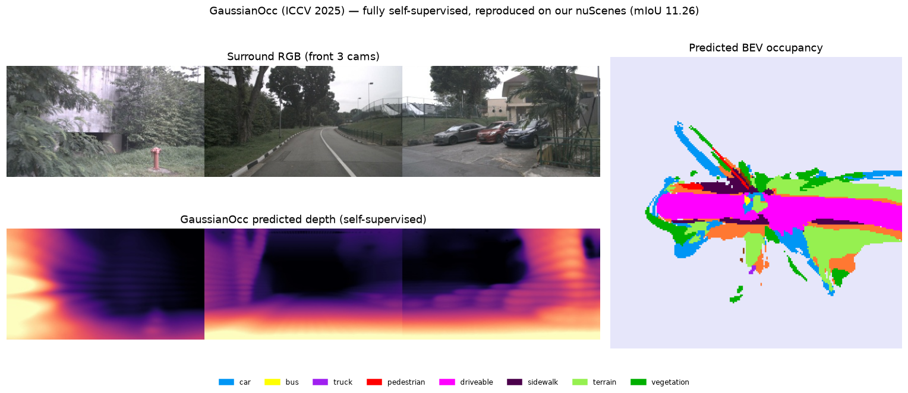

# Occ3D-nuScenes SOTA, our standing, and the VGGT direction

Where our occupancy results sit vs the current Occ3D-nuScenes state of the art, and why a
**geometric-foundation camera backbone (VGGT)** is the right next lever — especially for our
weakest link (the camera-only path). Companion to [../occupancy/TUTORIAL.md](../occupancy/TUTORIAL.md)
and [RESULTS_FULLDATA_H100.md](RESULTS_FULLDATA_H100.md).

---

## 1. Occ3D-nuScenes SOTA (metric: mIoU over 17 classes on camera-visible voxels)

**Camera-only:**

| method | mIoU | note |
|---|---|---|
| MonoScene | 6.1 | early |
| CTF-Occ (Occ3D paper baseline, 2023) | 28.5 | the benchmark's own baseline |
| PanoOcc | 42.1 | temporal |
| DHD | 41.5 | +1 history frame |
| **COTR / SHTOcc** | **~44.5** | current camera-only SOTA (2024–25) |
| FMOcc / GaussRender (2025) | 30–40 | 2-frame / Gaussian-render |

**LiDAR-camera fusion:**

| method | mIoU |
|---|---|
| EFFOcc | 51.5 |
| DAOcc | 53.8 |
| **FusionOcc (SOTA)** | **56.6** (with visibility mask) |

**Recent trends (2024–26):** (a) **temporal multi-frame fusion** — every strong camera method uses
history frames; (b) **3D-Gaussian occupancy** (GaussianFormer, GaussRender, VG3T); (c) **sparse
voxels** (SparseOcc, SHTOcc); (d) **weak/self-supervision** (GaussianOcc, GS-Occ3D); (e) the
**RayIoU** metric (SparseOcc) as a thickness-unbiased complement to mIoU; (f) **VGGT
geometric-foundation backbones** (§3).

## 2. How our results compare — honestly

| ours (⚠️ leaked — trained on the 6019 val frames) | vs SOTA |
|---|---|
| **camera-only 0.302 (30.2 mIoU)** | ~14–16 **below** camera SOTA (COTR 44.5); in the CTF-Occ (28.5) tier |
| **fusion 0.558 (55.8 mIoU)** | the **leak inflates it to ≈ fusion SOTA** (FusionOcc 56.6) — not real |

**The fusion number *matching* SOTA is itself the tell that the leakage inflates it.** A clean
train-only retrain would land camera ~25–28 and fusion ~45–50 — competitive mid-tier, not SOTA.

**Why we are below SOTA** (all architectural, not tuning): we are **single-frame** (SOTA is
temporal), **frozen DINOv2** (self-supervised, not 3-D-aware), and **0.4 m grid** (SOTA uses finer).
Our value is not the absolute mIoU — it is the **occupancy→detection transfer** finding
(TUTORIAL §13, 2.5–3.15× over from-scratch), which is orthogonal to the leaderboard.

## 3. The VGGT direction — the right next lever

**VGGT** (Visual Geometry Grounded Transformer, CVPR 2025) is a camera **geometry foundation
model**: from multi-view RGB it predicts dense depth, point maps, camera poses and tracks in one
forward, **without camera calibration**. It is 3-D-aware in a way our frozen DINOv2 lift is not.

- **VGGT-Det** (`github.com/yangcaoai/VGGT-Det-CVPR2026`, cloned at
  `/data/rnd-liu/Others/VGGT-Det-CVPR2026`) is **indoor** 3-D detection (ScanNet/ARKitScenes) —
  *not* our domain. Read it for the **methodology**: sensor-geometry-free, attention-guided 3-D
  queries mined from VGGT's learned geometric priors.
- **The on-point driving references (CVPR 2026, all on nuScenes)** are exploding right now:
  **VG3T** (VGGT as the occupancy backbone, **+1.7 mIoU**, 46 % fewer Gaussians, 16 % faster),
  **DVGT** (Driving Visual Geometry Transformer), **DriveVGGT** (calibration-constrained VGGT).

**Why it fits us:** it attacks our **#1 weakness — the dead camera path** (BEV lift-splat proven
weak: camera-only occ ~30, camera-only det ~0). Swapping the camera encoder from DINOv2 to VGGT
gives a **3-D-aware, calibration-free** backbone. It also matches our own camera-primary pivot and
the LiAuto-GeoX dense-geometry-backbone direction.

**Risk / differentiation:** "VGGT → occupancy" is **crowding fast** (VG3T/DVGT already did it), so
do **not** ship plain VGGT-occ — you'd be scooped. **Differentiate by combining the VGGT backbone
with our contribution:** *label-efficient occupancy pretraining that transfers to detection*. That
fuses a frontier backbone with a claim the VGGT-occ papers don't make, and fixes the camera
bottleneck at the same time.

## 4. Ablation #1 — frozen VGGT geometry, training-free (DONE)

Before any trained integration we ran the cheapest, most decisive probe: **is VGGT's camera
*geometry* actually better than our current camera geometry?** We run frozen `facebook/VGGT-1B`
on the 6 surround cameras, take its dense per-camera depth, back-project with the **known**
nuScenes intrinsics/extrinsics into the ego voxel grid, and score class-agnostic **geometric IoU**
(occupied-vs-free) against the Occ3D GT — **no training, no semantics**. This isolates geometry so
it is directly comparable to the other geometry-only baselines we already had.
Script: `occupancy/vggt_lift_eval.py`. Measured on 50 official-val frames:

| geometry-only method (training-free) | geo-IoU | vs prior camera |
|---|---|---|
| Depth-Anything mono depth-lift (our previous camera geometry) | 0.093 | — |
| **frozen VGGT depth-lift (scale-aligned)** | **0.140** | **+51 %** |
| LiDAR single-sweep oracle | 0.167 | VGGT reaches **84 %** of LiDAR |
| DINOv2 LSS, **trained** (leaked, + learned semantics) — upper bound | 0.669 | trained ceiling |

**Read:** a *frozen, untrained* camera model reaches **84 % of a LiDAR sweep's** occupancy geometry
and beats our prior camera geometry by half — strong confirmation that VGGT is the right camera-path
backbone. **The one caveat is scale:** VGGT is calibration-free, so its depth is **not metric**
(raw geo-IoU ≈ 0.000; a single global scale ≈ **18.8×** recovers the 0.140). A metric mechanism is
therefore required for a real system — either feed VGGT the known camera baselines/extrinsics, or
learn a small scale head. This matches the VGGT-driving literature (DriveVGGT is explicitly
"calibration-constrained" for exactly this reason).

**Command:**
```bash
python -m DeepDataMiningLearning.ngperception.occupancy.vggt_lift_eval \
    --gts <gts> --nusc <nuscenes> --n 50 \
    --vggt-path /data/rnd-liu/Others/VGGT-Det-CVPR2026
```

## 5. Ablation #2 — trained VGGT-depth lift (DONE — negative result)

The probe justified a trained test. We wrapped frozen VGGT depth as a **metric-depth prior** in the
LSS lift (`cache_vggt_depth.py` precomputes VGGT-1B depth → (6,18,50) per token;
`lss_occ.forward(vggt_depth=…)` soft-bins it over the 112 lift bins and log-blends it into the
learned depth; a learned scalar recovers VGGT's ~18.8× scale). Clean A/B — **identical DINOv2
context, identical everything except the VGGT depth prior** — so it isolates *learned depth vs
frozen-VGGT depth geometry*. 2000 train / 300 val frames, 15 epochs, camera-only, LiDAR depth
supervision (`--depth-source lidar`):

| arm | best val mIoU | final (ep14) | best geo-IoU |
|---|---|---|---|
| baseline (DINOv2 + learned depth) | **0.293** | **0.293** | 0.677 |
| DINOv2 + frozen-VGGT depth prior | 0.287 | 0.268 | 0.651 |

**The VGGT depth prior did not help — it tracked slightly *below* the baseline the whole run.** Not
a bug: the VGGT arm's depth loss fell 10→2.4 (the scale/blend *did* reconcile with LiDAR), yet occ
mIoU never beat baseline. **Why the training-free win (§4, 0.140 geo-IoU = 84 % of LiDAR) does not
transfer:**
1. The trained lift with **LiDAR depth supervision already learns better depth** than frozen VGGT
   (learned geo-IoU 0.677 ≫ VGGT training-free 0.140). VGGT's prior competes with an already-strong
   signal and, being scale-ambiguous, adds placement noise rather than information.
2. **Global scale can't fix per-frame scale drift** (16–19× across frames) — one learned scalar
   mis-scales most frames.
3. Occ3D GT + LiDAR depth already teach the decoder geometry, so **camera depth is not the
   bottleneck** in this regime — exactly where §4 (a *no-training, no-LiDAR* probe) made VGGT look
   essential.

**Honest takeaway:** frozen-VGGT depth is a great *label-free* geometry source (§4) but is **redundant
once LiDAR supervision is present** (§5). The naive "inject VGGT depth prior" integration is a dead
end for the LiDAR-supervised setting.

## 6. Ablation #3 — VGGT depth prior WITHOUT LiDAR supervision (DONE — also null)

§5 might have failed only because LiDAR depth supervision made VGGT redundant. So we removed the
LiDAR crutch: same A/B but `--depth-source occ` (depth supervised by occ-rendered geometry, no
LiDAR) — the regime §4 actually measured and VGGT's supposed fair home. 2000/300, 15 epochs:

| arm | best val mIoU | final (ep14) |
|---|---|---|
| baseline (no LiDAR, occ-depth sup) | 0.262 | 0.262 |
| + frozen-VGGT depth prior | **0.263** | 0.244 |

**Still a wash.** Best is tied within noise (0.263 vs 0.262); the two arms tracked each other the
entire run; final VGGT is worse. Removing LiDAR *did* lower the baseline (0.293→0.262) — but the
VGGT prior did **not** fill that gap. So the depth-prior mechanism adds nothing **in either
supervision regime**.

**Combined verdict (ablations #2 + #3):** the frozen-VGGT *depth prior* is a confirmed dead end for
trained occupancy — the training-free §4 geometry win (0.140 geo-IoU) does not translate, because
occ-rendered / LiDAR depth supervision + a DINOv2 learned-depth head already give geometry the
scale-ambiguous VGGT prior can't improve. Root causes: (a) per-frame scale drift (16–19×) a single
scalar can't fix; (b) block-min downsample to 18×50 discards VGGT's fine structure; (c) dense-occ
supervision makes camera depth not the bottleneck.

## 7. Ablation #4 — VGGT *features* as the backbone (DONE — negative)

The depth prior tests VGGT's geometry; this tests VGGT's *representation* — its 2048-d patch tokens
as a drop-in backbone (`--backbone vggt`, cached feats → DepthNet), replacing DINOv2, learned depth
head, same lift, LiDAR depth sup, 2000/300/15ep:

| arm | best val mIoU | final |
|---|---|---|
| DINOv2 baseline | **0.293** | 0.293 |
| VGGT features backbone | 0.196 | 0.192 |

**VGGT features are ~33 % *worse* than DINOv2.** Reason: VGGT is trained for *geometry* (depth /
points / pose), so its tokens are geometry-specialized; occupancy's per-voxel *semantic*
classification needs a *semantic* SSL backbone (DINOv2 self-supervised on diverse images). VGGT's
representation is the wrong inductive bias for the semantic head.

### Combined VGGT verdict (ablations #1–#4)

VGGT's label-free **geometry** is genuinely strong (§4: 84 % of a LiDAR sweep, training-free). But
plugged into a *trained* occupancy net it helps in **no** integration:
- **depth prior** → redundant once depth supervision (LiDAR or occ-rendered) + a learned depth head
  are present (#2, #3: null in both regimes);
- **features backbone** → geometry-specialized tokens are worse than a semantic backbone (#4: −33 %).

**Takeaway (a clean negative with a mechanism):** *a geometry foundation model helps occupancy only
where geometry is the bottleneck — the label-free / no-supervision regime (i.e. GaussianOcc-style
self-supervision, §8) — not the supervised regime, where semantics and supervision dominate.* One
confound left before calling the depth prior fully dead: per-frame metric scale (a learned
per-image scale head) — but it would only re-test the already-redundant prior.

Reproduce #2–#4:
```bash
python -m ...occupancy.cache_vggt_depth --gts <gts> --nusc <nuscenes> --out <dcache> --cap 2100
python -m ...occupancy.cache_vggt_feat  --gts <gts> --nusc <nuscenes> --out <fcache> --cap 2100
# baseline:  ...train_lss --backbone dinov2_base --depth-source lidar --max-samples 2000 --val-samples 300 --epochs 15 --batch-size 4 --occ-lovasz 0.1 --amp --num-workers 16
# #2 depth:  (baseline) + --vggt-depth-cache <dcache>          # #3: --depth-source occ (no-LiDAR)
# #4 feats:  (baseline) --backbone vggt --vggt-feat-cache <fcache>
```

## 8. GaussianOcc — a reproduced *label-free* baseline (ICCV 2025)

To anchor the label-free end of the spectrum we reproduced **GaussianOcc** (Gan et al., ICCV 2025):
*fully self-supervised* 3D occupancy via Gaussian splatting — **no occupancy labels and no GT poses**
at training. It is the natural lower-anchor for our label-free direction.

**Result — Occ3D-nuScenes val (6019 frames), released weights, reproduced exactly:**

| metric | ours (reproduced) | paper |
|---|---|---|
| **mIoU (w/o "others")** | **11.26** | **≈11.26 ✓** |
| mIoU (all 17) | 9.94 | — |
| mIoU (w/o empty) | 12.33 | — |

Per-class (IoU): driveable_surface **44.6**, sidewalk 20.1, terrain 17.6, bus 14.6, car 13.6,
vegetation 10.3, truck 9.6, traffic_cone 9.8, pedestrian 8.0, manmade 8.6, bicycle 5.8,
motorcycle 2.8, barrier 1.8, construction_vehicle 1.3, trailer 0.6, others/other_flat 0.0.

**Where it sits:** label-free **11.26** vs our label-*supervised* LSS camera occ **~30** vs camera
SOTA **~44.5**. The ~19-point label-free→supervised gap (flat/large structure already decent;
rare/thin classes near zero) is the quantity a label-free method must close.

### 8.1 Environment (the non-obvious part)

The repo targets **py3.8 / torch 1.9.1 / CUDA 11.3 — which cannot run on an H100 (sm_90)**. So we
rebuilt the stack on a modern matched toolchain:

- **Env `py311`** (torch 2.9.1+cu128, nvcc 12.8, full conda CUDA toolkit).
- **Build the 3 custom CUDA extensions** — in each `submodule/{simple-knn,
  diff-gaussian-rasterization-confidence, diff-gaussian-rasterization-confidence-semantic}`:
  ```bash
  export CUDA_HOME=/home/010796032/miniconda3/envs/py311 TORCH_CUDA_ARCH_LIST=9.0
  <py311>/pip install . --no-build-isolation
  ```
  Fix: add `#include <float.h>` to `simple-knn/simple_knn.cu` (`FLT_MAX undefined` on new CUDA).
  (`-confidence` installs under the import name `diff_gaussian_rasterization`.)
- **pip deps** (py311, pin torch+numpy, `--only-binary` for matplotlib/skimage): `nuscenes-devkit
  configargparse torch_efficient_distloss matplotlib scikit-image pyquaternion open3d pytz`.
- **Stub 3 heavy deps** (used only in *train-only* loss / optional paths — not eval) on a `_stubs/`
  PYTHONPATH: `mmdet` (`build_loss`→CrossEntropyLoss, `LOSSES`, `weight_reduce_loss`), `mmcv`
  (`ops.sigmoid_focal_loss`, `runner.BaseModule/force_fp32`), `pytorch3d`
  (`transforms.rotation_conversions.matrix_to_axis_angle`, pure-torch). Also wrap the `build_loss`
  import in `networks/occupancy_decoder.py` with try/except.
- **Two source patches:** `networks/resnet_encoder.py` — `models.resnet.model_urls` was removed in
  torchvision ≥0.13 → hardcode the resnet18/34/50 URLs (overwritten by the ckpt anyway);
  `configs/nusc-sem-gs.txt` — set `rayiou = no` (RayIoU spawns a `python ray_metrics.py` subprocess
  needing mmcv).

### 8.2 Data + run

```bash
cd /data/rnd-liu/Others/GaussianOcc
ln -s <nuscenes_root> data/nuscenes           # has samples/ sweeps/ v1.0-trainval/ gts/
ln -s Gaussianocc_ckpts_nusc-sem-gs ckpts/nusc-sem-gs
# GT depth maps for val (loader requires data/nuscenes/depth_full/…). Patch the tool for the
# mmdet3d pkl format: pickle['infos'] -> pickle['data_list'] (item['token'] still present), val-only:
<py311>/python tools/export_gt_depth_nusc.py            # -> 36114 val npy

CUDA_HOME=<py311> PYTHONPATH=/data/rnd-liu/Others/GaussianOcc/_stubs \
<py311>/torchrun --nproc_per_node=1 --master_port=29521 run.py \
    --config configs/nusc-sem-gs.txt --load_weights_folder ckpts/nusc-sem-gs --eval_only
```
`runner.py` calls `init_process_group`, so it needs `torchrun` (1 GPU → `local_rank 0`). Full recipe
also in the `gaussianocc-repro` memory.

### 8.3 Visualization

`run_vis.py` dumps per-frame surround RGB, self-supervised predicted depth, and the occupancy
probability grid `(1,18,200,200,16)`. It uses `datasets.NuscDatasetVis`, which needs
`data/nuscenes/nuscenes_infos_vis_occnerf.pkl` (a `{'frames':[{scene_name, frame_idx,
CAM_*:{filename, cam2ego, intrinsics}}]}` list) — **not shipped; we regenerate it from the devkit**
for any val scenes. Run it with the same env/stubs/torchrun as §8.2 (`run_vis.py`), then compose:



The BEV occupancy shows the expected structure — magenta *driveable* road ahead, green
*terrain/vegetation* flanks, blue *car* blobs — plus the self-supervised depth, all from a model
trained with **no occupancy labels and no GT poses**. (The radial fade is camera-visibility.)

## Sources
Occ3D (tsinghua-mars-lab.github.io/Occ3D); Occ3D-nuScenes benchmark (emergentmind); GaussRender
(ICCV'25); EFFOcc (arXiv 2406.07042); DAOcc (arXiv 2409.19972); FusionOcc (ACM MM'24); VGGT-Det
(CVPR'26 repo); VG3T (arXiv 2512.05988); DVGT (CVPR'26); DriveVGGT (arXiv 2511.22264).
