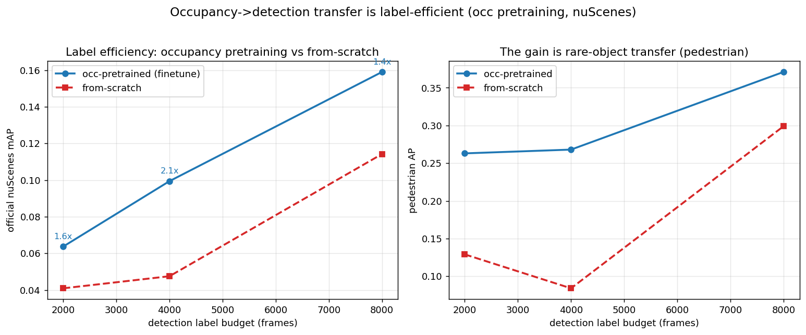

# Label-efficient / label-free AD perception — what we have, and the publication plan

A consolidation of the occupancy + detection experiments in this repo, and a concrete plan for a
publishable paper. Companion to [OCC3D_SOTA_AND_VGGT_DIRECTION.md](OCC3D_SOTA_AND_VGGT_DIRECTION.md),
[RESULTS_FULLDATA_H100.md](RESULTS_FULLDATA_H100.md), and the occupancy/detection tutorials.

---

## 1. Everything we measured (one table)

**Occupancy, Occ3D-nuScenes val, mIoU** (our runs are the 2000-frame / 15-epoch ablation harness
unless noted; ⚠️ = trained-on-val leakage in the full-data numbers):

| setting | supervision | mIoU | note |
|---|---|---|---|
| camera SOTA (COTR/SHTOcc) | full labels | ~44.5 | temporal, published |
| our LSS full-data ⚠️ | full labels | 0.302 | leaked; ~CTF-Occ tier |
| our LSS 2k-frame baseline (DINOv2, LiDAR-dep sup) | full labels | **0.293** | the A/B reference |
| **GaussianOcc (reproduced)** | **NONE (self-sup)** | **11.26** | no labels, no GT poses |

**Geometry-only, training-free (class-agnostic geo-IoU):**

| method | geo-IoU | |
|---|---|---|
| Depth-Anything mono lift | 0.093 | prior camera geometry |
| **frozen VGGT depth-lift** | **0.140** | +51%, = 84% of LiDAR |
| LiDAR single-sweep oracle | 0.167 | |

**VGGT integration ablations (trained, 2k/15ep, vs the 0.293 / 0.262 baselines):**

| # | what | regime | baseline | VGGT | verdict |
|---|---|---|---|---|---|
| #2 | depth **prior** | with LiDAR sup | 0.293 | 0.287 | no gain |
| #3 | depth **prior** | no LiDAR sup (occ-dep) | 0.262 | 0.263 | tied (noise) |
| #4 | **features** backbone | with LiDAR sup | 0.293 | 0.196 | **−33% (worse)** |

**Detection — the label-efficiency curve (the positive result, official nuScenes mAP):**
occ-pretrained (finetune) vs from-scratch, matched fp32 config, official val (6019 frames):

| det label budget | finetune mAP | scratch mAP | ratio | pedestrian AP (ft / scr) |
|---|---|---|---|---|
| 2000 | **0.064** | 0.041 | 1.56× | 0.263 / 0.129 |
| 4000 | **0.099** | 0.048 | **2.09×** | 0.268 / 0.084 |
| 8000 | **0.159** | 0.114 | 1.39× | 0.371 / 0.299 |

occ-pretraining wins at **every** budget (1.4–2.1× mAP), and **finetune @ 2k (0.064) > scratch @ 4k
(0.048)** — worth **≥2× the labels** at the low end. The gain is **entirely rare-object transfer**:
pedestrian/cone/barrier 1.5–3×, car a wash (0.41/0.41 at 8k). The pedestrian sub-curve is the story
— the occ-pretrained detector is near-flat across budgets (it *transfers* pedestrian geometry) while
from-scratch needs 8k labels to approach it. (Full-data anchor from earlier work:
[RESULTS_FULLDATA_H100.md] finetune 3.15× scratch at 8k. PETR/BEVFusion multi-expert pipeline also
built + evaluated on official metrics.) Reproduce:
`train_det_ablation.py --lidar-fusion --refine-iters 1 --max-samples {2000,4000,8000} [--pretrained <occ> --occ-weight 0.1]`
(fp32 — `--amp` triggers a BN collapse) → `eval_det_ablation_official.py` → `plot_label_efficiency.py`.

## 2. The findings

**Finding A — a geometry foundation model's label-free geometry does NOT transfer to trained
occupancy.** VGGT (CVPR'25) gives genuinely strong *label-free* geometry — a frozen, untrained
depth-lift reaches **84% of a LiDAR sweep** and +51% over the prior camera lift. Yet plugged into a
*trained* occupancy net it helps in **none of 4 integration ablations**: the **depth prior** is a
wash with *and* without LiDAR supervision (#2/#3 — redundant once a learned depth head + depth
supervision are present), and its **features backbone is 33% *worse* than DINOv2** (#4 — VGGT's
tokens are geometry-specialized, the wrong bias for a *semantic* occupancy head). Mechanism, not
just a null: **a geometry FM helps only where geometry is the bottleneck (the label-free /
no-supervision regime, i.e. GaussianOcc-style self-sup), not the supervised regime where semantics
and supervision dominate.** "Strong zero-shot geometry ≠ useful trained prior."

**Finding B — the label-free occupancy ceiling is ~11 mIoU.** We reproduced GaussianOcc
(ICCV'25, fully self-supervised, no labels/poses) *exactly* (11.26) and visualized it. That fixes a
concrete anchor: label-free 11 vs supervised ~30 (ours) vs SOTA ~44.5. The ~19-point gap is
structured — flat/large classes decent, rare/thin classes ≈0.

**Finding C (the POSITIVE) — occupancy pretraining is label-efficient for detection, via rare-object
transfer.** Occ-pretrained backbone → detection beats from-scratch at every label budget (§1 curve:
1.4–2.1× official mAP; finetune @ 2k > scratch @ 4k = ≥2× labels). Crucially the gain is **not**
uniform — it is concentrated on **rare/hard classes** (pedestrian, cone, barrier 1.5–3×) while easy
car is a wash. Interpretation: the occupancy encoder learns dense per-voxel geometry for exactly the
thin/rare structures where detection-from-scratch is data-starved, and transfers it. This is the
headline claim; it is orthogonal to the leaderboard and robust to being below absolute SOTA.

## 3. Publication options

**Option A — Analysis / negative-results paper.** *"When does geometry-foundation transfer help
3D occupancy? A systematic study."* Contributions: (1) Finding A with the redundancy mechanism +
the training-free-vs-trained gap; (2) Finding B as the label-free anchor; (3) the reusable harness.
Fit: CVPR/ICCV workshops, WACV, or the analysis/negative-results tracks. Honest, self-contained,
already ~80% done.

**Option B — Positive paper (Finding C headline) with A/B as ablations.** *Label-efficient occupancy
pretraining that transfers to detection* — now backed by the **measured data-efficiency curve** (§1,
Finding C: rare-object transfer, ≥2× labels), with Findings A/B as the "what doesn't work / why" that
motivate *why occupancy* (not a geometry FM) is the right pretext. Stronger venue potential and the
positive is in hand.

**Recommendation:** **B is now the target** — the positive headline (Finding C curve) exists, and
A/B give it a rare "here's what fails and the mechanism" spine. A remains a clean fallback. The
VGGT/GaussianOcc negatives are the differentiator either way — the VGGT-occ space is crowded
(VG3T/DVGT/DriveVGGT), so *"the obvious VGGT-occ integration doesn't work, and why"* is a contribution
those papers don't make. Related work: MTA (cross-task alignment helps the long tail — parallels
Finding C), Sensor2Sensor (4DGS label-free data engine — parallels the label-free arc).

## 4. What's needed to get to submission

- [x] Ablation #4 (VGGT features backbone) — done, −33%; Finding A closed across 4 ablations.
- [ ] **Clean train-only retrain** (leakage-free occ numbers) — required for any headline occ claim.
- [x] **Data-efficiency curve** for occ→detection transfer (2k/4k/8k labels) — DONE (Finding C,
      §1): 1.4–2.1× mAP, ≥2× labels, rare-object-driven. Next: add a 16k/28k point (gap-narrowing
      high anchor) + a camera-only (no-LiDAR-fusion) variant for a stronger transfer story.
- [ ] One more VGGT lever if we want Finding A airtight: per-frame metric-scale head (removes the
      scale-drift confound before declaring the prior dead).
- [ ] Scale the GaussianOcc analysis: per-class label-free-vs-supervised gap → which classes are
      "learnable without labels" (flat/large) vs not (rare/thin) — a clean sub-result.
