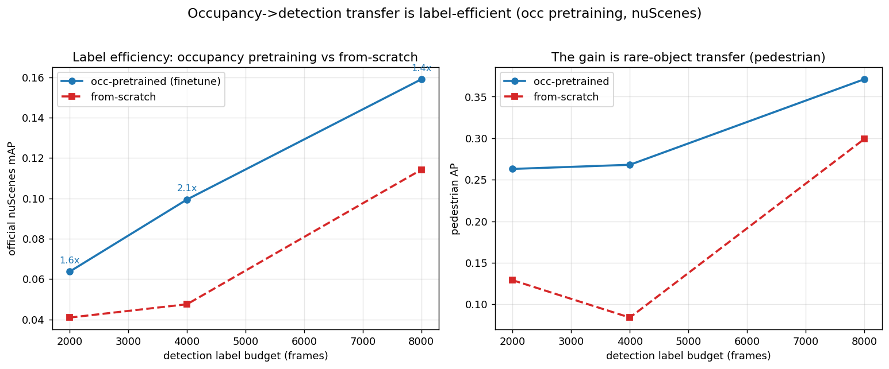
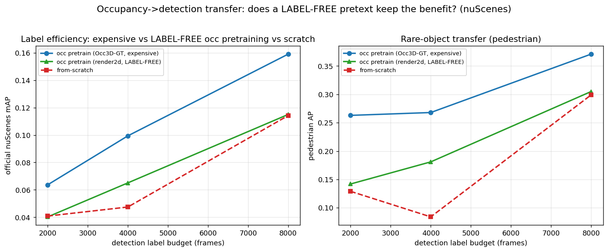
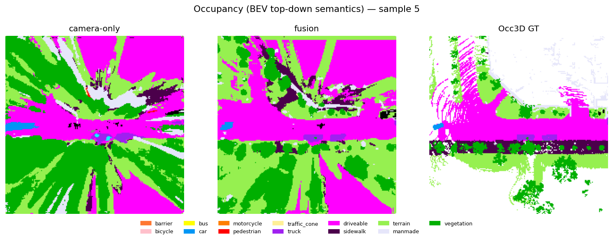
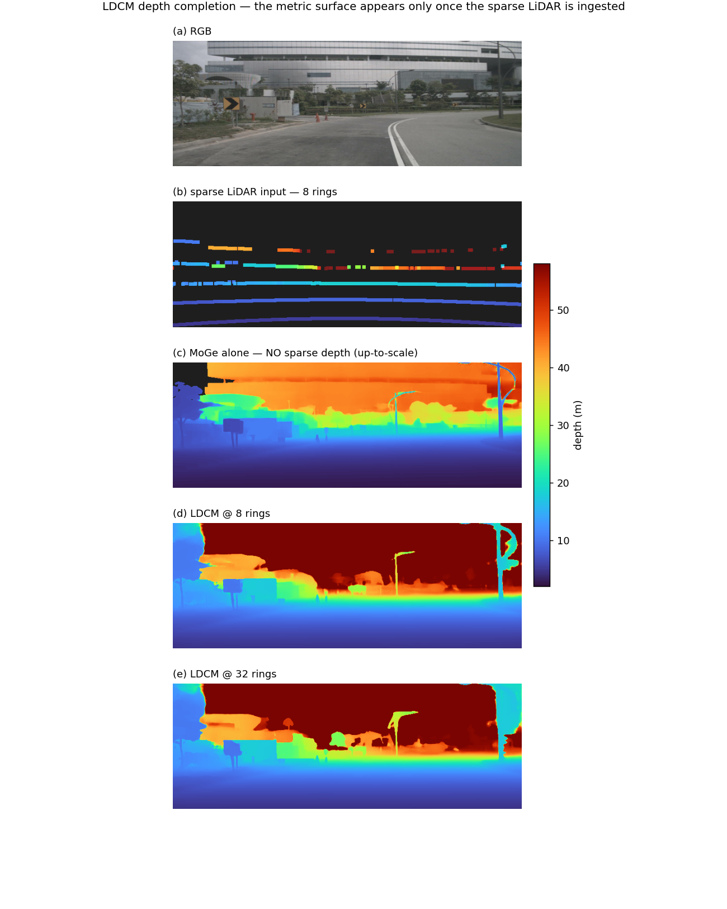
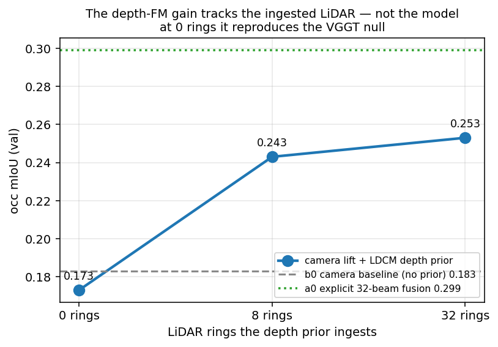
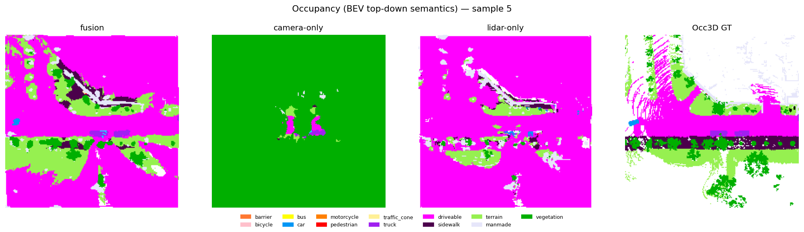
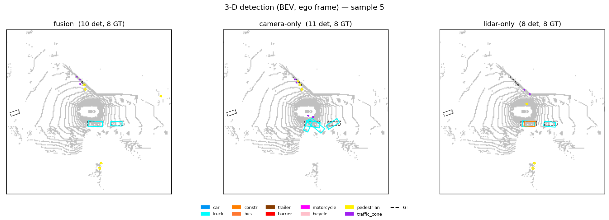
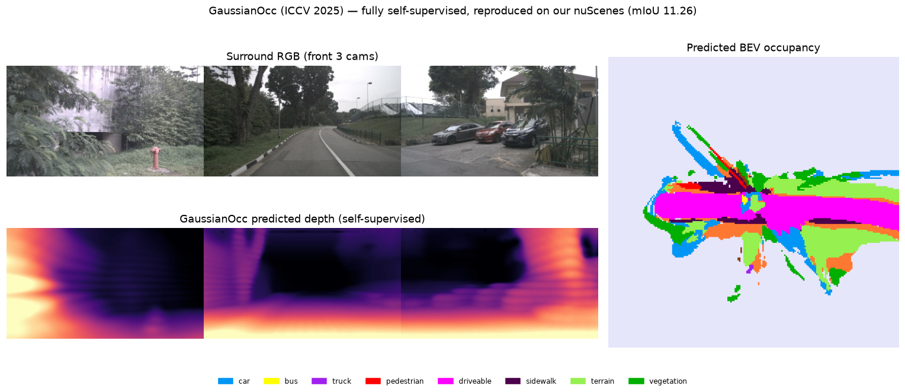

# Tutorial — every result, one chapter each, reproducible

This is the **results tutorial** for `ngperception`: one chapter per finding, each with the
question it answers, how the method works, **the exact command**, the measured numbers, a figure
where one exists, and a takeaway. The companion docs are the *narrative*
([TUTORIAL_LABELFREE_PERCEPTION_JOURNEY.md](TUTORIAL_LABELFREE_PERCEPTION_JOURNEY.md)) and the
*paper* ([PAPER_DRAFT.md](PAPER_DRAFT.md)); this one is the *lab manual*.

> **Read Chapter 9 first if you read nothing else.** Most of what we learned the hard way is not
> "which model wins" — it is **how to avoid fooling yourself**. Every trap in Chapter 9 is one we
> actually fell into, with the numbers from the run that caught it.

**Per-chapter template:** *Question → How it works → Run → Result → Takeaway.*

| ch | topic | headline |
|---|---|---|
| [0](#0-setup) | Setup | data, env, one-time deps |
| [1](#1-the-positive-result-occupancy-pretraining-buys-label-efficient-detection) | **Occ → detection label-efficiency** | **+35% mAP @2k labels, rare-object-driven** |
| [2](#2-occupancy-miou-does-not-predict-transferability) | Occ mIoU ≠ transferability | the default pretext metric is the wrong one |
| [3](#3-camera-foundation-model-backbones) | Camera FM benchmark | plain DINOv2 beats RADIO and VGGT |
| [4](#4-label-free-occupancy-pretexts) | Label-free pretexts | null-to-negative; better labels ≠ better transfer |
| [5](#5-the-depth-fm-arm-ldcm--the-zero-sensor-rung) | **Depth-FM arm (LDCM)** | **+38% that turns out to be a LiDAR side-channel** |
| [6](#6-the-point-fm-arm-sonata) | Point-FM arm (Sonata) | teacher-free ≠ transferable, out of domain |
| [7](#7-fusion-and-modality-ablation) | Fusion / modality | where the gain actually comes from |
| [8](#8-exact-reproductions) | Reproductions | FlashOcc 0.3809 vs 0.3784 (+ a real bug) |
| [9](#9-how-not-to-fool-yourself) | **How not to fool yourself** | seven traps, with the numbers |
| [10](#10-where-this-leaves-us) | Where this leaves us | what is worth doing next |

---

## 0. Setup

**Data.** Occ3D-nuScenes (`gts/`) + nuScenes v1.0-trainval. On this machine:

```bash
GTS=/home/lkk688/Developer/occ3d_data/gts
NUSC=/mnt/e/Shared/Dataset/NuScenes/v1.0-trainval
```

**Env.** One env, pure-PyTorch-first (`py312`, torch 2.10+cu128). Only two chapters need extra
compiled deps, and both are one-time:

```bash
# Chapter 5 (LDCM depth FM)
pip install --no-deps "git+https://github.com/EasternJournalist/utils3d.git"   # MoGe needs the .pt API
git clone https://github.com/aigc3d/LDCM.git Others/LDCM

# Chapter 6 (Sonata point FM)
pip install spconv-cu126
pip install torch-scatter --no-build-isolation      # build isolation cannot see torch -> fails without this
git clone https://github.com/facebookresearch/sonata.git Others/sonata
```

**Scale caveat used throughout.** The full harness (Chapters 1–4) is the repo's **2044-frame /
24-epoch** protocol on an H100. Chapters 5–6 were run locally at a reduced **400-frame / 12-epoch /
single-seed** budget on an RTX 3090 — so in those chapters **read the deltas, not absolute mIoU**,
and treat ±0.01 as noise.

---

## 1. The positive result — occupancy pretraining buys label-efficient detection

**Question.** Labelled 3D boxes are the scarce resource. If we pretrain the backbone on dense 3D
occupancy, does 3D detection need fewer boxes?

**How it works.** Train the LSS occupancy model on Occ3D-GT, then initialise the detector from that
encoder and fine-tune on a *small* number of detection labels (2k / 4k / 8k), against an identical
detector trained from scratch. Everything else is matched; evaluation is the **official nuScenes
mAP** (not a proxy).

**Run.**
```bash
# occupancy pretrain -> low-label detection, at 3 budgets, with and without the pretext
bash DeepDataMiningLearning/ngperception/occupancy/run_le_occ3d.sh
# or manually, per budget:
python -m DeepDataMiningLearning.ngperception.occupancy.train_det_ablation \
    --lidar-fusion --refine-iters 1 --max-samples {2000,4000,8000} \
    [--pretrained <occ_ckpt> --occ-weight 0.1]                    # omit for the scratch arm
python -m DeepDataMiningLearning.ngperception.occupancy.eval_det_ablation_official
python -m DeepDataMiningLearning.ngperception.occupancy.plot_label_efficiency
```
> **fp32 only** — `--amp` triggers a BatchNorm collapse in this trainer (Chapter 9, trap 6).

**Result** (official nuScenes mAP):

| pretext @ budget | 2k | 4k | 8k |
|---|---|---|---|
| **occ3d-GT (manual labels)** | **0.163** | **0.183** | **0.197** |
| from-scratch (DINOv2) | 0.121 | 0.153 | 0.177 |
| voxel-soft (label-free) | 0.115 | 0.140 | — |
| DynamicOcc (label-free, dynamic/static split) | 0.087 | — | — |

**+35% mAP at 2k labels**, and it holds at 4k (+20%) and 8k (+11%). In the LiDAR-fusion
configuration the effect is even starker — finetune @2k (0.064) beats **scratch @4k** (0.048),
i.e. the pretext is worth **≥2× the labels** at the low end.



**The mechanism is the real finding.** The gain is *not* uniform. It is concentrated on **rare, thin
classes** — pedestrian / cone / barrier improve **1.5–3×** — while easy `car` is a wash (0.41 vs
0.41 at 8k). The occupancy encoder learns dense per-voxel geometry precisely where
detection-from-scratch is data-starved, and transfers it.



**Takeaway.** Occupancy is a *good* detection pretext, but only with good labels, and the reason is
rare-object geometry transfer — a mechanism you can predict from, not a leaderboard delta.

---

## 2. Occupancy mIoU does not predict transferability

**Question.** The field optimises occupancy mIoU. If occupancy is a pretext, is mIoU the right thing
to maximise?

**How it works.** Hold the trainer fixed, vary only the pretraining data scale, and track two
numbers: the pretext's own occ mIoU, and the downstream detection mAP after transfer.

**Run.**
```bash
bash DeepDataMiningLearning/ngperception/occupancy/run_datascale.sh      # DINOv2-B
bash DeepDataMiningLearning/ngperception/occupancy/run_datascale_L.sh    # DINOv2-L
```

**Result.**

| pretraining frames | occ mIoU | detection mAP after transfer |
|---|---|---|
| 2044 | 0.288 | 0.106 |
| ~28k (full) | 0.302 | **0.163** |

Occ mIoU **saturates** by 2044 frames (+0.014 for 14× the data) while **detection transfer keeps
scaling** (+0.057, +54%). The two curves come apart.

**Takeaway.** **Report transfer, not pretext mIoU.** A pretext that looks "done" by its own metric
may still be improving as a representation — and, symmetrically (Chapter 4), a pretext with better
labels can transfer *worse*.

---

## 3. Camera foundation-model backbones

**Question.** Which frozen image FM best supports occupancy and its downstream transfer — a
semantic FM, an agglomerative one, or a geometry one?

**How it works.** Freeze the FM, emit dense patch tokens, LSS depth-supervised lift → occupancy;
only the lift/decoder/heads train. Same budget for every backbone.

**Run.**
```bash
bash DeepDataMiningLearning/ngperception/occupancy/run_backbone_bench.sh   # occ
bash DeepDataMiningLearning/ngperception/occupancy/run_backbone_det.sh     # + detection transfer
```

**Result** (nuScenes @2044 frames):

| backbone | kind | occ mIoU | det mAP@2k |
|---|---|---|---|
| **DINOv2-large** | semantic | **0.316** | **0.114** |
| DINOv2-base | semantic | 0.288 | 0.106 |
| RADIO v2.5-b | agglomerative | 0.274 | 0.096 |
| VGGT | geometry | 0.218 | — |
| *FlashOcc-4D-stereo (supervised ref.)* | — | *0.3809* | — |

And the VGGT integration ablations, against the 0.293 / 0.262 baselines:

| # | VGGT used as | regime | baseline | VGGT | verdict |
|---|---|---|---|---|---|
| 2 | depth **prior** | with LiDAR sup | 0.293 | 0.287 | no gain |
| 3 | depth **prior** | no LiDAR sup | 0.262 | 0.263 | tied |
| 4 | **feature backbone** | with LiDAR sup | 0.293 | **0.196** | **−33%** |



**The mechanism.** VGGT genuinely has strong *label-free* geometry — a frozen, untrained depth-lift
reaches **84% of a LiDAR sweep** (geo-IoU 0.140 vs 0.167; the prior camera lift was 0.093). But
plugged into a *trained, supervised* occupancy net it helps nowhere: the depth prior is **redundant**
once a learned depth head + LiDAR depth supervision exist, and its tokens are **geometry-specialised
— the wrong bias for a semantic head**.

**Takeaway.** "Strong zero-shot geometry ≠ useful trained prior." A geometry FM helps only where
geometry is the bottleneck (the label-free regime), not where semantics and supervision dominate.
Backbone **capacity and in-domain semantics** beat backbone *type*.

---

## 4. Label-free occupancy pretexts

**Question.** Occ3D labels are manual. Can a label-free occupancy pretext buy the same detection
label-efficiency as Chapter 1?

**How it works.** Generate occupancy pseudo-labels from unannotated LiDAR (multi-sweep accumulation +
foundation-model semantics projected from cameras), pretrain on them, then run the same transfer.
`DynamicOcc` adds Occ3D's missing ingredient — **dynamic/static separation**, so moving objects do
not smear across accumulated sweeps.

**Run.**
```bash
bash DeepDataMiningLearning/ngperception/occupancy/run_label_efficiency.sh
```

**Result.** From the Chapter 1 table: voxel-soft **0.115** vs scratch **0.121** (null), DynamicOcc
**0.087** (clearly worse). The fair 2×2 over {voxel, anisotropic-Gaussian} × {hard, soft-FM}
teachers gives **voxel-soft best at mIoU 0.104** — the Gaussian representation earns **no advantage**
as a *label* once an occupancy/semantic-coupling confound is removed.

**The sharpest negative in the project:** DynamicOcc has **+60% better foreground pseudo-label
agreement** and transfers **worse**. *Better labels ≠ better transfer.*

**Takeaway.** Label-free occupancy pretexts are teacher- **and** data-bounded. The pretext must teach
**camera-inferable** structure; improving label fidelity in a way the camera cannot infer does not
help, and can hurt. Gaussians belong in prediction/reconstruction, **not** as labels.

---

## 5. The depth-FM arm (LDCM) — the zero-sensor rung

**Question.** Chapter 3 killed a geometry FM (VGGT) as a depth prior, but with a stated mechanism:
redundancy with LiDAR depth supervision. **LDCM** (ICLR'26) is different *in kind* — it is **metric**
and **conditioned on sparse LiDAR**. Does a depth FM help where VGGT could not?

**How it works.** LDCM = frozen monocular geometry prior (MoGe-2) → **Poisson gradient-field
alignment** that fuses it with the projected sparse LiDAR into a coherent *metric* coarse depth →
DINOv2 ViT-B dual-encoder refinement → an **intrinsic-free point map**. We cache its depth in the
same format as the VGGT prior so it drops into the *same slot* — a controlled A/B. `--beams`
decimates the 32 nuScenes rings, and `--variant` exposes LDCM's own ladder.

**Run.**
```bash
# cache the prior at three rungs of "how much LiDAR does the prior see"
for spec in "depth_pred 0 full32" "depth_pred 8 beam8" "mono_depth 0 monoonly"; do set -- $spec
  python -m DeepDataMiningLearning.ngperception.occupancy.cache_ldcm_depth \
    --gts $GTS --nusc $NUSC --out $LD/$3 --cap 1000 --variant $1 --beams $2; done

# prior quality WITHOUT training (note the two protocol flags -- see Chapter 9)
python -m DeepDataMiningLearning.ngperception.occupancy.eval_depth_prior \
    --gts $GTS --nusc $NUSC --n 400 --holdout-beams 8 [--median-align] \
    --cache full32=$LD/full32 beam8=$LD/beam8 monoonly=$LD/monoonly

# the ladder: identical training, only the prior changes
COMMON="--nusc $NUSC --gts $GTS --max-samples 400 --val-samples 100 --epochs 12 --batch-size 2 \
        --lr 2e-3 --backbone dinov2_base --decoder-layers 4 --decoder-hidden 96 --depth-source lidar --seed 0"
python -m ...train_lss $COMMON                                                     # b0 baseline
python -m ...train_lss $COMMON --vggt-depth-cache $LD/full32   --depth-prior-metric # b1  32 rings
python -m ...train_lss $COMMON --vggt-depth-cache $LD/beam8    --depth-prior-metric # b2   8 rings
python -m ...train_lss $COMMON --vggt-depth-cache $LD/monoonly                      # b3   0 rings (up-to-scale -> learn the scale)

# figures
python -m DeepDataMiningLearning.ngperception.occupancy.viz_depth_arms --gts $GTS --nusc $NUSC --out <docs>
```

**Result — prior quality**, on LiDAR returns **held out from the 8-ring input**:

| prior | AbsRel (raw) | δ<1.25 (raw) | AbsRel (median-aligned) | δ<1.25 (aligned) |
|---|---|---|---|---|
| LDCM @32 rings | 0.069 | 0.923 | 0.088 | 0.934 |
| LDCM @8 rings | 0.099 | 0.885 | 0.114 | 0.891 |
| MoGe alone (0 rings) | 0.905 | **0.0002** | 0.329 | 0.456 |



The figure *is* the result: MoGe alone (c) has plausible **structure** but no metric scale — the raw
δ<1.25 of **0.0002** says it is not metric at all. The metric surface only appears once the Poisson
step ingests the sparse returns (d, e).

**Result — transfer:**

| arm | depth prior | rings the prior sees | occ mIoU | Δ vs b0 |
|---|---|---|---|---|
| b0 | none | — | 0.183 | — |
| b3 | MoGe alone | **0** | 0.173 | **−0.010 (wash)** |
| b2 | LDCM | 8 | 0.243 | +0.060 |
| b1 | LDCM | 32 | 0.253 | +0.070 |
| a0 | *explicit 32-beam fusion branch* | 32 (direct) | *0.299* | *+0.116* |



**This refuted our own hypothesis.** We predicted LDCM would succeed where VGGT failed *because* it
is metric and sparse-conditioned. It does give **+38%** — but the gain is **monotone in the LiDAR the
prior ingests and vanishes at zero rings**, where a strong monocular FM lands exactly where VGGT did.
So the +38% is a **LiDAR side-channel, not better monocular reasoning**: a "camera-only" model
carrying a sparse-depth-conditioned prior **is not camera-only**.

**What survives is a plumbing result** (still useful): a depth-completion FM is an *efficient channel*
for sparse LiDAR — **8 rings recover 86% of the 32-ring gain**, about half of what a dedicated
32-beam fusion branch buys. Attractive for low-beam / cheap-LiDAR rigs.

**Takeaway → the rule.** **Whenever a "prior" consumes a sensor the baseline lacks, add a
zero-sensor rung before attributing the gain to the model.** Without b3, we would have published
"depth FM beats the geometry-FM null" — and been wrong.

---

## 6. The point-FM arm (Sonata)

**Question.** Every backbone in this study is camera-side, while the fusion column's LiDAR branch
trains from scratch. **Sonata** (CVPR'25) is a self-supervised point FM that needs **no teacher at
all** — so it decides a question Chapter 4 left open: is the label-free ceiling a **teacher-quality**
bound, or a **pretext/transfer** bound?

**How it works.** Frozen Sonata (PTv3, 108M) per-point features → mean-pooled onto the Occ3D grid →
PCA-16 → **appended** to the LiDAR branch's 3 raw geometry channels `[occupancy, log(1+count),
height-residual]`. Everything else identical.

**Run.**
```bash
python -m DeepDataMiningLearning.ngperception.occupancy.cache_sonata_feat \
    --gts $GTS --nusc $NUSC --out $SN --cap 1000 --dim 16
python -m ...train_lss $COMMON --lidar-fusion                          # a0
python -m ...train_lss $COMMON --lidar-fusion --sonata-feat-cache $SN  # a1
```

**Result.**

| arm | LiDAR-branch input | occ mIoU | Δ |
|---|---|---|---|
| a0 | 3 raw geometry channels | **0.299** | — |
| a1 | + frozen Sonata (16 ch) | 0.285 | **−0.014** |

A clean negative: the FM arm has **more** capacity (19 vs 3 channels) and still loses, so capacity is
not the explanation.

**The honest caveat is the explanation.** Sonata is pretrained on **indoor** scans only
(ScanNet/S3DIS/HM3D/…) with `coord + colour` inputs; nuScenes LiDAR is outdoor and **colourless** (we
feed intensity as grey), and Sonata's published outdoor numbers come from **fine-tuning**, not frozen
transfer. So this is an **out-of-domain** probe by construction — which is exactly what our benchmark
asks of every FM, and the negative is a real answer.

**Takeaway.** The label-free ceiling is **not merely a teacher-quality bound** — a teacher-free point
FM does not clear it either, out of domain. Across camera (Ch. 3), point (Ch. 6) and depth (Ch. 5)
FMs, the same conclusion: **specialisation and capacity lose to in-domain semantics plus supervision.**

---

## 7. Fusion and modality ablation

**Question.** When LiDAR fusion improves occupancy, is the camera still contributing — or is LiDAR
doing all the work?

**How it works.** Three arms on the same model: camera-only, LiDAR-only, and fused, plus per-call
**modality dropout** so one model can be probed under each condition.

**Run.**
```bash
python -m ...train_lss $COMMON --lidar-fusion      # fused
python -m ...train_lss $COMMON --lidar-only        # LiDAR only
python -m DeepDataMiningLearning.ngperception.occupancy.train_modality_robust   # dropout-trained
```




**Takeaway.** Fusion's gain is real and *not* purely LiDAR — but always run the single-modality arms
before claiming a fusion result. This is the same discipline as Chapter 5's zero-sensor rung, applied
to an explicit branch instead of a hidden one.

---

## 8. Exact reproductions

**Question.** Can we reproduce the published numbers we are comparing against — and what do we learn
by trying?

**FlashOcc-4D-stereo** (supervised occupancy ceiling). The original needs torch 1.10 / mmcv 1.5,
which **cannot run on an H100 (sm_90)**, so we ported it to a modern stack.

| | mIoU |
|---|---|
| published | 0.3784 |
| **ours (ported)** | **0.3809** |

En route we found and fixed a **BGR-normalisation bug worth ~0.04 mIoU** — i.e. the port was silently
0.04 low until the channel order was traced. See [TUTORIAL_FlashOcc.md](TUTORIAL_FlashOcc.md) and
[PLAN_FLASHOCC_MIGRATION.md](PLAN_FLASHOCC_MIGRATION.md).

**GaussianOcc** (fully self-supervised, no labels, no GT poses) reproduced **exactly at mIoU 11.26**,
which fixes the label-free anchor: label-free ≈ 11 vs supervised ≈ 30 (ours) vs camera SOTA ≈ 44.5.



**Takeaway.** Reproduction is not busywork — it produced a real bug fix, a hard anchor for the
label-free ceiling, and the environment port that made the rest of the study runnable.

---

## 9. How not to fool yourself

Seven traps, all of which we actually hit. **Each is listed with the number from the run that caught
it** — that is what makes them memorable.

**Trap 1 — a "prior" that consumes a sensor the baseline lacks.**
LDCM gave **+38%**; the zero-ring rung gave **−0.010**. The gain was the LiDAR, not the model.
→ **Always add a zero-sensor rung.** (Ch. 5)

**Trap 2 — scoring a conditioned model on its own input.**
We first scored the depth prior on pixels where LiDAR had a return — the *same* pixels it was fed.
That is self-reconstruction. → Score on **held-out** returns (`--holdout-beams`). (Ch. 5)

**Trap 3 — scoring an up-to-scale prediction as metric.**
MoGe's raw δ<1.25 was **0.0002**, which reads as "broken model" but means "not metric". After median
alignment it is **0.456**. → Report **both**: raw for metric grounding, aligned for shape. (Ch. 5)

**Trap 4 — the wrong metric entirely.**
Our nuScenes detector looked dead at rotated-**IoU@0.5 = 0.008**. nuScenes's actual metric is
**center-distance**, under which the *same checkpoint* scored **0.271** and was climbing.
→ Use the benchmark's own metric before concluding the model is broken. (`detection/TUTORIAL.md` §9.1)

**Trap 5 — regression targets that are not O(1).**
Our lane head regressed x-offsets in **pixels** (range ~800). Adam moves parameters ~`lr`/step, so
reaching a lane needed ~`img_w/lr` steps and the LaneIoU loss sat **frozen at 0.88**. Normalising the
offset (×`img_w`) dropped it to **0.02**. → Keep regression targets **O(1)**. (`lane/TUTORIAL.md` §6)

**Trap 6 — silent numerical failure.**
`--amp` triggers a **BatchNorm collapse** in the detection-ablation trainer; the run completes and
reports garbage. → When a result is inexplicably bad, suspect the *numerics*, not just the model.

**Trap 7 — train/val leakage and single-seed deltas.**
Some early full-data occ numbers were trained on val (marked ⚠️ in the docs) and are **not** usable
for a headline claim. And Chapters 5–6 are **single-seed at reduced scale** — ±0.01 there is noise,
not a measured loss.
→ **Never headline a leaked number; never headline a single-seed ±0.01.**

**Bonus — tooling can lie too.** One of our commits claimed to add four files but added none of
them: a single wrong path in `git add` makes git reject the *whole* pathspec batch, and stderr was
silenced. → Check `git show --stat` after a commit you care about.

---

## 10. Where this leaves us

**What is solid:** occupancy pretraining buys detection label-efficiency (**+35% @2k**), driven by
**rare-object transfer**; occ mIoU is the wrong pretext metric; a supervised ceiling reproduced
exactly; and a depth-completion FM is an efficient sparse-LiDAR channel (**8 rings ≈ 86%** of 32).

**What is negative — and useful because it is:** camera geometry/agglomerative FMs, label-free
pretexts, Gaussian teachers, a point FM, and a depth FM's apparent win. Every competing route to the
Chapter-1 gain was run under one harness and none of them worked. That is what makes Chapter 1
non-obvious.

**What we would do next**, in order:
1. Close Chapter 1 properly — **leakage-free retrain, multi-seed, a 16k/28k anchor, a camera-only
   variant**. This is compute, not research risk.
2. Push Chapters 5–6 through the **detection-transfer** protocol rather than occ mIoU — our own
   Chapter 2 says occ mIoU is the wrong readout, and neither arm has been measured the right way yet.
3. Develop the **zero-sensor rung** into a methodological contribution: audit how many published
   "camera-only" 3D methods consume LiDAR-derived priors, depth supervision, or pseudo-labels. This
   is nearly compute-free and is the most transferable thing we found.
