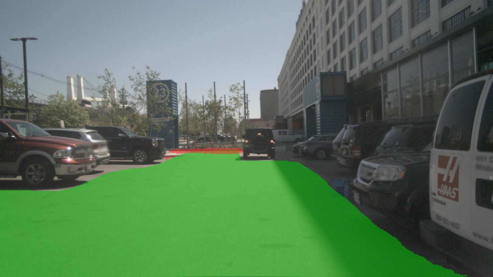

# Lane detection & prediction — a tutorial

Lanes are the road's *structure*: where can I drive, which lane am I in, where do the markings
go. This module is the lane branch of `ngperception` — start by **running SOTA models** on road
images, then fine-tune, then push to **3-D lanes**. Same philosophy as the rest of the framework:
pure PyTorch first, understand before scaling.

> Companion modules: [depth](../depth/) (per-pixel geometry), [detection](../detection/) (objects
> as boxes), [occupancy](../occupancy/) (dense what-is-where). Lanes add the *road layout*.

---

## 1. The task — and its many shapes

"Lane detection" is really several tasks:

| task | output | example use |
|---|---|---|
| **lane-line detection** | the painted markings, as instances/curves | lane keeping, LDW |
| **ego-lane / lane assignment** | which lane the car is in | ACC, lane-change |
| **drivable area** | free road surface (mask) | path planning |
| **3-D lanes** | lanes in metric 3-D (not just image pixels) | planning, HD-map-free driving |
| **lane/road topology** | how lanes connect (graph) | routing, intersections |

The first three are **2-D** (image space); the last two are the modern frontier. Most classic
work is 2-D lane-line detection on a front camera.

## 2. Paradigms — how models represent a lane

A lane line is a thin, long, sparse curve — awkward for a plain segmentation net. The field has
five families:

1. **Segmentation + clustering** (SCNN, LaneNet, RESA): per-pixel "lane vs not", then cluster
   pixels into instances. Simple, but post-processing-heavy and slow.
2. **Row-wise classification** (UFLD, **UFLDv2**): for each image row, *classify which column* the
   lane crosses. Turns detection into a cheap classification → **very fast** (300+ FPS).
3. **Keypoint** (FOLOLane, GANet): predict lane keypoints + associations, like pose estimation.
4. **Curve / polynomial** (PolyLaneNet, **LSTR**, BezierLaneNet): regress a parametric curve
   (polynomial / Bézier) per lane. Compact, smooth, no clustering.
5. **Anchor-based line** (LaneATT, **CLRNet**, **CLRerNet**): line "anchors" (like object anchors
   but for lines) refined across feature levels. **Current SOTA** on CULane.

**3-D lanes** (OpenLane): **PersFormer**, **Anchor3DLane**, **LATR** — lift image lanes into a BEV
/ 3-D space (often with a transformer + camera geometry), so lanes have real depth and curvature.

## 3. Datasets

| dataset | scale | what | metric |
|---|---|---|---|
| **TuSimple** | 6.4 k highway clips | lane lines, easy | accuracy (points on GT) |
| **CULane** | 133 k frames, 9 scenarios | lane lines, hard (night, crowd, no-line) | **F1** (IoU-matched, 30 px) |
| **LLAMAS** | 100 k, auto-labeled | highway lanes | F1 |
| **CurveLanes** | 150 k, curvy | hard curves | F1 |
| **OpenLane** | 200 k, on Waymo | **3-D lanes** + topology | 3-D F1, X/Z error |
| **OpenLane-V2** | + topology | lane graph, traffic elements | OLS |

CULane F1 is the standard "how good" number; OpenLane is the 3-D frontier.

## 4. SOTA landscape (CULane test F1, higher = better)

| model | year | paradigm | CULane F1 | notes |
|---|---|---|---|---|
| SCNN | 2018 | seg | 71.6 | the classic |
| UFLD | 2020 | row | 68.4 | very fast |
| LaneATT | 2021 | anchor-line | 77.0 | |
| **UFLDv2** | 2022 | row | 76.0 | fast + strong, pure PyTorch |
| **CLRNet** | 2022 | anchor-line | 80.5 | cross-layer refinement |
| **CLRerNet** | 2023 | anchor-line | **81.4** | current SOTA |
| **YOLOPv2** | 2022 | multi-task seg | (panoptic) | lane **+ drivable + detection**, one net |

The top lane-F1 models (CLRNet/CLRerNet) are **mmdet-based** (heavy env, like the occupancy SOTA
in §2.5). The pure-PyTorch, easy-to-run strong models are **UFLDv2** (row-wise) and **YOLOPv2**
(panoptic multi-task) — the same "runs in the main torch env" trade-off as elsewhere.

## 5. What we ran first — YOLOPv2 (panoptic driving)

We started with **[YOLOPv2](https://github.com/CAIC-AD/YOLOPv2)** because it is a **self-contained
TorchScript** (no mmcv, no framework) that does **three tasks in one forward**: vehicle detection,
**drivable-area** segmentation, and **lane-line** segmentation. Ideal first "what does SOTA see"
demo on the surround images we already have.

Run it (`run_lane.py`) on nuScenes / KITTI front cameras — no lane labels needed for inference:

```bash
python -m DeepDataMiningLearning.ngperception.lane.run_lane \
    --model yolopv2 --dataset nuscenes --n 30 --video      # -> output/lane/{lane_*.png, lane_demo.mp4}
python -m DeepDataMiningLearning.ngperception.lane.run_lane --dataset kitti --n 10
```

The model outputs (verified): `da` (drivable, 2-ch probs → argmax) and `ll` (lane, **1-ch
probability** — threshold `ll > 0.4` directly, *not* a logit; that one detail is the difference
between 217 clean lane pixels and 145 k garbage ones). We overlay drivable area (green) and lane
lines (red) back onto the original image:



On nuScenes CAM_FRONT the lane mask is a thin ~200–550 px set of markings and the drivable area a
~50–70 k px road region — sensible panoptic output, real-time, pure PyTorch.

## 6. L1 — a pure-torch CLRNet (line-anchor SOTA, no mmdet)

YOLOPv2 (§5) gives a lane *mask*; the F1 leaders (CLRNet 80.5, CLRerNet 81.4) instead
predict lane **instances** as line anchors — and they ship on mmdet. To own that
representation in plain PyTorch we reimplemented the **CLRNet head + LaneIoU** from
scratch (`clrnet.py`, `lane_iou.py`), the base detector for the research directions in
[DESIGN.md](DESIGN.md).

### 6.1 How it works

A lane is a **line anchor** ("prior"): a start point on the image border + an angle,
evaluated at a **fixed grid of N=72 image rows**. A lane prediction is then just *"for
each row, where is the lane's x"* + a start-row, a length, and a fg/bg score — turning
lane detection into anchor-based line detection.

| stage | what | file |
|---|---|---|
| **backbone + FPN** | torchvision ResNet → 3 levels (stride 8/16/32) → common width | `clrnet.py: ResNetFPN` |
| **line-anchor priors** | fixed bank of straight anchors (border start × 9 angles) → 252 priors | `generate_priors` |
| **ROIGather (lite)** | sample features *along each prior line* at the 72 rows on all 3 levels (`grid_sample`, the same pure-torch deformable trick as the BEV transformer), pool → one vector per prior | `CLRNet._roi_feat` |
| **heads** | per prior: cls (fg/bg), start-row, length, per-row x refinement | `cls_head`, `reg_head` |
| **assignment** | SimOTA-style **dynamic-k** matching on (cls + LineIoU) cost | `CLRNet._assign` |
| **loss** | focal cls + **LineIoU / LaneIoU** regression + smooth-L1 (start/length) | `get_loss` |
| **decode** | softmax score → threshold → **LineIoU-NMS** → lane point sets | `decode` |

**LineIoU** (CLRNet, `lane_iou.py`) turns each per-row point into a short horizontal
segment of radius *r* and measures interval IoU summed over rows — differentiable, and
well-behaved even where segments miss. **LaneIoU** (CLRerNet) scales *r* per row by the
local slope `√(1+(dx/dy)²)` so *tilted* lanes aren't under-counted (tilt-invariant
overlap); enable with `--lane-iou`.

Two deliberate simplifications vs upstream CLRNet, documented in the code: a **single**
refinement stage (upstream cascades 3) and **no auxiliary segmentation** head. Both are
easy extensions; they don't change the representation.

> **One subtlety that mattered.** The x-refinement is regressed in **normalised** units
> (× `img_w`), not raw pixels. With raw-pixel outputs the head must emit values ~200 to
> reach a lane, but Adam moves parameters ~`lr`/step → it would need ~`img_w/lr` steps and
> the LaneIoU loss sits frozen (we saw exactly this: iou-loss stuck at 0.88). Normalising
> the offset fixed it (iou-loss 0.88 → 0.02). Same lesson as everywhere: keep regression
> targets O(1).

### 6.2 Validation (local de-risk)

No CULane/TuSimple is staged locally and the old S3/HF mirrors are down, so — following the
same workflow as the detection module (de-risk locally, train big on H100) — we validated
the **full pipeline** on a **controlled synthetic** lane set (`SyntheticLanes`: random
smooth lanes on a textured road, known GT). This is a *correctness harness*, **not** a
benchmark number: it proves anchor assignment, LaneIoU regression, decode/NMS and the
CULane F1 metric are all correct and that the model learns.

```bash
# overfit 8 samples (loss must fall, F1 must rise) — pure sanity
python -m DeepDataMiningLearning.ngperception.lane.train_clrnet \
    --dataset synthetic --overfit 8 --epochs 300 --bs 8 --lr 1e-3 --lane-iou

# small train/val split (unseen val → learns geometry, not memorisation)
python -m DeepDataMiningLearning.ngperception.lane.train_clrnet \
    --dataset synthetic --max-train 512 --max-val 64 --epochs 40 --bs 16 --lr 1e-3 --lane-iou
```

Overfit result (8 samples, LaneIoU): **iou-loss 0.88 → 0.02, cls 0.02, F1 0.857**
(P 0.84 / R 0.875) — the loop converges. The residual FP/FN is decode-threshold strictness
(fixed-radius IoU@0.5 matching), not a pipeline bug.

### 6.3 Full CULane training (H100)

`CULaneDataset` already reads the real CULane format (list file + per-image `.lines.txt`),
so it is drop-in once the data is staged — the exact same command with `--dataset culane`:

```bash
python -m DeepDataMiningLearning.ngperception.lane.train_clrnet \
    --dataset culane --root /data/CULane \
    --train-list list/train_gt.txt --val-list list/test.txt \
    --backbone resnet34 --epochs 15 --bs 24 --lr 6e-4 --lane-iou
```

`culane_metric.py` computes the official-style **F1** (thick-curve IoU>0.5 matching), pure
numpy — no external eval binary. Reference targets: CLRNet ResNet-34 ≈ **80.5** F1, CLRerNet
(LaneIoU) ≈ **81.4**.

## 7. Roadmap

- **L1 — pure-torch CLRNet ✅ (done, §6).** Line-anchor SOTA representation + LineIoU/LaneIoU
  reimplemented without mmdet, validated end-to-end on the synthetic sanity set; drop-in for
  CULane on the H100. Still open: add **UFLDv2** (row-wise) as a second runnable paradigm for
  contrast, and stage real CULane for the benchmark number.
- **L2 — proper eval.** Stage TuSimple/CULane, report F1 against GT on real data (the metric
  (`culane_metric.py`) and loader (`CULaneDataset`) are ready; we've validated on synthetic).
- **L3 — fine-tune** a lane model on a target domain (mirrors depth §1.7 / detection fine-tuning).
- **L4 — 3-D lanes** (OpenLane): PersFormer / LATR — lift lanes into BEV, the natural bridge to
  the occupancy & detection BEV features (a fourth head on the shared encoder, extending M3).
- **L5 — prediction/topology**: lane graph + trajectory prediction, toward planning.

Two research directions are designed in detail in **[DESIGN.md](DESIGN.md)**:
1. **Temporal + uncertainty-aware CLRerNet** — a per-point variance head (Gaussian NLL) + lane
   **track-queries** across video frames, with *uncertainty-gated temporal fusion* (2-D front cam).
2. **OpenLane-V2 / 3-D lane graph / topology** — 3-D BEV lane centerlines + a topology head,
   built as a **fourth head on the M3 shared BEV encoder** (reusing the deformable BEV transformer
   + Hungarian matcher from detection), completing the unified-BEV vision.

See [README.md](README.md) for the module layout.
