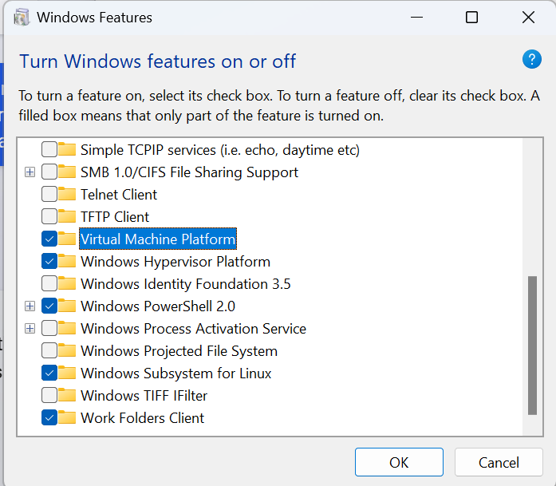

WSL2
=====

.. _WSL2:

Windows WSL2 Linux Setup Tutorial
----------------------------------

Install WSL2
~~~~~~~~~~~~

Ref `WSL2 install <https://learn.microsoft.com/en-us/windows/wsl/install>`_

.. code-block:: console

    wsl --version
    wsl --update
    wsl --list
    wsl.exe --list --online

Select one distribution, and install

.. code-block:: console

    C:\Users\lkk>wsl.exe --install Ubuntu-22.04

.. note::
    If you see this error: "WslRegisterDistribution failed with error: 0x80370114 Error: 0x80370114 The operation could not be started because a required feature is not installed. " This error message indicates that a required feature is not installed on your system. You can try the following steps to resolve this issue:
        * Open Control Panel -> Programs and Features -> Turn Windows Feature on or off -> Check Virtual Machine Platform and Windows Subsystem for Linux.
        * Restart your computer.

Turn on these Windows features:

When your wsl2 installation is finished, you can use this command to enter into the wsl linux:

.. code-block:: console

    wsl #enter default wsl distribution
    wsl --distribution Ubuntu-22.04 --user lkk #enter a specific distribution

You can access the WSL2 Linux file from the Windows Explorer by accessing the following address "\\wsl$"

You can check the version of WSL and perform conversion from WSL2 to WSL1 if needed

.. code-block:: console

    C:\Users\lkk>wsl --list --verbose
    NAME            STATE           VERSION
    * Ubuntu-22.04    Running         2
    Ubuntu-20.04    Running         2

    C:\Users\lkk>wsl --set-version Ubuntu-20.04 1
    Conversion in progress, this may take a few minutes.
    The operation completed successfully.

    C:\Users\lkk>wsl --setdefault Ubuntu20.04
    The operation completed successfully.

Use WSL for Development
~~~~~~~~~~~~~~~~~~~~~~~~
Access files inside the WSL from Windows side: access "\\wsl$" in the address bar of Windows File Explorer.

Open WSL in VScode for development: in "Remote Explorer" tab, select "WSL" as the remote the target, connect the target.

How to SSH into WSL2 on Windows from an external machine: https://www.hanselman.com/blog/how-to-ssh-into-wsl2-on-windows-10-from-an-external-machine

Export WSL
~~~~~~~~~~~~
You can export the WSL distribution to a local file

.. code-block:: console

    H:\WSL>wsl --export Ubuntu-20.04 ./Ubuntu2004_export.tar
    Export in progress, this may take a few minutes.
    The operation completed successfully.

After the export process is finished, you can unregister the distribution (the used disk space will become available)

.. code-block:: console

    H:\WSL>wsl --unregister Ubuntu-20.04

You can import the distribution again in a new driver (e.g., in H: drive)

.. code-block:: console

    H:\WSL>wsl --import Ubuntu20.04 ./Ubuntu20 ./Ubuntu2004_export.tar
    Import in progress, this may take a few minutes.
    The operation completed successfully.

Install CUDA inside WSL Linux
~~~~~~~~~~~~~~~~~~~~~~~~~~~~~~
Verify CUDA-capable GPU, check environment, and install gcc

.. code-block:: console

    lspci | grep -i nvidia # Did not show anything in WSL Linux
    uname -m && cat /etc/*release
    gcc --version # install gcc if not available
    sudo apt-get update
    sudo apt install gcc
    uname -r #check kernel version
        5.15.90.1-microsoft-standard-WSL2

Download CUDA11.8 Linux WSL2 (the download path is the same to Ubuntu22.04 cuda11.8):

.. code-block:: console

    wget https://developer.download.nvidia.com/compute/cuda/11.8.0/local_installers/cuda_11.8.0_520.61.05_linux.run
    sudo sh cuda_11.8.0_520.61.05_linux.run

After CUDA installation, please make sure that
 -   PATH includes /usr/local/cuda-xx.x/bin
 -   LD_LIBRARY_PATH includes /usr/local/cuda-xx.x/lib64
Add the following code to "~/.bashrc"

.. code-block:: console

    lkk@Alienware-LKKi7G8:~$ nano ~/.bashrc
    export LD_LIBRARY_PATH=/usr/local/cuda-12.1/lib64:$LD_LIBRARY_PATH
    export PATH=/usr/local/cuda-12.1/bin:$PATH
    lkk@Alienware-LKKi7G8:~$ source ~/.bashrc
    #install other required softwares in WSL Linux
    $ sudo apt install python3-pip
    $ sudo apt install net-tools
    $ sudo apt install openssh-server
    $ sudo apt install x11-apps
    $ curl https://repo.anaconda.com/miniconda/Miniconda3-latest-Linux-x86_64.sh -o Miniconda3-latest-Linux-x86_64.sh
    $ bash Miniconda3-latest-Linux-x86_64.sh
    $ sudo apt-get update && sudo apt-get install libgl1

Other Python Packages
~~~~~~~~~~~~~~~~~~~~~~

.. code-block:: console

    conda install -c conda-forge configargparse
    pip install -U albumentations
    pip install spconv-cu118 #check installation via import spconv
    pip install SharedArray

    pip install numba
    $ pip install requests

    $ pip install tensorboardX
    pip install tensorboardX
    $ pip install easydict
    $ pip install gpustat
    $ pip install --upgrade autopep8
    $ pip install pyyaml scikit-image onnx onnx-simplifier
    $ pip install onnxruntime
    $ pip install onnx_graphsurgeon --index-url https://pypi.ngc.nvidia.com
    (mypy310) lkk@Alienware-LKKi7G8:~/Developer/3DDepth$ python3 setup.py develop
    The detected CUDA version (12.1) mismatches the version that was used to compile
    PyTorch (11.8). Please make sure to use the same CUDA versions.

To solve the CUDA mismatch problem, uncomment the CUDA12.1 installation in "~/.bashrc", install CUDA11.8 in Conda

.. code-block:: console

    (mypy310) lkk@Alienware-LKKi7G8:~/Developer/3DDepth$ conda install -c conda-forge cudatoolkit=11.8.0
    (mypy310) lkk@Alienware-LKKi7G8:~/Developer/3DDepth$ conda install -c "nvidia/label/cuda-11.8.0" cuda-toolkit

    (mypy310) lkk@Alienware-LKKi7G8:~/Developer/3DDepth$ python3 setup.py develop
    Using /home/lkk/miniconda3/envs/mypy310/lib/python3.10/site-packages
    Finished processing dependencies for mydetector3d==0.1
    (mypy310) lkk@Alienware-LKKi7G8:~/Developer/3DDepth$ nvcc -V
    nvcc: NVIDIA (R) Cuda compiler driver
    Copyright (c) 2005-2022 NVIDIA Corporation
    Built on Wed_Sep_21_10:33:58_PDT_2022
    Cuda compilation tools, release 11.8, V11.8.89
    Build cuda_11.8.r11.8/compiler.31833905_0

Install langchain

.. code-block:: console

    (mypy310) lkk@Alienware-LKKi7G8:~/Developer$ conda install langchain -c conda-forge
    (mypy310) lkk@Alienware-LKKi7G8:~/Developer$ pip install langchain[llms]
    (mypy310) lkk@Alienware-LKKi7G8:~/Developer$ pip install openai
    pip install pypdf
    pip install tiktoken
    conda install -c conda-forge faiss
    pip install unstructured
    pip install pdf2image
    pip install pdfminer
    pip install pdfminer.six