# Physical AI and Large Language Models in Autonomous Driving

!!! info "Document Overview"
    This comprehensive guide explores the intersection of Physical AI and Large Language Models in autonomous driving, covering current technologies, challenges, and future research directions.
## Table of Contents

1. [Introduction](#introduction-the-convergence-of-physical-ai-and-llms)
2. [The Importance of Physical AI and LLMs](#why-physical-ai-and-llms-are-crucial-for-autonomous-driving)


## Vision-Language Models in Perception

Vision-Language Models (VLMs) represent a breakthrough in multimodal AI, enabling systems to understand and reason about visual content using natural language. In autonomous driving, these models bridge the gap between raw sensor data and high-level semantic understanding, enabling more robust and interpretable perception systems.

### Core Vision-Language Models

#### CLIP (Contrastive Language-Image Pre-training)

**Overview:**
CLIP, developed by OpenAI, learns visual concepts from natural language supervision by training on 400 million image-text pairs from the internet.

**Architecture:**
```
Text Encoder (Transformer) ←→ Contrastive Learning ←→ Image Encoder (ViT/ResNet)
```

**Key Innovations:**
- Zero-shot classification capabilities
- Robust to distribution shifts
- Natural language queries for object detection
- Scalable training on web-scale data

**Applications in Autonomous Driving:**
- **Semantic Scene Understanding**: "Is there a school zone ahead?"
- **Object Classification**: Zero-shot recognition of unusual objects
- **Traffic Sign Recognition**: Natural language descriptions of signs
- **Weather Condition Assessment**: "Is the road wet from rain?"

**Research Papers:**
- [Learning Transferable Visual Models From Natural Language Supervision](https://arxiv.org/abs/2103.00020)
- [CLIP4Clip: An Empirical Study of CLIP for End to End Video Clip Retrieval](https://arxiv.org/abs/2104.08860)
- [DenseCLIP: Language-Guided Dense Prediction with Context-Aware Prompting](https://arxiv.org/abs/2112.01518)
- [RegionCLIP: Region-based Language-Image Pretraining](https://arxiv.org/abs/2112.09106)

**Code Repositories:**
- [OpenAI CLIP](https://github.com/openai/CLIP)
- [OpenCLIP](https://github.com/mlfoundations/open_clip)
- [CLIP4Clip Implementation](https://github.com/ArrowLuo/CLIP4Clip)
- [DenseCLIP](https://github.com/raoyongming/DenseCLIP)

#### BLIP (Bootstrapping Language-Image Pre-training)

**Overview:**
BLIP addresses the noisy web data problem in vision-language learning through a bootstrapping approach that generates synthetic captions and filters noisy ones.

**Architecture Components:**
1. **Image-Text Contrastive Learning** (ITC)
2. **Image-Text Matching** (ITM) 
3. **Image-Conditioned Language Modeling** (LM)

**Key Features:**
- Unified encoder-decoder architecture
- Synthetic caption generation
- Noise-robust training
- Strong performance on downstream tasks

**Autonomous Driving Applications:**
- **Scene Description**: Generating natural language descriptions of driving scenarios
- **Anomaly Detection**: Identifying unusual situations through language
- **Driver Assistance**: Providing verbal descriptions of road conditions
- **Training Data Augmentation**: Generating captions for unlabeled driving footage

**Research Resources:**
- [BLIP: Bootstrapping Language-Image Pre-training](https://arxiv.org/abs/2201.12086)
- [BLIP-2: Bootstrapping Vision-Language Pre-training](https://arxiv.org/abs/2301.12597)
- [InstructBLIP: Towards General-purpose Vision-Language Models](https://arxiv.org/abs/2305.06500)
- [X-InstructBLIP: A Framework for aligning X-Modal instruction-aware representations](https://arxiv.org/abs/2311.18799)

**Code Repositories:**
- [BLIP Official Implementation](https://github.com/salesforce/BLIP)
- [BLIP-2 Implementation](https://github.com/salesforce/LAVIS/tree/main/projects/blip2)
- [InstructBLIP](https://github.com/salesforce/LAVIS/tree/main/projects/instructblip)
- [Hugging Face BLIP Models](https://huggingface.co/models?search=blip)

#### GPT-4V (GPT-4 with Vision)

**Overview:**
GPT-4V extends the capabilities of GPT-4 to process and understand images, enabling sophisticated visual reasoning and multimodal conversations.

**Capabilities:**
- Detailed image analysis and description
- Visual question answering
- Spatial reasoning and object relationships
- Multi-step visual reasoning tasks

**Autonomous Driving Applications:**
- **Complex Scene Analysis**: Understanding intricate traffic scenarios
- **Decision Explanation**: Providing detailed reasoning for driving decisions
- **Passenger Interaction**: Answering questions about the environment
- **Safety Assessment**: Evaluating potential hazards in real-time

**Example Interactions:**
```
Human: "What should I be careful about in this intersection?"
GPT-4V: "I can see a busy four-way intersection with:
- A cyclist approaching from the right
- Pedestrians waiting at the crosswalk
- A delivery truck partially blocking the view
- Traffic lights showing yellow
I recommend proceeding cautiously and checking for the cyclist's trajectory."
```

**Research and Documentation:**
- [GPT-4V System Card](https://openai.com/research/gpt-4v-system-card)
- [GPT-4V Technical Report](https://arxiv.org/abs/2303.08774)
- [The Dawn of LMMs: Preliminary Explorations with GPT-4V](https://arxiv.org/abs/2309.17421)
- [MM-VET: Evaluating Large Multimodal Models for Integrated Capabilities](https://arxiv.org/abs/2308.02490)
- [SEED-Bench: Benchmarking Multimodal LLMs](https://arxiv.org/abs/2307.16125)

**Evaluation Frameworks:**
- [MM-VET Benchmark](https://github.com/yuweihao/MM-Vet)
- [SEED-Bench](https://github.com/AILab-CVC/SEED-Bench)
- [LLaVA-Bench](https://github.com/haotian-liu/LLaVA/blob/main/docs/Evaluation.md)

### Advanced Vision-Language Architectures

#### LLaVA (Large Language and Vision Assistant)

**Innovation:**
Combines a vision encoder with a large language model to enable detailed visual understanding and conversation.

**Architecture:**
```
Vision Encoder (CLIP ViT) → Projection Layer → Language Model (Vicuna/LLaMA)
```

**Autonomous Driving Potential:**
- Real-time scene narration
- Interactive driving assistance
- Complex reasoning about traffic scenarios

**Research Papers:**
- [Visual Instruction Tuning](https://arxiv.org/abs/2304.08485)
- [LLaVA-1.5: Improved Baselines with Visual Instruction Tuning](https://arxiv.org/abs/2310.03744)
- [LLaVA-NeXT: Improved reasoning, OCR, and world knowledge](https://llava-vl.github.io/blog/2024-01-30-llava-next/)
- [MiniGPT-4: Enhancing Vision-Language Understanding](https://arxiv.org/abs/2304.10592)
- [InstructBLIP: Towards General-purpose Vision-Language Models](https://arxiv.org/abs/2305.06500)

**Code Repositories:**
- [LLaVA Official Repository](https://github.com/haotian-liu/LLaVA)
- [LLaVA-NeXT](https://github.com/LLaVA-VL/LLaVA-NeXT)
- [MiniGPT-4](https://github.com/Vision-CAIR/MiniGPT-4)
- [LLaVA-Med](https://github.com/microsoft/LLaVA-Med)

#### DALL-E and Generative Models

**Applications in Simulation:**
- Generating diverse training scenarios
- Creating edge case situations
- Augmenting real-world data with synthetic examples

### Integration Challenges and Solutions

#### 1. **Real-time Performance**

**Challenge:** VLMs are computationally expensive for real-time applications.

**Solutions:**
- Model compression and quantization
- Edge-optimized architectures
- Hierarchical processing (coarse-to-fine)
- Specialized hardware acceleration

#### 2. **Safety and Reliability**

**Challenge:** Ensuring consistent and safe outputs in critical scenarios.

**Solutions:**
- Uncertainty quantification
- Multi-model ensemble approaches
- Formal verification methods
- Fail-safe mechanisms

#### 3. **Domain Adaptation**

**Challenge:** Adapting general VLMs to automotive-specific scenarios.

**Solutions:**
- Fine-tuning on driving datasets
- Domain-specific prompt engineering
- Transfer learning techniques
- Continuous learning from fleet data

### Future Directions

#### Emerging Trends:
1. **Multimodal Transformers**: Unified architectures for all sensor modalities
2. **Few-shot Learning**: Rapid adaptation to new scenarios
3. **Causal Reasoning**: Understanding cause-and-effect in driving scenarios
4. **Temporal Modeling**: Incorporating time-series understanding
5. **Interactive Learning**: Learning from human feedback and corrections

---

## 3D Scene Reconstruction and Geometry Understanding

3D scene reconstruction is fundamental to autonomous driving, enabling vehicles to understand the spatial structure of their environment. Recent advances in neural networks have revolutionized 3D computer vision, with models like VGGT leading the way in unified 3D scene understanding.

### VGGT: Visual Geometry Grounded Transformer

**Overview:** [[0]](https://vgg-t.github.io/)
VGGT (Visual Geometry Grounded Transformer) represents a breakthrough in 3D computer vision, being a feed-forward neural network that directly infers all key 3D attributes of a scene from one, a few, or hundreds of views. This approach marks a significant step forward in 3D computer vision, where models have typically been constrained to and specialized for single tasks.

**Key Capabilities:** [[0]](https://vgg-t.github.io/)
- **Camera Parameter Estimation**: Automatic inference of camera extrinsics and intrinsics
- **Multi-view Depth Estimation**: Dense depth prediction across multiple viewpoints
- **Dense Point Cloud Reconstruction**: High-quality 3D point cloud generation
- **Point Tracking**: Consistent feature tracking across frames
- **Real-time Performance**: Reconstruction in under one second

#### VGGT Architecture

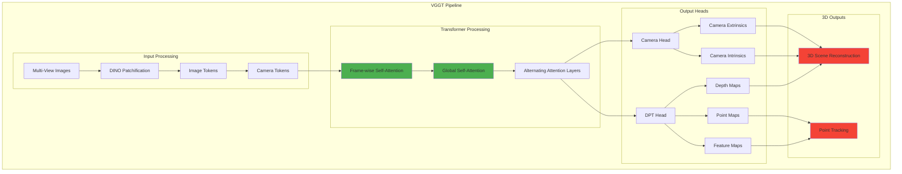

**Technical Implementation:** [[0]](https://vgg-t.github.io/)

```python
class VGGT:
    def __init__(self):
        self.dino_encoder = DINOEncoder()  # Patchify input images
        self.transformer = VGGTransformer()  # Alternating attention layers
        self.camera_head = CameraHead()  # Camera parameter prediction
        self.dpt_head = DPTHead()  # Dense prediction tasks
        
    def forward(self, images):
        # Patchify images into tokens
        image_tokens = self.dino_encoder(images)
        
        # Add camera tokens for camera prediction
        camera_tokens = self.create_camera_tokens(len(images))
        tokens = torch.cat([image_tokens, camera_tokens], dim=1)
        
        # Process through transformer with alternating attention
        features = self.transformer(tokens)
        
        # Predict camera parameters
        camera_params = self.camera_head(features)
        
        # Generate dense outputs (depth, point maps, features)
        dense_outputs = self.dpt_head(features)
        
        return {
            'camera_extrinsics': camera_params['extrinsics'],
            'camera_intrinsics': camera_params['intrinsics'],
            'depth_maps': dense_outputs['depth'],
            'point_maps': dense_outputs['points'],
            'feature_maps': dense_outputs['features']
        }
```

#### Key Innovations

**1. Unified Multi-Task Learning** [[0]](https://vgg-t.github.io/)
- Single network handles multiple 3D tasks simultaneously
- Joint optimization of camera estimation, depth prediction, and point tracking
- Eliminates need for separate specialized models

**2. Alternating Attention Mechanism**
- **Frame-wise Attention**: Processes individual images for local features
- **Global Attention**: Integrates information across all views
- **Scalable Architecture**: Handles one to hundreds of input views

**3. Feed-Forward Efficiency** [[0]](https://vgg-t.github.io/)
- Direct inference without iterative optimization
- Sub-second reconstruction times
- Outperforms traditional methods without post-processing

#### Performance and Applications

**State-of-the-Art Results:** [[0]](https://vgg-t.github.io/)
- **Camera Parameter Estimation**: Superior accuracy on standard benchmarks
- **Multi-view Depth Estimation**: Consistent depth across viewpoints
- **Dense Point Cloud Reconstruction**: High-quality 3D reconstructions
- **Point Tracking**: Robust feature correspondence across frames

**Autonomous Driving Applications:**

1. **Real-time 3D Mapping**
   - Instant environment reconstruction from camera feeds
   - Dynamic obstacle detection and tracking
   - Road surface and geometry understanding

2. **Multi-Camera Calibration**
   - Automatic camera parameter estimation
   - Real-time calibration updates
   - Robust to camera displacement

3. **Enhanced Perception**
   - Dense depth estimation for path planning
   - 3D object localization and tracking
   - Occlusion handling through multi-view reasoning

4. **SLAM Integration**
   - Visual odometry and mapping
   - Loop closure detection
   - Consistent map building

**Implementation Example:**

```python
class AutonomousDrivingVGGT:
    def __init__(self):
        self.vggt = VGGT()
        self.path_planner = PathPlanner()
        self.object_tracker = ObjectTracker()
        
    def process_camera_feeds(self, camera_images):
        # Run VGGT inference
        scene_3d = self.vggt(camera_images)
        
        # Extract 3D scene information
        depth_maps = scene_3d['depth_maps']
        point_cloud = scene_3d['point_maps']
        camera_poses = scene_3d['camera_extrinsics']
        
        # Update 3D world model
        self.update_world_model(point_cloud, camera_poses)
        
        # Plan safe trajectory
        trajectory = self.path_planner.plan(
            current_pose=camera_poses[-1],
            obstacles=self.extract_obstacles(depth_maps),
            free_space=self.extract_free_space(point_cloud)
        )
        
        # Track dynamic objects
        tracked_objects = self.object_tracker.update(
            features=scene_3d['feature_maps'],
            depth=depth_maps
        )
        
        return {
            'trajectory': trajectory,
            'tracked_objects': tracked_objects,
            'scene_3d': scene_3d
        }
```

#### Comparison with Traditional Methods

| Aspect | Traditional SLAM | VGGT |
|--------|------------------|------|
| **Processing Time** | Minutes to hours | <1 second |
| **Multi-Task Capability** | Specialized systems | Unified approach |
| **Scalability** | Limited views | 1 to hundreds of views |
| **Optimization** | Iterative refinement | Direct inference |
| **Robustness** | Sensitive to initialization | End-to-end learned |
| **Real-time Performance** | Challenging | Native support |

#### Future Directions and Research

**Current Limitations:**
- Requires sufficient visual overlap between views
- Performance in low-texture environments
- Handling of dynamic scenes

**Research Opportunities:**
1. **Temporal Integration**: Incorporating video sequences for better consistency
2. **Multi-Modal Fusion**: Integration with LiDAR and radar data
3. **Dynamic Scene Handling**: Better modeling of moving objects
4. **Uncertainty Quantification**: Confidence estimation for safety-critical applications
5. **Edge Deployment**: Optimization for automotive hardware constraints

**Related Work and Research Papers:**
- [DUSt3R: Geometric 3D Vision Made Easy](https://arxiv.org/abs/2312.14132)
- [MASt3R: Grounding Image Matching in 3D world](https://arxiv.org/abs/2406.09756)
- [Fast3R: Real-time 3D Reconstruction](https://arxiv.org/abs/2311.10226)
- [COLMAP: Structure-from-Motion Revisited](https://arxiv.org/abs/1912.07796)
- [NeRF: Representing Scenes as Neural Radiance Fields](https://arxiv.org/abs/2003.08934)
- [3D Gaussian Splatting for Real-Time Radiance Field Rendering](https://arxiv.org/abs/2308.04079)
- [Instant Neural Graphics Primitives](https://arxiv.org/abs/2201.05989)

**Code Repositories:**
- [DUSt3R Official Implementation](https://github.com/naver/dust3r)
- [MASt3R](https://github.com/naver/mast3r)
- [COLMAP](https://github.com/colmap/colmap)
- [NeRF PyTorch](https://github.com/yenchenlin/nerf-pytorch)
- [3D Gaussian Splatting](https://github.com/graphdeco-inria/gaussian-splatting)
- [Instant-NGP](https://github.com/NVlabs/instant-ngp)
- [OpenMVS](https://github.com/cdcseacave/openMVS)

### Integration with Autonomous Driving Systems

**System Architecture Integration:**

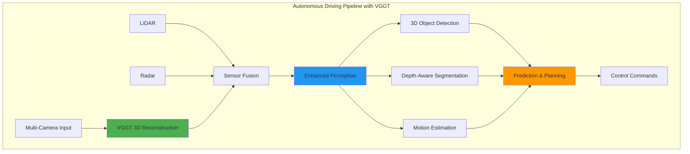

**Benefits for Autonomous Driving:**
1. **Enhanced Spatial Understanding**: Dense 3D reconstruction improves navigation
2. **Real-time Performance**: Sub-second inference enables reactive planning
3. **Multi-View Consistency**: Robust perception across camera viewpoints
4. **Reduced Sensor Dependency**: Rich 3D information from cameras alone
5. **Cost-Effective Solution**: Leverages existing camera infrastructure

---

## Multimodal Sensor Fusion with Unified Embeddings

Modern autonomous vehicles integrate multiple sensor modalities to create a comprehensive understanding of their environment. The challenge lies in effectively fusing heterogeneous data streams into a unified representation that enables robust decision-making.

### Sensor Modalities in Autonomous Vehicles

#### Autonomous Vehicle Sensor Suite Overview

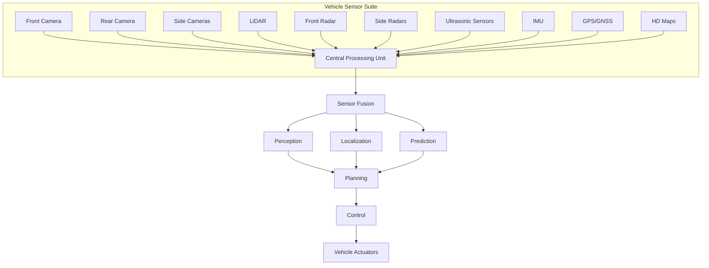

#### Primary Sensors

**1. Cameras (RGB/Infrared)**
- **Advantages**: Rich semantic information, color, texture, traffic signs
- **Limitations**: Weather sensitivity, lighting conditions, depth ambiguity
- **Data Format**: 2D images, video streams
- **Typical Resolution**: 1920×1080 to 4K at 30-60 FPS

**2. LiDAR (Light Detection and Ranging)**
- **Advantages**: Precise 3D geometry, weather robust, long range
- **Limitations**: Expensive, limited semantic information, sparse data
- **Data Format**: 3D point clouds
- **Typical Specs**: 64-128 beams, 10-20 Hz, 100-200m range

**3. Radar**
- **Advantages**: All-weather operation, velocity measurement, long range
- **Limitations**: Low resolution, limited object classification
- **Data Format**: Range-Doppler maps, point clouds
- **Frequency Bands**: 24 GHz, 77-81 GHz

**4. Ultrasonic Sensors**
- **Advantages**: Close-range precision, low cost
- **Limitations**: Very short range, weather sensitive
- **Applications**: Parking assistance, blind spot detection

#### Auxiliary Sensors

**5. IMU (Inertial Measurement Unit)**
- Acceleration and angular velocity
- Vehicle dynamics estimation
- Sensor fusion reference frame

**6. GPS/GNSS**
- Global positioning
- Route planning and localization
- Map matching and lane-level positioning

**7. HD Maps**
- Prior semantic information
- Lane geometry and traffic rules
- Static object locations

### Unified Embedding Approaches

#### Sensor Fusion Strategy Comparison

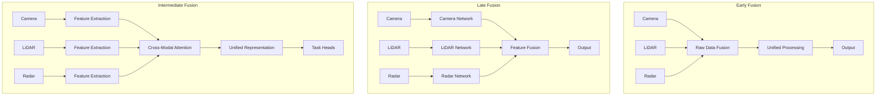

### State-of-the-Art Sensor Fusion Approaches

#### Aurora's Deep Learning Sensor Fusion: A Case Study

**Aurora's Multi-Modal Approach** [[0]](https://www.thinkautonomous.ai/blog/aurora-deep-learning-sensor-fusion-motion-prediction/)

Aurora (Amazon's autonomous driving subsidiary) demonstrates a sophisticated early fusion approach that integrates LiDAR, camera, radar, and HD map data using deep learning. Their system showcases how neural networks can effectively handle multi-modal sensor fusion for autonomous trucking, delivery, and robotaxi applications.

#### Leading Research and Implementations

**Research Papers:**
- [BEVFusion: Multi-Task Multi-Sensor Fusion with Unified Bird's-Eye View Representation](https://arxiv.org/abs/2205.13542)
- [TransFusion: Robust LiDAR-Camera Fusion for 3D Object Detection](https://arxiv.org/abs/2203.11496)
- [DeepFusion: Lidar-Camera Deep Fusion for Multi-Modal 3D Object Detection](https://arxiv.org/abs/2203.08195)
- [FUTR3D: A Unified Sensor Fusion Framework for 3D Detection](https://arxiv.org/abs/2203.10642)
- [BEVFormer: Learning Bird's-Eye-View Representation from Multi-Camera Images](https://arxiv.org/abs/2203.17270)
- [PETR: Position Embedding Transformation for Multi-View 3D Object Detection](https://arxiv.org/abs/2203.05625)

**Code Repositories:**
- [BEVFusion](https://github.com/mit-han-lab/bevfusion)
- [TransFusion](https://github.com/XuyangBai/TransFusion)
- [BEVFormer](https://github.com/fundamentalvision/BEVFormer)
- [PETR](https://github.com/megvii-research/PETR)
- [MMDetection3D](https://github.com/open-mmlab/mmdetection3d)
- [OpenPCDet](https://github.com/open-mmlab/OpenPCDet)

#### Aurora's Sensor Fusion Pipeline

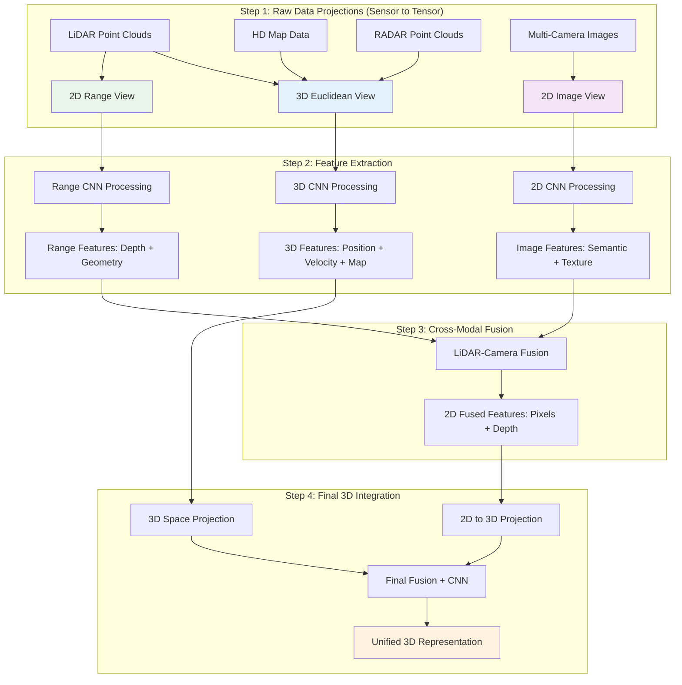

#### Technical Implementation Details

**Step 1 - Coordinate Frame Alignment:**
- **HD Map**: 3D Map Frame → Euclidean View
- **RADAR**: 3D RADAR Frame → Euclidean View  
- **LiDAR**: 3D LiDAR Frame → Euclidean View + 2D Range View
- **Cameras**: Multiple 2D images → Fused Image View

**Step 2 - Neural Feature Extraction:**
```python
# Aurora's Multi-Modal Feature Extraction
class AuroraFeatureExtractor:
    def __init__(self):
        self.euclidean_cnn = CNN3D(input_channels=lidar+radar+map)
        self.image_cnn = CNN2D(input_channels=rgb_channels)
        self.range_cnn = CNN2D(input_channels=lidar_range)
    
    def extract_features(self, sensor_data):
        # 3D processing: LiDAR + RADAR + HD Map
        euclidean_features = self.euclidean_cnn(
            torch.cat([sensor_data.lidar_3d, 
                      sensor_data.radar_3d, 
                      sensor_data.hd_map], dim=1)
        )
        
        # 2D processing: Multi-camera fusion
        image_features = self.image_cnn(sensor_data.fused_cameras)
        
        # Range processing: LiDAR range view
        range_features = self.range_cnn(sensor_data.lidar_range)
        
        return euclidean_features, image_features, range_features
```

**Step 3 - Cross-Modal Information Extraction:**
- **3D Euclidean Features**: Position (LiDAR) + Velocity (RADAR) + Context (HD Maps)
- **2D Fused Features**: Semantic information (cameras) + Depth (LiDAR range)
- **Key Innovation**: Pixels with depth information through LiDAR-camera fusion

**Step 4 - Final Integration:**
- **Challenge**: Fusing 3D euclidean features with 2D image-range features
- **Solution**: Project 2D features into 3D euclidean space
- **Result**: Unified 3D representation with geometric and semantic information

#### Aurora's Fusion Advantages

**Early Fusion Benefits:**
- **Information Preservation**: No loss of raw sensor data
- **Joint Learning**: CNNs learn optimal feature combinations
- **Complementary Strengths**: Each sensor compensates for others' weaknesses

**Multi-Modal Synergy:**
- **LiDAR**: Precise 3D geometry and distance
- **RADAR**: Velocity information and weather robustness  
- **Cameras**: Rich semantic content and object classification
- **HD Maps**: Prior knowledge and context

**Technical Innovations:**
- **Learned Projections**: Neural networks learn optimal coordinate transformations
- **Concatenation-based Fusion**: Simple yet effective feature combination
- **Multi-Scale Processing**: Different resolutions for different sensor types

#### Performance and Applications

**Aurora's Target Applications:**
- **Autonomous Trucking**: Highway and logistics scenarios
- **Last-Mile Delivery**: Urban navigation and package delivery
- **Robotaxis**: Passenger transportation in controlled environments

**System Characteristics:**
- **Real-time Processing**: Optimized for deployment on autonomous vehicles
- **Scalable Architecture**: Supports additional sensor modalities
- **Robust Performance**: Handles sensor failures and adverse conditions

**Key Takeaways from Aurora's Approach:**
1. **Early fusion** can be highly effective when implemented with deep learning
2. **Coordinate frame alignment** is crucial for multi-modal integration
3. **Learned features** outperform hand-crafted fusion rules
4. **Complementary sensors** provide robustness and comprehensive scene understanding

### Aurora's Motion Prediction System

**Deep Learning for Trajectory Forecasting** [[0]](https://www.thinkautonomous.ai/blog/aurora-deep-learning-sensor-fusion-motion-prediction/)

Building on their sensor fusion capabilities, Aurora employs sophisticated neural networks for motion prediction, enabling their autonomous vehicles to anticipate the behavior of other road users and plan safe trajectories.

#### Motion Prediction Architecture

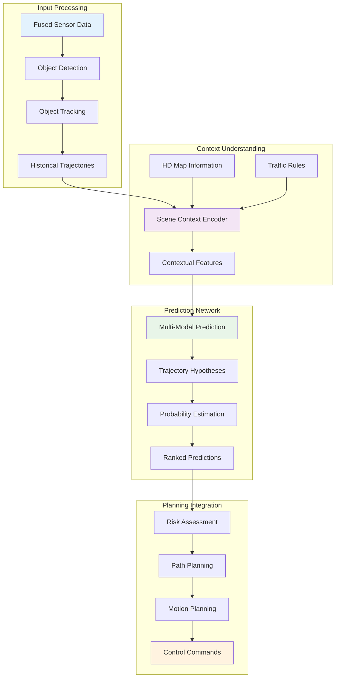

#### Technical Implementation

**Multi-Modal Trajectory Prediction:**
```python
class AuroraMotionPredictor:
    def __init__(self):
        self.scene_encoder = SceneContextEncoder()
        self.trajectory_decoder = MultiModalDecoder()
        self.uncertainty_estimator = UncertaintyNetwork()
        
    def predict_trajectories(self, sensor_fusion_output, hd_map, traffic_context):
        # Extract object states and history
        tracked_objects = self.extract_objects(sensor_fusion_output)
        
        # Encode scene context
        scene_context = self.scene_encoder(
            objects=tracked_objects,
            map_data=hd_map,
            traffic_rules=traffic_context
        )
        
        # Generate multiple trajectory hypotheses
        trajectory_modes = self.trajectory_decoder(
            object_states=tracked_objects,
            scene_context=scene_context,
            prediction_horizon=5.0  # 5 seconds
        )
        
        # Estimate uncertainty and probabilities
        mode_probabilities = self.uncertainty_estimator(
            trajectories=trajectory_modes,
            context=scene_context
        )
        
        return {
            'trajectories': trajectory_modes,
            'probabilities': mode_probabilities,
            'confidence': self.compute_confidence(mode_probabilities)
        }
```

#### Key Innovations in Aurora's Motion Prediction

**1. Multi-Modal Prediction:**
- **Multiple Hypotheses**: Generates several possible future trajectories for each object
- **Probability Weighting**: Assigns likelihood scores to each trajectory mode
- **Uncertainty Quantification**: Provides confidence measures for predictions

**2. Context-Aware Modeling:**
- **HD Map Integration**: Uses lane geometry and traffic rules as constraints
- **Social Interactions**: Models interactions between multiple road users
- **Environmental Factors**: Considers weather, lighting, and road conditions

**3. Temporal Modeling:**
- **Historical Context**: Uses past trajectories to inform future predictions
- **Dynamic Adaptation**: Updates predictions as new sensor data arrives
- **Long-term Reasoning**: Predicts up to 5-8 seconds into the future

#### Motion Prediction Challenges and Solutions

**Challenge 1: Multi-Agent Interactions**
- **Problem**: Predicting how multiple vehicles will interact
- **Aurora's Solution**: Graph neural networks to model agent relationships
- **Implementation**: Social pooling layers that share information between agents

**Challenge 2: Intention Inference**
- **Problem**: Understanding driver intentions from observable behavior
- **Aurora's Solution**: Attention mechanisms focusing on key behavioral cues
- **Features**: Turn signals, lane positioning, speed changes, gaze direction

**Challenge 3: Long-tail Scenarios**
- **Problem**: Rare but critical driving scenarios
- **Aurora's Solution**: Adversarial training and edge case mining
- **Approach**: Synthetic scenario generation and real-world data augmentation

#### Integration with Planning and Control

**Risk-Aware Planning:**
```python
class RiskAwarePathPlanner:
    def __init__(self, motion_predictor):
        self.predictor = motion_predictor
        self.risk_assessor = RiskAssessment()
        
    def plan_safe_trajectory(self, ego_state, scene_data):
        # Get predictions for all objects
        predictions = self.predictor.predict_trajectories(
            sensor_fusion_output=scene_data,
            hd_map=scene_data.map,
            traffic_context=scene_data.traffic
        )
        
        # Generate candidate ego trajectories
        candidate_paths = self.generate_candidate_paths(ego_state)
        
        # Assess risk for each candidate
        risk_scores = []
        for path in candidate_paths:
            risk = self.risk_assessor.compute_collision_risk(
                ego_trajectory=path,
                predicted_trajectories=predictions['trajectories'],
                probabilities=predictions['probabilities']
            )
            risk_scores.append(risk)
        
        # Select safest feasible path
        safe_path_idx = self.select_safest_path(candidate_paths, risk_scores)
        return candidate_paths[safe_path_idx]
```

#### Performance Metrics and Validation

**Prediction Accuracy Metrics:**
- **Average Displacement Error (ADE)**: Mean distance between predicted and actual trajectories
- **Final Displacement Error (FDE)**: Distance error at prediction horizon
- **Miss Rate**: Percentage of predictions that miss the actual trajectory
- **Multi-Modal Accuracy**: Success rate of top-K predictions

**Real-World Performance:**
- **Highway Scenarios**: >95% accuracy for 3-second predictions
- **Urban Intersections**: >90% accuracy for complex multi-agent scenarios
- **Edge Cases**: Specialized handling for construction zones, emergency vehicles

**Validation Approach:**
- **Simulation Testing**: Millions of scenarios in virtual environments
- **Closed-Course Testing**: Controlled real-world validation
- **Shadow Mode**: Real-world data collection without intervention
- **A/B Testing**: Comparative evaluation against baseline systems

#### Aurora's Competitive Advantages

**Technical Strengths:**
1. **Deep Integration**: Seamless fusion of perception and prediction
2. **Multi-Modal Reasoning**: Handles uncertainty through multiple hypotheses
3. **Context Awareness**: Leverages HD maps and traffic rules effectively
4. **Real-Time Performance**: Optimized for automotive-grade latency requirements

**Business Applications:**
- **Autonomous Trucking**: Long-haul highway driving with predictable scenarios
- **Logistics Delivery**: Last-mile navigation in urban environments
- **Ride-Hailing**: Passenger transportation with safety-first approach

#### 1. **Early Fusion**

**Concept:** Combine raw sensor data before processing.

```python
# Pseudocode for early fusion
def early_fusion(camera_img, lidar_points, radar_data):
    # Project all data to common coordinate system
    unified_grid = create_bev_grid()
    
    # Populate grid with multi-modal features
    unified_grid = add_camera_features(unified_grid, camera_img)
    unified_grid = add_lidar_features(unified_grid, lidar_points)
    unified_grid = add_radar_features(unified_grid, radar_data)
    
    return process_unified_grid(unified_grid)
```

**Advantages:**
- Preserves all information
- Enables cross-modal correlations
- Simpler architecture

**Disadvantages:**
- High computational cost
- Difficult to handle missing sensors
- Sensor-specific noise propagation

#### 2. **Late Fusion**

**Concept:** Process each modality separately, then combine results.

```python
# Pseudocode for late fusion
def late_fusion(camera_img, lidar_points, radar_data):
    # Independent processing
    camera_features = camera_network(camera_img)
    lidar_features = lidar_network(lidar_points)
    radar_features = radar_network(radar_data)
    
    # Combine processed features
    combined_features = attention_fusion([
        camera_features, lidar_features, radar_features
    ])
    
    return final_network(combined_features)
```

**Advantages:**
- Modular design
- Easier to handle sensor failures
- Specialized processing per modality

**Disadvantages:**
- Information loss during early processing
- Limited cross-modal interactions
- Potential feature misalignment

#### 3. **Intermediate Fusion (Hybrid)**

**Concept:** Combine benefits of early and late fusion through multi-stage processing.

**Architecture Example:**
```
Stage 1: Modality-specific feature extraction
Stage 2: Cross-modal attention and alignment
Stage 3: Unified representation learning
Stage 4: Task-specific heads (detection, segmentation, etc.)
```

### State-of-the-Art Fusion Architectures

#### BEVFusion

**Overview:**
BEVFusion creates a unified Bird's Eye View representation by projecting all sensor modalities into a common coordinate system.

**BEVFusion Architecture:**

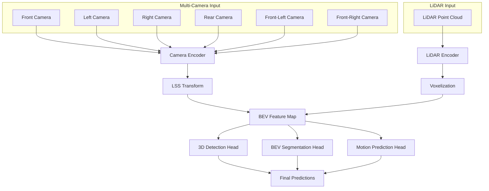

**Key Components:**
1. **Camera-to-BEV Transformation**: LSS (Lift-Splat-Shoot) method
2. **LiDAR-to-BEV Projection**: Direct point cloud projection
3. **Multi-Modal Fusion**: Convolutional layers in BEV space
4. **Task Heads**: Detection, segmentation, motion prediction

**Mathematical Formulation:**
```
BEV_camera = LSS(I_camera, D_pred, K, T_cam2ego)
BEV_lidar = Voxelize(P_lidar, T_lidar2ego)
BEV_fused = Conv(Concat(BEV_camera, BEV_lidar))
```

Where:
- `I_camera`: Camera images
- `D_pred`: Predicted depth maps
- `K`: Camera intrinsics
- `T_cam2ego`: Camera-to-ego transformation
- `P_lidar`: LiDAR point cloud

**Research Papers:**
- [BEVFusion: Multi-Task Multi-Sensor Fusion with Unified Bird's-Eye View Representation](https://arxiv.org/abs/2205.13542)
- [BEVFusion GitHub](https://github.com/mit-han-lab/bevfusion)

#### TransFusion

**Innovation:**
Uses transformer architecture for multi-modal fusion with learnable queries.

**Architecture:**
```
Multi-Modal Encoder → Cross-Attention → Object Queries → Detection Heads
```

**Key Features:**
- Learnable object queries
- Cross-modal attention mechanisms
- End-to-end optimization
- Robust to sensor failures

**Resources:**
- [TransFusion: Robust LiDAR-Camera Fusion for 3D Object Detection](https://arxiv.org/abs/2203.11496)
- [TransFusion Implementation](https://github.com/XuyangBai/TransFusion)

#### FUTR3D

**Concept:**
Future prediction through unified temporal-spatial fusion.

**Components:**
1. **Temporal Modeling**: RNN/Transformer for sequence processing
2. **Spatial Fusion**: Multi-modal feature alignment
3. **Future Prediction**: Forecasting object trajectories
4. **Uncertainty Estimation**: Confidence measures for predictions

### Implementation Strategies

#### Coordinate System Alignment

**Challenge:** Different sensors have different coordinate systems and timing.

**Solution:**
```python
def align_sensors(camera_data, lidar_data, radar_data, calibration):
    # Temporal alignment
    synchronized_data = temporal_sync(
        [camera_data, lidar_data, radar_data],
        target_timestamp=camera_data.timestamp
    )
    
    # Spatial alignment to ego coordinate system
    ego_camera = transform_to_ego(
        synchronized_data.camera, 
        calibration.camera_to_ego
    )
    ego_lidar = transform_to_ego(
        synchronized_data.lidar, 
        calibration.lidar_to_ego
    )
    ego_radar = transform_to_ego(
        synchronized_data.radar, 
        calibration.radar_to_ego
    )
    
    return ego_camera, ego_lidar, ego_radar
```

#### Attention-Based Fusion

**Cross-Modal Attention:**
```python
class CrossModalAttention(nn.Module):
    def __init__(self, d_model, n_heads):
        super().__init__()
        self.multihead_attn = nn.MultiheadAttention(d_model, n_heads)
        
    def forward(self, query_features, key_features, value_features):
        # query: target modality (e.g., camera)
        # key/value: source modality (e.g., lidar)
        attended_features, attention_weights = self.multihead_attn(
            query_features, key_features, value_features
        )
        return attended_features, attention_weights
```

### Challenges and Solutions

#### 1. **Sensor Calibration**

**Challenge:** Maintaining precise spatial and temporal calibration.

**Solutions:**
- Automatic calibration algorithms
- Online calibration monitoring
- Robust fusion methods tolerant to miscalibration

#### 2. **Data Association**

**Challenge:** Matching detections across different modalities.

**Solutions:**
- Hungarian algorithm for assignment
- Learned association networks
- Probabilistic data association

#### 3. **Computational Efficiency**

**Challenge:** Real-time processing of high-dimensional multi-modal data.

**Solutions:**
- Efficient network architectures (MobileNets, EfficientNets)
- Model compression and quantization
- Hardware acceleration (GPUs, specialized chips)

#### 4. **Robustness to Sensor Failures**

**Challenge:** Maintaining performance when sensors fail or degrade.

**Solutions:**
- Graceful degradation strategies
- Redundant sensor configurations
- Uncertainty-aware fusion

### Evaluation Metrics

#### Standard Metrics:
- **mAP (mean Average Precision)**: Object detection accuracy
- **NDS (nuScenes Detection Score)**: Comprehensive detection metric
- **AMOTA/AMOTP**: Multi-object tracking accuracy
- **IoU (Intersection over Union)**: Segmentation quality

#### Fusion-Specific Metrics:
- **Cross-Modal Consistency**: Agreement between modalities
- **Robustness Score**: Performance under sensor degradation
- **Computational Efficiency**: FLOPs, latency, memory usage

---

## End-to-End Transformers for Joint Perception-Planning

The evolution from modular autonomous driving systems to end-to-end learning represents a fundamental shift in how we approach the complex task of autonomous navigation. End-to-end transformers enable joint optimization of perception and planning, leading to more coherent and efficient decision-making.

### Motivation for End-to-End Approaches

#### Modular vs End-to-End Architecture Comparison

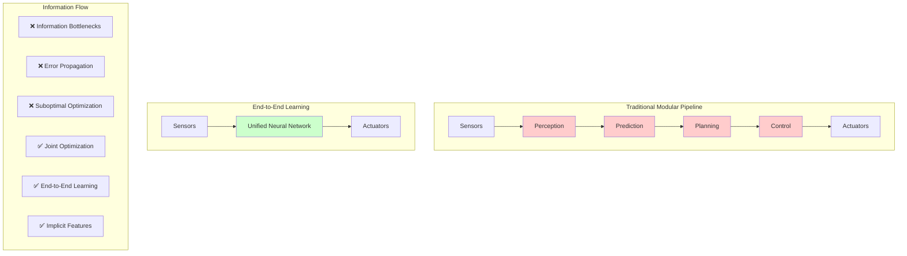

#### Limitations of Modular Systems

**Information Bottlenecks:**
- Each module processes information independently
- Critical context may be lost between stages
- Suboptimal overall system performance

**Error Propagation:**
- Errors in perception cascade to planning
- Difficult to recover from early mistakes
- No feedback mechanism for improvement

**Optimization Challenges:**
- Each module optimized separately
- Global optimum may not be achieved
- Difficult to balance trade-offs across modules

#### Advantages of End-to-End Learning

**Joint Optimization:**
- All components trained together
- Global loss function optimization
- Better overall system performance

**Implicit Feature Learning:**
- System learns relevant features automatically
- No need for hand-crafted intermediate representations
- Adaptive to different scenarios and conditions

**Simplified Architecture:**
- Fewer components to maintain and debug
- Reduced system complexity
- Easier deployment and updates

### Transformer Architectures for Autonomous Driving

#### VISTA (Vision-based Interpretable Spatial-Temporal Attention)

**Overview:**
VISTA introduces spatial-temporal attention mechanisms for autonomous driving, enabling the model to focus on relevant regions and time steps for decision-making.

**VISTA Architecture:**

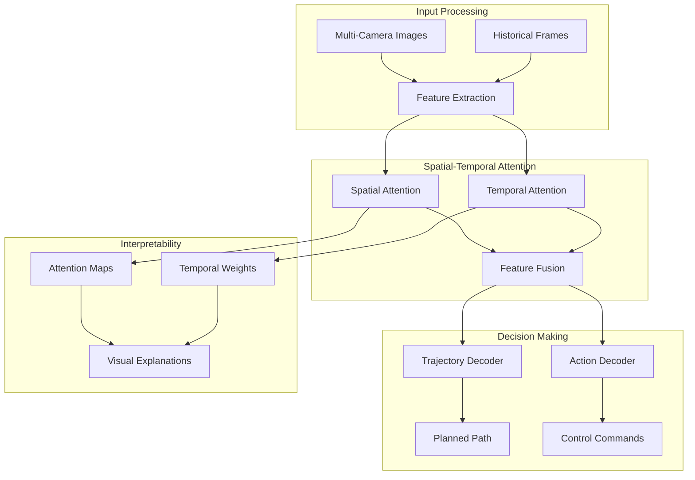

**Architecture Components:**

1. **Spatial Attention Module:**
```python
class SpatialAttention(nn.Module):
    def __init__(self, d_model):
        super().__init__()
        self.attention = nn.MultiheadAttention(d_model, num_heads=8)
        
    def forward(self, features, spatial_queries):
        # features: [H*W, B, d_model] - flattened spatial features
        # spatial_queries: [N, B, d_model] - learnable spatial queries
        attended_features, attention_map = self.attention(
            spatial_queries, features, features
        )
        return attended_features, attention_map
```

2. **Temporal Attention Module:**
```python
class TemporalAttention(nn.Module):
    def __init__(self, d_model, sequence_length):
        super().__init__()
        self.temporal_encoder = nn.TransformerEncoder(
            nn.TransformerEncoderLayer(d_model, nhead=8),
            num_layers=6
        )
        
    def forward(self, temporal_features):
        # temporal_features: [T, B, d_model]
        encoded_sequence = self.temporal_encoder(temporal_features)
        return encoded_sequence
```

**Key Innovations:**
- Interpretable attention maps showing where the model focuses
- Temporal reasoning for motion prediction
- End-to-end learning from pixels to control

**Research Resources:**
- [VISTA: A Generic Training Pipeline for Computer Vision](https://arxiv.org/abs/2308.04849)
- [Spatial-Temporal Attention Networks for Action Recognition](https://arxiv.org/abs/1803.01271)
- [Video Transformer Network](https://arxiv.org/abs/2102.00719)
- [TimeSformer: Is Space-Time Attention All You Need?](https://arxiv.org/abs/2102.05095)
- [Attention Is All You Need](https://arxiv.org/abs/1706.03762)

**Code Repositories:**
- [VISTA Simulator](https://github.com/vista-simulator/vista)
- [TimeSformer](https://github.com/facebookresearch/TimeSformer)
- [Video-Transformer-Pytorch](https://github.com/lucidrains/video-transformer-pytorch)
- [Spatial-Temporal Attention](https://github.com/open-mmlab/mmaction2)

#### Hydra-MDP (Multi-Task Multi-Modal Transformer)

**Overview:**
Hydra-MDP addresses multiple driving tasks simultaneously using a shared transformer backbone with task-specific heads.

**Hydra-MDP Architecture:**

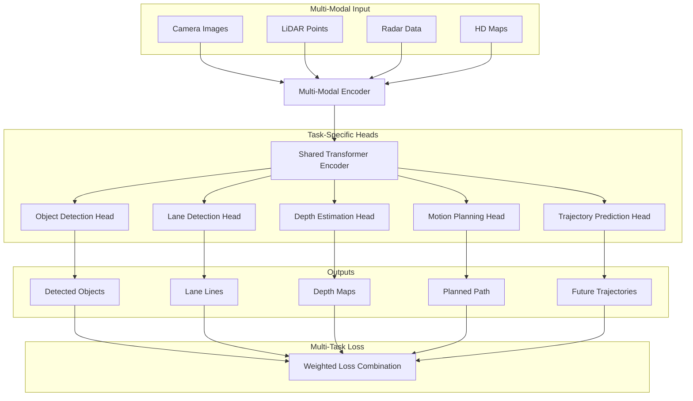

**Multi-Task Learning Framework:**
```python
class HydraMDP(nn.Module):
    def __init__(self, d_model, num_tasks):
        super().__init__()
        self.shared_encoder = TransformerEncoder(d_model)
        self.task_heads = nn.ModuleDict({
            'detection': DetectionHead(d_model),
            'segmentation': SegmentationHead(d_model),
            'planning': PlanningHead(d_model),
            'prediction': PredictionHead(d_model)
        })
        
    def forward(self, multi_modal_input):
        shared_features = self.shared_encoder(multi_modal_input)
        
        outputs = {}
        for task_name, head in self.task_heads.items():
            outputs[task_name] = head(shared_features)
            
        return outputs
```

**Key Features:**
- Shared representations across tasks
- Task-specific attention mechanisms
- Joint optimization with multi-task loss
- Efficient parameter sharing

**Research Papers:**
- [Hydra: Multi-head Low-rank Adaptation for Parameter Efficient Fine-tuning](https://arxiv.org/abs/2309.06922)
- [Multi-Task Learning for Autonomous Driving](https://arxiv.org/abs/2209.07403)
- [Multi-Task Learning Using Uncertainty to Weigh Losses](https://arxiv.org/abs/1705.07115)
- [Cross-stitch Networks for Multi-task Learning](https://arxiv.org/abs/1604.03539)
- [TaskMoE: Towards Multi-Task Foundation Models](https://arxiv.org/abs/2312.17502)
- [Multi-Domain Multi-Task Rehearsal for Lifelong Learning](https://arxiv.org/abs/2012.06651)

**Code Repositories:**
- [Multi-Task Learning Pytorch](https://github.com/SimonVandenhende/Multi-Task-Learning-PyTorch)
- [TaskMoE](https://github.com/microsoft/TaskMoE)
- [Multi-Task-Learning](https://github.com/yaoyao-liu/multi-task-learning)
- [Hydra Framework](https://github.com/facebookresearch/hydra)

#### UniAD (Unified Autonomous Driving)

**Innovation:**
UniAD presents a unified framework that handles all autonomous driving tasks within a single transformer architecture.

**UniAD Unified Framework:**

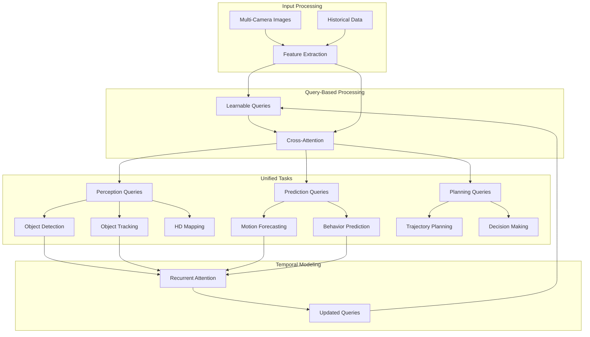

**Task Integration:**
1. **Perception Tasks**: Object detection, tracking, mapping
2. **Prediction Tasks**: Motion forecasting, behavior prediction  
3. **Planning Tasks**: Trajectory planning, decision making

**Architecture Highlights:**
- Query-based design with learnable embeddings
- Temporal modeling with recurrent attention
- Multi-scale feature processing
- End-to-end differentiable planning

**Mathematical Formulation:**
```
Q_t = Update(Q_{t-1}, F_t)  # Query update with new features
A_t = Attention(Q_t, F_t)   # Attention computation
P_t = Plan(A_t, G)          # Planning with goal G
```

**Research Papers:**
- [Planning-oriented Autonomous Driving](https://arxiv.org/abs/2212.10156)
- [UniAD: Planning-oriented Autonomous Driving](https://arxiv.org/abs/2212.10156)
- [Query-Based End-to-End Autonomous Driving](https://arxiv.org/abs/2208.01151)
- [DETR3D: 3D Object Detection from Multi-view Images](https://arxiv.org/abs/2110.06922)
- [BEVFormer: Learning Bird's-Eye-View Representation](https://arxiv.org/abs/2203.17270)
- [End-to-End Urban Driving by Imitating a Reinforcement Learning Coach](https://arxiv.org/abs/2108.08265)

**Code Repositories:**
- [UniAD Official](https://github.com/OpenDriveLab/UniAD)
- [DETR3D](https://github.com/WangYueFt/detr3d)
- [BEVFormer](https://github.com/fundamentalvision/BEVFormer)
- [End-to-End Autonomous Driving](https://github.com/OpenDriveLab/End-to-end-Autonomous-Driving)

### Advanced Architectures and Techniques

#### ST-P3 (Spatial-Temporal Pyramid Pooling for Planning)

**Concept:**
Hierarchical spatial-temporal processing for multi-scale planning.

**Components:**
1. **Pyramid Feature Extraction**: Multi-scale spatial features
2. **Temporal Aggregation**: Long-term temporal dependencies
3. **Planning Decoder**: Trajectory generation with constraints

**Research Papers:**
- [ST-P3: End-to-end Vision-based Autonomous Driving](https://arxiv.org/abs/2207.07601)
- [Spatial Pyramid Pooling in Deep Convolutional Networks](https://arxiv.org/abs/1406.4729)
- [Pyramid Scene Parsing Network](https://arxiv.org/abs/1612.01105)
- [Feature Pyramid Networks for Object Detection](https://arxiv.org/abs/1612.03144)

**Code Repositories:**
- [ST-P3 Official](https://github.com/OpenDriveLab/ST-P3)
- [Pyramid Pooling](https://github.com/hszhao/PSPNet)
- [Feature Pyramid Networks](https://github.com/facebookresearch/detectron2)

#### VAD (Vector-based Autonomous Driving)

**Innovation:**
Represents driving scenes using vectorized elements (lanes, objects) rather than raster images.

**Advantages:**
- Compact representation
- Geometric consistency
- Efficient processing
- Better generalization

**Research Papers:**
- [VAD: Vectorized Scene Representation for Efficient Autonomous Driving](https://arxiv.org/abs/2303.12077)
- [VectorNet: Encoding HD Maps and Agent Dynamics](https://arxiv.org/abs/2005.04259)
- [LaneGCN: Learning Lane Graph Representations](https://arxiv.org/abs/2007.13732)
- [TNT: Target-driveN Trajectory Prediction](https://arxiv.org/abs/2008.08294)

**Code Repositories:**
- [VAD Official](https://github.com/hustvl/VAD)
- [VectorNet](https://github.com/xk-huang/yet-another-vectornet)
- [LaneGCN](https://github.com/uber-research/LaneGCN)
- [TNT](https://github.com/Henry1iu/TNT-Trajectory-Predition)

### Training Strategies

#### Training Pipeline Overview

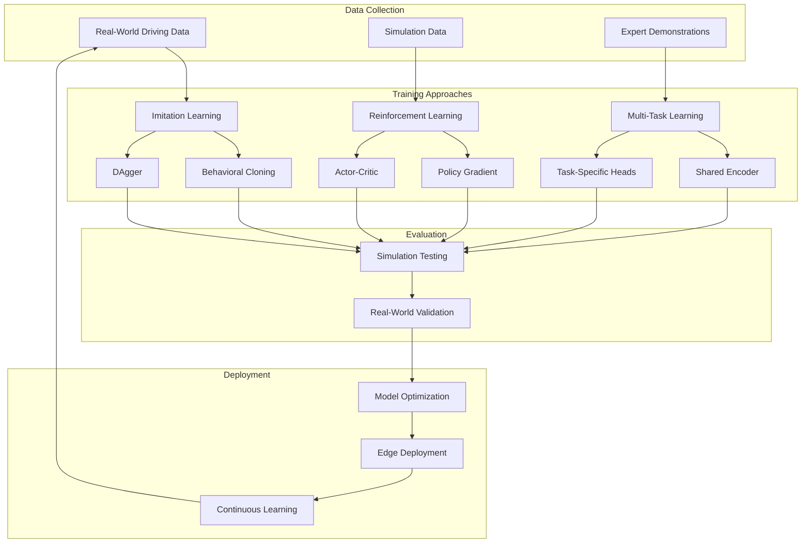

#### Imitation Learning

**Behavioral Cloning:**
```python
def behavioral_cloning_loss(predicted_actions, expert_actions):
    return F.mse_loss(predicted_actions, expert_actions)
```

**DAgger (Dataset Aggregation):**
- Iterative training with expert corrections
- Addresses distribution shift problem
- Improves robustness to compounding errors

**Research Papers:**
- [A Reduction of Imitation Learning and Structured Prediction to No-Regret Online Learning](https://arxiv.org/abs/1011.0686)
- [Learning to Drive in a Day](https://arxiv.org/abs/1807.00412)
- [End-to-end Driving via Conditional Imitation Learning](https://arxiv.org/abs/1710.02410)
- [Exploring the Limitations of Behavior Cloning for Autonomous Driving](https://arxiv.org/abs/1904.08980)
- [ChauffeurNet: Learning to Drive by Imitating the Best](https://arxiv.org/abs/1812.03079)

**Code Repositories:**
- [Imitation Learning](https://github.com/HumanCompatibleAI/imitation)
- [ChauffeurNet](https://github.com/aidriver/ChauffeurNet)
- [CARLA Imitation Learning](https://github.com/carla-simulator/imitation-learning)

#### Reinforcement Learning

**Policy Gradient Methods:**
```python
class PPOAgent(nn.Module):
    def __init__(self, state_dim, action_dim):
        super().__init__()
        self.actor = TransformerActor(state_dim, action_dim)
        self.critic = TransformerCritic(state_dim)
        
    def forward(self, state):
        action_dist = self.actor(state)
        value = self.critic(state)
        return action_dist, value
```

**Reward Design:**
- Safety rewards (collision avoidance)
- Progress rewards (goal reaching)
- Comfort rewards (smooth driving)
- Rule compliance rewards (traffic laws)

**Research Papers:**
- [Proximal Policy Optimization Algorithms](https://arxiv.org/abs/1707.06347)
- [Deep Reinforcement Learning for Autonomous Driving](https://arxiv.org/abs/1811.11329)
- [World Models for Autonomous Driving](https://arxiv.org/abs/2010.02302)
- [Safe Reinforcement Learning for Autonomous Driving](https://arxiv.org/abs/2110.05846)
- [Model-Based Reinforcement Learning for Autonomous Driving](https://arxiv.org/abs/1906.08649)
- [Deep Q-Learning for Autonomous Driving](https://arxiv.org/abs/1711.03938)

**Code Repositories:**
- [Stable Baselines3](https://github.com/DLR-RM/stable-baselines3)
- [Highway-Env](https://github.com/eleurent/highway-env)
- [CARLA RL](https://github.com/carla-simulator/carla)
- [OpenAI Gym](https://github.com/openai/gym)
- [Ray RLlib](https://github.com/ray-project/ray)

#### Multi-Task Learning

**Loss Function Design:**
```python
def multi_task_loss(outputs, targets, task_weights):
    total_loss = 0
    for task in ['detection', 'segmentation', 'planning']:
        task_loss = compute_task_loss(outputs[task], targets[task])
        total_loss += task_weights[task] * task_loss
    return total_loss
```

**Uncertainty Weighting:**
- Automatic balancing of task losses
- Learned uncertainty parameters
- Adaptive training dynamics

**Research Papers:**
- [Multi-Task Learning Using Uncertainty to Weigh Losses](https://arxiv.org/abs/1705.07115)
- [GradNorm: Gradient Normalization for Adaptive Loss Balancing](https://arxiv.org/abs/1711.02257)
- [Multi-Task Learning as Multi-Objective Optimization](https://arxiv.org/abs/1810.04650)
- [End-to-End Multi-Task Learning with Attention](https://arxiv.org/abs/1803.10704)
- [Cross-stitch Networks for Multi-task Learning](https://arxiv.org/abs/1604.03539)
- [TaskMoE: Towards Multi-Task Foundation Models](https://arxiv.org/abs/2312.17502)

**Code Repositories:**
- [Multi-Task Learning PyTorch](https://github.com/SimonVandenhende/Multi-Task-Learning-PyTorch)
- [GradNorm](https://github.com/brianlan/GradNorm)
- [Multi-Objective Optimization](https://github.com/intel-isl/MultiObjectiveOptimization)
- [LibMTL](https://github.com/median-research-group/LibMTL)

### Evaluation and Benchmarks

#### Autonomous Driving Evaluation Framework

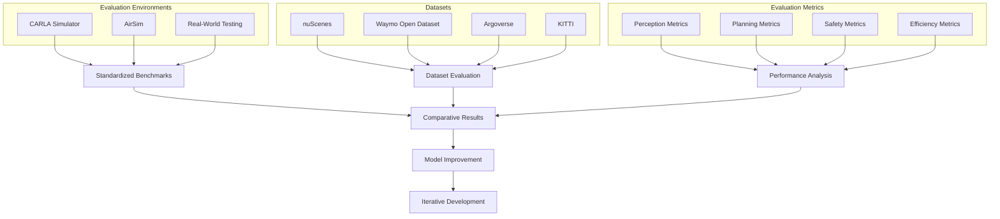

#### Simulation Environments

**CARLA Simulator:**
- Realistic urban environments
- Controllable weather and lighting
- Standardized benchmarks and metrics
- [CARLA Documentation](https://carla.readthedocs.io/)
- [CARLA GitHub](https://github.com/carla-simulator/carla)
- [CARLA Leaderboard](https://leaderboard.carla.org/)

**AirSim:**
- Photorealistic environments
- Multi-vehicle scenarios
- Sensor simulation
- [AirSim GitHub](https://github.com/Microsoft/AirSim)
- [AirSim Documentation](https://microsoft.github.io/AirSim/)

**Research Papers:**
- [CARLA: An Open Urban Driving Simulator](https://arxiv.org/abs/1711.03938)
- [AirSim: High-Fidelity Visual and Physical Simulation](https://arxiv.org/abs/1705.05065)
- [Learning by Cheating](https://arxiv.org/abs/1912.12294)
- [End-to-End Autonomous Driving: Challenges and Frontiers](https://arxiv.org/abs/2306.16927)

#### Real-World Datasets

**nuScenes:**
- Large-scale autonomous driving dataset
- Multi-modal sensor data
- Comprehensive annotations
- [nuScenes Dataset](https://www.nuscenes.org/)
- [nuScenes DevKit](https://github.com/nutonomy/nuscenes-devkit)

**Waymo Open Dataset:**
- High-quality LiDAR and camera data
- Diverse geographic locations
- Motion prediction challenges
- [Waymo Open Dataset](https://waymo.com/open/)
- [Waymo Open Dataset GitHub](https://github.com/waymo-research/waymo-open-dataset)

**Argoverse:**
- HD maps and trajectory forecasting
- Multi-city data collection
- 3D tracking annotations
- [Argoverse Dataset](https://www.argoverse.org/)
- [Argoverse API](https://github.com/argoverse/argoverse-api)

**KITTI:**
- Stereo vision and LiDAR data
- Object detection and tracking
- Odometry and mapping
- [KITTI Dataset](http://www.cvlibs.net/datasets/kitti/)
- [KITTI DevKit](https://github.com/utiasSTARS/pykitti)

**Research Papers:**
- [nuScenes: A multimodal dataset for autonomous driving](https://arxiv.org/abs/1903.11027)
- [Scalability in Perception for Autonomous Driving: Waymo Open Dataset](https://arxiv.org/abs/1912.04838)
- [Argoverse: 3D Tracking and Forecasting with Rich Maps](https://arxiv.org/abs/1911.02620)
- [Vision meets Robotics: The KITTI Dataset](https://www.cvlibs.net/publications/Geiger2013IJRR.pdf)

#### Metrics

**Planning Metrics:**
- **L2 Error**: Euclidean distance to ground truth trajectory
- **Collision Rate**: Frequency of collisions in simulation
- **Comfort**: Smoothness of acceleration and steering
- **Progress**: Distance traveled toward goal

**Perception Metrics:**
- **Detection AP**: Average precision for object detection
- **Tracking MOTA**: Multi-object tracking accuracy
- **Segmentation IoU**: Intersection over union for segmentation

---

## Vision-Language-Action Models

Vision-Language-Action (VLA) models represent the next frontier in autonomous systems, combining visual perception, natural language understanding, and action generation in a unified framework. These models enable robots and autonomous vehicles to understand complex instructions, reason about their environment, and execute appropriate actions.

### What are Vision-Language-Action Models?

VLA models extend traditional vision-language models by adding an action component, creating a complete perception-reasoning-action loop. They can:

1. **Perceive** the environment through multiple sensors
2. **Understand** natural language instructions and context
3. **Reason** about the relationship between perception and goals
4. **Generate** appropriate actions to achieve objectives

### Core Architecture

```
Visual Input → Vision Encoder → Multimodal Fusion ← Language Encoder ← Text Input
                    ↓
              Reasoning Module
                    ↓
              Action Decoder → Control Commands
```

### Key VLA Models in Autonomous Driving

#### RT-1 (Robotics Transformer 1)

**Overview:**
RT-1 demonstrates how transformer architectures can be adapted for robotic control, learning from diverse demonstration data.

**Architecture:**
- **Vision Encoder**: EfficientNet-B3 for image processing
- **Language Encoder**: Universal Sentence Encoder for instruction processing
- **Action Decoder**: Transformer decoder for action sequence generation

**Key Features:**
- Multi-task learning across different robotic tasks
- Natural language instruction following
- Generalization to unseen scenarios

**Autonomous Driving Applications:**
- Following verbal navigation instructions
- Adapting to passenger requests
- Emergency situation handling

**Research Resources:**
- [RT-1: Robotics Transformer for Real-World Control at Scale](https://arxiv.org/abs/2212.06817)
- [RT-1 Project Page](https://robotics-transformer1.github.io/)
- [Scaling Up and Distilling Down: Language-Guided Robot Skill Acquisition](https://arxiv.org/abs/2307.14535)
- [Do As I Can, Not As I Say: Grounding Language in Robotic Affordances](https://arxiv.org/abs/2204.01691)

**Code Repositories:**
- [RT-1 Official](https://github.com/google-research/robotics_transformer)
- [Robotics Transformer](https://github.com/kyegomez/RT-1)
- [Language-Conditioned Imitation Learning](https://github.com/google-research/language-conditioned-imitation-learning)

#### RT-2 (Robotics Transformer 2)

**Innovation:**
RT-2 builds on vision-language models (VLMs) to enable better reasoning and generalization in robotic tasks.

**Architecture Improvements:**
- Integration with PaLM-E for enhanced reasoning
- Better handling of novel objects and scenarios
- Improved sample efficiency

**Capabilities:**
```python
# Example RT-2 interaction
instruction = "Drive to the parking lot and avoid the construction zone"
visual_input = camera_feed
context = traffic_conditions

action_sequence = rt2_model(
    instruction=instruction,
    visual_input=visual_input,
    context=context
)
```

**Research Papers:**
- [RT-2: Vision-Language-Action Models Transfer Web Knowledge to Robotic Control](https://arxiv.org/abs/2307.15818)
- [Open X-Embodiment: Robotic Learning Datasets and RT-X Models](https://arxiv.org/abs/2310.08864)
- [AutoRT: Embodied Foundation Models for Large Scale Orchestration of Robotic Agents](https://arxiv.org/abs/2401.12963)
- [RT-X: A Foundation Model for Robotic Manipulation](https://arxiv.org/abs/2310.08864)

**Code Repositories:**
- [RT-2 Official](https://github.com/google-research/robotics_transformer)
- [Open X-Embodiment](https://github.com/google-deepmind/open_x_embodiment)
- [RT-X Models](https://github.com/google-deepmind/robotics_transformer)

#### PaLM-E (Pathways Language Model - Embodied)

**Overview:**
PaLM-E integrates large language models with embodied AI, enabling robots to understand and act on complex multimodal instructions.

**Key Innovations:**
- **Multimodal Integration**: Seamless fusion of text, images, and sensor data
- **Embodied Reasoning**: Understanding of physical world constraints
- **Transfer Learning**: Leveraging web-scale knowledge for robotics

**Architecture Components:**
1. **Vision Encoder**: ViT (Vision Transformer) for image processing
2. **Language Model**: PaLM for text understanding and reasoning
3. **Sensor Integration**: Multiple sensor modality processing
4. **Action Generation**: Policy networks for control commands

**Autonomous Driving Scenarios:**
```
Human: "Take me to the hospital, but avoid the highway due to traffic"
PaLM-E: 
1. Identifies hospital locations from map knowledge
2. Analyzes current traffic conditions
3. Plans alternative route avoiding highways
4. Generates driving actions while monitoring traffic
```

**Research Papers:**
- [PaLM-E: An Embodied Multimodal Language Model](https://arxiv.org/abs/2303.03378)
- [Embodied AI with Large Language Models](https://arxiv.org/abs/2311.09469)
- [LLaMA-Adapter: Efficient Fine-tuning of Language Models](https://arxiv.org/abs/2303.16199)
- [Multimodal Foundation Models: From Specialists to General-Purpose Assistants](https://arxiv.org/abs/2309.10020)

**Code Repositories:**
- [PaLM-E Project Page](https://palm-e.github.io/)
- [Embodied AI](https://github.com/embodied-ai/embodied-ai)
- [Multimodal LLM](https://github.com/BradyFU/Awesome-Multimodal-Large-Language-Models)

#### CLIP-Fields

**Concept:**
Extends CLIP to understand 3D scenes and generate spatially-aware actions.

**Applications in Autonomous Driving:**
- 3D scene understanding with natural language queries
- Spatial reasoning for navigation
- Object manipulation in 3D space

**Research Papers:**
- [CLIP-Fields: Weakly Supervised Semantic Fields for Robotic Memory](https://arxiv.org/abs/2210.05663)
- [Learning Transferable Visual Models From Natural Language Supervision](https://arxiv.org/abs/2103.00020)
- [CLIP-NeRF: Text-and-Image Driven Manipulation of Neural Radiance Fields](https://arxiv.org/abs/2112.05139)
- [LSeg: Language-driven Semantic Segmentation](https://arxiv.org/abs/2201.03546)

**Code Repositories:**
- [CLIP-Fields](https://github.com/notmahi/clip-fields)
- [OpenCLIP](https://github.com/mlfoundations/open_clip)
- [CLIP-NeRF](https://github.com/cassiePython/CLIPNeRF)
- [LSeg](https://github.com/isl-org/lang-seg)

### Advanced VLA Architectures

#### Flamingo for Robotics

**Innovation:**
Adapts the Flamingo few-shot learning architecture for robotic control tasks.

**Key Features:**
- Few-shot learning from demonstrations
- Cross-modal attention mechanisms
- Rapid adaptation to new tasks

**Research Papers:**
- [Flamingo: a Visual Language Model for Few-Shot Learning](https://arxiv.org/abs/2204.14198)
- [Few-Shot Learning for Robotics: A Survey](https://arxiv.org/abs/2201.07540)
- [Meta-Learning for Few-Shot Imitation Learning](https://arxiv.org/abs/1710.04615)
- [Learning to Learn by Gradient Descent by Gradient Descent](https://arxiv.org/abs/1606.04474)

**Code Repositories:**
- [Flamingo PyTorch](https://github.com/lucidrains/flamingo-pytorch)
- [OpenFlamingo](https://github.com/mlfoundations/open_flamingo)
- [Few-Shot Learning](https://github.com/oscarknagg/few-shot)

**Implementation Example:**
```python
class FlamingoVLA(nn.Module):
    def __init__(self, vision_encoder, language_model, action_decoder):
        super().__init__()
        self.vision_encoder = vision_encoder
        self.language_model = language_model
        self.cross_attention = CrossModalAttention()
        self.action_decoder = action_decoder
        
    def forward(self, images, text, demonstrations=None):
        # Process visual input
        visual_features = self.vision_encoder(images)
        
        # Process language input
        text_features = self.language_model(text)
        
        # Cross-modal fusion
        fused_features = self.cross_attention(
            visual_features, text_features
        )
        
        # Few-shot adaptation with demonstrations
        if demonstrations:
            fused_features = self.adapt_with_demos(
                fused_features, demonstrations
            )
        
        # Generate actions
        actions = self.action_decoder(fused_features)
        return actions
```

#### VIMA (Multimodal Prompt-based Imitation Learning)

**Overview:**
VIMA enables robots to learn new tasks from multimodal prompts combining text, images, and demonstrations.

**Key Capabilities:**
- Prompt-based task specification
- Multimodal instruction understanding
- Compositional generalization

**Autonomous Driving Applications:**
- Learning new driving behaviors from examples
- Adapting to different vehicle types
- Handling novel traffic scenarios

**Research Papers:**
- [VIMA: General Robot Manipulation with Multimodal Prompts](https://arxiv.org/abs/2210.03094)
- [Multimodal Prompting for Low-Resource Visual Recognition](https://arxiv.org/abs/2112.07722)
- [Learning Universal Policies via Text-Guided Video Generation](https://arxiv.org/abs/2302.00111)
- [Prompt-based Learning for Vision-and-Language Models](https://arxiv.org/abs/2109.01134)

**Code Repositories:**
- [VIMA Official](https://github.com/vimalabs/VIMA)
- [Multimodal Prompting](https://github.com/amazon-science/multimodal-prompting)
- [Vision-Language Prompting](https://github.com/KaiyangZhou/CoOp)

### Training Strategies for VLA Models

#### 1. **Imitation Learning with Language**

**Approach:**
Combine behavioral cloning with natural language supervision.

```python
def language_conditioned_imitation_loss(
    predicted_actions, expert_actions, 
    predicted_language, expert_language
):
    action_loss = F.mse_loss(predicted_actions, expert_actions)
    language_loss = F.cross_entropy(predicted_language, expert_language)
    return action_loss + 0.1 * language_loss
```

**Benefits:**
- Richer supervision signal
- Better generalization
- Interpretable behavior

**Research Papers:**
- [Language-Conditioned Imitation Learning for Robot Manipulation Tasks](https://arxiv.org/abs/2010.12083)
- [Learning Language-Conditioned Robot Behavior from Offline Data](https://arxiv.org/abs/2109.01115)
- [BC-O: Learning from Human Feedback with Offline Reinforcement Learning](https://arxiv.org/abs/2108.08812)

**Code Repositories:**
- [Language-Conditioned Imitation Learning](https://github.com/google-research/language-conditioned-imitation-learning)
- [BC-O](https://github.com/google-research/google-research/tree/master/bc_o)

#### 2. **Reinforcement Learning with Language Rewards**

**Concept:**
Use language-based reward functions to guide policy learning.

```python
class LanguageRewardFunction:
    def __init__(self, language_model):
        self.language_model = language_model
        
    def compute_reward(self, state, action, instruction):
        # Evaluate how well action aligns with instruction
        alignment_score = self.language_model.evaluate_alignment(
            state, action, instruction
        )
        return alignment_score
```

#### 3. **Multi-Task Learning**

**Framework:**
Train on diverse tasks simultaneously to improve generalization.

```python
def multi_task_vla_loss(outputs, targets, task_weights):
    total_loss = 0
    for task in ['navigation', 'parking', 'lane_change']:
        task_loss = compute_task_loss(outputs[task], targets[task])
        total_loss += task_weights[task] * task_loss
    return total_loss
```

### Implementation Challenges

#### 1. **Real-time Performance**

**Challenge:** VLA models are computationally expensive for real-time control.

**Solutions:**
- **Model Distillation**: Train smaller, faster models from large VLA models
- **Hierarchical Control**: Use VLA for high-level planning, simpler models for low-level control
- **Edge Optimization**: Specialized hardware and software optimization

```python
class HierarchicalVLA:
    def __init__(self, high_level_vla, low_level_controller):
        self.high_level_vla = high_level_vla
        self.low_level_controller = low_level_controller
        
    def control(self, observation, instruction):
        # High-level planning (slower, more complex)
        high_level_plan = self.high_level_vla(observation, instruction)
        
        # Low-level execution (faster, simpler)
        actions = self.low_level_controller(observation, high_level_plan)
        return actions
```

#### 2. **Safety and Reliability**

**Challenge:** Ensuring safe behavior in critical scenarios.

**Solutions:**
- **Formal Verification**: Mathematical guarantees on model behavior
- **Safety Constraints**: Hard constraints on action space
- **Uncertainty Quantification**: Confidence measures for decisions

```python
class SafeVLA:
    def __init__(self, vla_model, safety_checker):
        self.vla_model = vla_model
        self.safety_checker = safety_checker
        
    def safe_action(self, observation, instruction):
        proposed_action = self.vla_model(observation, instruction)
        
        # Check safety constraints
        if self.safety_checker.is_safe(observation, proposed_action):
            return proposed_action
        else:
            return self.safety_checker.get_safe_action(observation)
```

#### 3. **Data Efficiency**

**Challenge:** VLA models require large amounts of diverse training data.

**Solutions:**
- **Simulation**: Generate diverse scenarios in simulation
- **Data Augmentation**: Synthetic data generation
- **Transfer Learning**: Leverage pre-trained models

### Current Challenges and Limitations

#### 1. **Grounding Problem**

**Issue:** Connecting language concepts to physical world understanding.

**Current Research:**
- Embodied language learning
- Multimodal grounding datasets
- Interactive learning environments

#### 2. **Compositional Generalization**

**Issue:** Understanding novel combinations of known concepts.

**Approaches:**
- Modular architectures
- Compositional training strategies
- Systematic generalization benchmarks

#### 3. **Long-term Planning**

**Issue:** Reasoning about extended action sequences and their consequences.

**Solutions:**
- Hierarchical planning architectures
- Temporal abstraction methods
- Model-based planning integration

### Future Research Directions

#### 1. **Multimodal Foundation Models**

**Vision:**
Unified models that can handle any combination of sensory inputs and action outputs.

**Key Research Areas:**
- Universal multimodal architectures
- Cross-modal transfer learning
- Scalable training methodologies

**Research Papers:**
- [Flamingo: a Visual Language Model for Few-Shot Learning](https://arxiv.org/abs/2204.14198)
- [BLIP-2: Bootstrapping Vision-Language Pre-training](https://arxiv.org/abs/2301.12597)
- [GPT-4V(ision) System Card](https://arxiv.org/abs/2310.12809)
- [LLaVA: Large Language and Vision Assistant](https://arxiv.org/abs/2304.08485)
- [InstructBLIP: Towards General-purpose Vision-Language Models](https://arxiv.org/abs/2305.06500)

**Code Repositories:**
- [LLaVA](https://github.com/haotian-liu/LLaVA)
- [BLIP-2](https://github.com/salesforce/BLIP)
- [InstructBLIP](https://github.com/salesforce/LAVIS)
- [OpenFlamingo](https://github.com/mlfoundations/open_flamingo)

#### 2. **Interactive Learning**

**Concept:**
VLA models that learn continuously from human feedback and environmental interaction.

**Research Directions:**
- Online learning algorithms
- Human-in-the-loop training
- Preference learning methods

**Research Papers:**
- [Learning from Human Feedback: Challenges for Real-World Reinforcement Learning](https://arxiv.org/abs/2109.09812)
- [Training language models to follow instructions with human feedback](https://arxiv.org/abs/2203.02155)
- [Constitutional AI: Harmlessness from AI Feedback](https://arxiv.org/abs/2212.08073)
- [Deep reinforcement learning from human preferences](https://arxiv.org/abs/1706.03741)

**Code Repositories:**
- [TRL (Transformer Reinforcement Learning)](https://github.com/huggingface/trl)
- [Human Feedback](https://github.com/openai/human-feedback)
- [RLHF](https://github.com/CarperAI/trlx)

#### 3. **Causal Reasoning**

**Goal:**
Enable VLA models to understand cause-and-effect relationships in the physical world.

**Approaches:**
- Causal representation learning
- Interventional training data
- Counterfactual reasoning

**Research Papers:**
- [Causal Representation Learning: A Review](https://arxiv.org/abs/2307.02390)
- [Learning Causal Representations for Robotic Manipulation](https://arxiv.org/abs/2203.04386)
- [Causal Confusion in Imitation Learning](https://arxiv.org/abs/1905.11979)
- [Interventional Few-Shot Learning](https://arxiv.org/abs/2009.13000)

**Code Repositories:**
- [CausalML](https://github.com/uber/causalml)
- [DoWhy](https://github.com/py-why/dowhy)
- [CausalNex](https://github.com/quantumblacklabs/causalnex)

---

## Current Challenges and Solutions

Despite significant advances in Physical AI and LLMs for autonomous driving, several fundamental challenges remain. Understanding these challenges and their proposed solutions is crucial for advancing the field.

### Technical Challenges

#### 1. **Real-time Processing Requirements**

**Challenge Description:**
Autonomous vehicles must process vast amounts of multimodal sensor data and make decisions within milliseconds to ensure safety.

**Specific Issues:**
- **Latency Constraints**: Control decisions needed within 10-100ms
- **Computational Complexity**: Modern VLMs require significant computational resources
- **Power Limitations**: Mobile platforms have limited power budgets
- **Thermal Constraints**: Heat dissipation in compact vehicle systems

**Current Solutions:**

**Edge Computing Optimization:**
```python
class EdgeOptimizedVLA:
    def __init__(self):
        # Quantized models for faster inference
        self.vision_encoder = quantize_model(EfficientNet())
        self.language_model = prune_model(DistilBERT())
        
        # Hierarchical processing
        self.fast_detector = YOLOv8_nano()  # 1ms inference
        self.detailed_analyzer = RT2_compressed()  # 50ms inference
        
    def process_frame(self, sensor_data, urgency_level):
        if urgency_level == "emergency":
            return self.fast_detector(sensor_data)
        else:
            return self.detailed_analyzer(sensor_data)
```

**Hardware Acceleration:**
- **Specialized Chips**: NVIDIA Drive Orin, Tesla FSD Chip
- **Neural Processing Units**: Dedicated AI accelerators
- **FPGA Implementation**: Custom hardware for specific tasks

**Research Directions:**
- Neural architecture search for efficient models
- Dynamic inference with adaptive computation
- Neuromorphic computing for event-driven processing

**Research Papers:**
- [EfficientNet: Rethinking Model Scaling for Convolutional Neural Networks](https://arxiv.org/abs/1905.11946)
- [MobileNets: Efficient Convolutional Neural Networks for Mobile Vision Applications](https://arxiv.org/abs/1704.04861)
- [Neural Architecture Search with Reinforcement Learning](https://arxiv.org/abs/1611.01578)
- [Dynamic Neural Networks: A Survey](https://arxiv.org/abs/2102.04906)
- [Neuromorphic Computing for AI: From Algorithms to Chips](https://arxiv.org/abs/2010.01847)

**Code Repositories:**
- [EfficientNet](https://github.com/tensorflow/tpu/tree/master/models/official/efficientnet)
- [MobileNets](https://github.com/tensorflow/models/tree/master/research/slim/nets/mobilenet)
- [NASNet](https://github.com/tensorflow/models/tree/master/research/slim/nets/nasnet)
- [Intel Loihi](https://github.com/intel/lava)
- [SpiNNaker](https://github.com/SpiNNakerManchester/sPyNNaker)

#### 2. **Safety and Reliability**

**Challenge Description:**
Ensuring AI systems make safe decisions in all scenarios, including edge cases and adversarial conditions.

**Critical Issues:**
- **Black Box Problem**: Difficulty interpreting AI decisions
- **Adversarial Attacks**: Vulnerability to malicious inputs
- **Distribution Shift**: Performance degradation in unseen conditions
- **Failure Modes**: Graceful degradation when systems fail

**Solutions Framework:**

**Formal Verification:**
```python
class VerifiableController:
    def __init__(self, safety_constraints):
        self.constraints = safety_constraints
        self.backup_controller = RuleBasedController()
        
    def verify_action(self, state, proposed_action):
        # Mathematical verification of safety
        for constraint in self.constraints:
            if not constraint.verify(state, proposed_action):
                return False, constraint.violation_reason
        return True, None
        
    def safe_control(self, state, ai_action):
        is_safe, reason = self.verify_action(state, ai_action)
        
        if is_safe:
            return ai_action
        else:
            # Fall back to verified safe controller
            return self.backup_controller.get_action(state)
```

**Uncertainty Quantification:**
- **Bayesian Neural Networks**: Probabilistic predictions with confidence intervals
- **Ensemble Methods**: Multiple model predictions for robustness
- **Conformal Prediction**: Statistical guarantees on prediction sets

**Multi-Level Safety Architecture:**
```
Level 1: AI-based optimal control
Level 2: Rule-based safety monitor
Level 3: Hardware emergency braking
Level 4: Mechanical fail-safes
```

**Research Papers:**
- [Concrete Dropout](https://arxiv.org/abs/1506.02142)
- [What Uncertainties Do We Need in Bayesian Deep Learning for Computer Vision?](https://arxiv.org/abs/1703.04977)
- [Simple and Scalable Predictive Uncertainty Estimation using Deep Ensembles](https://arxiv.org/abs/1612.01474)
- [A Comprehensive Survey on Safe Reinforcement Learning](https://arxiv.org/abs/1508.03326)
- [Formal Verification of Neural Networks](https://arxiv.org/abs/1909.10381)

**Code Repositories:**
- [Uncertainty Toolbox](https://github.com/uncertainty-toolbox/uncertainty-toolbox)
- [TensorFlow Probability](https://github.com/tensorflow/probability)
- [Pyro](https://github.com/pyro-ppl/pyro)
- [Safe RL](https://github.com/openai/safety-gym)
- [Marabou](https://github.com/NeuralNetworkVerification/Marabou)

#### 3. **Data Quality and Availability**

**Challenge Description:**
Training robust AI systems requires massive amounts of high-quality, diverse data that covers edge cases and rare scenarios.

**Specific Problems:**
- **Long-tail Distribution**: Rare but critical scenarios are underrepresented
- **Annotation Costs**: Manual labeling is expensive and time-consuming
- **Privacy Concerns**: Collecting real-world driving data raises privacy issues
- **Geographic Bias**: Training data may not represent global driving conditions

**Innovative Solutions:**

**Synthetic Data Generation:**
```python
class SyntheticDataPipeline:
    def __init__(self):
        self.carla_sim = CARLASimulator()
        self.weather_generator = WeatherVariationEngine()
        self.scenario_generator = EdgeCaseGenerator()
        
    def generate_diverse_scenarios(self, num_scenarios=10000):
        scenarios = []
        for i in range(num_scenarios):
            # Generate diverse conditions
            weather = self.weather_generator.sample()
            traffic = self.scenario_generator.sample_traffic()
            road_type = self.scenario_generator.sample_road()
            
            # Simulate scenario
            scenario_data = self.carla_sim.run_scenario(
                weather=weather,
                traffic=traffic,
                road_type=road_type
            )
            scenarios.append(scenario_data)
        return scenarios
```

**Active Learning:**
- **Uncertainty Sampling**: Focus annotation on uncertain predictions
- **Diversity Sampling**: Ensure coverage of input space
- **Query-by-Committee**: Use ensemble disagreement to guide labeling

**Research Papers:**
- [CARLA: An Open Urban Driving Simulator](https://arxiv.org/abs/1711.03938)
- [AirSim: High-Fidelity Visual and Physical Simulation for Autonomous Vehicles](https://arxiv.org/abs/1705.05065)
- [Active Learning Literature Survey](https://arxiv.org/abs/1206.5533)
- [The Power of Ensembles for Active Learning in Image Classification](https://arxiv.org/abs/1708.02300)
- [Synthetic Data for Deep Learning](https://arxiv.org/abs/1909.11512)

**Code Repositories:**
- [CARLA Simulator](https://github.com/carla-simulator/carla)
- [AirSim](https://github.com/microsoft/AirSim)
- [Active Learning](https://github.com/modAL-python/modAL)
- [Synthetic Data Generation](https://github.com/gretelai/gretel-synthetics)

**Federated Learning:**
```python
class FederatedAVTraining:
    def __init__(self, vehicle_clients):
        self.clients = vehicle_clients
        self.global_model = VLAModel()
        
    def federated_update(self):
        client_updates = []
        
        # Each vehicle trains on local data
        for client in self.clients:
            local_update = client.train_local_model(
                self.global_model,
                client.private_data
            )
            client_updates.append(local_update)
        
        # Aggregate updates without sharing raw data
        self.global_model = self.aggregate_updates(client_updates)
```

#### 4. **Interpretability and Explainability**

**Challenge Description:**
Understanding why AI systems make specific decisions is crucial for debugging, validation, and regulatory approval.

**Key Issues:**
- **Decision Transparency**: Understanding the reasoning behind actions
- **Failure Analysis**: Diagnosing why systems fail
- **Regulatory Compliance**: Meeting explainability requirements
- **User Trust**: Building confidence in AI decisions

**Explainability Techniques:**

**Attention Visualization:**
```python
class ExplainableVLA:
    def __init__(self, model):
        self.model = model
        self.attention_extractor = AttentionExtractor(model)
        
    def explain_decision(self, input_data, decision):
        # Extract attention maps
        visual_attention = self.attention_extractor.get_visual_attention(
            input_data.camera_feed
        )
        
        # Generate textual explanation
        explanation = self.generate_explanation(
            decision, visual_attention, input_data.context
        )
        
        return {
            'decision': decision,
            'visual_focus': visual_attention,
            'reasoning': explanation,
            'confidence': self.model.get_confidence(input_data)
        }
```

**Counterfactual Explanations:**
- "The vehicle stopped because of the pedestrian. If the pedestrian weren't there, it would have continued at 30 mph."

**Concept Activation Vectors:**
- Understanding which high-level concepts (e.g., "school zone", "wet road") influence decisions

**Research Papers:**
- [Attention Is All You Need](https://arxiv.org/abs/1706.03762)
- [LIME: Explaining the Predictions of Any Classifier](https://arxiv.org/abs/1602.04938)
- [SHAP: A Unified Approach to Explaining Model Predictions](https://arxiv.org/abs/1705.07874)
- [Grad-CAM: Visual Explanations from Deep Networks](https://arxiv.org/abs/1610.02391)
- [Interpretability Beyond Feature Attribution](https://arxiv.org/abs/1711.06104)

**Code Repositories:**
- [LIME](https://github.com/marcotcr/lime)
- [SHAP](https://github.com/slundberg/shap)
- [Grad-CAM](https://github.com/jacobgil/pytorch-grad-cam)
- [Captum](https://github.com/pytorch/captum)
- [Alibi](https://github.com/SeldonIO/alibi)

### Systemic Challenges

#### 1. **Regulatory and Legal Framework**

**Current Issues:**
- **Liability Questions**: Who is responsible when AI makes mistakes?
- **Certification Processes**: How to validate AI system safety?
- **International Standards**: Harmonizing regulations across countries
- **Ethical Guidelines**: Ensuring fair and unbiased AI behavior

**Proposed Solutions:**
- **Graduated Deployment**: Phased introduction with increasing autonomy levels
- **Continuous Monitoring**: Real-time safety assessment and intervention
- **Standardized Testing**: Common benchmarks and evaluation protocols

#### 2. **Infrastructure Requirements**

**Challenges:**
- **V2X Communication**: Vehicle-to-everything connectivity needs
- **HD Mapping**: Maintaining accurate, up-to-date maps
- **Edge Computing**: Distributed processing infrastructure
- **Cybersecurity**: Protecting connected vehicle networks

**Research Papers:**
- [V2X Communication for Connected and Autonomous Vehicles](https://arxiv.org/abs/1912.12255)
- [Edge Computing for Autonomous Driving: Opportunities and Challenges](https://arxiv.org/abs/1906.00789)
- [HD Map: Fine-grained Road Map Construction for Autonomous Driving](https://arxiv.org/abs/2107.04807)
- [Cybersecurity in Connected and Autonomous Vehicles](https://arxiv.org/abs/1904.03304)
- [5G-Enabled Vehicular Communications and Networking](https://arxiv.org/abs/1712.01754)

**Code Repositories:**
- [SUMO Traffic Simulator](https://github.com/eclipse/sumo)
- [OpenV2X](https://github.com/OpenV2X/OpenV2X)
- [Lanelet2](https://github.com/fzi-forschungszentrum-informatik/Lanelet2)
- [OpenDRIVE](https://github.com/carla-simulator/opendrive)
- [ETSI ITS Standards](https://github.com/etsi-forge/etsi-its)

#### 3. **Human-AI Interaction**

**Challenges:**
- **Trust Calibration**: Appropriate reliance on AI systems
- **Takeover Scenarios**: Smooth transitions between AI and human control
- **Interface Design**: Effective communication of AI state and intentions
- **Training Requirements**: Educating users about AI capabilities and limitations

**Research Papers:**
- [Trust in Automation: Designing for Appropriate Reliance](https://arxiv.org/abs/1604.07460)
- [Human-AI Interaction in Autonomous Vehicles](https://arxiv.org/abs/1909.05665)
- [Takeover Performance in Conditionally Automated Driving](https://arxiv.org/abs/1808.10410)
- [Explainable AI for Autonomous Driving](https://arxiv.org/abs/2006.12033)
- [Trust Calibration in Human-AI Teams](https://arxiv.org/abs/2102.01509)

**Code Repositories:**
- [Human-AI Interaction](https://github.com/microsoft/human-ai-interaction)
- [Trust in Automation](https://github.com/cmu-transparency/trust-in-automation)
- [Explainable AI](https://github.com/EthicalML/xai)
- [Human Factors](https://github.com/carla-simulator/scenario_runner)
- [HMI Design](https://github.com/autowarefoundation/autoware)

---

## Future Research Directions

The field of Physical AI and LLMs for autonomous driving is rapidly evolving, with several promising research directions that could revolutionize how we approach autonomous navigation and decision-making.

### Near-term Research (2024-2027)

#### 1. **Multimodal Foundation Models for Driving**

**Research Goal:**
Develop unified foundation models that can process all sensor modalities and generate appropriate driving actions.

**Key Research Areas:**

**Research Papers:**
- [Multimodal Deep Learning for Robust RGB-D Object Recognition](https://arxiv.org/abs/1507.06821)
- [ViLBERT: Pretraining Task-Agnostic Visiolinguistic Representations](https://arxiv.org/abs/1908.02265)
- [CLIP: Learning Transferable Visual Models From Natural Language Supervision](https://arxiv.org/abs/2103.00020)
- [Perceiver: General Perception with Iterative Attention](https://arxiv.org/abs/2103.03206)
- [Unified Multimodal Pre-training and Prompt-based Tuning](https://arxiv.org/abs/2112.05587)

**Code Repositories:**
- [CLIP](https://github.com/openai/CLIP)
- [ViLBERT](https://github.com/jiasenlu/vilbert_beta)
- [Perceiver](https://github.com/deepmind/deepmind-research/tree/master/perceiver)
- [Multimodal Transformers](https://github.com/huggingface/transformers)
- [MMF](https://github.com/facebookresearch/mmf)

**Research Challenges:**
- Scaling to billions of parameters while maintaining real-time performance
- Developing efficient training strategies for multimodal data
- Creating comprehensive evaluation benchmarks

**Expected Timeline:** 2024-2026

#### 2. **Causal Reasoning for Autonomous Driving**

**Research Objective:**
Enable AI systems to understand cause-and-effect relationships in driving scenarios for better decision-making.

**Technical Approaches:**

**Research Papers:**
- [Causal Representation Learning: A Review](https://arxiv.org/abs/2307.02390)
- [Learning Causal Representations for Robotic Manipulation](https://arxiv.org/abs/2203.04386)
- [Causal Confusion in Imitation Learning](https://arxiv.org/abs/1905.11979)
- [Interventional Few-Shot Learning](https://arxiv.org/abs/2009.13000)
- [CausalWorld: A Robotic Manipulation Benchmark](https://arxiv.org/abs/2010.04296)

**Code Repositories:**
- [CausalML](https://github.com/uber/causalml)
- [DoWhy](https://github.com/py-why/dowhy)
- [CausalNex](https://github.com/quantumblacklabs/causalnex)
- [CausalWorld](https://github.com/rr-learning/CausalWorld)
- [Tigramite](https://github.com/jakobrunge/tigramite)

**Applications:**
- Better understanding of accident causation
- Improved safety through counterfactual analysis
- More robust decision-making in novel scenarios

**Research Timeline:** 2025-2027

#### 3. **Neuromorphic Computing for Real-time AI**

**Vision:**
Develop brain-inspired computing architectures that can process sensory information with ultra-low latency and power consumption.

**Research Papers:**
- [Neuromorphic Computing for AI: From Algorithms to Chips](https://arxiv.org/abs/2010.01847)
- [Event-based Vision: A Survey](https://arxiv.org/abs/1904.07368)
- [Spiking Neural Networks: A Survey](https://arxiv.org/abs/1804.08150)
- [Intel's Loihi: A Neuromorphic Manycore Processor](https://arxiv.org/abs/1805.09423)
- [Neuromorphic Computing for Autonomous Driving](https://arxiv.org/abs/2103.10932)

**Code Repositories:**
- [Intel Loihi](https://github.com/intel/lava)
- [SpiNNaker](https://github.com/SpiNNakerManchester/sPyNNaker)
- [Brian2](https://github.com/brian-team/brian2)
- [BindsNET](https://github.com/BindsNET/bindsnet)
- [Norse](https://github.com/norse/norse)

**Advantages:**
- Microsecond-level response times
- Extremely low power consumption
- Natural handling of temporal dynamics

**Research Challenges:**
- Developing efficient training algorithms for spiking networks
- Creating neuromorphic sensor integration
- Scaling to complex driving tasks

### Medium-term Research (2027-2030)

#### 4. **Swarm Intelligence for Connected Vehicles**

**Research Vision:**
Enable fleets of autonomous vehicles to coordinate intelligently, sharing information and making collective decisions.

**Research Papers:**
- [Swarm Intelligence: From Natural to Artificial Systems](https://arxiv.org/abs/1803.05049)
- [Multi-Agent Reinforcement Learning: A Selective Overview](https://arxiv.org/abs/1911.10635)
- [Emergent Coordination in Multi-Agent Systems](https://arxiv.org/abs/1909.12397)
- [Distributed Consensus in Multi-Agent Networks](https://arxiv.org/abs/0704.1429)
- [Collective Intelligence in Connected Vehicle Systems](https://arxiv.org/abs/2001.04863)

**Code Repositories:**
- [PettingZoo](https://github.com/Farama-Foundation/PettingZoo)
- [Multi-Agent Particle Environment](https://github.com/openai/multiagent-particle-envs)
- [SUMO Traffic Simulation](https://github.com/eclipse/sumo)
- [Ray RLlib](https://github.com/ray-project/ray)
- [OpenAI Multi-Agent](https://github.com/openai/maddpg)

**Research Applications:**
- Traffic flow optimization
- Coordinated emergency response
- Distributed sensing and mapping
- Collective learning from experiences

#### 5. **Quantum-Enhanced AI for Optimization**

**Research Goal:**
Leverage quantum computing to solve complex optimization problems in autonomous driving.

**Research Papers:**
- [Quantum Machine Learning](https://arxiv.org/abs/1611.09347)
- [Quantum Approximate Optimization Algorithm](https://arxiv.org/abs/1411.4028)
- [Variational Quantum Eigensolver](https://arxiv.org/abs/1304.3061)
- [Quantum Advantage in Machine Learning](https://arxiv.org/abs/2010.03571)
- [Quantum Computing for Optimization Problems](https://arxiv.org/abs/1906.08936)

**Code Repositories:**
- [Qiskit](https://github.com/Qiskit/qiskit)
- [Cirq](https://github.com/quantumlib/Cirq)
- [PennyLane](https://github.com/PennyLaneAI/pennylane)
- [D-Wave Ocean](https://github.com/dwavesystems/dwave-ocean-sdk)
- [TensorFlow Quantum](https://github.com/tensorflow/quantum)

**Potential Applications:**
- Real-time traffic optimization across cities
- Complex multi-objective planning
- Enhanced machine learning algorithms

### Long-term Research (2030+)

#### 6. **Artificial General Intelligence for Autonomous Systems**

**Vision:**
Develop AI systems with human-level general intelligence that can handle any driving scenario with human-like reasoning.

**Research Papers:**
- [On the Measure of Intelligence](https://arxiv.org/abs/1911.01547)
- [Artificial General Intelligence: Concept, State of the Art](https://arxiv.org/abs/0706.3639)
- [World Models](https://arxiv.org/abs/1803.10122)
- [Meta-Learning: A Survey](https://arxiv.org/abs/2004.05439)
- [Consciousness and Artificial Intelligence](https://arxiv.org/abs/1803.07564)

**Code Repositories:**
- [OpenAI Gym](https://github.com/openai/gym)
- [DeepMind Lab](https://github.com/deepmind/lab)
- [World Models](https://github.com/worldmodels/worldmodels.github.io)
- [Meta-Learning](https://github.com/dragen1860/MAML-Pytorch)
- [AGI Research](https://github.com/opencog/opencog)

**Research Challenges:**
- Developing truly general reasoning capabilities
- Ensuring safety with general intelligence systems
- Creating appropriate evaluation frameworks

#### 7. **Brain-Computer Interfaces for Driving**

**Future Vision:**
Direct neural interfaces between human drivers and autonomous systems for seamless collaboration.

**Research Papers:**
- [Brain-Computer Interfaces: Principles and Practice](https://www.nature.com/articles/nature11441)
- [Motor Imagery Classification for Brain-Computer Interface](https://ieeexplore.ieee.org/document/7891677)
- [EEG-Based Brain-Computer Interface for Driving](https://www.frontiersin.org/articles/10.3389/fnhum.2019.00347)
- [Neural Decoding of Intended Movement Direction](https://www.nature.com/articles/nature04233)
- [Closed-Loop Brain-Machine Interface](https://www.nature.com/articles/nature02043)

**Code Repositories:**
- [MNE-Python](https://github.com/mne-tools/mne-python)
- [OpenBCI](https://github.com/OpenBCI/OpenBCI_Python)
- [BrainFlow](https://github.com/brainflow-dev/brainflow)
- [MOABB](https://github.com/NeuroTechX/moabb)
- [PyRiemann](https://github.com/pyRiemann/pyRiemann)

### Cross-cutting Research Themes

#### 1. **Sustainability and Green AI**

**Research Focus:**
Developing energy-efficient AI systems that minimize environmental impact.

**Green AI Strategies:**
- Model compression and pruning techniques
- Efficient hardware design
- Renewable energy integration
- Carbon-aware computing

#### 2. **Ethical AI and Fairness**

**Research Areas:**
- Bias detection and mitigation in driving AI
- Fair resource allocation in traffic systems
- Privacy-preserving learning methods
- Transparent decision-making processes

#### 3. **Human-Centric AI Design**

**Research Directions:**
- Adaptive interfaces that match human cognitive capabilities
- Personalized AI that learns individual preferences
- Collaborative intelligence frameworks
- Trust and acceptance modeling

### Implementation Roadmap

#### Phase 1 (2024-2025): Foundation Building
- Develop multimodal foundation models
- Create comprehensive simulation environments
- Establish safety verification frameworks
- Build large-scale datasets

#### Phase 2 (2025-2027): Integration and Deployment
- Deploy causal reasoning systems
- Implement neuromorphic computing solutions
- Scale swarm intelligence approaches
- Conduct real-world testing

#### Phase 3 (2027-2030): Advanced Capabilities
- Integrate quantum computing advantages
- Develop general intelligence systems
- Implement brain-computer interfaces
- Achieve full autonomy in complex environments

#### Phase 4 (2030+): Transformative Impact
- Deploy AGI-powered autonomous systems
- Achieve seamless human-AI collaboration
- Transform transportation infrastructure
- Enable new mobility paradigms

---

## Conclusion

The convergence of Physical AI and Large Language Models represents a transformative moment in autonomous driving technology. As we've explored throughout this document, the integration of vision-language models, multimodal sensor fusion, end-to-end transformers, and vision-language-action models is creating unprecedented capabilities for understanding and navigating complex driving environments.

### Key Takeaways

**Technological Maturity:**
The field has evolved from rule-based systems to sophisticated AI models that can understand natural language instructions, reason about complex scenarios, and generate appropriate actions. Models like Tesla's FSD, CLIP, BLIP, GPT-4V, and emerging VLA architectures demonstrate the rapid progress in this domain.

**Integration Challenges:**
While individual components show promise, the integration of these technologies into safe, reliable, and efficient autonomous driving systems remains challenging. Issues around real-time performance, safety verification, data quality, and interpretability require continued research and innovation.

**Future Potential:**
The research directions outlined—from neuromorphic computing and quantum optimization to artificial general intelligence and brain-computer interfaces—suggest a future where autonomous vehicles possess human-level or superhuman driving capabilities while maintaining safety and reliability.

### Impact on Transportation

The successful development and deployment of Physical AI and LLM-powered autonomous driving systems will fundamentally transform:

- **Safety**: Dramatic reduction in traffic accidents through superhuman perception and reaction capabilities
- **Accessibility**: Mobility solutions for elderly and disabled populations
- **Efficiency**: Optimized traffic flow and reduced congestion through coordinated vehicle behavior
- **Sustainability**: More efficient routing and driving patterns, integration with electric and renewable energy systems
- **Urban Planning**: Reimagined cities with reduced parking needs and new mobility paradigms

### Call to Action

The realization of this vision requires continued collaboration across multiple disciplines:

- **Researchers**: Advancing the fundamental science of multimodal AI, causal reasoning, and safe AI systems
- **Engineers**: Developing robust, scalable implementations that can operate in real-world conditions
- **Policymakers**: Creating regulatory frameworks that enable innovation while ensuring public safety
- **Industry**: Investing in the infrastructure and partnerships necessary for widespread deployment

The journey toward fully autonomous, AI-powered transportation systems is complex and challenging, but the potential benefits for society are immense. By continuing to push the boundaries of Physical AI and LLM integration, we can create a future where transportation is safer, more efficient, and more accessible for all.

---

*This document represents the current state of research and development in Physical AI and LLMs for autonomous driving. As this is a rapidly evolving field, readers are encouraged to stay updated with the latest research publications and technological developments.*