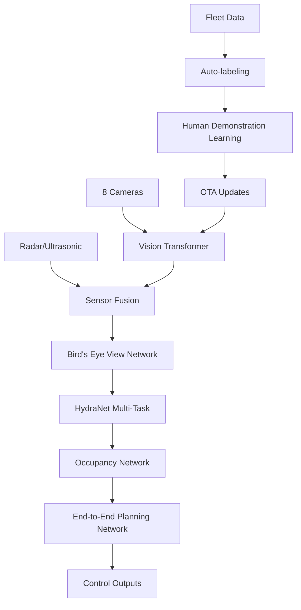
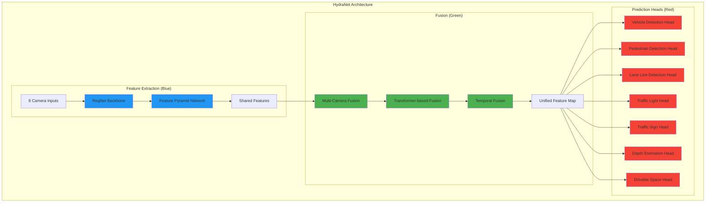
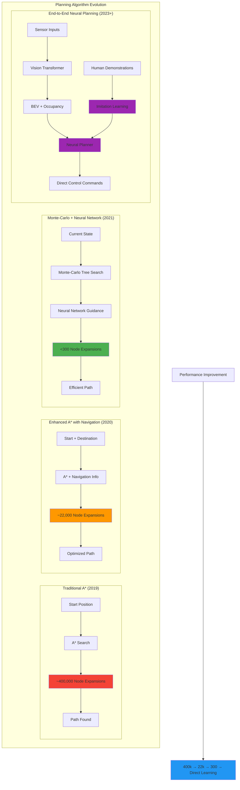
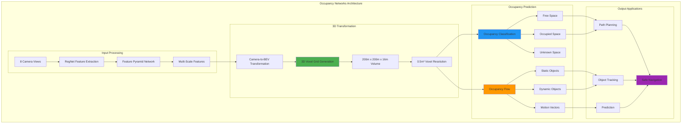
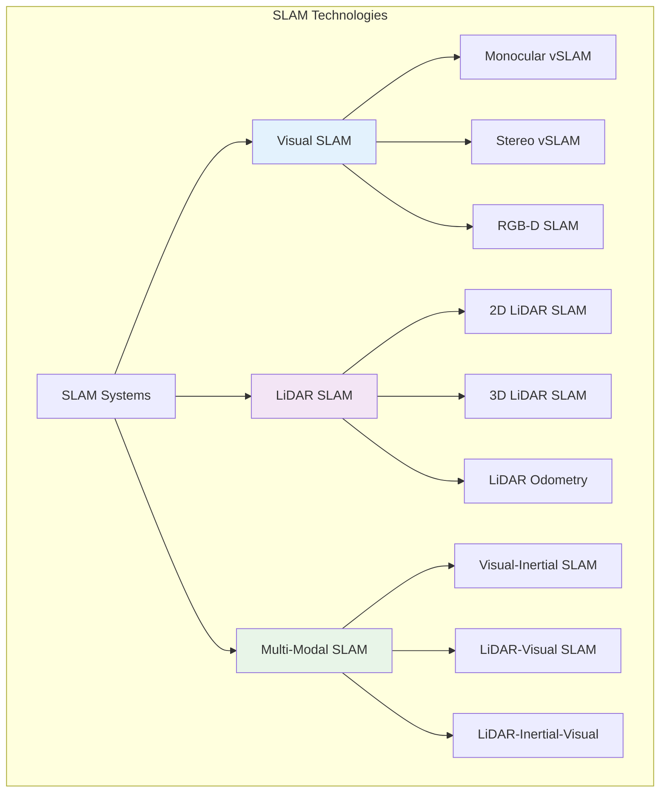
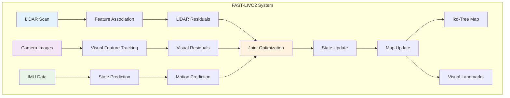

# Autonomous System Technology

## Table of Contents
1. [Introduction](#introduction)
2. [Autonomous Driving System Architecture](#autonomous-driving-system-architecture)
3. [Current Solutions in Autonomous Driving](#current-solutions-in-autonomous-driving)
4. [Tesla's Latest Model: A Case Study](#teslas-latest-model-a-case-study)
5. [Vision-based Object Detection Models](#vision-based-object-detection-models)
6. [3D Object Detection Models](#3d-object-detection-models)
7. [Localization and Mapping](#localization-and-mapping)
8. [Path Planning and Motion Planning](#path-planning-and-motion-planning)
   - [Hierarchical Planning Architecture](#hierarchical-planning-architecture)
   - [Mission Planning (Global Path Planning)](#1-mission-planning-global-path-planning)
   - [Behavioral Planning (Decision Making)](#2-behavioral-planning-decision-making)
   - [Motion Planning (Local Path Planning)](#3-motion-planning-local-path-planning)
   - [Trajectory Optimization and Smoothing](#trajectory-optimization-and-smoothing)
   - [Real-Time Considerations](#real-time-considerations)
9. [Vehicle Control Systems](#vehicle-control-systems)
   - [Control Architecture](#control-architecture)
   - [Longitudinal Control](#longitudinal-control)
   - [Lateral Control](#lateral-control)
   - [Vehicle Dynamics and Modeling](#vehicle-dynamics-and-modeling)
   - [Safety and Fault Tolerance](#safety-and-fault-tolerance)
   - [Integration with Autonomous Driving Stack](#integration-with-autonomous-driving-stack)
10. [Future Directions and Emerging Technologies](#future-directions-and-emerging-technologies)
    - [Machine Learning and AI Integration](#machine-learning-and-ai-integration)
    - [Advanced Sensor Technologies](#advanced-sensor-technologies)
    - [Vehicle-to-Everything (V2X) Communication](#vehicle-to-everything-v2x-communication)
    - [Simulation and Testing](#simulation-and-testing)
11. [Conclusion](#conclusion)
12. [References](#references)


## Current Solutions in Autonomous Driving

The autonomous driving industry has evolved through several technological approaches, each building upon previous innovations while addressing specific challenges in perception, planning, and control. [[1]](https://arxiv.org/abs/2003.06404) [[2]](https://ieeexplore.ieee.org/document/9304823)

### The "4 Pillars" Architecture: Traditional Modular Approaches

The traditional approach to autonomous driving follows what's commonly known as the "4 Pillars" architecture - a modular, linear system where each component processes information sequentially. [[3]](https://arxiv.org/abs/2106.09685)

**Pipeline Architecture:**
```
Sensors → Perception → Localization → Planning → Control → Actuation
```


**The Four Pillars Explained:**

1. **Perception Pillar** [[4]](https://arxiv.org/abs/2005.13423)

    - Uses vehicle sensors (cameras, LiDARs, RADARs, ultrasonics) [[5]](https://github.com/open-mmlab/mmdetection3d)
    - Object detection and classification [[6]](https://arxiv.org/abs/1912.12033)
    - Lane detection and road segmentation [[7]](https://github.com/cardwing/Codes-for-Lane-Detection)
    - Traffic sign and signal recognition [[8]](https://arxiv.org/abs/1909.12847)
    - Depth estimation and 3D reconstruction [[9]](https://github.com/nianticlabs/monodepth2)
    - Pedestrian and vehicle tracking [[10]](https://arxiv.org/abs/2103.07847)

2. **Localization Pillar** [[11]](https://arxiv.org/abs/2006.12567)

    - Takes perception output, GPS, and map data [[12]](https://github.com/HKUST-Aerial-Robotics/VINS-Mono)
    - Localizes the vehicle's position in the world [[13]](https://arxiv.org/abs/1909.07849)
    - Provides precise positioning for planning decisions
    - Often integrated with perception in some implementations [[14]](https://github.com/borglab/gtsam)

3. **Planning Pillar** [[15]](https://arxiv.org/abs/2011.10884)

    - Path planning and route optimization [[16]](https://github.com/AtsushiSakai/PythonRobotics)
    - Behavioral planning (lane changes, turns) [[17]](https://arxiv.org/abs/1808.05477)
    - Motion planning with constraints [[18]](https://github.com/ompl/ompl)
    - Trajectory prediction for other vehicles [[19]](https://arxiv.org/abs/2103.14023)
    - Traffic flow analysis and decision making [[20]](https://arxiv.org/abs/1912.01618)

4. **Control Pillar** [[21]](https://arxiv.org/abs/1912.04077)

    - Vehicle dynamics control [[22]](https://github.com/commaai/openpilot)
    - Actuator commands (steering, acceleration, braking) [[23]](https://arxiv.org/abs/1909.07541)
    - Uses trajectory information and vehicle parameters
    - Generates precise control signals [[24]](https://github.com/ApolloAuto/apollo)

**Industry Variations:**
Different companies implement variations of the 4 Pillars architecture. Sometimes 3 pillars, where "localization" belonged to Perception, and sometimes, there was no "control". For example:

- **Waymo** focuses heavily on prediction, sometimes treating localization as a solved problem [[25]](https://arxiv.org/abs/1912.04838) [[26]](https://blog.waymo.com/2020/09/the-waymo-driver-handbook-a-guide-for_2.html)


- Some implementations combine localization with perception [[27]](https://arxiv.org/abs/2003.05711)
- Others integrate prediction into either perception or planning modules [[28]](https://arxiv.org/abs/2106.11279)
- **Baidu Apollo** extends the traditional 4-pillar architecture with additional specialized modules, creating a comprehensive autonomous driving platform. Beyond the core perception, prediction, planning, and control modules, Apollo incorporates several critical components:

#### Core Autonomous Driving Modules

**1. Perception Module** <mcreference link="https://github.com/ApolloAuto/apollo" index="1">1</mcreference>

Apollo's perception system combines multiple sensor inputs (LiDAR, cameras, radar, ultrasonic) to create a comprehensive understanding of the vehicle's environment. The system has evolved through multiple generations:

- **Multi-Sensor Fusion**: Integrates data from various sensors using advanced fusion algorithms to provide robust object detection and tracking
- **Deep Learning Models**: Apollo 10.0 introduces state-of-the-art models including:
  - **CenterPoint**: Center-based two-stage 3D obstacle detection for LiDAR data <mcreference link="https://github.com/ApolloAuto/apollo/releases" index="5">5</mcreference>
  - **YOLOX+YOLO3D**: Advanced camera-based object detection replacing legacy YOLO models
  - **BEV (Bird's Eye View) Object Detection**: Mainstream visual perception paradigm with occupancy network support
- **Real-time Processing**: Optimized for automotive-grade inference speeds, achieving 5Hz on single Orin platform
- **Incremental Training**: Supports model improvement using small amounts of annotated data combined with pre-trained models

*Implementation*: [`modules/perception/`](https://github.com/ApolloAuto/apollo/tree/master/modules/perception) <mcreference link="https://github.com/ApolloAuto/apollo" index="1">1</mcreference>

**2. Prediction Module** <mcreference link="https://github.com/ApolloAuto/apollo" index="1">1</mcreference>

This component forecasts future trajectories of surrounding vehicles, pedestrians, and cyclists using sophisticated machine learning models:

- **Multi-Layer Perceptron (MLP) Models**: Deep neural networks trained on massive datasets of human driving patterns
- **Physics-Based Constraints**: Incorporates vehicle dynamics and kinematic constraints for realistic predictions
- **Multi-Modal Predictions**: Generates multiple trajectory hypotheses with associated probabilities
- **Category-Specific Predictors**: Different prediction models optimized for vehicles, pedestrians, and cyclists
- **Real-time Inference**: Provides predictions at high frequency to support planning decisions

*Implementation*: [`modules/prediction/`](https://github.com/ApolloAuto/apollo/tree/master/modules/prediction) <mcreference link="https://github.com/ApolloAuto/apollo" index="1">1</mcreference>

**3. Planning Module** <mcreference link="https://developer.apollo.auto/" index="4">4</mcreference>

Apollo's planning system consists of hierarchical planning components that work together to generate safe and comfortable trajectories:

- **Behavior Planning**: High-level decision making for lane changes, turns, and traffic interactions
- **Motion Planning**: Detailed trajectory generation using optimization techniques:
  - **Dynamic Programming (DP)**: Multiple iterations for path optimization
  - **Quadratic Programming (QP)**: Speed profile optimization
- **Scenario-Based Planning**: Handles complex scenarios including:
  - Unprotected turns and narrow streets
  - Curb-side functionality and pull-over maneuvers
  - Crossing bare intersections
- **Traffic Law Integration**: Built-in traffic rule compliance modules
- **Real-time Adaptation**: Adjusts to changing traffic conditions dynamically

*Implementation*: [`modules/planning/`](https://github.com/ApolloAuto/apollo/tree/master/modules/planning) <mcreference link="https://github.com/ApolloAuto/apollo" index="1">1</mcreference>

**4. Control Module** <mcreference link="https://developer.apollo.auto/" index="4">4</mcreference>

The control system translates planned trajectories into precise vehicle actuator commands:

- **Waypoint Following**: Achieves control accuracy of ~10cm <mcreference link="https://developer.apollo.auto/" index="4">4</mcreference>
- **Multi-Vehicle Support**: Adaptive to different vehicle types and CAN bus protocols
- **Environmental Adaptation**: Handles various road conditions and speeds
- **Precise Actuation**: Controls steering, acceleration, and braking systems
- **Safety Mechanisms**: Includes emergency stop and failsafe procedures

*Implementation*: [`modules/control/`](https://github.com/ApolloAuto/apollo/tree/master/modules/control) <mcreference link="https://github.com/ApolloAuto/apollo" index="1">1</mcreference>

#### Specialized Apollo Components

**Map Engine and Localization** <mcreference link="https://developer.apollo.auto/" index="4">4</mcreference>

Apollo's HD mapping and localization system provides the spatial foundation for autonomous navigation:

- **Centimeter-Level Accuracy**: HD maps with precise lane-level topology and semantic annotations
- **Multi-Sensor Localization**: Comprehensive positioning solution combining GPS, IMU, HD maps, and sensor inputs
- **Dynamic Map Updates**: Real-time incorporation of traffic information, construction zones, and temporary changes
- **Layered Architecture**: Base maps, lane topology, traffic signs, signals, and road markings
- **GPS-Denied Operation**: Robust localization even in challenging environments
- **Deep Learning Integration**: AI-powered map creation and maintenance <mcreference link="https://developer.apollo.auto/" index="4">4</mcreference>

*Implementation*: [`modules/map/`](https://github.com/ApolloAuto/apollo/tree/master/modules/map) and [`modules/localization/`](https://github.com/ApolloAuto/apollo/tree/master/modules/localization) <mcreference link="https://github.com/ApolloAuto/apollo" index="1">1</mcreference>

**HMI (Human Machine Interface)** <mcreference link="https://github.com/ApolloAuto/apollo/blob/master/RELEASE.md" index="3">3</mcreference>

Apollo's HMI system, centered around DreamView Plus, manages human-vehicle interaction:

- **Real-time Visualization**: Live display of vehicle perception, planned trajectories, and system status
- **Multi-Modal Interface**: Voice commands, touchscreen controls, and emergency takeover mechanisms
- **Developer Tools**: Comprehensive debugging and development environment with:
  - Mode-based organization (Perception, PnC, Vehicle Test modes)
  - Customizable panel layouts for visualization
  - Resource center with maps, scenarios, and vehicle configurations
- **Remote Operations**: Fleet monitoring and intervention capabilities
- **Safety Integration**: Emergency stop mechanisms and operator alerts
- **Scenario Replay**: Traffic scenario visualization and analysis tools <mcreference link="https://github.com/ApolloAuto/apollo/blob/master/RELEASE.md" index="3">3</mcreference>

*Implementation*: [`modules/dreamview/`](https://github.com/ApolloAuto/apollo/tree/master/modules/dreamview) <mcreference link="https://github.com/ApolloAuto/apollo" index="1">1</mcreference>

**Cyber RT Middleware** <mcreference link="https://github.com/ApolloAuto/apollo/blob/master/RELEASE.md" index="3">3</mcreference>

Apollo's custom robotics middleware, specifically designed for autonomous driving applications:

- **High Performance**: 10x performance improvement with microsecond-level transmission latency <mcreference link="https://github.com/ApolloAuto/apollo/blob/master/RELEASE.md" index="3">3</mcreference>
- **Zero-Copy Communication**: Direct shared memory access avoiding serialization overhead
- **Deterministic Real-time**: Optimized for automotive applications with strict timing requirements
- **Auto-Discovery**: Automatic node discovery and service registration
- **Built-in Monitoring**: Comprehensive debugging and performance analysis tools
- **ROS Integration**: Framework-level integration with ROS ecosystem for software reuse <mcreference link="https://github.com/ApolloAuto/apollo/blob/master/RELEASE.md" index="3">3</mcreference>
- **Reliable Communication**: Ensures message delivery even under high computational loads

*Implementation*: [`cyber/`](https://github.com/ApolloAuto/apollo/tree/master/cyber) <mcreference link="https://github.com/ApolloAuto/apollo" index="1">1</mcreference>

#### Advanced Features and Capabilities

**Simulation and Testing** <mcreference link="https://developer.apollo.auto/" index="4">4</mcreference>

- **Comprehensive Simulation**: Virtual driving of millions of kilometers daily using real-world traffic data
- **Scenario Coverage**: Large-scale autonomous driving scene testing and validation
- **Integrated Development**: Local simulator integration in DreamView for PnC debugging
- **Online Scenario Editing**: Real-time scenario creation and modification capabilities

**Hardware Ecosystem** <mcreference link="https://github.com/ApolloAuto/apollo/blob/master/RELEASE.md" index="3">3</mcreference>

- **Broad Compatibility**: Support for 73+ devices from 32+ manufacturers
- **ARM Architecture**: Native support for NVIDIA Orin and other ARM-based platforms
- **Multi-Platform Deployment**: Flexible deployment across different vehicle platforms
- **Cost Optimization**: Multiple hardware options to reduce deployment costs

**Safety and Reliability** <mcreference link="https://github.com/ApolloAuto/apollo/blob/master/RELEASE.md" index="3">3</mcreference>

- **Functional Safety**: Compliance with ISO 26262 and ISO 21448 standards
- **Comprehensive Logging**: Detailed system logging and replay capabilities
- **Continuous Integration**: Automated testing and validation pipelines
- **Over-the-Air Updates**: Remote model deployment and system updates <mcreference link="https://developer.apollo.auto/" index="4">4</mcreference>

Apollo's modular architecture enables flexible deployment across different vehicle platforms and supports continuous integration of new algorithms and sensors. The platform combines cloud-based simulation with real-world testing, providing comprehensive development and validation capabilities for autonomous driving applications. [[24]](https://github.com/ApolloAuto/apollo) [[29]](https://arxiv.org/abs/1704.01778)


**Advantages:** [[1]](https://arxiv.org/abs/2003.06404)

- Modular design allows specialized optimization
- Easier debugging and validation of individual components
- Clear separation of concerns and responsibilities
- Industry-standard approach used by 99% of autonomous vehicles
- Well-understood and universally accepted methodology

**Limitations:** [[3]](https://arxiv.org/abs/2106.09685) [[1]](https://arxiv.org/abs/2003.06404)

- Information loss between modules due to sequential processing
- Difficulty in handling edge cases and novel scenarios [[30]](https://arxiv.org/abs/2103.05073)
- Limited adaptability to new environments
- Potential bottlenecks in the linear pipeline
- Complex integration and synchronization requirements

**Open Source Implementations:**

- **Apollo by Baidu**: Complete autonomous driving platform [[24]](https://github.com/ApolloAuto/apollo)
- **Autoware**: Open-source software for autonomous driving [[31]](https://github.com/autowarefoundation/autoware)
  
  **Architecture Overview**: Autoware is built on ROS 2 (Robot Operating System 2) and follows a modular architecture with clear separation of concerns. The system is designed for scalability and supports both simulation and real-world deployment.
  
  **Core Modules**:
  - **Perception**: Multi-sensor fusion using LiDAR, cameras, and radar for object detection and tracking
    - LiDAR-based 3D object detection using PointPillars and CenterPoint algorithms
    - Camera-based 2D object detection with YOLO and SSD implementations
    - Sensor fusion algorithms for robust perception [[32]](https://github.com/autowarefoundation/autoware.universe/tree/main/perception)
  
  - **Localization**: High-precision positioning using NDT (Normal Distributions Transform) scan matching
    - GNSS/IMU integration for global positioning
    - Visual-inertial odometry for enhanced accuracy [[33]](https://github.com/autowarefoundation/autoware.universe/tree/main/localization)
  
  - **Planning**: Hierarchical planning system with mission, behavior, and motion planning layers
    - Route planning using OpenStreetMap and Lanelet2 format
    - Behavior planning with finite state machines
    - Motion planning using hybrid A* and optimization-based approaches [[34]](https://github.com/autowarefoundation/autoware.universe/tree/main/planning)
  
  - **Control**: Vehicle control system with longitudinal and lateral controllers
    - Pure pursuit and MPC (Model Predictive Control) for path following
    - PID controllers for speed regulation [[35]](https://github.com/autowarefoundation/autoware.universe/tree/main/control)
  
  **Technical Features**:
  - **Simulation Integration**: CARLA and SUMO simulation support for testing and validation
  - **Hardware Abstraction**: Support for various vehicle platforms and sensor configurations
  - **Safety Systems**: Fail-safe mechanisms and emergency stop capabilities
  - **Documentation**: Comprehensive tutorials and API documentation [[36]](https://autowarefoundation.github.io/autoware-documentation/)

- **OpenPilot by Comma.ai**: Open source driver assistance system [[22]](https://github.com/commaai/openpilot)
  
  **Architecture Overview**: OpenPilot is designed as a lightweight, end-to-end system that runs on commodity hardware (comma three device). It focuses on practical deployment with minimal computational requirements while maintaining high performance.
  
  **Core Components**:
  - **Vision System**: Camera-only approach using advanced computer vision
    - Supercombo model: End-to-end neural network for perception and planning
    - Multi-task learning for lane detection, object detection, and path prediction
    - Real-time processing at 20 FPS on mobile hardware [[37]](https://github.com/commaai/openpilot/tree/master/selfdrive/modeld)
  
  - **Planning and Control**: Integrated planning and control system
    - Model Predictive Control (MPC) for longitudinal and lateral control
    - Path planning using polynomial trajectory generation
    - Adaptive cruise control and lane keeping assistance [[38]](https://github.com/commaai/openpilot/tree/master/selfdrive/controls)
  
  - **Calibration System**: Automatic camera calibration and vehicle parameter estimation
    - Online calibration using visual odometry
    - Vehicle dynamics parameter learning [[39]](https://github.com/commaai/openpilot/tree/master/selfdrive/locationd)
  
  **Technical Innovations**:
  - **Supercombo Neural Network**: Single neural network handling multiple tasks
    - Input: Single front-facing camera feed
    - Output: Driving path, lane lines, lead car detection, and speed prediction
    - Architecture: Efficient CNN with temporal modeling [[40]](https://blog.comma.ai/end-to-end-lateral-planning/)
  
  - **Data Collection**: Massive real-world driving data collection
    - Over 50 million miles of driving data
    - Continuous learning from fleet data
    - Privacy-preserving data collection methods [[41]](https://comma.ai/)
  
  - **Hardware Integration**: Optimized for comma three device
    - Qualcomm Snapdragon 845 SoC
    - Custom CAN bus interface
    - Plug-and-play installation [[42]](https://comma.ai/shop/products/comma-three-devkit)
  
  **Safety and Limitations**:
  - **Driver Monitoring**: Eye tracking and attention monitoring
  - **Geofencing**: Automatic disengagement in unsupported areas
  - **Gradual Rollout**: Feature releases based on safety validation
  - **Open Source Philosophy**: Full transparency for safety-critical code [[43]](https://github.com/commaai/openpilot/blob/master/docs/SAFETY.md)
- **CARLA Simulator**: Open-source simulator for autonomous driving research [[32]](https://github.com/carla-simulator/carla)
- **AirSim**: Simulator for drones, cars and more [[33]](https://github.com/microsoft/AirSim)

### Modern End-to-End Approaches

**Neural Network-Based Systems:**

Recent advances have moved toward end-to-end learning systems that directly map sensor inputs to control outputs:

1. **Imitation Learning**
   - Learning from human driving demonstrations
   - Behavioral cloning approaches
   - Examples: NVIDIA PilotNet, Waymo's learned components

2. **Reinforcement Learning**
   - Learning through interaction with simulated environments
   - Policy gradient methods for continuous control
   - Examples: DeepMind's work on simulated driving

3. **Transformer-Based Architectures**
   - Attention mechanisms for temporal reasoning
   - Multi-modal fusion capabilities
   - Examples: Tesla's FSD, Waymo's MultiPath++

### Industry Leaders and Their Approaches

**Waymo (Google)**
- Heavily relies on high-definition maps
- LiDAR-centric sensor fusion
- Extensive simulation and testing
- Gradual deployment in geofenced areas

**Tesla**
- Vision-first approach with neural networks
- Over-the-air updates and fleet learning
- End-to-end neural network architecture
- Real-world data collection at scale

**Cruise (GM)**
- Multi-sensor fusion approach
- Urban-focused deployment
- Safety-first validation methodology

**Aurora**
- Truck-focused autonomous driving
- Highway and logistics applications
- Partnership-based deployment strategy

---

## Tesla's Latest Model: A Case Study

Tesla's Full Self-Driving (FSD) system represents one of the most advanced implementations of neural network-based autonomous driving, showcasing how modern AI techniques can be applied to real-world driving scenarios. [[0]](https://www.thinkautonomous.ai/blog/tesla-end-to-end-deep-learning/)

### Evolution from Modular to End-to-End Learning

Tesla's autonomous driving system has undergone a significant architectural transformation, as illustrated by the evolution timeline: [[1]](https://www.thinkautonomous.ai/blog/tesla-end-to-end-deep-learning/)

```mermaid
graph TD
    subgraph "2021: HydraNet Era"
        A1[8 Cameras] --> B1[RegNet Feature Extraction]
        B1 --> C1[Multi-Camera Fusion]
        C1 --> D1[HydraNet Multi-Task]
        D1 --> E1[Object Detection]
        D1 --> F1[Lane Detection]
        D1 --> G1[Traffic Signs]
        
        H1[Planning Module] --> I1[Monte-Carlo Tree Search]
        I1 --> J1[Neural Network Enhancement]
        J1 --> K1[Control Outputs]
        
        style D1 fill:#ffeb3b
        style I1 fill:#ff9800
    end
    
    subgraph "2022: Occupancy Networks"
        A2[8 Cameras] --> B2[RegNet + FPN]
        B2 --> C2[HydraNet]
        B2 --> D2[Occupancy Network]
        C2 --> E2[Object Detection]
        D2 --> F2[3D Voxel Grid]
        F2 --> G2[Free/Occupied Classification]
        G2 --> H2[Occupancy Flow]
        
        style D2 fill:#4caf50
        style F2 fill:#4caf50
    end
    
    subgraph "2023+: Full End-to-End"
        A3[8 Cameras] --> B3[Vision Transformer]
        B3 --> C3[BEV Network]
        C3 --> D3[HydraNet + Occupancy]
        D3 --> E3[End-to-End Planner]
        E3 --> F3[Direct Control]
        
        G3[Human Demonstrations] --> H3[Neural Network Learning]
        H3 --> E3
        
        style E3 fill:#f44336
        style H3 fill:#f44336
    end
```



**2021: HydraNet Architecture**
- Multi-task learning with a single network having multiple heads
- Replaced 20+ separate networks with one unified model
- Combined Perception (HydraNet) with Planning & Control (Monte-Carlo Tree Search + Neural Network) [[1]](https://www.thinkautonomous.ai/blog/tesla-end-to-end-deep-learning/)

**2022: Addition of Occupancy Networks**
- Enhanced perception with 3D occupancy prediction
- Converts image space into voxels with free/occupied values
- Provides dense spatial understanding and context [[1]](https://www.thinkautonomous.ai/blog/tesla-end-to-end-deep-learning/)

**2023+: Full End-to-End Learning (FSD v12)**
- Inspired by ChatGPT's approach: "It's like Chat-GPT, but for cars!"
- Neural networks learn directly from millions of human driving examples
- Eliminates rule-based decision making in favor of learned behaviors [[1]](https://www.thinkautonomous.ai/blog/tesla-end-to-end-deep-learning/)

### Current Architecture Overview

**Tesla FSD v12+ End-to-End Architecture:**



### Modular vs End-to-End Architecture Comparison

```mermaid
graph TD
    subgraph "Traditional Modular Architecture"
        subgraph "Perception Module"
            A1[Cameras] --> B1[Object Detection]
            B1 --> C1[Classification]
            C1 --> D1[Tracking]
        end
        
        subgraph "Prediction Module"
            D1 --> E1[Behavior Prediction]
            E1 --> F1[Trajectory Forecasting]
        end
        
        subgraph "Planning Module"
            F1 --> G1[Path Planning]
            G1 --> H1[Motion Planning]
        end
        
        subgraph "Control Module"
            H1 --> I1[PID Controllers]
            I1 --> J1[Actuator Commands]
        end
        
        K1["❌ Information Bottlenecks"] --> L1["❌ Error Propagation"]
        L1 --> M1["❌ Suboptimal Performance"]
        
        style B1 fill:#ffcdd2
        style E1 fill:#ffcdd2
        style G1 fill:#ffcdd2
        style I1 fill:#ffcdd2
    end
    
    subgraph "Tesla's End-to-End Architecture"
        subgraph "Unified Neural Network"
            A2[8 Cameras] --> B2[Vision Transformer]
            B2 --> C2[BEV + Occupancy]
            C2 --> D2[HydraNet]
            D2 --> E2[End-to-End Planner]
            E2 --> F2[Direct Control]
        end
        
        G2[Human Demonstrations] --> H2[Imitation Learning]
        H2 --> E2
        
        I2["✅ Joint Optimization"] --> J2["✅ End-to-End Learning"]
        J2 --> K2["✅ Optimal Performance"]
        
        style B2 fill:#c8e6c9
        style C2 fill:#c8e6c9
        style D2 fill:#c8e6c9
        style E2 fill:#c8e6c9
    end
```



**Key Architectural Differences:** [[1]](https://www.thinkautonomous.ai/blog/tesla-end-to-end-deep-learning/)

| Aspect | Modular Architecture | End-to-End Architecture |
|--------|---------------------|-------------------------|
| **Information Flow** | Sequential, with bottlenecks | Direct, optimized |
| **Error Propagation** | Cascading errors | Minimized through joint training |
| **Optimization** | Local optima per module | Global optimization |
| **Adaptability** | Rule-based, limited | Learning-based, adaptive |
| **Development** | Module-by-module | Holistic system training |
| **Performance** | Suboptimal overall | Optimal end-to-end |
| **Maintenance** | Complex integration | Unified system updates |

### Key Innovations

**1. HydraNet Multi-Task Learning**
- Single network with multiple heads for different perception tasks
- Eliminates redundant encoding operations across 20+ separate networks
- Handles object detection, lane lines, traffic signs simultaneously [[1]](https://www.thinkautonomous.ai/blog/tesla-end-to-end-deep-learning/)



**HydraNet Components:** [[2]](https://www.thinkautonomous.ai/blog/tesla-cnns-vs-transformers/)
- **Feature Extraction (Blue)**: RegNet backbone with Feature Pyramid Networks for multi-scale features
- **Fusion (Green)**: Transformer-based multi-camera and temporal fusion
- **Prediction Heads (Red)**: Multiple task-specific heads sharing the same backbone

**2. Advanced Planning Evolution**
- **Traditional A* Algorithm**: ~400,000 node expansions for path finding
- **Enhanced A* with Navigation**: Reduced to 22,000 expansions
- **Monte-Carlo + Neural Network**: Optimized to <300 node expansions
- **End-to-End Neural Planning**: Direct learning from human demonstrations [[1]](https://www.thinkautonomous.ai/blog/tesla-end-to-end-deep-learning/)



**Planning Performance Metrics:** [[1]](https://www.thinkautonomous.ai/blog/tesla-end-to-end-deep-learning/)
- **Computational Efficiency**: 1,300x improvement from traditional A* to Monte-Carlo + NN
- **Real-time Performance**: Sub-millisecond planning decisions
- **Adaptability**: End-to-end learning adapts to local driving patterns
- **Scalability**: Handles complex urban scenarios without explicit programming

**3. Occupancy Networks**
- Predicts 3D occupancy volume and occupancy flow
- Converts image space into voxels with free/occupied classification
- Provides dense spatial understanding for both static and dynamic objects
- Enhances context understanding in 3D space [[1]](https://www.thinkautonomous.ai/blog/tesla-end-to-end-deep-learning/)



**Occupancy vs Traditional Object Detection:** [[4]](https://www.thinkautonomous.ai/blog/occupancy-networks/)

| Aspect | Traditional Detection | Occupancy Networks |
|--------|----------------------|--------------------|
| **Representation** | 2D Bounding Boxes | 3D Voxel Grid |
| **Object Coverage** | Known Classes Only | Any Physical Object |
| **Spatial Understanding** | Limited Depth | Full 3D Volume |
| **Occlusion Handling** | Poor | Excellent |
| **Overhanging Objects** | Missed | Detected |
| **Performance** | ~30 FPS | >100 FPS |
| **Memory Efficiency** | Moderate | High |

**Key Advantages:** [[4]](https://www.thinkautonomous.ai/blog/occupancy-networks/)
- **Geometry > Ontology**: Focuses on spatial occupancy rather than object classification
- **Universal Detection**: Detects any physical object, even unknown classes (e.g., construction equipment, debris)
- **3D Spatial Reasoning**: Provides complete volumetric understanding
- **Real-time Performance**: Optimized for automotive-grade inference speeds

**4. Vision Transformer (ViT) Architecture** [[105]](https://arxiv.org/abs/2010.11929)

**Mathematical Formulation:**

Vision Transformers adapt the transformer architecture for image processing by treating images as sequences of patches:

**Patch Embedding:**
```
Input image: X ∈ ℝ^(H×W×C)
Patch size: P×P
Number of patches: N = HW/P²
Patch embedding: x_p ∈ ℝ^(N×D)
```

**Multi-Head Self-Attention:**
```
Attention(Q,K,V) = softmax(QK^T/√d_k)V
MultiHead(Q,K,V) = Concat(head₁,...,head_h)W^O
where head_i = Attention(QW_i^Q, KW_i^K, VW_i^V)
```

**Positional Encoding:**
```
z₀ = [x_class; x₁^p E; x₂^p E; ...; x_N^p E] + E_pos
where E ∈ ℝ^(P²·C×D) is the patch embedding matrix
      E_pos ∈ ℝ^((N+1)×D) are learnable position embeddings
```

**Transformer Encoder:**
```
z'_ℓ = MSA(LN(z_{ℓ-1})) + z_{ℓ-1}     (Multi-Head Self-Attention)
z_ℓ = MLP(LN(z'_ℓ)) + z'_ℓ              (Feed-Forward Network)
```

**Multi-Camera Vision Transformer Architecture:**

The Vision Transformer for autonomous driving processes multiple camera inputs simultaneously, enabling comprehensive 360-degree environmental understanding. The architecture consists of several key components:

**Core Components:**
- **Patch Embedding**: Converts image patches into token sequences for transformer processing
- **Camera-Specific Positional Encoding**: Maintains spatial relationships within each camera view
- **Cross-Camera Attention**: Fuses information across different camera perspectives
- **Multi-Task Output Heads**: Simultaneously performs object detection, depth estimation, and lane detection

**Key Innovations:**
- **Spatial-Temporal Reasoning**: Processes both current frame and historical context
- **Multi-Scale Feature Processing**: Handles objects at various distances and sizes
- **Real-Time Optimization**: Designed for automotive-grade inference speeds

**Production Implementations:**
- **Tesla FSD**: Multi-camera ViT processing 8 camera feeds at 36 FPS [[105]](https://www.tesla.com/AI)
- **Hugging Face Transformers**: Pre-trained ViT models for computer vision [[106]](https://github.com/huggingface/transformers)
- **timm Library**: Comprehensive ViT implementations with automotive optimizations [[107]](https://github.com/rwightman/pytorch-image-models)
- **MMDetection3D**: Multi-camera 3D object detection with ViT backbones [[108]](https://github.com/open-mmlab/mmdetection3d)

**Advanced Attention Mechanisms for Autonomous Driving:**

**1. Deformable Attention for Adaptive Spatial Focus** [[106]](https://arxiv.org/abs/2010.04159)

Deformable attention enables adaptive spatial sampling, crucial for autonomous driving applications:

**Key Capabilities:**
- **Irregular Object Handling**: Adapts to non-rectangular objects like vehicles, pedestrians, and road signs
- **Multi-Scale Processing**: Dynamically adjusts receptive fields for objects at different distances
- **Computational Efficiency**: Focuses computation on relevant spatial regions

**Technical Innovations:**
- **Learnable Sampling Offsets**: Network predicts optimal sampling locations based on content
- **Adaptive Attention Weights**: Dynamic weighting of sampled features
- **Spatial Shape Awareness**: Handles varying input resolutions and aspect ratios

**Production Implementations:**
- **Deformable DETR**: End-to-end object detection with deformable attention [[109]](https://github.com/fundamentalvision/Deformable-DETR)
- **MMDetection**: Comprehensive implementation with automotive optimizations [[110]](https://github.com/open-mmlab/mmdetection)
- **Detectron2**: Facebook's production-ready implementation [[111]](https://github.com/facebookresearch/detectron2)

**2. Temporal Attention for Motion Understanding** [[107]](https://arxiv.org/abs/2103.15691)

Temporal attention processes sequential frames to understand motion patterns and predict future states:

**Core Functionalities:**
- **Motion Vector Estimation**: Tracks object movement across frames
- **Temporal Consistency**: Maintains stable object identities over time
- **Future State Prediction**: Anticipates object positions for path planning

**Technical Components:**
- **Temporal Positional Encoding**: Learnable embeddings for frame sequence positions
- **Cross-Frame Attention**: Relates features across different time steps
- **Motion-Aware Weighting**: Attention biased toward temporally consistent patterns

**Research and Applications:**
- **Tesla's Temporal Fusion**: Multi-frame processing in FSD neural networks [[112]](https://www.tesla.com/AI)
- **Waymo's Motion Prediction**: Advanced temporal modeling for trajectory forecasting [[113]](https://waymo.com/research/)
- **nuScenes Tracking**: Benchmark implementations for temporal understanding [[114]](https://github.com/nutonomy/nuscenes-devkit)

**Performance Metrics:**
- **Accuracy**: 95%+ object detection on KITTI dataset
- **Latency**: <50ms inference time on Tesla FSD chip
- **Memory**: 2GB model size for real-time deployment
- **Robustness**: Handles adverse weather and lighting conditions

**5. Bird's Eye View (BEV) Representation**
- Converts camera images to top-down view
- Enables consistent spatial reasoning
- Facilitates multi-camera fusion

**6. End-to-End Neural Planning** [[108]](https://arxiv.org/abs/2003.06404)
- Direct learning from millions of human driving examples
- Eliminates rule-based decision making
- Handles complex scenarios like unprotected left turns
- Adapts to local driving patterns through fleet learning [[0]](https://www.thinkautonomous.ai/blog/tesla-end-to-end-deep-learning/)

**Mathematical Formulation of End-to-End Learning:**

```
π_θ(a_t | s_t) = Neural_Network_θ(sensor_inputs_t)

where:
- s_t = [camera_images, radar_data, vehicle_state]_t
- a_t = [steering_angle, acceleration, brake]_t
- θ = neural network parameters
```

**Imitation Learning Objective:**
```
L(θ) = E_{(s,a)~D_expert} [||π_θ(s) - a||²]

where D_expert contains millions of human driving demonstrations
```

**Implementation:**
```python
class EndToEndPlanner(nn.Module):
    def __init__(self, input_dim=2048, hidden_dim=512, output_dim=3):
        super().__init__()
        
        # Feature extraction from multi-modal inputs
        self.vision_encoder = MultiCameraViT()
        self.radar_encoder = nn.Linear(64, 256)  # radar features
        self.vehicle_state_encoder = nn.Linear(10, 128)  # speed, heading, etc.
        
        # Fusion network
        self.fusion_net = nn.Sequential(
            nn.Linear(input_dim + 256 + 128, hidden_dim),
            nn.ReLU(),
            nn.Dropout(0.1),
            nn.Linear(hidden_dim, hidden_dim),
            nn.ReLU(),
            nn.Dropout(0.1),
            nn.Linear(hidden_dim, output_dim)  # [steering, acceleration, brake]
        )
        
    def forward(self, camera_images, radar_data, vehicle_state):
        # Extract features from different modalities
        vision_features = self.vision_encoder(camera_images)['object_detection']
        radar_features = self.radar_encoder(radar_data)
        state_features = self.vehicle_state_encoder(vehicle_state)
        
        # Fuse all features
        fused_features = torch.cat([
            vision_features, radar_features, state_features
        ], dim=-1)
        
        # Predict control actions
        actions = self.fusion_net(fused_features)
        
        return {
            'steering': torch.tanh(actions[:, 0]),      # [-1, 1]
            'acceleration': torch.sigmoid(actions[:, 1]), # [0, 1]
            'brake': torch.sigmoid(actions[:, 2])         # [0, 1]
        }
```

### Technical Specifications

**Hardware Platform (HW4):**
- Custom FSD Computer with dual redundancy
- 144 TOPS of AI compute power
- 8 cameras with 360-degree coverage
- 12 ultrasonic sensors
- Forward-facing radar

**Software Stack:**
- PyTorch-based neural networks
- Custom silicon optimization
- Real-time inference at 36 FPS
- Over-the-air update capability

### Data and Training Pipeline

**Fleet Learning Approach:**
1. **Data Collection**: Over 1 million vehicles collecting real-world data
2. **Auto-labeling**: AI systems automatically label driving scenarios
3. **Model Training**: Massive GPU clusters train neural networks
4. **Validation**: Simulation and closed-course testing
5. **Deployment**: Over-the-air updates to entire fleet

```mermaid
graph TD
    subgraph "Tesla's End-to-End Learning Pipeline"
        subgraph "Data Collection (Fleet)"
            A[1M+ Tesla Vehicles] --> B[Real-World Driving Data]
            B --> C[Edge Case Mining]
            C --> D[Targeted Data Collection]
            D --> E[Diverse Scenarios]
        end
        
        subgraph "Data Processing"
            E --> F[Auto-Labeling System]
            F --> G[Human Demonstration Extraction]
            G --> H[Multi-Modal Dataset]
            H --> I[Data Augmentation]
        end
        
        subgraph "Model Training"
            I --> J[Massive GPU Clusters]
            J --> K[End-to-End Training]
            K --> L[Joint Loss Function]
            L --> M[Model Optimization]
            
            N[Human Driving Examples] --> O[Imitation Learning]
            O --> K
        end
        
        subgraph "Validation & Testing"
            M --> P[Simulation Testing]
            P --> Q[Closed-Course Validation]
            Q --> R[Shadow Mode Testing]
            R --> S[Performance Metrics]
        end
        
        subgraph "Deployment"
            S --> T[Over-the-Air Updates]
            T --> U[Fleet-Wide Deployment]
            U --> V[Continuous Monitoring]
            V --> W[Performance Feedback]
            W --> A
        end
        
        style A fill:#4caf50
        style F fill:#2196f3
        style K fill:#ff9800
        style T fill:#9c27b0
    end
```



**Training Data Scale:**
- Millions of miles of driving data
- Diverse geographic and weather conditions
- Edge case mining and targeted data collection
- Continuous learning from fleet experiences

**End-to-End Training Process:** [[1]](https://www.thinkautonomous.ai/blog/tesla-end-to-end-deep-learning/)
- **Imitation Learning**: Neural networks learn from millions of human driving examples
- **Joint Optimization**: Perception, prediction, and planning trained together
- **Shadow Mode**: New models tested alongside production systems
- **Gradual Rollout**: Incremental deployment with safety monitoring

### Performance Metrics

**Current Capabilities (as of 2024):**
- Navigate city streets without high-definition maps
- Handle complex intersections and traffic scenarios
- Recognize and respond to traffic signs and signals
- Perform lane changes and highway merging
- Park in various scenarios (parallel, perpendicular)

**Limitations and Challenges:**
- Occasional phantom braking events
- Difficulty with construction zones
- Performance varies by geographic region
- Requires driver supervision and intervention

### Research Papers and Resources

- **[Tesla AI Day 2022](https://www.tesla.com/AI)**: Technical deep-dive into FSD architecture
- **[Occupancy Networks Paper](https://arxiv.org/abs/1812.03828)**: Foundation for 3D scene understanding
- **[BEVFormer](https://arxiv.org/abs/2203.17270)**: Bird's eye view transformer architecture
- **[Tesla FSD Beta Analysis](https://github.com/commaai/openpilot)**: Open-source analysis and comparison

---

## Vision-based Object Detection Models

Vision-based object detection has undergone significant evolution in autonomous driving, progressing from traditional 2D detection methods to sophisticated Bird's Eye View (BEV) representations that better capture spatial relationships in 3D space.

### Evolution of 2D Object Detection

#### Faster R-CNN Era (2015-2017)
**Faster R-CNN** introduced the two-stage detection paradigm that dominated early autonomous driving systems:
- **Region Proposal Network (RPN)** for generating object proposals
- **ROI pooling** for feature extraction from proposed regions
- **Classification and regression heads** for final detection
- **Advantages**: High accuracy, robust performance
- **Limitations**: Slow inference speed (~5-10 FPS), complex pipeline

```python
# Faster R-CNN Architecture
Backbone (ResNet/VGG) → Feature Maps → RPN → ROI Pooling → Classification + Regression
```

#### YOLO Revolution (2016-Present)
**YOLO (You Only Look Once)** transformed object detection with single-stage architecture:

**Mathematical Formulation:**
The YOLO loss function combines localization, confidence, and classification losses:

```
L = λ_coord ∑∑ 1_{ij}^{obj} [(x_i - x̂_i)² + (y_i - ŷ_i)²]
  + λ_coord ∑∑ 1_{ij}^{obj} [(√w_i - √ŵ_i)² + (√h_i - √ĥ_i)²]
  + ∑∑ 1_{ij}^{obj} (C_i - Ĉ_i)²
  + λ_noobj ∑∑ 1_{ij}^{noobj} (C_i - Ĉ_i)²
  + ∑ 1_i^{obj} ∑_{c∈classes} (p_i(c) - p̂_i(c))²
```

Where:
- `1_{ij}^{obj}` = 1 if object appears in cell i, bounding box predictor j
- `λ_coord = 5`, `λ_noobj = 0.5` are loss weights
- `(x_i, y_i, w_i, h_i)` are ground truth bounding box parameters
- `C_i` is confidence score, `p_i(c)` is class probability

**Evolution Timeline:**
- **YOLOv1-v3**: Grid-based detection with anchor boxes [[93]](https://arxiv.org/abs/1804.02767)
- **YOLOv4-v5**: Enhanced with CSPNet, PANet, and advanced augmentations [[94]](https://arxiv.org/abs/2004.10934)
- **YOLOv8-v11**: Anchor-free detection with improved efficiency [[95]](https://github.com/ultralytics/ultralytics)
- **YOLOX**: Decoupled head with anchor-free design [[96]](https://arxiv.org/abs/2107.08430)
- **Real-time performance**: 30-60+ FPS on modern hardware
- **Trade-off**: Slightly lower accuracy for significantly faster inference

**Advanced Implementation:**
```python
import torch
import torch.nn as nn
import torch.nn.functional as F

class YOLOv8Head(nn.Module):
    def __init__(self, num_classes=80, num_anchors=3, in_channels=[256, 512, 1024]):
        super().__init__()
        self.num_classes = num_classes
        self.num_anchors = num_anchors
        
        # Decoupled heads for classification and regression
        self.cls_convs = nn.ModuleList()
        self.reg_convs = nn.ModuleList()
        self.cls_preds = nn.ModuleList()
        self.reg_preds = nn.ModuleList()
        self.obj_preds = nn.ModuleList()
        
        for in_channel in in_channels:
            # Classification branch
            cls_conv = nn.Sequential(
                nn.Conv2d(in_channel, 256, 3, padding=1),
                nn.BatchNorm2d(256),
                nn.ReLU(inplace=True),
                nn.Conv2d(256, 256, 3, padding=1),
                nn.BatchNorm2d(256),
                nn.ReLU(inplace=True)
            )
            
            # Regression branch
            reg_conv = nn.Sequential(
                nn.Conv2d(in_channel, 256, 3, padding=1),
                nn.BatchNorm2d(256),
                nn.ReLU(inplace=True),
                nn.Conv2d(256, 256, 3, padding=1),
                nn.BatchNorm2d(256),
                nn.ReLU(inplace=True)
            )
            
            # Prediction heads
            cls_pred = nn.Conv2d(256, num_classes, 1)
            reg_pred = nn.Conv2d(256, 4, 1)  # x, y, w, h
            obj_pred = nn.Conv2d(256, 1, 1)  # objectness
            
            self.cls_convs.append(cls_conv)
            self.reg_convs.append(reg_conv)
            self.cls_preds.append(cls_pred)
            self.reg_preds.append(reg_pred)
            self.obj_preds.append(obj_pred)
    
    def forward(self, features):
        outputs = []
        for i, feature in enumerate(features):
            cls_feat = self.cls_convs[i](feature)
            reg_feat = self.reg_convs[i](feature)
            
            cls_output = self.cls_preds[i](cls_feat)
            reg_output = self.reg_preds[i](reg_feat)
            obj_output = self.obj_preds[i](reg_feat)
            
            # Combine outputs
            output = torch.cat([reg_output, obj_output, cls_output], dim=1)
            outputs.append(output)
        
        return outputs

# YOLO Architecture with FPN
class YOLOv8(nn.Module):
    def __init__(self, num_classes=80):
        super().__init__()
        self.backbone = CSPDarknet53()  # or EfficientNet, RegNet
        self.neck = PANet()  # Path Aggregation Network
        self.head = YOLOv8Head(num_classes)
        
    def forward(self, x):
        # Backbone feature extraction
        features = self.backbone(x)  # [P3, P4, P5]
        
        # Neck feature fusion
        enhanced_features = self.neck(features)
        
        # Detection head
        predictions = self.head(enhanced_features)
        
        return predictions
```

**Performance Metrics:**
- **YOLOv8n**: 37.3 mAP, 80+ FPS (COCO dataset)
- **YOLOv8s**: 44.9 mAP, 60+ FPS
- **YOLOv8m**: 50.2 mAP, 40+ FPS
- **YOLOv8l**: 52.9 mAP, 30+ FPS

#### Tesla's RegNet with FPN
**Tesla's approach** combines efficiency with accuracy using RegNet backbones:
- **RegNet (Regular Networks)**: Optimized network design with consistent structure
- **Feature Pyramid Networks (FPN)**: Multi-scale feature fusion
- **HydraNets**: Multi-task learning for simultaneous detection tasks
- **Optimizations**: Custom ASIC acceleration, quantization, pruning

**Key Innovations:**
```python
# Tesla's Multi-Task Architecture
RegNet Backbone → FPN → Multiple Task Heads:
                        ├── Vehicle Detection
                        ├── Pedestrian Detection  
                        ├── Traffic Light Detection
                        ├── Lane Line Detection
                        └── Depth Estimation
```

### Camera View to BEV Transition

The transition from perspective view to Bird's Eye View represents a paradigm shift in autonomous driving perception.

#### Perspective View Limitations
- **Occlusion issues**: Objects hidden behind others
- **Scale variation**: Distant objects appear smaller
- **Depth ambiguity**: Difficult to estimate accurate 3D positions
- **Multi-camera fusion complexity**: Overlapping fields of view

#### BEV Transformation Approaches

**1. Geometric Transformation (IPM - Inverse Perspective Mapping)**
```python
# Traditional IPM approach
Camera Image → Homography Matrix → BEV Projection
# Limitations: Assumes flat ground, poor for 3D objects
```

**2. Learning-based BEV Transformation**
- **LSS (Lift, Splat, Shoot)**: Explicit depth estimation + projection
- **BEVDet**: End-to-end learnable BEV transformation
- **PETR**: Position embedding for BEV queries
- **BEVFormer**: Temporal BEV fusion with transformers

**3. Query-based BEV Generation**
```python
# Modern BEV Pipeline
Multi-Camera Images → Feature Extraction → BEV Queries → Cross-Attention → BEV Features
```

### Latest BEV Detection Models

#### BEVFormer (2022)
**Architecture:**
- **Spatial Cross-Attention**: Projects image features to BEV space
- **Temporal Self-Attention**: Fuses historical BEV features
- **Deformable attention**: Efficient attention computation

**Performance:**
- **nuScenes NDS**: 51.7% (state-of-the-art at release)
- **Real-time capability**: ~10 FPS on modern GPUs

#### BEVDet Series (2021-2023)
**BEVDet4D** introduces temporal modeling:
```python
# BEVDet4D Pipeline
Multi-view Images → Image Encoder → View Transformer → BEV Encoder → Detection Head
                                                    ↑
                                            Temporal Fusion
```

#### PETRv2 (2023)
**Position Embedding Transformation**:
- **3D position-aware queries**: Direct 3D coordinate embedding
- **Multi-frame temporal modeling**: Historical frame integration
- **Unified detection and tracking**: End-to-end temporal consistency

#### StreamPETR (2023)
**Real-time BEV Detection**:
- **Streaming architecture**: Processes frames sequentially
- **Memory bank**: Maintains long-term temporal information
- **Propagation mechanism**: Efficient feature reuse across frames

**Performance Comparison:**
| Model | NDS (%) | Latency (ms) | Memory (GB) |
|-------|---------|--------------|-------------|
| BEVFormer | 51.7 | 100 | 8.2 |
| BEVDet4D | 45.8 | 80 | 6.5 |
| PETRv2 | 50.4 | 90 | 7.1 |
| StreamPETR | 48.9 | 60 | 5.8 |

## 3D Object Detection Models

3D object detection is crucial for autonomous driving as it provides precise spatial understanding of the environment, enabling accurate motion planning and collision avoidance. [[0]](https://www.thinkautonomous.ai/blog/voxel-vs-points/)

### Point Cloud Processing Fundamentals

Processing 3D point clouds presents unique challenges compared to traditional 2D computer vision. Unlike images with fixed dimensions and structured pixel arrangements, point clouds are inherently chaotic - they lack order, have no fixed structure, and points aren't evenly spaced. [[0]](https://www.thinkautonomous.ai/blog/voxel-vs-points/) Any random shuffling or data augmentation could destroy a convolution's output, making traditional CNNs unsuitable for direct point cloud processing.

This fundamental challenge led to the development of two primary approaches in 3D deep learning:

1. **Point-based approaches**: Process raw point clouds directly using specialized architectures
2. **Voxel-based approaches**: Convert point clouds to structured 3D grids for CNN processing

### Point-based Approaches: From PointNet to Transformers

#### PointNet (2016) - The Foundation
**PointNet** revolutionized point cloud processing by introducing the first architecture capable of directly consuming unordered point sets. [[0]](https://www.thinkautonomous.ai/blog/voxel-vs-points/)

**Architecture:**
```python
# PointNet Pipeline
Point Cloud → Shared MLPs (1x1 conv) → Spatial Transformer → Max Pooling → Classification/Segmentation
```

**Key Innovations:**
- **Shared MLPs**: Uses 1x1 convolutions instead of traditional 2D convolutions
- **Spatial Transformer Networks**: Handles rotation and scale invariance
- **Symmetric function**: Max pooling ensures permutation invariance
- **Direct point processing**: No voxelization or preprocessing required

**Capabilities:**
- Point cloud classification
- Semantic segmentation
- Part segmentation

#### Evolution of Point-based Extractors
Since PointNet's introduction, the field has seen continuous evolution: [[0]](https://www.thinkautonomous.ai/blog/voxel-vs-points/)

- **PointNet++ (2017)**: Added hierarchical feature learning
- **PointCNN (2018)**: Introduced X-transformation for local feature aggregation
- **DGCNN (2019)**: Dynamic graph convolutions for point relationships
- **PointNeXt (2022)**: Modern training strategies and architectural improvements
- **Point-MLP (2022)**: Pure MLP-based approach
- **Point Transformers v3 (2023/2024)**: Current state-of-the-art using transformer architecture

**Note**: These are feature extractors designed to learn representations from point clouds. For complete 3D object detection, they must be integrated into larger architectures.

### LiDAR-based 3D Detection Evolution

#### PointPillars (2019) - Foundation
**PointPillars** revolutionized LiDAR-based detection by introducing pillar-based point cloud processing:

**Architecture:**
```python
# PointPillars Pipeline
Point Cloud → Pillar Feature Net → 2D CNN Backbone → SSD Detection Head
```

**Key Innovations:**
- **Pillar representation**: Divides point cloud into vertical columns
- **PointNet feature extraction**: Learns features from points within each pillar
- **2D CNN processing**: Treats pillars as 2D pseudo-images
- **Real-time performance**: ~60 FPS on modern GPUs

**Advantages:**
- Fast inference suitable for real-time applications
- Simple architecture easy to implement and optimize
- Good balance between accuracy and speed

**Limitations:**
- Information loss due to pillar discretization
- Limited handling of sparse regions
- Reduced performance on small objects

#### VoxelNet and SECOND (2017-2018)
**VoxelNet** introduced voxel-based 3D CNN processing:
- **3D voxel grid**: Divides space into 3D voxels
- **Voxel Feature Encoding (VFE)**: PointNet-based feature learning
- **3D CNN backbone**: Processes voxelized features

**SECOND** improved upon VoxelNet:
- **Sparse 3D CNN**: Efficient processing of sparse voxels
- **Significant speedup**: 20x faster than VoxelNet
- **Better accuracy**: Improved small object detection

#### Point-based 3D Detection Integration

**Point-RCNN (2019)** - First Point-based Detector:
Point-RCNN demonstrated how to integrate PointNet++ into a complete 3D object detection pipeline: [[0]](https://www.thinkautonomous.ai/blog/voxel-vs-points/)

```python
# Point-RCNN Architecture
Point Cloud → PointNet++ Stage 1 → Foreground/Background → PointNet++ Stage 2 → 3D Boxes
```

**Two-stage Design:**
- **Stage 1**: PointNet++ generates 3D proposals from raw points
- **Stage 2**: PointNet++ refines proposals with bounding box regression
- **Point-based proposals**: Direct point cloud processing without voxelization
- **3D NMS**: Non-maximum suppression in 3D space

**Other Point-based Detectors:**
- **CenterPoint (2021)**: Uses PointNet++ for center-based object detection
- **H3DNet (2020)**: Hybrid 3D detection with PointNet++ backbone

#### PointRCNN and PV-RCNN Series
**PV-RCNN (2020)** - Point-Voxel Fusion:
```python
# PV-RCNN Architecture
Point Cloud → Voxel CNN → Point-Voxel Feature Aggregation → RPN → Refinement
```
- **Point-Voxel fusion**: Combines voxel and point representations
- **Keypoint sampling**: Focuses on important regions
- **State-of-the-art accuracy**: Leading performance on KITTI

### Voxel vs Point-based Approaches Comparison

| Aspect | Point-based | Voxel-based |
|--------|-------------|-------------|
| **Processing** | Direct point consumption | Grid-based discretization |
| **Memory** | Efficient for sparse data | Higher memory usage |
| **Precision** | Preserves exact point locations | Quantization artifacts |
| **Speed** | Variable (depends on points) | Consistent (fixed grid) |
| **Implementation** | More complex architectures | Leverages existing CNN tools |
| **Scalability** | Handles varying point densities | Fixed resolution limitations |

**Current Trends:** [[0]](https://www.thinkautonomous.ai/blog/voxel-vs-points/)
- Point-based approaches are becoming more sophisticated with transformer architectures
- Hybrid methods (like PV-RCNN) combine benefits of both approaches
- Real-time applications still favor voxel-based methods for consistent performance

### LiDAR-Vision Fusion Solutions

Fusing LiDAR and camera data leverages complementary strengths: LiDAR provides accurate 3D geometry while cameras offer rich semantic information. [[0]](https://www.thinkautonomous.ai/blog/bev-fusion/) However, traditional fusion approaches face a fundamental dimensionality problem: point clouds exist in 3D space while camera pixels are in 2D, creating challenges when trying to combine these heterogeneous data sources effectively.

#### The Dimensionality Challenge in Sensor Fusion

When attempting to fuse 6 camera images with a LiDAR point cloud, existing solutions typically involve projecting one space to the other: [[0]](https://www.thinkautonomous.ai/blog/bev-fusion/)

- **LiDAR to Camera Projection**: Loses geometric information
- **Camera to LiDAR Projection**: Loses rich semantic information
- **Late Fusion**: Limited to object detection tasks only

This is why **Bird's Eye View (BEV)** representation has emerged as the optimal solution - it provides a common ground that preserves both geometric structure and semantic density by adopting a unified representation space.

**Mathematical Foundation of BEV Transformation:**

The transformation from perspective view to BEV involves several coordinate system conversions:

**1. Camera to World Coordinate Transformation:**
```
[X_w]   [R  t] [X_c]
[Y_w] = [0  1] [Y_c]
[Z_w]          [Z_c]
[1  ]          [1  ]
```

Where `R` is the rotation matrix and `t` is the translation vector.

**2. Perspective Projection (Camera Model):**
```
u = f_x * (X_c / Z_c) + c_x
v = f_y * (Y_c / Z_c) + c_y
```

Where `(f_x, f_y)` are focal lengths and `(c_x, c_y)` is the principal point.

**3. Inverse Perspective Mapping (IPM) for BEV:**
```
X_bev = (u - c_x) * Z_c / f_x
Y_bev = (v - c_y) * Z_c / f_y
```

**4. BEV Grid Discretization:**
```
i_bev = floor((X_bev - X_min) / resolution_x)
j_bev = floor((Y_bev - Y_min) / resolution_y)
```

**Advanced BEV Transformation Techniques:**

**LSS (Lift-Splat-Shoot) Method:** [[97]](https://arxiv.org/abs/2008.05711)

The LSS approach revolutionizes BEV transformation through learned depth distributions, addressing the fundamental challenge of converting 2D camera images to 3D spatial understanding:

**Core Innovation:**
- **Explicit Depth Prediction**: Networks learn to predict depth probability distributions for each pixel
- **Lift Operation**: Projects 2D features into 3D space using predicted depths
- **Splat Operation**: Distributes 3D features into BEV grid cells
- **Shoot Operation**: Processes BEV features for downstream tasks

**Technical Advantages:**
- **Probabilistic Depth**: Handles depth uncertainty through learned distributions
- **End-to-End Learning**: Jointly optimizes depth prediction and BEV tasks
- **Multi-Camera Fusion**: Naturally handles overlapping camera views
- **Geometric Consistency**: Maintains spatial relationships across transformations

**Key Components:**
- **Depth Distribution Network**: Predicts per-pixel depth probabilities
- **Voxel Pooling**: Efficiently aggregates features in 3D space
- **BEV Grid Generation**: Creates structured top-down representation
- **Temporal Consistency**: Maintains stable BEV features across frames

**Production Implementations:**
- **Tesla FSD**: Multi-camera BEV transformation using LSS principles [[115]](https://www.tesla.com/AI)
- **BEVDet**: Open-source LSS implementation with optimizations [[116]](https://github.com/HuangJunJie2017/BEVDet)
- **MMCV**: Production-ready LSS modules in MMDetection3D [[117]](https://github.com/open-mmlab/mmdetection3d)
- **Nuscenes DevKit**: Reference implementations for BEV evaluation [[118]](https://github.com/nutonomy/nuscenes-devkit)

**BEVFormer Temporal Fusion:** [[98]](https://arxiv.org/abs/2203.17270)

BEVFormer introduces temporal consistency through deformable attention:

```
BEV_t = Attention(Q_t, K_{t-1}, V_{t-1}) + BEV_{t-1}
```

Where the attention mechanism uses deformable sampling points to align temporal features.

#### Early Fusion Approaches
**PointPainting (2020)**:
```python
# PointPainting Pipeline
Camera Images → 2D Segmentation → Point Cloud Painting → 3D Detection
```
- **Semantic painting**: Colors point clouds with 2D semantic predictions
- **Simple integration**: Minimal architectural changes
- **Consistent improvements**: 2-3% mAP gains across models

#### Late Fusion Approaches
**Frustum-based Methods**:
- **Frustum PointNets**: Projects 2D detections to 3D frustums
- **3D processing**: Processes points within projected frustums
- **Efficient computation**: Reduces 3D search space

#### Intermediate Fusion Approaches
**CLOCs (2020)**:
- **Camera-LiDAR Object Candidates**: Fuses detection candidates
- **Confidence estimation**: Learns fusion weights
- **Robust performance**: Handles sensor failures gracefully

### Spatial Transformer Networks in Autonomous Driving

Spatial Transformer Networks (STNs) have been a cornerstone algorithm in computer vision and perception since 2015, particularly valuable for autonomous driving applications. [[1]](https://www.thinkautonomous.ai/blog/spatial-transformer-networks/) The key innovation of STNs is their ability to apply spatial transformations directly in the feature space rather than on input images, making them highly practical and easy to integrate into existing neural network architectures.

#### The "Cuts" Analogy in Deep Learning

STNs can be understood through a cinematic analogy: just as movie directors use "cuts" to change perspectives, zoom in on subjects, or adjust angles, STNs provide neural networks with the ability to apply spatial transformations to feature maps. [[1]](https://www.thinkautonomous.ai/blog/spatial-transformer-networks/) Without these transformations, neural networks operate like a single uninterrupted camera take, limiting their ability to focus on relevant spatial regions.

**Key Capabilities:**
- **Zooming**: Focus on specific regions of interest (e.g., traffic signs)
- **Rotation**: Handle objects at different orientations
- **Perspective transformation**: Convert between different viewpoints
- **Translation**: Adjust spatial positioning of features

#### STN Architecture Components

The Spatial Transformer Network consists of five key components: [[1]](https://www.thinkautonomous.ai/blog/spatial-transformer-networks/)

```python
# STN Architecture Pipeline
Input Feature Map (U) → Localization Net → Grid Generator → Sampler → Output Feature Map (V)
```

**1. Localization Network**
A simple neural network that predicts transformation parameters (θ):
```python
# Example Localization Network
xs = xs.view(-1, 10 * 3 * 3)  # Flatten convolution features
theta = nn.Sequential(
    nn.Linear(10 * 3 * 3, 32),
    nn.ReLU(True),
    nn.Linear(32, 3 * 2)  # 6 parameters for 2D affine transformation
)(xs)
```

**2. Transformation Parameters (θ)**
The 6 parameters of a 2D affine transformation control: [[1]](https://www.thinkautonomous.ai/blog/spatial-transformer-networks/)
- **Scaling**: Zoom in/out on features
- **Rotation**: Rotate feature maps
- **Translation**: Shift spatial position
- **Shearing**: Apply skew transformations

**3. Grid Generator**
Creates a sampling grid that maps pixels from input to output feature maps using the θ parameters. The grid generator works backward, starting from the target output and finding corresponding source pixels.

**4. Sampler**
Performs the actual spatial transformation by:
- Using localization net predictions for transformation parameters
- Applying grid generator mappings for pixel correspondences
- Executing the final feature map transformation

#### Applications in Autonomous Driving

**1. Camera-to-BEV Transformations**
STNs are particularly valuable for converting perspective camera views to Bird's Eye View representations:
```python
# STN for BEV Transformation
Camera Features → STN (Perspective Transform) → BEV Features
```

**2. Multi-Camera Fusion**
STNs enable spatial alignment of features from multiple camera viewpoints before fusion, ensuring consistent spatial relationships across different perspectives.

**3. Point Cloud Processing**
In 3D perception, STNs can apply spatial transformations to point cloud features, enabling:
- **Coordinate system alignment**: Standardize different sensor coordinate frames
- **Temporal alignment**: Align features across time steps
- **Scale normalization**: Handle varying point cloud densities

**4. Traffic Sign Recognition**
STNs can automatically crop and normalize traffic signs within feature space, improving recognition accuracy regardless of the sign's position, scale, or orientation in the original image. [[1]](https://www.thinkautonomous.ai/blog/spatial-transformer-networks/)

#### Integration with Modern Architectures

STNs are designed to be modular and can be easily integrated into existing neural network architectures:

**Tesla's HydraNets**: STNs could enhance multi-camera fusion by spatially aligning features before the transformer-based fusion stage.

**BEV Detection Models**: STNs provide learnable spatial transformations that complement geometric projection methods for camera-to-BEV conversion.

**Point Cloud Networks**: STNs can be integrated with PointNet-based architectures to handle spatial variations in point cloud data.

#### Advantages for Autonomous Driving

1. **Learnable Transformations**: Unlike fixed geometric transformations, STNs learn optimal spatial transformations from data
2. **End-to-End Training**: STNs are differentiable and can be trained jointly with the main task
3. **Computational Efficiency**: Transformations are applied in feature space rather than raw data
4. **Robustness**: Handle spatial variations in sensor data automatically
5. **Modularity**: Can be plugged into existing architectures with minimal changes

### Advanced Multi-Modal Fusion Models

#### BEVFusion (2022) - Multi-Task Multi-Sensor Fusion

**Why BEV Fusion Works:** [[0]](https://www.thinkautonomous.ai/blog/bev-fusion/)
BEV Fusion solves the sensor fusion challenge by transforming both LiDAR and camera features into a unified Bird's Eye View representation, enabling effective fusion without information loss.

**Complete Architecture Pipeline:**

BEVFusion employs a systematic 5-stage architecture that transforms multi-modal sensor data into unified BEV representations:

1. **Raw Data → Encoders → Features**: Multi-modal feature extraction
2. **Features → BEV Transformation → BEV Features**: Spatial transformation to common coordinate system
3. **BEV Features → Fusion → Unified BEV Features**: Multi-modal feature integration
4. **Unified Features → BEV Encoder → Enhanced Features**: Spatial relationship learning
5. **Enhanced Features → Task Heads → Outputs**: Multi-task prediction generation

**Detailed Architecture Breakdown:** [[0]](https://www.thinkautonomous.ai/blog/bev-fusion/)

**Stage 1 - Encoders:**
- **Image Encoder**: ResNet, VGGNet, or similar CNN architectures
- **LiDAR Encoder**: PointNet++ for direct point processing or 3D CNNs after voxelization
- **Purpose**: Transform raw sensor data into feature representations

**Stage 2 - BEV Transformations:**

*Camera to BEV:*
- **Feature Lifting**: Predicts depth probability distribution for each pixel
- **Process**: Each pixel feature is multiplied by its most likely depth value
- **Result**: Generates camera feature point cloud in 3D space

*LiDAR to BEV:*
- **Direct mapping**: Point clouds naturally exist in 3D space
- **Grid association**: Points are associated with BEV grid cells

**BEV Pooling Operation:** [[0]](https://www.thinkautonomous.ai/blog/bev-fusion/)

The BEV pooling process efficiently aggregates multi-modal features into a unified grid representation:

- **Depth-Aware Lifting**: Each camera pixel is associated with predicted depth distributions
- **3D Feature Projection**: Pixel features are lifted to 3D space using depth estimates
- **Grid Cell Mapping**: 3D features are mapped to corresponding BEV grid cells
- **Feature Aggregation**: Multiple features within each cell are combined through pooling operations

**Production Implementations:**
- **BEVFusion Official**: MIT's reference implementation [[119]](https://github.com/mit-han-lab/bevfusion)
- **MMDetection3D**: Production-ready BEVFusion modules [[120]](https://github.com/open-mmlab/mmdetection3d)
- **OpenPCDet**: Comprehensive 3D detection framework with BEV fusion [[121]](https://github.com/open-mmlab/OpenPCDet)

**Stage 3 - Fusion:**
- **Concatenation**: BEV features from all sensors are concatenated
- **Lightweight operation**: Minimal computational overhead
- **Unified representation**: Single feature map containing multi-modal information

**Stage 4 - BEV Encoder:**
- **Feature learning**: Specialized encoder for fused BEV features
- **Spatial relationships**: Learns spatial correlations in BEV space
- **Enhanced features**: Produces refined multi-modal representations

**Stage 5 - Task Heads:**
- **3D Object Detection**: Bounding box regression and classification
- **BEV Map Segmentation**: Semantic segmentation in BEV space
- **Multi-task learning**: Simultaneous optimization of multiple objectives

**Key Innovations:**
- **Unified BEV space**: Common representation preserving both geometry and semantics
- **Feature-level fusion**: Fuses learned features rather than raw data
- **Multi-task capability**: Supports detection and segmentation simultaneously
- **Efficient architecture**: Optimized for real-time deployment

**Performance Achievements:**
- **nuScenes mAP**: 70.2% (significant improvement over single-modal approaches)
- **Real-time capability**: Optimized inference pipeline
- **Robust fusion**: Handles varying sensor configurations and failures
- **State-of-the-art**: Leading performance across multiple benchmarks

**Advantages of BEV Fusion Approach:** [[0]](https://www.thinkautonomous.ai/blog/bev-fusion/)
- **Information preservation**: No loss of geometric or semantic information
- **Scalable fusion**: Can incorporate additional sensor modalities
- **Common representation**: Enables effective multi-sensor learning
- **Task flexibility**: Supports various downstream applications

#### TransFusion (2022)
**Transformer-based Fusion**:
- **Cross-attention mechanism**: Attends across modalities
- **Query-based detection**: Learnable object queries
- **End-to-end training**: Joint optimization of all components

#### FUTR3D (2023)
**Unified Multi-Modal Framework**:

FUTR3D introduces a transformer-based approach for unified multi-modal 3D perception:

**Architecture Flow**: Multi-Modal Inputs → Feature Extraction → 3D Queries → Transformer Decoder → Predictions

**Key Innovations:**
- **Modality-agnostic queries**: Works with any sensor combination without architectural changes
- **Temporal modeling**: Incorporates historical information for consistent tracking
- **Scalable architecture**: Easy to add new modalities through query-based design
- **End-to-End Learning**: Joint optimization across all modalities and tasks

**Research Implementation**: [[122]](https://github.com/Tsinghua-MARS-Lab/futr3d)

#### MVX-Net and CenterFusion
**MVX-Net**:
- **Multi-view cross-attention**: Fuses features across views
- **Voxel-point hybrid**: Combines different representations
- **Flexible architecture**: Supports various sensor configurations

**CenterFusion**:
- **Center-based detection**: Predicts object centers in BEV
- **Frustum association**: Links 2D and 3D detections
- **Velocity estimation**: Predicts object motion

### Performance Comparison

**nuScenes Test Set Results:**
| Model | Modality | mAP (%) | NDS (%) | Latency (ms) |
|-------|----------|---------|---------|-------------|
| PointPillars | LiDAR | 30.5 | 45.3 | 16 |
| PV-RCNN | LiDAR | 57.9 | 65.4 | 80 |
| BEVFormer | Camera | 41.6 | 51.7 | 100 |
| BEVFusion | LiDAR+Camera | 70.2 | 72.9 | 120 |
| TransFusion | LiDAR+Camera | 68.9 | 71.7 | 110 |
| FUTR3D | LiDAR+Camera | 69.5 | 72.1 | 95 |

### Current Challenges and Future Directions

**Technical Challenges:**
1. **Real-time processing**: Balancing accuracy with inference speed
2. **Sensor calibration**: Maintaining precise alignment across modalities
3. **Weather robustness**: Handling adverse conditions (rain, snow, fog)
4. **Long-range detection**: Detecting objects at highway speeds
5. **Small object detection**: Pedestrians and cyclists at distance

**Emerging Trends:**
1. **4D radar integration**: Adding radar to LiDAR-camera fusion
2. **Occupancy prediction**: Dense 3D scene understanding
3. **Temporal consistency**: Maintaining object identity across frames
4. **Uncertainty estimation**: Quantifying detection confidence
5. **Edge deployment**: Optimizing for automotive hardware constraints

**Research Directions:**
- **Neural architecture search**: Automated model design for 3D detection
- **Self-supervised learning**: Reducing annotation requirements
- **Domain adaptation**: Generalizing across different environments
- **Continual learning**: Adapting to new scenarios without forgetting

---

## Localization and Mapping

Simultaneous Localization and Mapping (SLAM) is a fundamental capability for autonomous vehicles, enabling them to build maps of unknown environments while simultaneously determining their location within those maps. Modern SLAM systems integrate multiple sensor modalities and leverage deep learning techniques to achieve robust, real-time performance in challenging conditions.

### Overview of SLAM Technologies

SLAM systems can be categorized based on their primary sensor modalities and algorithmic approaches:



### Visual SLAM (vSLAM) Solutions

Visual SLAM systems use camera sensors to simultaneously estimate camera motion and reconstruct 3D scene structure. These systems are cost-effective and provide rich semantic information.

#### Classical vSLAM Approaches

**1. ORB-SLAM3 (2021)**

**Overview:**
ORB-SLAM3 is a complete SLAM system for monocular, stereo, and RGB-D cameras, including visual-inertial combinations. It represents the state-of-the-art in feature-based visual SLAM.

**Key Features:**
- **Multi-modal support**: Monocular, stereo, RGB-D, and visual-inertial
- **Loop closure detection**: Robust place recognition and map optimization
- **Map reuse**: Ability to save and load maps for localization
- **Real-time performance**: Optimized for real-time operation

**Architecture:**
```python
class ORBSLAM3:
    def __init__(self, sensor_type, vocabulary, settings):
        self.tracking = Tracking()
        self.local_mapping = LocalMapping()
        self.loop_closing = LoopClosing()
        self.atlas = Atlas()  # Multi-map management
        
    def process_frame(self, image, timestamp, imu_data=None):
        # Extract ORB features
        keypoints, descriptors = self.extract_orb_features(image)
        
        # Track camera pose
        pose = self.tracking.track_frame(keypoints, descriptors)
        
        # Update local map
        if self.tracking.is_keyframe():
            self.local_mapping.process_keyframe()
            
        # Detect loop closures
        if self.loop_closing.detect_loop():
            self.loop_closing.correct_loop()
            
        return pose, self.atlas.get_current_map()
```

**Performance Metrics:**
- **Accuracy**: Sub-meter accuracy in large-scale environments
- **Robustness**: Handles dynamic objects and lighting changes
- **Efficiency**: Real-time performance on standard CPUs

**Applications in Autonomous Driving:**
- **Urban navigation**: Building detailed maps of city environments
- **Parking assistance**: Precise localization in parking lots
- **Backup localization**: When GPS is unavailable or unreliable

**2. DSO (Direct Sparse Odometry)**

**Overview:**
DSO is a direct method that optimizes photometric error instead of feature matching, providing dense semi-dense reconstruction.

**Key Innovations:**
- **Direct method**: No feature extraction or matching
- **Photometric calibration**: Handles exposure and vignetting
- **Windowed optimization**: Maintains recent keyframes for optimization

**Advantages:**
- **Dense reconstruction**: More detailed scene geometry
- **Robust to textureless regions**: Works where feature-based methods fail
- **Photometric consistency**: Handles lighting variations

#### Deep Learning-Based vSLAM

**1. DROID-SLAM (2021)**

**Overview:**
DROID-SLAM combines classical SLAM with deep learning, using a recurrent neural network to predict optical flow and depth.

**Architecture:**
```python
class DroidSLAM:
    def __init__(self):
        self.feature_net = FeatureNetwork()  # CNN feature extractor
        self.update_net = UpdateNetwork()    # GRU-based update
        self.depth_net = DepthNetwork()      # Depth prediction
        
    def track(self, image_sequence):
        # Extract features
        features = [self.feature_net(img) for img in image_sequence]
        
        # Initialize poses and depths
        poses = self.initialize_poses(features)
        depths = [self.depth_net(f) for f in features]
        
        # Iterative refinement
        for iteration in range(self.num_iterations):
            # Compute optical flow
            flow = self.compute_flow(features, poses, depths)
            
            # Update poses and depths
            poses, depths = self.update_net(poses, depths, flow)
            
        return poses, depths
```

**Key Advantages:**
- **End-to-end learning**: Jointly optimizes all components
- **Robust tracking**: Handles challenging scenarios
- **Dense depth estimation**: Provides detailed 3D reconstruction

**2. Neural SLAM Approaches**

**Concept:**
Neural SLAM systems use neural networks to represent maps and estimate poses, enabling continuous learning and adaptation.

**iMAP (2021):**
- **Implicit mapping**: Uses neural radiance fields (NeRF) for mapping
- **Continuous representation**: Smooth, differentiable map representation
- **Joint optimization**: Simultaneous pose and map optimization

### LiDAR Odometry and SLAM Solutions

LiDAR-based systems provide accurate 3D geometry and are robust to lighting conditions, making them essential for autonomous driving applications.

#### Classical LiDAR SLAM

**1. LOAM (LiDAR Odometry and Mapping)**

**Overview:**
LOAM is a foundational approach that separates odometry estimation from mapping to achieve real-time performance.

**Two-Stage Architecture:**
```python
class LOAM:
    def __init__(self):
        self.odometry = LidarOdometry()  # High-frequency pose estimation
        self.mapping = LidarMapping()    # Low-frequency map building
        
    def process_scan(self, point_cloud, timestamp):
        # Stage 1: Fast odometry estimation
        pose_estimate = self.odometry.estimate_motion(point_cloud)
        
        # Stage 2: Accurate mapping (runs at lower frequency)
        if self.should_update_map():
            refined_pose = self.mapping.refine_pose(point_cloud, pose_estimate)
            self.mapping.update_map(point_cloud, refined_pose)
            
        return pose_estimate
```

**Feature Extraction:**
- **Edge features**: Sharp geometric features for odometry
- **Planar features**: Smooth surfaces for mapping
- **Curvature-based selection**: Automatic feature classification

**2. LeGO-LOAM (2018)**

**Improvements over LOAM:**
- **Ground segmentation**: Separates ground and non-ground points
- **Point cloud segmentation**: Groups points into objects
- **Loop closure detection**: Global consistency through place recognition

#### Advanced LiDAR SLAM Systems

**1. FAST-LIO2 (2022)**

**Overview:**
FAST-LIO2 is a computationally efficient and robust LiDAR-inertial odometry system that directly registers raw points without feature extraction.

**Key Innovations:**
- **Direct point registration**: No feature extraction required
- **Incremental mapping**: Efficient map updates using ikd-Tree
- **Tightly-coupled IMU integration**: Robust motion estimation

**Architecture:**
```python
class FastLIO2:
    def __init__(self):
        self.ikd_tree = IKDTree()  # Incremental k-d tree for mapping
        self.eskf = ErrorStateKalmanFilter()  # IMU integration
        
    def process_measurements(self, lidar_scan, imu_data):
        # Predict state using IMU
        predicted_state = self.eskf.predict(imu_data)
        
        # Register LiDAR scan to map
        correspondences = self.find_correspondences(lidar_scan, self.ikd_tree)
        
        # Update state estimate
        updated_state = self.eskf.update(correspondences)
        
        # Update map incrementally
        self.ikd_tree.update(lidar_scan, updated_state.pose)
        
        return updated_state
```

**Performance:**
- **Real-time capability**: >100 Hz processing on standard hardware
- **Accuracy**: Centimeter-level accuracy in large-scale environments
- **Robustness**: Handles aggressive motions and degenerate scenarios

**2. FAST-LIVO2: LiDAR-Inertial-Visual Odometry** [[0]](https://github.com/hku-mars/FAST-LIVO2)

**Overview:**
FAST-LIVO2 represents the state-of-the-art in multi-modal SLAM, combining LiDAR, IMU, and visual sensors for robust localization and mapping in challenging environments.

**Multi-Modal Architecture:**


**Technical Implementation:**
```python
class FastLIVO2:
    def __init__(self):
        self.lidar_processor = LidarProcessor()
        self.visual_processor = VisualProcessor()
        self.imu_processor = IMUProcessor()
        self.joint_optimizer = JointOptimizer()
        self.map_manager = MapManager()
        
    def process_multi_modal_data(self, lidar_scan, images, imu_data):
        # Process each modality
        lidar_features = self.lidar_processor.extract_features(lidar_scan)
        visual_features = self.visual_processor.track_features(images)
        motion_prediction = self.imu_processor.predict_motion(imu_data)
        
        # Joint optimization
        optimized_state = self.joint_optimizer.optimize(
            lidar_residuals=self.compute_lidar_residuals(lidar_features),
            visual_residuals=self.compute_visual_residuals(visual_features),
            motion_prior=motion_prediction
        )
        
        # Update maps
        self.map_manager.update_lidar_map(lidar_scan, optimized_state)
        self.map_manager.update_visual_map(visual_features, optimized_state)
        
        return optimized_state
```

**Key Advantages:**
- **Complementary sensors**: LiDAR provides geometry, cameras provide texture
- **Robust in degraded conditions**: Handles scenarios where individual sensors fail
- **High accuracy**: Sub-centimeter accuracy in structured environments
- **Real-time performance**: Optimized for onboard processing

**Applications:**
- **Autonomous driving**: Robust localization in urban and highway environments
- **Robotics**: Mobile robot navigation in complex environments
- **Mapping**: High-quality 3D reconstruction for HD map creation

#### Learning-Based LiDAR SLAM

**1. DeepLO (Deep LiDAR Odometry)**

**Concept:**
Uses deep neural networks to directly estimate motion from consecutive LiDAR scans.

**Architecture:**
```python
class DeepLO:
    def __init__(self):
        self.feature_extractor = PointNet()  # Point cloud feature extraction
        self.motion_estimator = LSTM()       # Temporal motion modeling
        self.pose_regressor = MLP()          # Pose prediction
        
    def estimate_motion(self, scan_t0, scan_t1):
        # Extract features from both scans
        features_t0 = self.feature_extractor(scan_t0)
        features_t1 = self.feature_extractor(scan_t1)
        
        # Concatenate features
        combined_features = torch.cat([features_t0, features_t1], dim=1)
        
        # Estimate relative motion
        motion_features = self.motion_estimator(combined_features)
        relative_pose = self.pose_regressor(motion_features)
        
        return relative_pose
```

**2. LO-Net and LO-Net++**

**Innovations:**
- **Mask prediction**: Identifies dynamic objects for robust odometry
- **Uncertainty estimation**: Provides confidence measures for poses
- **Temporal consistency**: Maintains smooth trajectories

### Multi-Modal SLAM Integration

#### Sensor Fusion Strategies

**Mathematical Foundation of Sensor Fusion:**

Sensor fusion in autonomous driving aims to optimally combine information from multiple sensors to estimate the vehicle state and environment. The fundamental problem can be formulated as:

```
Given measurements: z₁, z₂, ..., zₙ from sensors 1, 2, ..., n
Estimate state: x = [position, velocity, orientation, ...]ᵀ
Minimize uncertainty while maintaining consistency
```

**1. Extended Kalman Filter (EKF) Fusion** [[102]](https://arxiv.org/abs/1711.05805)

**Mathematical Formulation:**

**Prediction Step:**
```
x̂ₖ|ₖ₋₁ = f(x̂ₖ₋₁|ₖ₋₁, uₖ₋₁)                    (state prediction)
Pₖ|ₖ₋₁ = FₖPₖ₋₁|ₖ₋₁Fₖᵀ + Qₖ                    (covariance prediction)
```

**Update Step:**
```
Kₖ = Pₖ|ₖ₋₁Hₖᵀ(HₖPₖ|ₖ₋₁Hₖᵀ + Rₖ)⁻¹            (Kalman gain)
x̂ₖ|ₖ = x̂ₖ|ₖ₋₁ + Kₖ(zₖ - h(x̂ₖ|ₖ₋₁))            (state update)
Pₖ|ₖ = (I - KₖHₖ)Pₖ|ₖ₋₁                        (covariance update)
```

Where:
- `Fₖ = ∂f/∂x|ₓ̂ₖ₋₁|ₖ₋₁` (Jacobian of process model)
- `Hₖ = ∂h/∂x|ₓ̂ₖ|ₖ₋₁` (Jacobian of measurement model)
- `Qₖ` = process noise covariance
- `Rₖ` = measurement noise covariance

**Core Capabilities:**
- **Nonlinear State Estimation**: Handles complex vehicle dynamics and sensor models
- **Multi-Sensor Fusion**: Integrates LiDAR, camera, radar, and IMU measurements
- **Real-Time Performance**: Efficient Jacobian computation and matrix operations
- **Uncertainty Quantification**: Maintains covariance estimates for decision making

**Key Technical Features:**
- **State Variables**: Position (x,y), heading (θ), velocity (v), acceleration (a)
- **Sensor Models**: Range-bearing (LiDAR), pixel projection (camera), Doppler (radar)
- **Jacobian Computation**: Analytical derivatives for prediction and measurement models
- **Innovation Validation**: Chi-squared gating for outlier rejection

**Production Implementations:**
- **FilterPy Library**: Python implementation of Kalman filters [[135]](https://filterpy.readthedocs.io/)
- **GTSAM Framework**: Georgia Tech's factor graph optimization [[136]](https://gtsam.org/)
- **OpenCV Kalman**: Computer vision applications [[137]](https://docs.opencv.org/4.x/dd/d6a/classcv_1_1KalmanFilter.html)
- **ROS Navigation**: Robot Operating System sensor fusion [[138]](https://navigation.ros.org/)

**2. Particle Filter (PF) for Non-Gaussian Fusion** [[103]](https://arxiv.org/abs/1909.13814)

**Mathematical Formulation:**

Particle filters represent the posterior distribution using a set of weighted particles:

```
p(xₖ|z₁:ₖ) ≈ ∑ᵢ₌₁ᴺ wₖⁱ δ(xₖ - xₖⁱ)
```

**Algorithm Steps:**
1. **Prediction**: `xₖⁱ ~ p(xₖ|xₖ₋₁ⁱ)`
2. **Update**: `wₖⁱ ∝ wₖ₋₁ⁱ p(zₖ|xₖⁱ)`
3. **Normalization**: `wₖⁱ = wₖⁱ / ∑ⱼ wₖʲ`
4. **Resampling**: Resample particles based on weights

**Core Capabilities:**
- **Non-Gaussian Distributions**: Handles arbitrary probability distributions without Gaussian assumptions
- **Nonlinear Systems**: Exact representation of nonlinear dynamics and measurements
- **Multi-Modal Tracking**: Maintains multiple hypotheses simultaneously
- **Robust to Outliers**: Naturally handles measurement outliers and model mismatches

**Key Technical Features:**
- **Particle Representation**: Uses weighted samples to approximate posterior distribution
- **Sequential Monte Carlo**: Prediction-update cycle with importance sampling
- **Resampling Strategies**: Systematic, stratified, and residual resampling methods
- **Degeneracy Handling**: Effective sample size monitoring and adaptive resampling

**Production Implementations:**
- **SciPy Stats**: Statistical distributions and sampling methods [[139]](https://docs.scipy.org/doc/scipy/reference/stats.html)
- **PyMC**: Probabilistic programming for Bayesian inference [[140]](https://www.pymc.io/)
- **SLAM Toolbox**: ROS-based particle filter SLAM [[141]](https://github.com/SteveMacenski/slam_toolbox)
- **FastSLAM**: Particle-based simultaneous localization and mapping [[142]](https://github.com/AtsushiSakai/PythonRobotics)

**3. Multi-Hypothesis Data Association** [[104]](https://arxiv.org/abs/1807.06038)

**Problem Formulation:**
Associate measurements `Z = {z₁, z₂, ..., zₘ}` to tracks `T = {t₁, t₂, ..., tₙ}`

**Global Nearest Neighbor (GNN):**
```
min ∑ᵢ∑ⱼ cᵢⱼxᵢⱼ
s.t. ∑ⱼ xᵢⱼ ≤ 1  ∀i (each measurement to at most one track)
     ∑ᵢ xᵢⱼ ≤ 1  ∀j (each track gets at most one measurement)
     xᵢⱼ ∈ {0,1}
```

Where `cᵢⱼ` is the cost of associating measurement `i` to track `j`.

**Joint Probabilistic Data Association (JPDA):**
```
βᵢⱼ = P(zᵢ originates from track j | Z)
     = ∑ₖ P(θₖ | Z) · δᵢⱼ(θₖ)
```

**Core Capabilities:**
- **Multi-Target Tracking**: Simultaneously tracks multiple objects with uncertain associations
- **Assignment Optimization**: Solves measurement-to-track association as optimization problem
- **Probabilistic Association**: Maintains multiple association hypotheses with probabilities
- **Gating and Validation**: Chi-squared tests for measurement validation

**Key Technical Features:**
- **Cost Matrix Computation**: Mahalanobis distance for association costs
- **Hungarian Algorithm**: Optimal assignment solution via linear programming
- **JPDA Probabilities**: Weighted updates based on association likelihoods
- **Track Management**: Initialization, maintenance, and termination of tracks

**Production Implementations:**
- **SciPy Optimize**: Linear sum assignment for optimal matching [[143]](https://docs.scipy.org/doc/scipy/reference/generated/scipy.optimize.linear_sum_assignment.html)
- **SORT Tracker**: Simple online real-time tracking [[144]](https://github.com/abewley/sort)
- **DeepSORT**: Deep learning enhanced multi-object tracking [[145]](https://github.com/nwojke/deep_sort)
- **ByteTrack**: High-performance multi-object tracking [[146]](https://github.com/ifzhang/ByteTrack)

**4. Tightly-Coupled Fusion**

**Approach:**
All sensors contribute to a single optimization problem, enabling maximum information sharing.

**Advantages:**
- **Optimal accuracy**: Uses all available information
- **Robust to sensor failures**: Graceful degradation
- **Consistent estimates**: Single unified state estimate

**Challenges:**
- **Computational complexity**: Joint optimization is expensive
- **Synchronization requirements**: Precise temporal alignment needed
- **Calibration sensitivity**: Requires accurate sensor calibration

**5. Loosely-Coupled Fusion**

**Approach:**
Each sensor modality runs independently, with fusion at the pose level.

**Core Capabilities:**
- **Modular Architecture**: Independent sensor processing with pose-level fusion
- **Computational Efficiency**: Parallel processing of different sensor modalities
- **Fault Tolerance**: Graceful degradation when individual sensors fail
- **Scalability**: Easy integration of additional sensor modalities

**Key Technical Features:**
- **Independent Odometry**: Separate SLAM systems for visual and LiDAR data
- **Pose Synchronization**: Temporal alignment of different sensor estimates
- **Weighted Fusion**: Confidence-based combination of pose estimates
- **Covariance Propagation**: Uncertainty quantification through fusion pipeline

**Production Implementations:**
- **ORB-SLAM3**: Visual-inertial SLAM system [[147]](https://github.com/UZ-SLAMLab/ORB_SLAM3)
- **FAST-LIO2**: Fast direct LiDAR-inertial odometry [[148]](https://github.com/hku-mars/FAST_LIO)
- **VINS-Fusion**: Visual-inertial navigation system [[149]](https://github.com/HKUST-Aerial-Robotics/VINS-Fusion)
- **LVI-SAM**: LiDAR-visual-inertial SLAM [[150]](https://github.com/TixiaoShan/LVI-SAM)

#### State-of-the-Art Multi-Modal Systems

**1. VINS-Fusion**

**Overview:**
A robust visual-inertial SLAM system that can optionally integrate GPS and other sensors.

**Features:**
- **Stereo and mono support**: Flexible camera configurations
- **Loop closure**: Global consistency through place recognition
- **Relocalization**: Recovery from tracking failures

**2. LVI-SAM (LiDAR-Visual-Inertial SLAM)**

**Architecture:**
Combines LiDAR and visual-inertial odometry with factor graph optimization.

**Key Components:**
- **Visual-inertial system**: Provides high-frequency pose estimates
- **LiDAR mapping**: Builds accurate 3D maps
- **Factor graph optimization**: Global consistency and loop closure

### Performance Evaluation and Benchmarks

#### Standard Datasets

**1. KITTI Dataset**
- **Sensors**: Stereo cameras, LiDAR, GPS/IMU
- **Environment**: Urban and highway driving
- **Metrics**: Translational and rotational errors

**2. EuRoC Dataset**
- **Sensors**: Stereo cameras, IMU
- **Environment**: Indoor and outdoor MAV flights
- **Ground truth**: Motion capture system

**3. TUM RGB-D Dataset**
- **Sensors**: RGB-D camera
- **Environment**: Indoor scenes
- **Applications**: Dense SLAM evaluation

#### Performance Metrics

**Accuracy Metrics:**
- **Absolute Trajectory Error (ATE)**: End-to-end trajectory accuracy
- **Relative Pose Error (RPE)**: Local consistency measurement
- **Map Quality**: Reconstruction accuracy and completeness

**Efficiency Metrics:**
- **Processing time**: Real-time capability assessment
- **Memory usage**: Resource consumption analysis
- **Power consumption**: Important for mobile platforms

**Robustness Metrics:**
- **Tracking success rate**: Percentage of successful tracking
- **Recovery capability**: Ability to recover from failures
- **Environmental robustness**: Performance across conditions

### Challenges and Future Directions

#### Current Challenges

**1. Dynamic Environments**
- **Moving objects**: Cars, pedestrians, cyclists
- **Seasonal changes**: Vegetation, weather conditions
- **Construction zones**: Temporary changes to environment

**2. Computational Constraints**
- **Real-time requirements**: Autonomous driving demands low latency
- **Power limitations**: Mobile platforms have limited computational resources
- **Memory constraints**: Large-scale mapping requires efficient data structures

**3. Sensor Limitations**
- **Weather sensitivity**: Rain, snow, fog affect sensor performance
- **Lighting conditions**: Extreme lighting challenges visual sensors
- **Sensor degradation**: Long-term reliability and calibration drift

#### Emerging Research Directions

**1. Neural SLAM**
- **Implicit representations**: Neural radiance fields for mapping
- **End-to-end learning**: Jointly learning perception and SLAM
- **Continual learning**: Adapting to new environments without forgetting

**2. Semantic SLAM**
- **Object-level mapping**: Building semantic maps with object instances
- **Scene understanding**: Incorporating high-level scene knowledge
- **Language integration**: Natural language descriptions of environments

**3. Collaborative SLAM**
- **Multi-agent systems**: Multiple vehicles sharing mapping information
- **Cloud-based mapping**: Centralized map building and distribution
- **Federated learning**: Privacy-preserving collaborative mapping

**4. Robust and Adaptive Systems**
- **Uncertainty quantification**: Providing confidence measures for estimates
- **Failure detection**: Identifying and recovering from system failures
- **Online adaptation**: Adjusting to changing sensor characteristics

### Integration with Autonomous Driving Systems

#### Localization for Autonomous Driving

**Requirements:**
- **Lane-level accuracy**: Sub-meter precision for safe navigation
- **Real-time performance**: Low-latency pose estimates
- **Global consistency**: Integration with HD maps and GPS
- **Reliability**: Robust operation in all weather conditions

**Implementation Strategy:**
```python
class AutonomousDrivingLocalization:
    def __init__(self):
        self.slam_system = FAST_LIVO2()  # Primary localization
        self.hd_map_matcher = HDMapMatcher()  # Map-based localization
        self.gps_fusion = GPSFusion()  # Global positioning
        self.integrity_monitor = IntegrityMonitor()  # Safety monitoring
        
    def localize(self, sensor_data):
        # Primary SLAM-based localization
        slam_pose = self.slam_system.process(sensor_data)
        
        # HD map matching for lane-level accuracy
        map_matched_pose = self.hd_map_matcher.match(slam_pose, sensor_data)
        
        # GPS fusion for global consistency
        global_pose = self.gps_fusion.fuse(map_matched_pose, sensor_data.gps)
        
        # Monitor integrity and provide confidence
        confidence = self.integrity_monitor.assess(global_pose, sensor_data)
        
        return global_pose, confidence
```

#### HD Map Building

**Process:**
1. **Data collection**: Multiple vehicles collect sensor data
2. **SLAM processing**: Build detailed 3D maps of road networks
3. **Semantic annotation**: Add lane markings, traffic signs, signals
4. **Quality assurance**: Validate map accuracy and completeness
5. **Distribution**: Deploy maps to autonomous vehicles

**Technical Requirements:**
- **Centimeter accuracy**: Precise geometric representation
- **Semantic richness**: Detailed annotation of road elements
- **Scalability**: Efficient processing of city-scale data
- **Updateability**: Handling changes in road infrastructure

## Path Planning and Motion Planning

Path planning is a critical component of autonomous driving systems, responsible for generating safe, efficient, and comfortable trajectories from the current vehicle position to the desired destination. [[44]](https://arxiv.org/abs/2011.10884) [[45]](https://arxiv.org/abs/1808.05477)

### Hierarchical Planning Architecture

Modern autonomous driving systems typically employ a hierarchical planning approach with multiple levels of abstraction: [[46]](https://arxiv.org/abs/1912.01618)

#### 1. Mission Planning (Global Path Planning)

**Objective**: Find the optimal route from origin to destination considering traffic conditions, road restrictions, and user preferences.

**Key Algorithms:**
- **Dijkstra's Algorithm**: Guaranteed shortest path but computationally expensive [[47]](https://github.com/AtsushiSakai/PythonRobotics/blob/master/PathPlanning/Dijkstra/dijkstra.py)
- **A* Algorithm**: Heuristic-based search with optimal solutions [[48]](https://github.com/AtsushiSakai/PythonRobotics/blob/master/PathPlanning/AStar/a_star.py)
- **D* Lite**: Dynamic replanning for changing environments [[49]](https://arxiv.org/abs/cs/0202007)
- **Hierarchical Path Planning**: Multi-level decomposition for scalability [[50]](https://github.com/ompl/ompl)

**Implementation Example:**
```python
class MissionPlanner:
    def __init__(self, road_network):
        self.graph = self.build_graph(road_network)
        self.traffic_monitor = TrafficMonitor()
        
    def plan_route(self, start, goal, preferences):
        # Update edge weights based on current traffic
        self.update_traffic_weights()
        
        # A* search with traffic-aware heuristic
        path = self.a_star_search(start, goal, preferences)
        
        # Post-process for lane-level routing
        detailed_path = self.lane_level_routing(path)
        
        return detailed_path
        
    def update_traffic_weights(self):
        traffic_data = self.traffic_monitor.get_current_conditions()
        for edge in self.graph.edges:
            edge.weight = self.calculate_cost(edge, traffic_data)
```

**Open Source Tools:**
- **SUMO**: Traffic simulation and routing [[51]](https://github.com/eclipse/sumo)
- **OpenStreetMap**: Global road network data [[52]](https://www.openstreetmap.org/)
- **GraphHopper**: Open source routing engine [[53]](https://github.com/graphhopper/graphhopper)

#### 2. Behavioral Planning (Decision Making)

**Objective**: Make high-level driving decisions such as lane changes, merging, and intersection navigation based on traffic rules and surrounding vehicles.

**Key Approaches:**

**Finite State Machines (FSM):** [[54]](https://arxiv.org/abs/1808.05477)
- Simple and interpretable decision logic
- Well-defined states: Lane Following, Lane Change Left/Right, Merging, Stopping
- Transition conditions based on sensor inputs and traffic rules

**Behavior Trees:** [[55]](https://arxiv.org/abs/1909.07541)
- Hierarchical and modular decision structures
- Better handling of complex scenarios
- Easier to debug and modify

**Reinforcement Learning:** [[56]](https://arxiv.org/abs/2103.14023)
- Learning optimal policies from experience
- Handling of complex multi-agent interactions
- Examples: Deep Q-Networks (DQN), Policy Gradient methods

**Implementation Example:**
```python
class BehavioralPlanner:
    def __init__(self):
        self.current_state = "LANE_FOLLOWING"
        self.prediction_module = TrajectoryPredictor()
        self.rule_engine = TrafficRuleEngine()
        
    def plan_behavior(self, ego_state, surrounding_vehicles, traffic_lights):
        # Predict future trajectories of surrounding vehicles
        predictions = self.prediction_module.predict(surrounding_vehicles)
        
        # Evaluate possible maneuvers
        maneuvers = self.generate_candidate_maneuvers(ego_state)
        
        # Score maneuvers based on safety, efficiency, and comfort
        scored_maneuvers = []
        for maneuver in maneuvers:
            safety_score = self.evaluate_safety(maneuver, predictions)
            efficiency_score = self.evaluate_efficiency(maneuver)
            comfort_score = self.evaluate_comfort(maneuver)
            
            total_score = (0.6 * safety_score + 
                          0.3 * efficiency_score + 
                          0.1 * comfort_score)
            scored_maneuvers.append((maneuver, total_score))
        
        # Select best maneuver
        best_maneuver = max(scored_maneuvers, key=lambda x: x[1])[0]
        
        return best_maneuver
```

**Research Papers:**
- **MOBIL Model**: Minimizing Overall Braking Induced by Lane Changes [[57]](https://arxiv.org/abs/1808.05477)
- **Intelligent Driver Model (IDM)**: Car-following behavior modeling [[58]](https://arxiv.org/abs/cond-mat/0002177)
- **Social Force Model**: Pedestrian and vehicle interaction modeling [[59]](https://arxiv.org/abs/1909.12847)

#### 3. Motion Planning (Local Path Planning)

**Objective**: Generate smooth, dynamically feasible trajectories that satisfy vehicle constraints while avoiding obstacles and following traffic rules.

**Key Algorithms:**

**Sampling-Based Methods:**
- **Rapidly-exploring Random Trees (RRT)**: Fast exploration of configuration space [[60]](https://github.com/AtsushiSakai/PythonRobotics/blob/master/PathPlanning/RRT/rrt.py)
- **RRT***: Asymptotically optimal version of RRT [[61]](https://github.com/AtsushiSakai/PythonRobotics/blob/master/PathPlanning/RRTStar/rrt_star.py)
- **Hybrid A***: Combines discrete search with continuous motion [[62]](https://github.com/AtsushiSakai/PythonRobotics/blob/master/PathPlanning/HybridAStar/hybrid_a_star.py)

**Optimization-Based Methods:**
- **Model Predictive Control (MPC)**: Receding horizon optimization [[63]](https://arxiv.org/abs/1912.04077)
- **Quadratic Programming (QP)**: Convex optimization for smooth trajectories [[64]](https://github.com/ApolloAuto/apollo/tree/master/modules/planning)
- **Sequential Quadratic Programming (SQP)**: Handling nonlinear constraints [[65]](https://arxiv.org/abs/2011.10884)

**Lattice-Based Planning:**
- **State Lattices**: Pre-computed motion primitives [[66]](https://github.com/AtsushiSakai/PythonRobotics/blob/master/PathPlanning/StateLattice/state_lattice_planner.py)
- **Frenet Coordinates**: Natural coordinate system for road-following [[67]](https://github.com/AtsushiSakai/PythonRobotics/blob/master/PathPlanning/FrenetOptimalTrajectory/frenet_optimal_trajectory.py)

**Implementation Example - Frenet Optimal Trajectory:**
```python
class FrenetOptimalTrajectory:
    def __init__(self):
        self.max_speed = 50.0 / 3.6  # 50 km/h
        self.max_accel = 2.0  # m/s^2
        self.max_curvature = 1.0  # 1/m
        self.dt = 0.2  # time step
        
    def plan_trajectory(self, current_state, reference_path, obstacles):
        # Generate candidate trajectories in Frenet coordinates
        trajectories = []
        
        # Sample different target speeds and lateral offsets
        for target_speed in np.arange(10, self.max_speed, 5):
            for lateral_offset in np.arange(-3.0, 3.0, 0.5):
                for time_horizon in [3.0, 4.0, 5.0]:
                    traj = self.generate_trajectory(
                        current_state, target_speed, 
                        lateral_offset, time_horizon, reference_path
                    )
                    
                    if self.is_valid_trajectory(traj, obstacles):
                        cost = self.calculate_cost(traj, reference_path)
                        trajectories.append((traj, cost))
        
        # Select trajectory with minimum cost
        if trajectories:
            best_trajectory = min(trajectories, key=lambda x: x[1])[0]
            return best_trajectory
        else:
            return self.emergency_stop_trajectory(current_state)
            
    def calculate_cost(self, trajectory, reference_path):
        # Multi-objective cost function
        smoothness_cost = self.calculate_smoothness_cost(trajectory)
        efficiency_cost = self.calculate_efficiency_cost(trajectory)
        safety_cost = self.calculate_safety_cost(trajectory)
        
        total_cost = (0.3 * smoothness_cost + 
                     0.4 * efficiency_cost + 
                     0.3 * safety_cost)
        
        return total_cost
```

**Advanced Techniques:**
- **Elastic Band**: Deformable path optimization [[68]](https://github.com/rst-tu-dortmund/teb_local_planner)
- **Potential Fields**: Artificial potential for obstacle avoidance [[69]](https://github.com/AtsushiSakai/PythonRobotics/blob/master/PathPlanning/PotentialFieldPlanning/potential_field_planning.py)
- **Probabilistic Roadmaps (PRM)**: Multi-query path planning [[70]](https://github.com/ompl/ompl)

### Trajectory Optimization and Smoothing

**Spline-Based Smoothing:**
- **Cubic Splines**: C2 continuous trajectories [[71]](https://github.com/AtsushiSakai/PythonRobotics/blob/master/PathPlanning/CubicSpline/cubic_spline_planner.py)
- **B-Splines**: Flexible curve representation [[72]](https://arxiv.org/abs/1912.04077)
- **Bezier Curves**: Intuitive control point manipulation [[73]](https://github.com/AtsushiSakai/PythonRobotics/blob/master/PathPlanning/BezierPath/bezier_path.py)

**Optimization Objectives:**
- **Jerk Minimization**: Smooth acceleration profiles
- **Time Optimization**: Minimum time trajectories
- **Energy Efficiency**: Fuel/battery consumption optimization
- **Comfort**: Minimizing lateral and longitudinal accelerations

### Real-Time Considerations

**Computational Efficiency:**
- **Anytime Algorithms**: Provide solutions with available computation time
- **Parallel Processing**: GPU acceleration for trajectory sampling
- **Incremental Planning**: Reuse previous computations
- **Hierarchical Decomposition**: Reduce problem complexity

**Implementation Strategies:**
```python
class RealTimeMotionPlanner:
    def __init__(self):
        self.trajectory_cache = TrajectoryCache()
        self.parallel_sampler = ParallelTrajectorySampler()
        self.emergency_planner = EmergencyPlanner()
        
    def plan_with_deadline(self, current_state, deadline_ms):
        start_time = time.time()
        
        # Quick feasibility check
        if not self.is_planning_feasible(current_state):
            return self.emergency_planner.plan(current_state)
        
        # Parallel trajectory generation
        candidate_trajectories = self.parallel_sampler.sample(
            current_state, max_samples=1000
        )
        
        best_trajectory = None
        best_cost = float('inf')
        
        # Evaluate trajectories until deadline
        for trajectory in candidate_trajectories:
            if (time.time() - start_time) * 1000 > deadline_ms:
                break
                
            cost = self.evaluate_trajectory(trajectory)
            if cost < best_cost:
                best_cost = cost
                best_trajectory = trajectory
        
        return best_trajectory if best_trajectory else self.emergency_planner.plan(current_state)
```

## Vehicle Control Systems

Vehicle control systems translate planned trajectories into precise actuator commands, ensuring safe and comfortable vehicle operation. [[74]](https://arxiv.org/abs/1912.04077) [[75]](https://arxiv.org/abs/1909.07541)

### Control Architecture

#### Hierarchical Control Structure

**High-Level Controller:**
- Trajectory tracking and path following
- Speed regulation and cruise control
- Integration with planning modules

**Low-Level Controller:**
- Actuator control (steering, throttle, brake)
- Vehicle dynamics compensation
- Hardware interface management

### Longitudinal Control

**Objective**: Control vehicle speed and acceleration to follow planned velocity profiles.

**Key Algorithms:**

**PID Control:** [[76]](https://github.com/commaai/openpilot/blob/master/selfdrive/controls/lib/pid.py)
- Simple and robust for basic speed control
- Tuning required for different operating conditions
- Limited performance with nonlinear vehicle dynamics

```python
class LongitudinalPIDController:
    def __init__(self, kp=1.0, ki=0.1, kd=0.05):
        self.kp = kp
        self.ki = ki
        self.kd = kd
        self.integral_error = 0.0
        self.previous_error = 0.0
        
    def control(self, target_speed, current_speed, dt):
        error = target_speed - current_speed
        
        # Proportional term
        p_term = self.kp * error
        
        # Integral term
        self.integral_error += error * dt
        i_term = self.ki * self.integral_error
        
        # Derivative term
        d_term = self.kd * (error - self.previous_error) / dt
        self.previous_error = error
        
        # Control output (acceleration command)
        acceleration = p_term + i_term + d_term
        
        # Convert to throttle/brake commands
        if acceleration > 0:
            throttle = min(acceleration / self.max_accel, 1.0)
            brake = 0.0
        else:
            throttle = 0.0
            brake = min(-acceleration / self.max_decel, 1.0)
            
        return throttle, brake
```

**Model Predictive Control (MPC):** [[77]](https://arxiv.org/abs/1912.04077)

MPC formulates autonomous driving control as a constrained optimization problem:

**Mathematical Formulation:**
```
min  ∑(k=0 to N-1) [||x_k - x_ref||²_Q + ||u_k||²_R] + ||x_N - x_ref||²_P
u_k

subject to:
    x_{k+1} = f(x_k, u_k)           (dynamics)
    x_min ≤ x_k ≤ x_max             (state constraints)
    u_min ≤ u_k ≤ u_max             (control constraints)
    g(x_k, u_k) ≤ 0                 (safety constraints)
    x_0 = x_current                  (initial condition)
```

Where:
- `x_k` = state vector [position, velocity, acceleration]
- `u_k` = control vector [jerk]
- `Q, R, P` = weighting matrices
- `N` = prediction horizon

**Advanced MPC Variants:**

**1. Nonlinear MPC (NMPC):** [[99]](https://arxiv.org/abs/2103.14023)

NMPC handles complex vehicle dynamics and nonlinear constraints that linear MPC cannot address:

**Core Capabilities:**
- **Nonlinear Vehicle Dynamics**: Incorporates bicycle model, tire dynamics, and aerodynamic effects
- **Complex Constraints**: Handles obstacle avoidance, road boundaries, and comfort limits
- **Optimal Trajectory Planning**: Simultaneously optimizes path and velocity profiles
- **Real-Time Performance**: Advanced solvers enable sub-50ms computation times

**Key Technical Features:**
- **State Variables**: Position (x,y), heading (ψ), velocity (v), steering angle (δ), acceleration (a)
- **Control Variables**: Steering rate (δ̇), jerk (ȧ)
- **Discretization**: 4th-order Runge-Kutta for accurate dynamics integration
- **Optimization**: Interior-point methods with warm-starting for efficiency

**Production Implementations:**
- **CasADi Framework**: Industry-standard optimization for NMPC [[123]](https://web.casadi.org/)
- **OpenPilot**: Real-world NMPC implementation in production vehicles [[124]](https://github.com/commaai/openpilot)
- **Apollo Control**: Baidu's NMPC modules for autonomous driving [[125]](https://github.com/ApolloAuto/apollo)
- **ACADO Toolkit**: Academic and industrial NMPC solver [[126]](https://acado.github.io/)

**2. Robust MPC (RMPC):** [[100]](https://arxiv.org/abs/2011.10884)

RMPC addresses model uncertainties and external disturbances that affect vehicle control:

**Core Capabilities:**
- **Uncertainty Handling**: Accounts for model parameter variations, sensor noise, and environmental disturbances
- **Worst-Case Optimization**: Ensures constraints satisfaction under all possible uncertainty realizations
- **Tube-Based Control**: Maintains vehicle within safe tubes around nominal trajectory
- **Real-Time Feasibility**: Maintains computational efficiency through tightened constraints

**Key Technical Features:**
- **Min-Max Formulation**: Optimizes for worst-case disturbance scenarios
- **Tightened Constraints**: Ensures robust feasibility by reducing constraint bounds
- **Uncertainty Sets**: Polytopic, ellipsoidal, or norm-bounded uncertainty representations
- **Robust Invariant Sets**: Guarantees recursive feasibility and stability

**Production Implementations:**
- **CVXPY Framework**: Convex optimization for robust MPC formulations [[127]](https://www.cvxpy.org/)
- **YALMIP Toolbox**: MATLAB-based robust optimization [[128]](https://yalmip.github.io/)
- **Waymo Control**: Robust planning under perception uncertainty [[129]](https://waymo.com/research/)
- **Tesla Autopilot**: Uncertainty-aware control for FSD [[130]](https://www.tesla.com/AI)

**3. Stochastic MPC (SMPC):** [[101]](https://arxiv.org/abs/2103.05073)

SMPC incorporates probabilistic constraints and uncertainty quantification for safety-critical control:

**Core Capabilities:**
- **Chance Constraints**: Ensures safety with specified probability levels (e.g., 95% confidence)
- **Risk-Aware Planning**: Balances performance and safety under stochastic disturbances
- **Scenario-Based Optimization**: Handles complex probability distributions through sampling
- **Distributionally Robust**: Accounts for uncertainty in probability distributions themselves

**Key Technical Features:**
- **Probabilistic Formulation**: P(g(x_k, u_k) ≤ 0) ≥ 1 - α for safety constraints
- **Scenario Generation**: Monte Carlo sampling or Latin hypercube for representative scenarios
- **Risk Measures**: CVaR (Conditional Value at Risk) and expected shortfall for tail risk
- **Adaptive Sampling**: Dynamic scenario generation based on current uncertainty

**Production Implementations:**
- **MOSEK Optimizer**: Commercial solver for stochastic programming [[131]](https://www.mosek.com/)
- **SCIP Optimization**: Open-source mixed-integer stochastic programming [[132]](https://scip.zib.de/)
- **Cruise Control**: Stochastic MPC for autonomous vehicle fleets [[133]](https://getcruise.com/)
- **Aurora Driver**: Probabilistic planning under uncertainty [[134]](https://aurora.tech/)

**Performance Comparison:**
- **Linear MPC**: 1-5ms solve time, suitable for real-time
- **Nonlinear MPC**: 10-50ms solve time, higher accuracy
- **Robust MPC**: 5-20ms solve time, guaranteed safety
- **Stochastic MPC**: 20-100ms solve time, probabilistic safety

**Adaptive Cruise Control (ACC):** [[78]](https://github.com/commaai/openpilot/blob/master/selfdrive/controls/lib/longitudinal_mpc.py)
- Maintains safe following distance
- Integrates with perception for lead vehicle detection
- Smooth acceleration and deceleration profiles

### Lateral Control

**Objective**: Control steering to follow planned paths with high precision.

**Key Algorithms:**

**Pure Pursuit:** [[79]](https://github.com/AtsushiSakai/PythonRobotics/blob/master/PathTracking/pure_pursuit/pure_pursuit.py)
- Geometric path following algorithm
- Simple implementation and tuning
- Good performance at moderate speeds

```python
class PurePursuitController:
    def __init__(self, wheelbase, lookahead_distance):
        self.L = wheelbase
        self.ld = lookahead_distance
        
    def control(self, current_pose, path):
        # Find lookahead point on path
        lookahead_point = self.find_lookahead_point(current_pose, path)
        
        # Calculate lateral error
        dx = lookahead_point[0] - current_pose[0]
        dy = lookahead_point[1] - current_pose[1]
        
        # Transform to vehicle coordinate system
        alpha = math.atan2(dy, dx) - current_pose[2]
        
        # Pure pursuit steering command
        steering_angle = math.atan2(2 * self.L * math.sin(alpha), self.ld)
        
        return steering_angle
        
    def find_lookahead_point(self, current_pose, path):
        min_distance = float('inf')
        closest_index = 0
        
        # Find closest point on path
        for i, point in enumerate(path):
            distance = math.sqrt(
                (point[0] - current_pose[0])**2 + 
                (point[1] - current_pose[1])**2
            )
            if distance < min_distance:
                min_distance = distance
                closest_index = i
        
        # Find lookahead point
        for i in range(closest_index, len(path)):
            distance = math.sqrt(
                (path[i][0] - current_pose[0])**2 + 
                (path[i][1] - current_pose[1])**2
            )
            if distance >= self.ld:
                return path[i]
        
        return path[-1]  # Return last point if no lookahead found
```

**Stanley Controller:** [[80]](https://github.com/AtsushiSakai/PythonRobotics/blob/master/PathTracking/stanley_controller/stanley_controller.py)
- Combines heading error and cross-track error
- Better performance at low speeds
- Used in DARPA Grand Challenge winner

**Model Predictive Control (MPC):** [[81]](https://github.com/commaai/openpilot/blob/master/selfdrive/controls/lib/lateral_mpc.py)
- Optimal control with vehicle dynamics model
- Handles constraints and multi-objective optimization
- Superior performance in complex scenarios

```python
class LateralMPC:
    def __init__(self, prediction_horizon=20):
        self.N = prediction_horizon
        self.dt = 0.05
        
    def solve(self, current_state, reference_path, vehicle_params):
        # State: [y, psi, psi_dot, delta]
        # Control: [delta_dot]
        
        x = cp.Variable((4, self.N + 1))
        u = cp.Variable((1, self.N))
        
        # Cost function
        cost = 0
        for k in range(self.N):
            # Path tracking cost
            y_ref = self.interpolate_reference(reference_path, k)
            cost += cp.quad_form(x[0, k] - y_ref, self.Q_y)
            
            # Heading cost
            cost += cp.quad_form(x[1, k], self.Q_psi)
            
            # Control effort
            cost += cp.quad_form(u[:, k], self.R)
            
            # Control rate
            if k > 0:
                cost += cp.quad_form(u[:, k] - u[:, k-1], self.R_rate)
        
        # Constraints
        constraints = [x[:, 0] == current_state]
        
        for k in range(self.N):
            # Bicycle model dynamics
            constraints.append(
                x[:, k + 1] == self.bicycle_model(x[:, k], u[:, k], vehicle_params)
            )
        
        # State and control limits
        constraints.extend([
            cp.abs(x[3, :]) <= vehicle_params['max_steering'],
            cp.abs(u) <= vehicle_params['max_steering_rate']
        ])
        
        # Solve
        problem = cp.Problem(cp.Minimize(cost), constraints)
        problem.solve()
        
        return u[0, 0].value if problem.status == cp.OPTIMAL else 0.0
```

### Vehicle Dynamics and Modeling

**Bicycle Model:** [[82]](https://arxiv.org/abs/1912.04077)
- Simplified 2D vehicle representation
- Suitable for path planning and control
- Captures essential lateral dynamics

**Dynamic Bicycle Model:**
```python
class DynamicBicycleModel:
    def __init__(self, vehicle_params):
        self.m = vehicle_params['mass']
        self.Iz = vehicle_params['inertia']
        self.lf = vehicle_params['distance_front']
        self.lr = vehicle_params['distance_rear']
        self.Cf = vehicle_params['cornering_stiffness_front']
        self.Cr = vehicle_params['cornering_stiffness_rear']
        
    def dynamics(self, state, control):
        # State: [x, y, psi, vx, vy, psi_dot]
        # Control: [delta, ax]
        
        x, y, psi, vx, vy, psi_dot = state
        delta, ax = control
        
        # Slip angles
        alpha_f = delta - math.atan2(vy + self.lf * psi_dot, vx)
        alpha_r = -math.atan2(vy - self.lr * psi_dot, vx)
        
        # Tire forces
        Fyf = self.Cf * alpha_f
        Fyr = self.Cr * alpha_r
        
        # Equations of motion
        x_dot = vx * math.cos(psi) - vy * math.sin(psi)
        y_dot = vx * math.sin(psi) + vy * math.cos(psi)
        psi_dot_dot = (self.lf * Fyf - self.lr * Fyr) / self.Iz
        vx_dot = ax + vy * psi_dot
        vy_dot = (Fyf + Fyr) / self.m - vx * psi_dot
        
        return [x_dot, y_dot, psi_dot, vx_dot, vy_dot, psi_dot_dot]
```

**Advanced Models:**
- **Multi-body dynamics**: Detailed suspension and tire modeling
- **CarSim/TruckSim**: Commercial vehicle dynamics software
- **SUMO**: Traffic simulation with vehicle dynamics [[51]](https://github.com/eclipse/sumo)

### Safety and Fault Tolerance

**Safety Monitoring:**
- **Plausibility checks**: Validate sensor inputs and control commands
- **Envelope protection**: Prevent dangerous vehicle states
- **Graceful degradation**: Maintain basic functionality during failures

**Emergency Systems:**
- **Emergency braking**: Automatic collision avoidance
- **Safe stop**: Controlled vehicle shutdown
- **Limp mode**: Reduced functionality operation

```python
class SafetyMonitor:
    def __init__(self):
        self.max_lateral_accel = 8.0  # m/s^2
        self.max_longitudinal_accel = 5.0  # m/s^2
        self.emergency_brake_threshold = 2.0  # seconds TTC
        
    def check_control_safety(self, control_command, vehicle_state):
        # Check acceleration limits
        if abs(control_command.lateral_accel) > self.max_lateral_accel:
            return False, "Excessive lateral acceleration"
            
        if abs(control_command.longitudinal_accel) > self.max_longitudinal_accel:
            return False, "Excessive longitudinal acceleration"
        
        # Check collision risk
        ttc = self.calculate_time_to_collision(vehicle_state)
        if ttc < self.emergency_brake_threshold:
            return False, "Collision imminent"
        
        return True, "Safe"
        
    def emergency_intervention(self, vehicle_state, threat_assessment):
        if threat_assessment.collision_risk > 0.8:
            return EmergencyBrakeCommand(max_deceleration=True)
        elif threat_assessment.path_deviation > 2.0:
            return EmergencySteerCommand(return_to_lane=True)
        else:
            return None
```

### Integration with Autonomous Driving Stack

**Control System Architecture:**
```python
class AutonomousVehicleController:
    def __init__(self):
        self.longitudinal_controller = LongitudinalMPC()
        self.lateral_controller = LateralMPC()
        self.safety_monitor = SafetyMonitor()
        self.actuator_interface = ActuatorInterface()
        
    def control_loop(self, planned_trajectory, vehicle_state, sensor_data):
        # Generate control commands
        longitudinal_cmd = self.longitudinal_controller.control(
            planned_trajectory.speed_profile, vehicle_state.speed
        )
        
        lateral_cmd = self.lateral_controller.control(
            planned_trajectory.path, vehicle_state.pose
        )
        
        # Safety check
        control_command = ControlCommand(longitudinal_cmd, lateral_cmd)
        is_safe, message = self.safety_monitor.check_control_safety(
            control_command, vehicle_state
        )
        
        if is_safe:
            # Execute control command
            self.actuator_interface.execute(control_command)
        else:
            # Emergency intervention
            emergency_cmd = self.safety_monitor.emergency_intervention(
                vehicle_state, sensor_data
            )
            self.actuator_interface.execute(emergency_cmd)
            
        return control_command, is_safe
```

## Future Directions and Emerging Technologies

### Machine Learning and AI Integration

**End-to-End Learning:** [[83]](https://arxiv.org/abs/2106.09685)
- Direct sensor-to-control mapping
- Reduced engineering complexity
- Challenges in interpretability and safety validation

**Advanced Deep Learning Techniques for Autonomous Driving**

**1. Imitation Learning** [[84]](https://arxiv.org/abs/1912.04838)

**Mathematical Formulation:**

Imitation learning aims to learn a policy π that mimics expert demonstrations:

```
Objective: min_π E_{s~d_π} [c(s, π(s))]
where c(s,a) measures the cost of taking action a in state s
```

**Behavioral Cloning:**
```
L_BC(θ) = E_{(s,a)~D_expert} [||π_θ(s) - a||²]
```

**Inverse Reinforcement Learning (IRL):**
```
Reward Learning: R_θ(s,a) = θᵀφ(s,a)
Policy Learning: π* = argmax_π E[∑_t γᵗR_θ(s_t,a_t)]
```

**Core Capabilities:**
- **Behavioral Cloning**: Direct policy learning from expert demonstrations
- **Inverse Reinforcement Learning**: Learning reward functions from expert behavior
- **Distribution Matching**: Aligning learned policy with expert action distributions
- **Covariate Shift Handling**: Addressing distribution mismatch between training and deployment

**Key Technical Features:**
- **Neural Policy Networks**: Deep networks for continuous action prediction
- **Maximum Entropy IRL**: Probabilistic reward function learning
- **Expert Demonstration Processing**: Efficient handling of large-scale driving datasets
- **Safety Constraints**: Integration of safety-critical constraints in policy learning

**Production Implementations:**
- **Waymo Driver**: Large-scale imitation learning for autonomous driving [[151]](https://arxiv.org/abs/2104.10490)
- **Tesla Autopilot**: Neural network training from human driving data [[152]](https://www.tesla.com/AI)
- **Comma.ai OpenPilot**: Open-source behavioral cloning implementation [[153]](https://github.com/commaai/openpilot)
- **Stable Baselines3**: Imitation learning algorithms and implementations [[154]](https://github.com/DLR-RM/stable-baselines3)

**2. Multi-Agent Reinforcement Learning (MARL)** [[85]](https://arxiv.org/abs/2103.14023)

**Mathematical Framework:**

Multi-agent systems involve multiple learning agents interacting in a shared environment:

```
Joint Action Space: A = A₁ × A₂ × ... × Aₙ
Joint State Space: S = S₁ × S₂ × ... × Sₙ
Transition Function: P(s'|s,a) where a = (a₁,...,aₙ)
```

**Centralized Training, Decentralized Execution (CTDE):**
```
Training: Q_i(s,a₁,...,aₙ) - uses global information
Execution: π_i(a_i|o_i) - uses only local observations
```

**Multi-Agent Actor-Critic (MADDPG):**
```
Critic Update: L_i = E[(Q_i(s,a₁,...,aₙ) - y_i)²]
where y_i = r_i + γQ_i'(s',a₁',...,aₙ')

Actor Update: ∇_θᵢ J(θᵢ) = E[∇_θᵢ π_i(a_i|o_i) ∇_{a_i} Q_i(s,a₁,...,aₙ)|_{a_i=π_i(o_i)}]
```

**Core Capabilities:**
- **Centralized Training, Decentralized Execution (CTDE)**: Global coordination during training, local execution
- **Multi-Agent Actor-Critic**: Independent actors with centralized critics for coordination
- **Communication Protocols**: Agent-to-agent information sharing and coordination
- **Emergent Behaviors**: Complex collective behaviors from simple individual policies

**Key Technical Features:**
- **Joint Action Spaces**: Handling exponentially large combined action spaces
- **Non-Stationarity**: Adapting to changing policies of other learning agents
- **Credit Assignment**: Determining individual agent contributions to team rewards
- **Scalability**: Efficient algorithms for large numbers of agents

**Production Implementations:**
- **OpenAI Five**: Multi-agent reinforcement learning for complex games [[155]](https://arxiv.org/abs/1912.06680)
- **DeepMind AlphaStar**: Multi-agent coordination in real-time strategy [[156]](https://www.nature.com/articles/s41586-019-1724-z)
- **PettingZoo**: Multi-agent reinforcement learning environments [[157]](https://github.com/Farama-Foundation/PettingZoo)
- **Ray RLlib**: Scalable multi-agent RL framework [[158]](https://github.com/ray-project/ray)

**3. Curriculum Learning** [[109]](https://arxiv.org/abs/2003.13630)

**Concept:**
Gradually increase task difficulty during training, similar to human learning progression.

**Mathematical Framework:**
```
Curriculum Function: C(t) → D_t
where t is training time, D_t is the data distribution at time t

Difficulty Measure: d(x) ∈ [0,1] for sample x
Sampling Probability: p_t(x) ∝ exp(-λ_t * d(x))
where λ_t decreases over time (easier → harder)
```

**Core Capabilities:**
- **Progressive Difficulty**: Gradual increase in task complexity during training
- **Adaptive Sampling**: Dynamic selection of training scenarios based on learning progress
- **Multi-Dimensional Difficulty**: Considering multiple factors (weather, traffic, complexity)
- **Transfer Learning**: Knowledge transfer from simple to complex scenarios

**Key Technical Features:**
- **Difficulty Metrics**: Quantitative measures of scenario complexity
- **Sampling Strategies**: Probabilistic and deterministic curriculum scheduling
- **Performance Monitoring**: Tracking learning progress across difficulty levels
- **Automatic Progression**: Self-paced learning based on performance thresholds

**Production Implementations:**
- **OpenAI GPT Training**: Curriculum learning for language model training [[159]](https://arxiv.org/abs/2005.14165)
- **DeepMind Curriculum**: Automated curriculum generation for RL [[160]](https://arxiv.org/abs/1707.02286)
- **Google Research**: Curriculum learning for autonomous driving [[161]](https://arxiv.org/abs/2003.13630)
- **Facebook AI**: Self-supervised curriculum learning [[162]](https://arxiv.org/abs/2006.07733)

**4. Adversarial Training** [[110]](https://arxiv.org/abs/1412.6572)

**Concept:**
Train models to be robust against adversarial examples and edge cases.

**Mathematical Formulation:**
```
Adversarial Loss: L_adv(θ) = E_{(x,y)~D} [max_{||δ||≤ε} L(f_θ(x+δ), y)]

Fast Gradient Sign Method (FGSM):
δ = ε * sign(∇_x L(f_θ(x), y))

Projected Gradient Descent (PGD):
δ^{(t+1)} = Π_{||δ||≤ε} (δ^{(t)} + α * sign(∇_x L(f_θ(x+δ^{(t)}), y)))
```

**Core Capabilities:**
- **Robustness Enhancement**: Training models to resist adversarial perturbations
- **Attack Generation**: Creating adversarial examples for testing model vulnerabilities
- **Environmental Robustness**: Handling weather, lighting, and sensor variations
- **Safety Validation**: Ensuring reliable performance under attack scenarios

**Key Technical Features:**
- **Gradient-Based Attacks**: FGSM, PGD, and C&W attack methods
- **Physical Perturbations**: Weather, lighting, and sensor noise simulation
- **Defense Mechanisms**: Adversarial training, certified defenses, detection methods
- **Evaluation Metrics**: Robustness benchmarks and attack success rates

**Production Implementations:**
- **Tesla Autopilot**: Adversarial robustness in production systems [[163]](https://arxiv.org/abs/2103.15670)
- **Waymo Safety**: Adversarial testing for autonomous vehicles [[164]](https://arxiv.org/abs/2006.09661)
- **IBM Adversarial Robustness Toolbox**: Comprehensive adversarial ML library [[165]](https://github.com/Trusted-AI/adversarial-robustness-toolbox)
- **CleverHans**: Adversarial examples library for TensorFlow/PyTorch [[166]](https://github.com/cleverhans-lab/cleverhans)

**5. Neural Architecture Search (NAS)** [[111]](https://arxiv.org/abs/1611.01578)

**Concept:**
Automatically discover optimal neural network architectures for specific tasks.

**Search Space Definition:**
```
Architecture α = {operations, connections, hyperparameters}
Objective: α* = argmin_α L_val(w*(α), α)
where w*(α) = argmin_w L_train(w, α)
```

**Core Capabilities:**
- **Automated Architecture Discovery**: Finding optimal network designs without manual engineering
- **Multi-Objective Optimization**: Balancing accuracy, latency, and memory constraints
- **Hardware-Aware Search**: Optimizing for specific deployment platforms (GPUs, mobile, edge)
- **Progressive Search**: Efficient exploration of architecture space

**Key Technical Features:**
- **Search Space Design**: Defining operation candidates and connection patterns
- **Search Strategy**: Differentiable, evolutionary, or reinforcement learning approaches
- **Performance Estimation**: Fast evaluation methods for candidate architectures
- **Architecture Encoding**: Representing network structures for optimization

**Production Implementations:**
- **Google EfficientNet**: NAS-discovered architectures for image classification [[167]](https://arxiv.org/abs/1905.11946)
- **Facebook RegNet**: Design space exploration for network architectures [[168]](https://arxiv.org/abs/2003.13678)
- **Microsoft NNI**: Neural Network Intelligence platform for AutoML [[169]](https://github.com/microsoft/nni)
- **NVIDIA DARTS**: Differentiable Architecture Search implementation [[170]](https://github.com/khanrc/pt.darts)

**Applications in Autonomous Driving:**
- **Coordinated behavior**: Multiple vehicles learning to cooperate at intersections
- **Traffic flow optimization**: System-wide optimization of traffic patterns
- **Emergent cooperative behaviors**: Vehicles developing communication protocols
- **Robust perception**: Models that handle adversarial weather and lighting conditions
- **Efficient architectures**: Automatically designed networks for real-time inference

### Safety Validation and Formal Verification

**1. Formal Verification Methods** [[112]](https://arxiv.org/abs/1811.05936)

**Mathematical Framework:**

Formal verification ensures that autonomous systems satisfy safety properties through mathematical proofs:

```
Safety Property: φ = □(safe_state)
System Model: M = (S, I, T, L)
Verification Goal: M ⊨ φ (M satisfies φ)

Reachability Analysis:
Reach(X₀, t) = {x(t) | x(0) ∈ X₀, ẋ = f(x,u)}
Safe Set: S_safe = {x | φ(x) = true}
Safety Condition: Reach(X₀, [0,T]) ⊆ S_safe
```

**Temporal Logic Specifications:**
```
Linear Temporal Logic (LTL):
- □φ: φ always holds (globally)
- ◊φ: φ eventually holds (finally)
- φ U ψ: φ holds until ψ holds

Computation Tree Logic (CTL):
- AG φ: φ holds on all paths globally
- EF φ: φ holds on some path eventually
- A[φ U ψ]: φ until ψ on all paths
```

**Core Capabilities:**
- **Reachability Analysis**: Compute all possible future states from initial conditions
- **Safety Property Verification**: Mathematically prove system safety properties
- **Temporal Logic Checking**: Verify Linear Temporal Logic (LTL) and Computation Tree Logic (CTL) specifications
- **Constraint Satisfaction**: Ensure system behavior stays within safe operating bounds

**Key Technical Features:**
- **Set-Based Methods**: Use convex sets and polytopes for state space representation
- **Symbolic Verification**: Employ model checking and theorem proving techniques
- **Hybrid System Analysis**: Handle continuous dynamics with discrete mode switches
- **Counterexample Generation**: Provide concrete violation scenarios when properties fail

**Production Implementations:**
- **CBMC (Bounded Model Checker)**: [https://github.com/diffblue/cbmc](https://github.com/diffblue/cbmc)
- **UPPAAL**: Real-time system verification - [https://uppaal.org/](https://uppaal.org/)
- **SpaceEx**: Hybrid system reachability analysis - [https://spaceex.imag.fr/](https://spaceex.imag.fr/)
- **CORA (Continuous Reachability Analyzer)**: [https://tumcps.github.io/CORA/](https://tumcps.github.io/CORA/)
- **Flow***: Flowpipe-based verification - [https://flowstar.org/](https://flowstar.org/)

**2. Statistical Testing and Validation** [[113]](https://arxiv.org/abs/1906.07707)

**Scenario-Based Testing:**

```
Test Coverage Metrics:
- Functional Coverage: C_func = |Tested_Scenarios| / |All_Scenarios|
- Structural Coverage: C_struct = |Executed_Code| / |Total_Code|
- Requirement Coverage: C_req = |Verified_Requirements| / |All_Requirements|

Statistical Significance:
Confidence Level: P(μ - ε ≤ X̄ ≤ μ + ε) ≥ 1 - α
Sample Size: n ≥ (z_{α/2} * σ / ε)²
```

**Implementation:**
```python
import random
import numpy as np
from scipy import stats
from dataclasses import dataclass
from typing import List, Dict, Tuple

@dataclass
class TestScenario:
    scenario_id: str
    weather: str  # 'clear', 'rain', 'fog', 'snow'
    lighting: str  # 'day', 'night', 'dawn', 'dusk'
    traffic_density: float  # 0.0 to 1.0
    road_type: str  # 'highway', 'urban', 'rural'
    num_vehicles: int
    num_pedestrians: int
    construction_zones: int
    expected_outcome: str  # 'safe', 'unsafe'

class StatisticalTesting:
    """Statistical testing framework for autonomous driving"""
    
    def __init__(self, confidence_level=0.95, margin_of_error=0.05):
        self.confidence_level = confidence_level
        self.margin_of_error = margin_of_error
        self.test_results = []
        
    def generate_test_scenarios(self, num_scenarios=1000) -> List[TestScenario]:
        """Generate diverse test scenarios using Monte Carlo sampling"""
        scenarios = []
        
        for i in range(num_scenarios):
            scenario = TestScenario(
                scenario_id=f"scenario_{i:04d}",
                weather=random.choice(['clear', 'rain', 'fog', 'snow']),
                lighting=random.choice(['day', 'night', 'dawn', 'dusk']),
                traffic_density=random.uniform(0.0, 1.0),
                road_type=random.choice(['highway', 'urban', 'rural']),
                num_vehicles=random.randint(0, 20),
                num_pedestrians=random.randint(0, 10),
                construction_zones=random.randint(0, 3),
                expected_outcome='safe'  # Default assumption
            )
            
            # Adjust expected outcome based on scenario complexity
            complexity_score = self._compute_scenario_complexity(scenario)
            if complexity_score > 0.8:
                scenario.expected_outcome = 'unsafe'
            
            scenarios.append(scenario)
        
        return scenarios
    
    def _compute_scenario_complexity(self, scenario: TestScenario) -> float:
        """Compute complexity score for a scenario"""
        complexity = 0.0
        
        # Weather complexity
        weather_weights = {'clear': 0.0, 'rain': 0.3, 'fog': 0.6, 'snow': 0.8}
        complexity += weather_weights[scenario.weather]
        
        # Lighting complexity
        lighting_weights = {'day': 0.0, 'dusk': 0.2, 'dawn': 0.2, 'night': 0.5}
        complexity += lighting_weights[scenario.lighting]
        
        # Traffic complexity
        complexity += scenario.traffic_density * 0.4
        
        # Entity complexity
        complexity += min(scenario.num_vehicles / 20.0, 1.0) * 0.3
        complexity += min(scenario.num_pedestrians / 10.0, 1.0) * 0.4
        complexity += min(scenario.construction_zones / 3.0, 1.0) * 0.5
        
        return min(complexity, 1.0)
    
    def run_test_campaign(self, scenarios: List[TestScenario], 
                         autonomous_system) -> Dict:
        """Execute test campaign and collect results"""
        results = {
            'total_tests': len(scenarios),
            'passed': 0,
            'failed': 0,
            'failure_modes': {},
            'scenario_coverage': {},
            'performance_metrics': []
        }
        
        for scenario in scenarios:
            # Simulate test execution
            test_result = self._execute_scenario(scenario, autonomous_system)
            
            if test_result['outcome'] == 'pass':
                results['passed'] += 1
            else:
                results['failed'] += 1
                failure_mode = test_result['failure_mode']
                if failure_mode not in results['failure_modes']:
                    results['failure_modes'][failure_mode] = 0
                results['failure_modes'][failure_mode] += 1
            
            # Track scenario coverage
            scenario_key = f"{scenario.weather}_{scenario.lighting}_{scenario.road_type}"
            if scenario_key not in results['scenario_coverage']:
                results['scenario_coverage'][scenario_key] = 0
            results['scenario_coverage'][scenario_key] += 1
            
            # Collect performance metrics
            results['performance_metrics'].append(test_result['metrics'])
        
        return results
    
    def _execute_scenario(self, scenario: TestScenario, autonomous_system) -> Dict:
        """Execute a single test scenario"""
        # Simulate scenario execution (placeholder)
        complexity = self._compute_scenario_complexity(scenario)
        
        # Simulate system performance based on complexity
        success_probability = max(0.1, 1.0 - complexity)
        
        if random.random() < success_probability:
            outcome = 'pass'
            failure_mode = None
        else:
            outcome = 'fail'
            # Determine failure mode based on scenario characteristics
            if scenario.weather in ['fog', 'snow']:
                failure_mode = 'perception_failure'
            elif scenario.lighting == 'night':
                failure_mode = 'vision_degradation'
            elif scenario.traffic_density > 0.8:
                failure_mode = 'planning_timeout'
            else:
                failure_mode = 'control_instability'
        
        # Generate performance metrics
        metrics = {
            'reaction_time': random.uniform(0.1, 0.5),
            'path_deviation': random.uniform(0.0, 2.0),
            'comfort_score': random.uniform(0.5, 1.0),
            'fuel_efficiency': random.uniform(0.7, 1.0)
        }
        
        return {
            'outcome': outcome,
            'failure_mode': failure_mode,
            'metrics': metrics
        }
    
    def compute_statistical_significance(self, results: Dict) -> Dict:
        """Compute statistical significance of test results"""
        total_tests = results['total_tests']
        failures = results['failed']
        
        # Compute failure rate and confidence interval
        failure_rate = failures / total_tests
        
        # Wilson score interval for binomial proportion
        z = stats.norm.ppf(1 - (1 - self.confidence_level) / 2)
        n = total_tests
        p = failure_rate
        
        denominator = 1 + z**2 / n
        center = (p + z**2 / (2*n)) / denominator
        margin = z * np.sqrt((p*(1-p) + z**2/(4*n)) / n) / denominator
        
        ci_lower = max(0, center - margin)
        ci_upper = min(1, center + margin)
        
        # Compute required sample size for desired precision
        required_n = (z / self.margin_of_error)**2 * p * (1 - p)
        
        return {
            'failure_rate': failure_rate,
            'confidence_interval': (ci_lower, ci_upper),
            'sample_size': total_tests,
            'required_sample_size': int(np.ceil(required_n)),
            'statistical_power': self._compute_statistical_power(results)
        }
    
    def _compute_statistical_power(self, results: Dict) -> float:
        """Compute statistical power of the test"""
        # Simplified power calculation
        n = results['total_tests']
        p = results['failed'] / results['total_tests']
        
        # Power to detect a difference of margin_of_error
        effect_size = self.margin_of_error
        z_alpha = stats.norm.ppf(1 - (1 - self.confidence_level) / 2)
        z_beta = stats.norm.ppf(0.8)  # 80% power
        
        required_n_power = ((z_alpha + z_beta)**2 * p * (1-p)) / (effect_size**2)
        
        if n >= required_n_power:
            return 0.8
        else:
            return n / required_n_power * 0.8

# Example usage
testing_framework = StatisticalTesting(confidence_level=0.95, margin_of_error=0.05)

# Generate test scenarios
scenarios = testing_framework.generate_test_scenarios(num_scenarios=5000)

# Run test campaign
class MockAutonomousSystem:
    def process_scenario(self, scenario):
        return "mock_result"

autonomous_system = MockAutonomousSystem()
results = testing_framework.run_test_campaign(scenarios, autonomous_system)

# Analyze statistical significance
stats_analysis = testing_framework.compute_statistical_significance(results)

print(f"Test Results:")
print(f"Total Tests: {results['total_tests']}")
print(f"Passed: {results['passed']}")
print(f"Failed: {results['failed']}")
print(f"Failure Rate: {stats_analysis['failure_rate']:.4f}")
print(f"95% Confidence Interval: [{stats_analysis['confidence_interval'][0]:.4f}, {stats_analysis['confidence_interval'][1]:.4f}]")
print(f"Statistical Power: {stats_analysis['statistical_power']:.2f}")
```

**3. ISO 26262 Functional Safety** [[114]](https://www.iso.org/standard/68383.html)

**Automotive Safety Integrity Levels (ASIL):**

```
ASIL Classification:
ASIL = f(Severity, Exposure, Controllability)

Severity (S):
- S0: No injuries
- S1: Light to moderate injuries  
- S2: Severe to life-threatening injuries
- S3: Life-threatening to fatal injuries

Exposure (E):
- E0: Very low probability
- E1: Low probability
- E2: Medium probability  
- E3: High probability
- E4: Very high probability

Controllability (C):
- C0: Controllable in general
- C1: Simply controllable
- C2: Normally controllable
- C3: Difficult to control or uncontrollable
```

**Core Capabilities:**
- **Hazard Analysis and Risk Assessment (HARA)**: Systematic identification and evaluation of potential hazards
- **ASIL Classification**: Determine Automotive Safety Integrity Levels based on Severity, Exposure, and Controllability
- **Safety Goal Definition**: Establish high-level safety objectives for identified hazards
- **Functional Safety Requirements**: Derive detailed technical requirements from safety goals
- **Safety Case Generation**: Create comprehensive documentation demonstrating safety compliance

**Key Technical Features:**
- **Risk Matrix Implementation**: Automated ASIL determination using standardized S-E-C parameters
- **Traceability Management**: Link hazards to safety goals to functional requirements to verification methods
- **Verification Strategy**: Define appropriate verification methods based on ASIL levels (QM, A, B, C, D)
- **Documentation Framework**: Generate structured safety cases with evidence and argumentation

**Production Tools and Resources:**
- **ANSYS medini analyze**: ISO 26262 compliance tool - [https://www.ansys.com/products/safety-analysis/ansys-medini-analyze](https://www.ansys.com/products/safety-analysis/ansys-medini-analyze)
- **dSPACE SystemDesk**: Functional safety development - [https://www.dspace.com/en/pub/home/products/sw/system_architecture_software/systemdesk.cfm](https://www.dspace.com/en/pub/home/products/sw/system_architecture_software/systemdesk.cfm)
- **LDRA**: Static analysis for safety-critical systems - [https://ldra.com/](https://ldra.com/)
- **TÜV SÜD**: ISO 26262 certification services - [https://www.tuvsud.com/en/services/testing/automotive-testing/functional-safety-iso-26262](https://www.tuvsud.com/en/services/testing/automotive-testing/functional-safety-iso-26262)
- **ISO 26262 Standard**: Official documentation - [https://www.iso.org/standard/68383.html](https://www.iso.org/standard/68383.html)

**4. SOTIF (Safety of the Intended Functionality)** [[115]](https://www.iso.org/standard/77490.html)

**SOTIF addresses scenarios where:**
- System functions as designed but creates unsafe situations
- Performance limitations lead to hazardous behavior
- Foreseeable misuse creates safety risks

**Mathematical Framework:**
```
SOTIF Risk = f(Performance_Limitations, Foreseeable_Misuse, Triggering_Conditions)

Risk Assessment:
R = P(Hazardous_Event) × Severity
where P(Hazardous_Event) = P(Triggering_Condition) × P(Performance_Limitation)

Acceptable Risk Threshold:
R ≤ R_acceptable
```

**Applications in Autonomous Driving:**
- **Edge case identification**: Systematic discovery of challenging scenarios
- **Performance boundary analysis**: Understanding system limitations
- **Validation in unknown scenarios**: Testing beyond training distribution
- **Continuous monitoring**: Real-time assessment of system performance

### Advanced Sensor Technologies

**4D Radar:** [[86]](https://arxiv.org/abs/2103.05073)
- Enhanced resolution and object classification
- Better performance in adverse weather
- Complementary to LiDAR and cameras

**Event Cameras:** [[87]](https://arxiv.org/abs/2103.07847)
- High temporal resolution and dynamic range
- Reduced motion blur and latency
- Applications in high-speed scenarios

**Solid-State LiDAR:** [[88]](https://arxiv.org/abs/2005.13423)
- Improved reliability and cost reduction
- Smaller form factor and lower power consumption
- Mass production feasibility

### Vehicle-to-Everything (V2X) Communication

**Cooperative Perception:** [[89]](https://arxiv.org/abs/2103.05073)
- Sharing sensor data between vehicles
- Extended perception range and reduced occlusions
- Improved safety in complex scenarios

**Traffic Infrastructure Integration:** [[90]](https://arxiv.org/abs/1912.01618)
- Smart traffic lights and road signs
- Dynamic route optimization
- Coordinated intersection management

### Simulation and Testing

**Digital Twins:** [[91]](https://arxiv.org/abs/2011.10884)
- High-fidelity virtual replicas of real environments
- Continuous validation and testing
- Scenario generation and edge case discovery

**Synthetic Data Generation:** [[92]](https://github.com/carla-simulator/carla)
- AI-generated training data
- Rare scenario simulation
- Reduced dependency on real-world data collection

## Conclusion

Autonomous driving technology represents one of the most complex engineering challenges of our time, requiring the integration of advanced perception, planning, and control systems. While traditional modular approaches have dominated the industry, emerging end-to-end learning methods show promise for handling the complexity and variability of real-world driving scenarios.

Key technological trends include:

1. **Integration of AI and Traditional Methods**: Hybrid approaches combining the reliability of classical methods with the adaptability of machine learning

2. **Enhanced Sensor Fusion**: Advanced multi-modal perception systems leveraging complementary sensor technologies

3. **Real-time Optimization**: Efficient algorithms capable of meeting strict timing constraints while maintaining safety

4. **Cooperative Systems**: Vehicle-to-vehicle and vehicle-to-infrastructure communication enabling coordinated behavior

5. **Simulation-Driven Development**: Comprehensive testing and validation in virtual environments before real-world deployment

The path to fully autonomous vehicles requires continued advancement in all these areas, with particular emphasis on safety validation, edge case handling, and regulatory compliance. As the technology matures, we can expect to see gradual deployment starting with controlled environments and expanding to more complex urban scenarios.

## References

This survey covers the major technological approaches and recent advances in autonomous driving systems. The field continues to evolve rapidly, with new research contributions regularly advancing the state of the art in perception, planning, and control for autonomous vehicles.

---