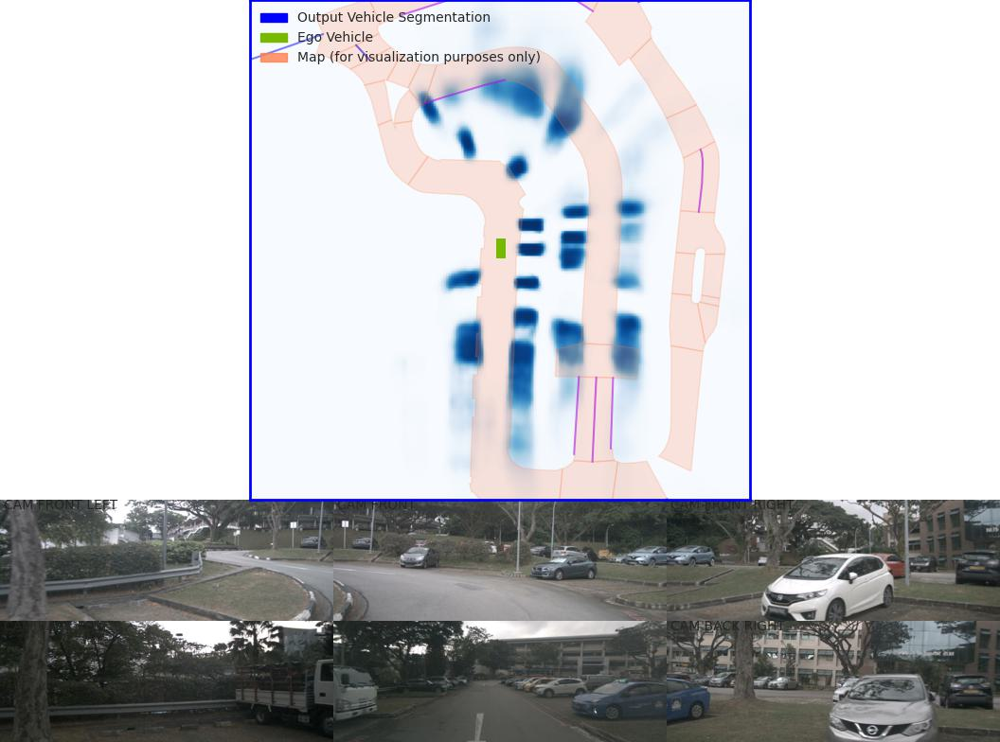
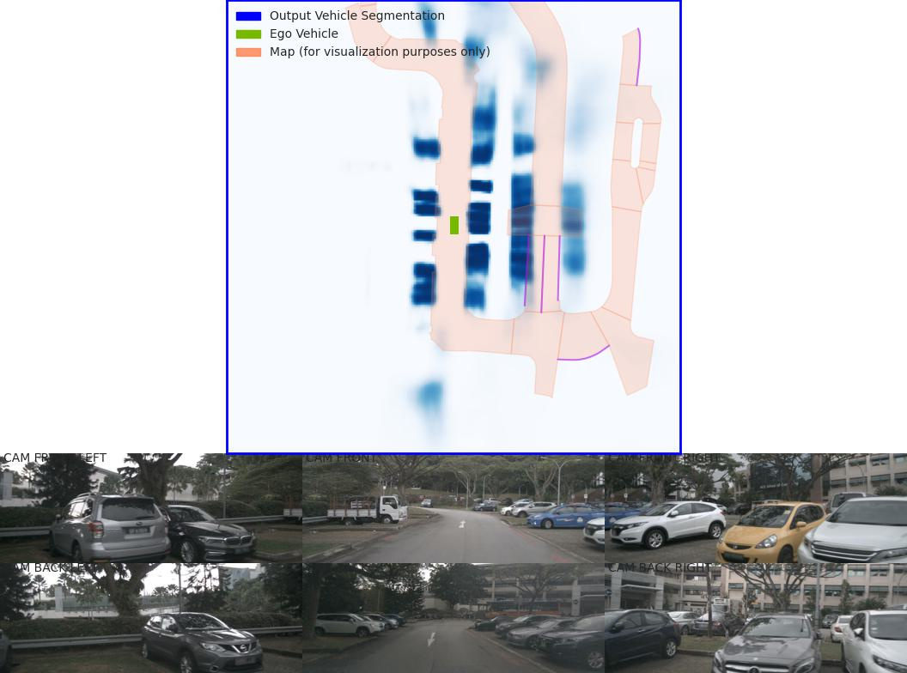
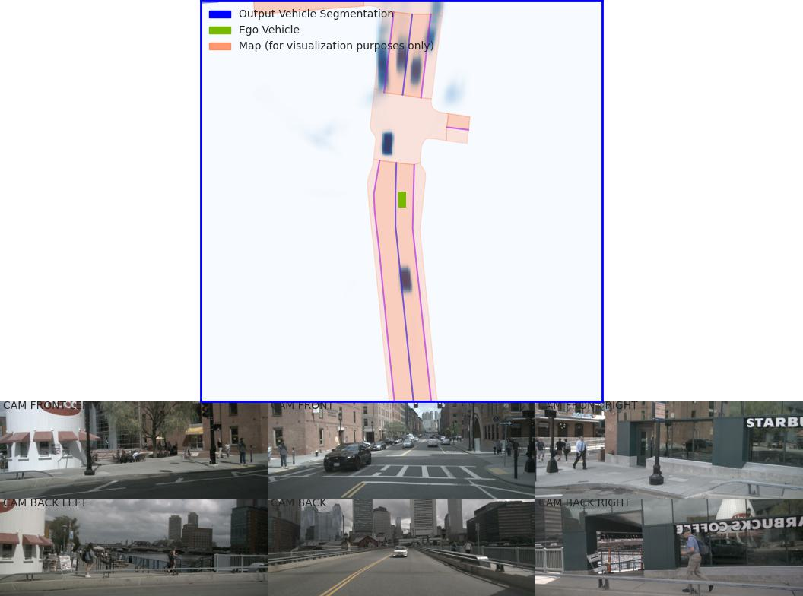
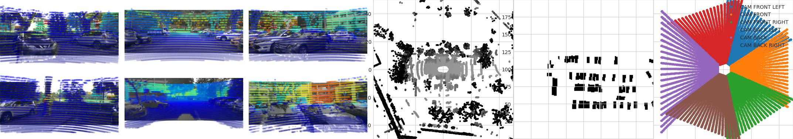
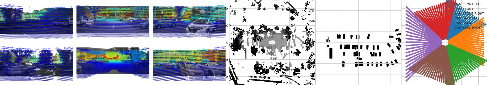

# Bird's-Eye-View (BEV) Detection Tutorial

This tutorial covers Bird's-Eye-View (BEV) detection methods, including LSS (Lift-Splat-Shoot) and BEVFusion architectures for 3D object detection.

## LSS (Lift-Splat-Shoot)

### LSS Bird's-Eye-View Conversion

We have added a new folder (`mydetector3d/datasets/nuscenes/lss`) to test Bird's-Eye-View conversion based on the LSS model from [lift-splat-shoot](https://github.com/nv-tlabs/lift-splat-shoot/tree/master).

#### Installation Requirements

Install the required dependencies:

```bash
pip install nuscenes-devkit tensorboardX efficientnet_pytorch==0.7.0
```

#### Training LSS Model

Perform LSS training on the nuScenes v1.0-mini dataset:

```python
# File: mydetector3d/datasets/nuscenes/lss/lssmain.py
train('mini', dataroot='/data/cmpe249-fa22/nuScenes/nuScenesv1.0-mini/', nepochs=100, gpuid=0, logdir='./output/lss')
```

#### Model Evaluation

The pretrained model is saved at `/data/cmpe249-fa22/Mymodels/lss_model525000.pt`. Use the **eval_model_iou** function in `mydetector3d/datasets/nuscenes/lss/lssexplore.py` for inference:

```bash
{'loss': 0.09620507466204373, 'iou': 0.35671476137624863}
```

#### Map Configuration Issue

When running **viz_model_preds**, you may encounter a missing map file error:

```
No such file or directory: '/data/cmpe249-fa22/nuScenes/nuScenesv1.0-mini/maps/maps/expansion/singapore-hollandvillage.json'
```

To fix this issue, extract and copy the map expansion files:

```bash
(mycondapy39) [010796032@cs001 nuScenes]$ unzip nuScenes-map-expansion-v1.3.zip
Archive:  nuScenes-map-expansion-v1.3.zip
creating: basemap/
inflating: basemap/boston-seaport.png
inflating: basemap/singapore-hollandvillage.png
inflating: basemap/singapore-queenstown.png
inflating: basemap/singapore-onenorth.png
creating: expansion/
inflating: expansion/boston-seaport.json
inflating: expansion/singapore-onenorth.json
inflating: expansion/singapore-queenstown.json
inflating: expansion/singapore-hollandvillage.json
creating: prediction/
inflating: prediction/prediction_scenes.json
(mycondapy39) [010796032@cs001 nuScenes]$ cp -r expansion/ nuScenesv1.0-mini/maps/
```

#### Visualization Results

After fixing the map issue, the evaluation figures from **viz_model_preds** are saved as `eval000000_000.jpg` (format: `f'eval{batchi:06}_{si:03}.jpg'`) in the root folder.

**Image dimensions:** [4, 6, 3, 128, 352]


*LSS model prediction visualization - Sample 1*


*LSS model prediction visualization - Sample 2*


*LSS model prediction visualization - Sample 3*

#### LiDAR Calibration Check

The **lidar_check** function performs a visual verification to ensure extrinsics and intrinsics are parsed correctly:

- **Left:** Input images with LiDAR scans projected using extrinsics and intrinsics
- **Middle:** The projected LiDAR scan
- **Right:** X-Y projection of the point cloud generated by the lift-splat model


*LiDAR calibration verification - Sample 1*


*LiDAR calibration verification - Sample 2*

#### Training Results

After completing training on the nuScenes v1.0-mini dataset using `mydetector3d/datasets/nuscenes/lss/lssmain.py`, the models are saved in the output folder as `model1000.pt` and `model8000.pt`. Using `model8000.pt` for inference yields:

```bash
{'loss': 0.23870943376311549, 'iou': 0.11804760577248166}
```

## BEVFusion

BEVFusion code has been integrated into the mydetector3d framework for multi-modal 3D object detection.

### BEVFusion Training

#### Training Configuration

**Training Parameters (Updated: 10/21):**
- Config file: `mydetector3d/tools/cfgs/nuscenes_models/bevfusion.yaml`
- Batch size: 4
- Epochs: 128
- Extra tag: 0522
- Checkpoint: `/data/cmpe249-fa22/Mymodels/nuscenes_models/bevfusion/0522/ckpt/latest_model.pth`
- Output folder: `/data/cmpe249-fa22/Mymodels/`

#### Available Models

```bash
(mycondapy310) [010796032@cs001 3DDepth]$ ls /data/cmpe249-fa22/Mymodels/nuscenes_models/
bevfusion  cbgs_pp_multihead
/data/cmpe249-fa22/Mymodels/nuscenes_models/cbgs_pp_multihead/0522/ckpt/checkpoint_epoch_128.pth
/data/cmpe249-fa22/Mymodels/nuscenes_models/bevfusion/0522/ckpt/checkpoint_epoch_56.pth  latest_model.pth
```

#### Training Command

```bash
(mycondapy310) [010796032@cs001 3DDepth]$ python ./mydetector3d/tools/mytrain.py --cfg_file='mydetector3d/tools/cfgs/nuscenes_models/bevfusion.yaml' --batch_size=4 --epochs=128 --extra_tag='0522' --ckpt='/data/cmpe249-fa22/Mymodels/nuscenes_models/bevfusion/0522/ckpt/latest_model.pth' --outputfolder='/data/cmpe249-fa22/Mymodels/'
023-10-21 17:09:07,965   INFO  Train:   59/128 ( 46%) [4534/30895 ( 15%)]  Loss: 0.4369 (0.437)  LR: 5.738e-05  Time cost: 00:47/346:12:13 [00:47/28342:55:05]  Acc_iter 1796445     Data time: 10.99(10.99)  Forward time: 36.29(36.29)  Batch time: 47.28(47.28)
```

### BEVFusion Evaluation

#### Evaluation Results - Custom Trained Model

```bash
(mycondapy310) [010796032@cs002 3DDepth]$ python mydetector3d/tools/myevaluatev2_nuscenes.py --cfg_file='mydetector3d/tools/cfgs/nuscenes_models/bevfusion.yaml' --ckpt='/data/cmpe249-fa22/Mymodels/nuscenes_models/bevfusion/0522/ckpt/checkpoint_epoch_56.pth' --tag='1021' --outputpath='/data/cmpe249-fa22/Mymodels/'
```

**Dataset Statistics:**
- Ground truth annotations: 6,019 samples
- Original predictions: 1,203,800 boxes
- After distance filtering: 807,685 boxes
- After LiDAR/RADAR filtering: 807,685 boxes
- After bike rack filtering: 807,498 boxes

**Overall Performance Metrics:**
- **mAP:** 0.6215
- **mATE:** 0.2811 (Average Translation Error)
- **mASE:** 0.2565 (Average Scale Error)
- **mAOE:** 0.3630 (Average Orientation Error)
- **mAVE:** 0.2630 (Average Velocity Error)
- **mAAE:** 0.1964 (Average Attribute Error)
- **NDS:** 0.6747 (nuScenes Detection Score)
- **Evaluation time:** 123.9s

**Per-Class Performance:**

| Object Class | AP | ATE | ASE | AOE | AVE | AAE |
|--------------|----|----|----|----|----|----|
| car | 0.867 | 0.182 | 0.155 | 0.064 | 0.242 | 0.187 |
| truck | 0.517 | 0.356 | 0.210 | 0.077 | 0.273 | 0.215 |
| bus | 0.704 | 0.339 | 0.185 | 0.076 | 0.505 | 0.267 |
| trailer | 0.427 | 0.482 | 0.213 | 0.775 | 0.208 | 0.181 |
| construction_vehicle | 0.257 | 0.630 | 0.439 | 0.877 | 0.146 | 0.350 |
| pedestrian | 0.856 | 0.128 | 0.286 | 0.351 | 0.209 | 0.089 |
| motorcycle | 0.678 | 0.206 | 0.235 | 0.382 | 0.333 | 0.268 |
| bicycle | 0.493 | 0.172 | 0.261 | 0.613 | 0.187 | 0.013 |
| traffic_cone | 0.755 | 0.122 | 0.316 | nan | nan | nan |
| barrier | 0.660 | 0.195 | 0.265 | 0.051 | nan | nan |

#### Evaluation Results - Pretrained Model

```bash
(mycondapy310) [010796032@cs002 3DDepth]$ python mydetector3d/tools/myevaluatev2_nuscenes.py --cfg_file='mydetector3d/tools/cfgs/nuscenes_models/bevfusion.yaml' --ckpt='/data/cmpe249-fa23/modelzoo/cbgs_bevfusion.pth' --tag='1022' --outputpath='/data/cmpe249-fa22/Mymodels/'
```

**Model Loading Issues:**
```
==> Loading parameters from checkpoint /data/cmpe249-fa23/modelzoo/cbgs_bevfusion.pth to cuda:0
Not updated weight backbone_3d.conv1.0.conv1.bias: torch.Size([16])
[... additional weight loading warnings ...]
==> Done (loaded 582/599)
```

**Performance Metrics (Pretrained Model):**
- **mAP:** 0.2364
- **mATE:** 0.7516
- **mASE:** 0.6989
- **mAOE:** 0.6777
- **mAVE:** 0.6240
- **mAAE:** 0.4523
- **NDS:** 0.2977
- **Evaluation time:** 100.4s

### BEVFusion Architecture Overview

The BEVFusion model forward process consists of the following major components:

#### 1. MeanVFE (Voxel Feature Encoder)
- **Input:** `voxel_features([600911, 10, 5])`, `voxel_num_points([600911])`
- **Output:** `batch_dict['voxel_features'] = points_mean.contiguous()` `#[600911, 5]`

#### 2. VoxelResBackBone8x (3D Backbone)
- **Input:** `voxel_features([600911, 5])`, `voxel_coords([600911, 4])`
- **Output:** 
  - `batch_dict['encoded_spconv_tensor']`: `out([2, 180, 180])`
  - `batch_dict['encoded_spconv_tensor_stride']`: 8
  - `batch_dict['multi_scale_3d_features']`

#### 3. HeightCompression (BEV Mapping Module)
- **Input:** `encoded_spconv_tensor` (Sparse `[2, 180, 180]`)
- **Output:** 
  - `batch_dict['spatial_features']`: `[6, 256, 180, 180]`
  - `batch_dict['spatial_features_stride']`: 8

#### 4. SwinTransformer (Image Backbone)
- **Input:** `batch_dict['camera_imgs']` `#[6, 6, 3, 256, 704]`
- **Output:** `batch_dict['image_features']` (3 items):
  - `[36, 192, 32, 88]`
  - `[36, 384, 16, 44]`
  - `[36, 768, 8, 22]`

#### 5. GeneralizedLSSFPN (Feature Pyramid Network)
- **Input:** `batch_dict['image_features']`
- **Output:** `batch_dict['image_fpn']` (2 items):
  - `[36, 256, 32, 88]`
  - `[36, 256, 16, 44]`

#### 6. DepthLSSTransform (View Transformation)
Lifts images into 3D and splats onto BEV features (from [BEVFusion](https://github.com/mit-han-lab/bevfusion/))
- **Input:** 
  - `batch_dict['image_fpn']`: `[6, 6, 256, 32, 88]`
  - `batch_dict['points']`: `[1456967, 6]`
- **Output:** `batch_dict['spatial_features_img']`: `[6, 80, 180, 180]`
- **Components:** dtransform, depthnet, downsample

#### 7. ConvFuser (Multi-Modal Fusion)
- **Input:** 
  - `img_bev = batch_dict['spatial_features_img']`: `[6, 80, 180, 180]`
  - `lidar_bev = batch_dict['spatial_features']`: `[6, 256, 180, 180]`
- **Process:** `cat_bev = torch.cat([img_bev, lidar_bev], dim=1)`
- **Output:** `batch_dict['spatial_features'] = mm_bev`: `[6, 256, 180, 180]`

#### 8. BaseBEVBackbone (2D Backbone)
- **Input:** `spatial_features = data_dict['spatial_features']`: `[6, 256, 180, 180]`
- **Output:** `data_dict['spatial_features_2d']`: `[6, 512, 180, 180]`

#### 9. TransFusionHead (Detection Head)
- **Loss Functions:** 
  - `loss_cls`: SigmoidFocalClassificationLoss()
  - `loss_bbox`: L1Loss()
  - `loss_heatmap`: GaussianFocalLoss()
- **Input:** `feats = batch_dict['spatial_features_2d']`: `[6, 512, 180, 180]`
- **Predictions:** 
  - `'center'`: `[6, 2, 200]`
  - `'height'`: `[6, 1, 200]`
  - `'dim'`: `[6, 3, 200]`
  - `'rot'`: `[6, 2, 200]`
  - `'vel'`: `[6, 2, 200]`
  - `'heatmap'`: `[6, 10, 200]`
  - `'query_heatmap_score'`: `[6, 10, 200]`
  - `'dense_heatmap'`: `[6, 10, 180, 180]`
- **Loss Computation:** `loss, tb_dict = self.loss(gt_bboxes_3d [6, 51, 9], gt_labels_3d [6, 51], res)`

## MMDetection3D Integration

### Installation Guide

Reference: [MMDetection3D Installation](https://mmdetection3d.readthedocs.io/en/latest/get_started.html#installation)

#### Step-by-Step Installation

1. **Install OpenMMLab Package Manager:**
```bash
(mycondapy310) [010796032@coe-hpc2 3DDepth]$ pip install -U openmim
```

2. **Install MMEngine:**
```bash
(mycondapy310) [010796032@coe-hpc2 3DDepth]$ mim install mmengine
Looking in links: https://download.openmmlab.com/mmcv/dist/cu118/torch2.0.0/index.html
....
Successfully installed addict-2.4.0 mmengine-0.9.0 opencv-python-4.8.1.78 platformdirs-3.11.0 yapf-0.40.2
```

3. **Install MMCV:**
```bash
(mycondapy310) [010796032@coe-hpc2 3DDepth]$ mim install 'mmcv>=2.0.0rc4'
Looking in links: https://download.openmmlab.com/mmcv/dist/cu118/torch2.0.0/index.html
Collecting mmcv>=2.0.0rc4
  Downloading https://download.openmmlab.com/mmcv/dist/cu118/torch2.0.0/mmcv-2.1.0-cp310-cp310-manylinux1_x86_64.whl (98.6 MB)
Successfully installed mmcv-2.1.0
```

4. **Install MMDetection:**
```bash
(mycondapy310) [010796032@coe-hpc2 3DDepth]$ mim install 'mmdet>=3.0.0'
Looking in links: https://download.openmmlab.com/mmcv/dist/cu118/torch2.0.0/index.html
Collecting mmdet>=3.0.0
  Downloading mmdet-3.2.0-py3-none-any.whl (2.1 MB)
Successfully installed mmdet-3.2.0 terminaltables-3.1.10
```

5. **Clone and Install MMDetection3D:**
```bash
(mycondapy310) [010796032@coe-hpc2 3DObject]$ git clone https://github.com/open-mmlab/mmdetection3d.git -b dev-1.x
```

#### Handling Installation Issues

If you encounter Open3D installation issues:

```bash
ERROR: No matching distribution found for open3d
(mycondapy310) [010796032@coe-hpc2 mmdetection3d]$ nano requirements/runtime.txt #comment out open3d
(mycondapy310) [010796032@coe-hpc2 mmdetection3d]$ pip install -v -e .
Successfully installed black-23.10.0 flake8-6.1.0 iniconfig-2.0.0 lyft_dataset_sdk-0.0.8 matplotlib-3.5.3 mccabe-0.7.0 mmdet3d-1.2.0 mypy-extensions-1.0.0 pathspec-0.11.2 plotly-5.17.0 pluggy-1.3.0 plyfile-1.0.1 pycodestyle-2.11.1 pyflakes-3.1.0 pytest-7.4.2 tenacity-8.2.3 trimesh-4.0.0
```

### Model Download and Testing

#### Download Pretrained Model

```bash
(mycondapy310) [010796032@coe-hpc2 mmdetection3d]$ mim download mmdet3d --config pointpillars_hv_secfpn_8xb6-160e_kitti-3d-car --dest .
processing pointpillars_hv_secfpn_8xb6-160e_kitti-3d-car...
downloading ━━━━━━━━━━━━━━━━━━━━━━━━━━━━━━━━━━━━━━━━ 18.4/18.4 MiB 117.4 MB/s eta 0:00:00
Successfully downloaded hv_pointpillars_secfpn_6x8_160e_kitti-3d-car_20220331_134606-d42d15ed.pth to /lts/home/010796032/3DObject/mmdetection3d
Successfully dumped pointpillars_hv_secfpn_8xb6-160e_kitti-3d-car.py to /lts/home/010796032/3DObject/mmdetection3d
```

#### Run Point Cloud Demo

```bash
(mycondapy310) [010796032@cs001 mmdetection3d]$ python demo/pcd_demo.py demo/data/kitti/000008.bin pointpillars_hv_secfpn_8xb6-160e_kitti-3d-car.py hv_pointpillars_secfpn_6x8_160e_kitti-3d-car_20220331_134606-d42d15ed.pth --no-save-vis
```

#### Sample Detection Results

```bash
(mycondapy310) [010796032@cs001 mmdetection3d]$ cat outputs/preds/000008.json 
{
  "labels_3d": [0, 0, 0, 0, 0, 0, 0, 0, 0, 0], 
  "scores_3d": [0.9750590920448303, 0.9682098627090454, 0.9457541108131409, 0.8904030919075012, 0.8890073299407959, 0.7703604698181152, 0.7550405859947205, 0.7058141827583313, 0.5811426639556885, 0.44102343916893005], 
  "bboxes_3d": [
    [14.75867748260498, -1.0537946224212646, -1.5589320659637451, 3.7562406063079834, 1.6059986352920532, 1.558688998222351, -0.31321752071380615],
    [6.438138961791992, -3.8679745197296143, -1.7354645729064941, 3.147707223892212, 1.4599915742874146, 1.4284530878067017, -0.2998310327529907],
    [8.112329483032227, 1.216971516609192, -1.6341216564178467, 3.6662495136260986, 1.573140025138855, 1.5916767120361328, 2.8161733150482178],
    [20.169925689697266, -8.43094253540039, -1.6689856052398682, 2.381495237350464, 1.51751708984375, 1.5693042278289795, -0.3255223035812378],
    [33.455665588378906, -7.035743236541748, -1.3376567363739014, 4.213741302490234, 1.744563102722168, 1.6697136163711548, 2.828497886657715],
    [55.621891021728516, -20.328449249267578, -1.3771171569824219, 4.370689392089844, 1.7358696460723877, 1.7066415548324585, 2.8504137992858887],
    [3.637699842453003, 2.7381889820098877, -1.6892050504684448, 3.7212045192718506, 1.5820955038070679, 1.51765775680542, -0.2304447889328003],
    [25.04075050354004, -10.156379699707031, -1.6326467990875244, 3.739389181137085, 1.6084976196289062, 1.4840202331542969, -0.32967936992645264],
    [28.72532081604004, -1.552423357963562, -1.202379822731018, 3.69446063041687, 1.5429767370224, 1.5610381364822388, 1.2416549921035767],
    [40.87098693847656, -9.748966217041016, -1.3669469356536865, 3.8333828449249268, 1.6528679132461548, 1.5699278116226196, -0.28837358951568604]
  ], 
  "box_type_3d": "LiDAR"
}
```

This tutorial provides a comprehensive overview of BEV detection methods, from basic LSS implementation to advanced BEVFusion architecture, along with practical MMDetection3D integration for production-ready 3D object detection systems.
