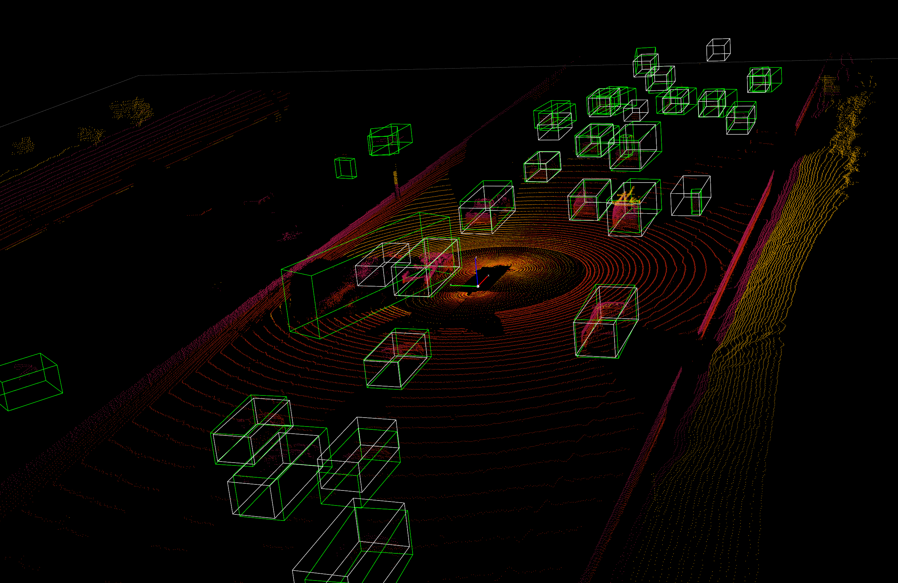

# MyDetector3D Training and Evaluation

## Trained Models

### Waymo Dataset Models (Waymo132/train0to9)

These models were trained on the **Waymo** dataset (Waymo132/train0to9) in HPC2. The model save path is `/data/cmpe249-fa22/Mymodels/waymo_models/`:

- **MyVoxelNext**: 
  - Config: `mydetector3d/tools/cfgs/waymo_models/myvoxelnext.yaml`
  - Checkpoint: `/data/cmpe249-fa22/Mymodels/waymo_models/myvoxelnext/0427b/ckpt/`

- **MyVoxelNext with IoU Branch**: 
  - Config: `mydetector3d/tools/cfgs/waymo_models/myvoxelnext_ioubranch.yaml`
  - Checkpoint: `/data/cmpe249-fa22/Mymodels/waymo_models/myvoxelnext_ioubranch/0429/ckpt/`

- **MySecond**: 
  - Config: `mydetector3d/tools/cfgs/waymo_models/mysecond.yaml`
  - Checkpoint: `/data/cmpe249-fa22/Mymodels/waymo_models/mysecond/0429/ckpt/checkpoint_epoch_128.pth`
  - Evaluation results: `/data/cmpe249-fa22/Mymodels/eval/waymo_models_mysecond_epoch128`

- **My3DModel**: 
  - Config: `mydetector3d/tools/cfgs/waymo_models/my3dmodel.yaml`
  - Checkpoint: `/data/cmpe249-fa22/Mymodels/waymo_models/my3dmodel/0507/ckpt/checkpoint_epoch_128.pth`
  - Evaluation results: `/data/cmpe249-fa22/Mymodels/eval/waymo_models_my3dmodel_epoch128`

### Complete Waymo Dataset Models (Waymo132/trainall)

These models were trained on the complete Waymo dataset (Waymo132/trainall) in HPC2:

#### My3DModel (Epoch 256)
- Config: `mydetector3d/tools/cfgs/waymo_models/my3dmodel.yaml`
- Checkpoint: `/data/cmpe249-fa22/Mymodels/waymo_models/my3dmodel/0508/ckpt/checkpoint_epoch_256.pth`
- Training: Continued from epochs 129-256 based on checkpoint `/data/cmpe249-fa22/Mymodels/waymo_models/my3dmodel/0507/ckpt/checkpoint_epoch_128.pth`
- Evaluation results: `/data/cmpe249-fa22/Mymodels/eval/waymo_models_my3dmodel_epoch256/txtresults`

**Performance Results:**

```
Car AP@0.70, 0.70, 0.70:
 bbox AP:91.7851, 91.7851, 91.7851
 bev  AP:68.3034, 68.3034, 68.3034
 3d   AP:49.0174, 49.0174, 49.0174
 aos  AP:50.76, 50.76, 50.76
Pedestrian AP@0.50, 0.50, 0.50:
 bbox AP:89.7635, 89.7635, 89.7635
 bev  AP:55.1775, 55.1775, 55.1775
 3d   AP:50.3953, 50.3953, 50.3953
 aos  AP:45.93, 45.93, 45.93
Cyclist AP@0.50, 0.50, 0.50:
 bbox AP:64.8413, 64.8413, 64.8413
 bev  AP:51.8248, 51.8248, 51.8248
 3d   AP:48.8936, 48.8936, 48.8936
 aos  AP:51.74, 51.74, 51.74
```

#### MyVoxelNext (Epoch 128)
- Config: `mydetector3d/tools/cfgs/waymo_models/myvoxelnext.yaml`
- Checkpoint: `/data/cmpe249-fa22/Mymodels/waymo_models/myvoxelnext/0509/ckpt/checkpoint_epoch_128.pth`
- Training: Trained from scratch (epoch 0)
- Evaluation results: `/data/cmpe249-fa22/Mymodels/eval/waymo_models_myvoxelnext_epoch128/txtresults`

**Performance Results:**

```
Car AP@0.70, 0.70, 0.70:
bbox AP:96.9390, 96.9390, 96.9390
bev  AP:71.0638, 71.0638, 71.0638
3d   AP:57.9034, 57.9034, 57.9034
aos  AP:57.86, 57.86, 57.86
Pedestrian AP@0.50, 0.50, 0.50:
bbox AP:93.3127, 93.3127, 93.3127
bev  AP:67.9591, 67.9591, 67.9591
3d   AP:61.6305, 61.6305, 61.6305
aos  AP:52.90, 52.90, 52.90
Cyclist AP@0.50, 0.50, 0.50:
bbox AP:80.0512, 80.0512, 80.0512
bev  AP:70.7396, 70.7396, 70.7396
3d   AP:69.7192, 69.7192, 69.7192
aos  AP:67.86, 67.86, 67.86
```

#### MySecond (Epoch 256)
- Config: `mydetector3d/tools/cfgs/waymo_models/mysecond.yaml`
- Checkpoint: `/data/cmpe249-fa22/Mymodels/waymo_models/mysecond/0510/ckpt/checkpoint_epoch_256.pth`
- Training: Continued from previous `mysecond_epoch_128`
- Evaluation results: `/data/cmpe249-fa22/Mymodels/eval/waymo_models_mysecond_epoch256/txtresults`

**Performance Results:**

```
Car AP@0.70, 0.70, 0.70:
bbox AP:92.4510, 92.4510, 92.4510
bev  AP:67.9950, 67.9950, 67.9950
3d   AP:50.5870, 50.5870, 50.5870
aos  AP:51.00, 51.00, 51.00
Pedestrian AP@0.50, 0.50, 0.50:
bbox AP:91.2207, 91.2207, 91.2207
bev  AP:56.9275, 56.9275, 56.9275
3d   AP:49.9933, 49.9933, 49.9933
aos  AP:47.57, 47.57, 47.57
Cyclist AP@0.50, 0.50, 0.50:
bbox AP:65.6921, 65.6921, 65.6921
bev  AP:52.4134, 52.4134, 52.4134
3d   AP:49.4230, 49.4230, 49.4230
aos  AP:52.40, 52.40, 52.40
```

### WaymoKitti Dataset Models

These models were trained on our converted **WaymoKitti** dataset in HPC2. The model save path is `/data/cmpe249-fa22/Mymodels/waymokitti_models/`:

- **PointPillar**: 
  - Config: `mydetector3d/tools/cfgs/waymokitti_models/pointpillar.yaml`
  - Checkpoint: `/data/cmpe249-fa22/Mymodels/waymokitti_models/pointpillar/0504/ckpt/checkpoint_epoch_128.pth`

- **Second**: 
  - Config: `mydetector3d/tools/cfgs/waymokitti_models/second.yaml`
  - Checkpoint: `/data/cmpe249-fa22/Mymodels/waymokitti_models/second/0502/ckpt/checkpoint_epoch_128.pth`

- **VoxelNext 3-Class**: 
  - Config: `mydetector3d/tools/cfgs/waymokitti_models/voxelnext_3class.yaml`
  - Checkpoint: `/data/cmpe249-fa22/Mymodels/waymokitti_models/voxelnext_3class/0430/ckpt/checkpoint_epoch_72.pth`

- **My3DModel**: 
  - Config: `mydetector3d/tools/cfgs/waymokitti_models/my3dmodel.yaml`
  - Checkpoint: `/data/cmpe249-fa22/Mymodels/waymokitti_models/my3dmodel/0505/ckpt/latest_model.pth`

## Model Evaluation

### Evaluation Results Structure

Evaluation results from `myevaluatev2.py` are stored in `/data/cmpe249-fa22/Mymodels/eval/` with the naming convention: `datasetname` + `modelname` + `epochnumber`.

Each evaluation folder (e.g., `/data/cmpe249-fa22/Mymodels/eval/waymokitti_dataset_mysecond_epoch128/`) contains:

#### Detection Results (saved by detection function):
- **`result.pkl`**: Detection results in KITTI format (det_annos array) used for evaluation
- **`ret_dicts.pkl`**: Detection results, ground truth, and inference time for each frame
- **`txtresults`**: Detection results in KITTI format with 2D bounding boxes converted from 3D bounding boxes
- **`{dataset}_{model}_{epoch}_frame_{n}.pkl`**: Complete frame data with original LiDAR points and ground truth for visualization with `visonebatch.py`

#### Evaluation Results (saved by runevaluation function):
- **`result_str.txt`**: KITTI evaluation results
- **`result_dict.pkl`**: Recall-related evaluation data

### Evaluation Process

The **runevaluation** function processes detection results as follows:

1. **Input Processing**: Takes `det_annos` from detection results
2. **Data Extraction**: Retrieves info from `dataset.infos`, where each annotation dictionary contains:
   - `point_cloud`, `frame_id`, `metadata`, `image`, `annos`, `pose`
   - `num_points_of_each_lidar` (5 LiDAR sensors)
3. **Ground Truth Processing**: The `annos` key contains `gt_boxes_lidar` (63,9), `dimensions`, `location`, `heading_angles`, etc.
4. **Format Conversion**: Annotations are converted to `eval_gt_annos` using:

```python
eval_det_annos = copy.deepcopy(det_annos)  # contains 'boxes_lidar' (N,7) key
eval_gt_annos = [copy.deepcopy(info['annos']) for info in datainfo]  # contains 'gt_boxes_lidar' (N,7) key
transform_annotations_to_kitti_format(eval_det_annos, map_name_to_kitti=map_name_to_kitti)
transform_annotations_to_kitti_format(
    eval_gt_annos, map_name_to_kitti=map_name_to_kitti, info_with_fakelidar=False)
result_str, result_dict = kitti_eval.get_official_eval_result(eval_gt_annos, eval_det_annos, class_names)
```

### Visualization Example


*3D detection results using WaymoKitti dataset and SECOND model*

## KITTI Dataset Processing

### Dataset Info Generation

Run `create_kitti_infos` in `mydetector3d/datasets/kitti/kitti_dataset.py` to generate:
- `kitti_infos_train.pkl`
- `kitti_infos_val.pkl` 
- `kitti_infos_trainval.pkl`
- `kitti_infos_test.pkl`

The process calls `dataset.get_infos` to generate each info file, processing files in `sample_id_list` via `process_single_scene`:

```python
pc_info = {'num_features': 4, 'lidar_idx': sample_idx}
info['point_cloud'] = pc_info
image_info = {'image_idx': sample_idx, 'image_shape': self.get_image_shape(sample_idx)}
info['image'] = image_info
info['calib'] = calib_info
info['annos'] = annotations
```

### Label Processing

Labels are extracted using `self.get_label(sample_idx)`, which returns:

```python
return object3d_kitti.get_objects_from_label(label_file)
    # |-------[Object3d(line) for line in lines]
    # |-----in mydetector3d/utils/object3d_kitti.py
```

### Annotation Structure

**Annotations** are created from the object list, with each dictionary containing:

- **`name`**: Class name string from `obj.cls_type`
- **`truncated`**: Float (0=non-truncated, 1=truncated)
- **`occluded`**: Integer (0=fully visible, 1,2,3=unknown)
- **`alpha`**: Observation angle (-π to π)
  - Considers vector from camera center to object center
  - Zero when object is along camera Z-axis (front)
- **`bbox`**: 2D bounding box from `obj.box2d` (left, top, right, bottom in image pixels)
- **`dimensions`**: 3D object size in meters `[obj.l, obj.h, obj.w]`
  - `obj.l`: length (label[10])
  - `obj.h`: height (label[9]) 
  - `obj.w`: width (label[8])
- **`location`**: Object center `obj.loc` (label[11-13]) in camera coordinates
- **`rotation_y`**: Rotation around Y-axis (label[14]) in camera coordinates [-π..π]
- **`difficulty`**: Calculated by `get_kitti_obj_level` based on 2D box height (>40 pixels = Easy)

### Coordinate Transformation

Annotations are processed to convert from camera coordinates to LiDAR coordinates:

```python
loc_lidar = calib.rect_to_lidar(loc)
l, h, w = dims[:, 0:1], dims[:, 1:2], dims[:, 2:3]
loc_lidar[:, 2] += h[:, 0] / 2
gt_boxes_lidar = np.concatenate([loc_lidar, l, w, h, -(np.pi / 2 + rots[..., np.newaxis])], axis=1)
annotations['gt_boxes_lidar'] = gt_boxes_lidar
```

The rotation conversion `-(π/2 + rots)` transforms from KITTI camera rotation (camera x-axis, clockwise positive) to PCDet LiDAR rotation (LiDAR X-axis, clockwise negative).

## WaymoKitti Dataset Processing

### Dataset Location and Structure

The WaymoKitti dataset is stored at `/data/cmpe249-fa22/WaymoKitti/4c_train5678`:

```bash
(mycondapy39) [010796032@coe-hpc2 cmpe249-fa22]$ ls /data/cmpe249-fa22/WaymoKitti/4c_train5678/
ImageSets   training                 waymo_gt_database      waymo_infos_trainval.pkl
ImageSets2  waymo_dbinfos_train.pkl  waymo_infos_train.pkl  waymo_infos_val.pkl
```

### Conversion Process

The Waymo dataset was converted to KITTI format using `Waymo2KittiAsync.py` from the [WaymoObjectDetection](https://github.com/lkk688/WaymoObjectDetection) repository:

```bash
[DatasetTools]$ python Waymo2KittiAsync.py
[DatasetTools]$ python mycreatewaymoinfo.py --createsplitfile_only
[DatasetTools]$ python mycreatewaymoinfo.py --createinfo_only
```

Ground truth database generation was performed using [mymmdetection3d](https://github.com/lkk688/mymmdetection3d).

### Info File Generation

The `createinfo_only` function calls `get_waymo_image_info` from [myWaymoinfo_utils.py](https://github.com/lkk688/WaymoObjectDetection/blob/master/DatasetTools/myWaymoinfo_utils.py), creating info files with the following KITTI-like format:

```python
{
    # [optional] points: [N, 3+] point cloud
    # [optional, for kitti] image: {
    #     image_idx: ...
    #     image_path: ...
    #     image_shape: ...
    # }
    point_cloud: {
        num_features: 4,  # or 6
        velodyne_path: ...
    },
    # [optional, for kitti] calib: {
    #     R0_rect: ...
    #     Tr_velo_to_cam0: ...
    #     P0: ...
    # }
    annos: {
        location: [num_gt, 3],      # array
        dimensions: [num_gt, 3],    # array  
        rotation_y: [num_gt],       # angle array
        name: [num_gt],             # ground truth name array
        # [optional] difficulty: kitti difficulty
        # [optional] group_ids: used for multi-part object
    }
}
```

A new dataset file `mydetector3d/datasets/kitti/waymokitti_dataset.py` was created based on `kitti_dataset.py`.

## Waymo Dataset Processing

### Dataset Preparation

The `mydetector3d/datasets/waymo/waymo_dataset.py` file provides different preprocessing functions via the `--func` parameter:

#### Available Functions:
- **`mycreateImageSet`**: Creates the `ImageSets` folder with train/val split files under `/data/cmpe249-fa22/Waymo132/ImageSets/`
- **`mygeninfo`**: Creates info files based on provided folder list with `processed_data_tag='train0to9'`
- **`mygengtdb`**: Creates ground truth database via `create_waymo_gt_database` function

#### Info Generation Process (`mygeninfo`)

1. **Sequence Processing**: Calls `waymo_utils.process_single_sequence` for each TFRecord sequence file
2. **Info Storage**: All returned info dictionaries are saved in `train0to9_infos_train.pkl` under `/data/cmpe249-fa22/Waymo132/`
3. **Folder Creation**: Creates one folder per sequence under `/data/cmpe249-fa22/Waymo132/train0to9`
4. **Annotation Generation**: Includes annotations via `generate_labels`

#### Label Generation (`generate_labels`)

Located in `mydetector3d/datasets/waymo/waymo_utils.py`:

- **Source**: Uses `waymo frame.laser_labels` for box annotations
- **Location**: `loc = [box.center_x, box.center_y, box.center_z]`
- **Dimensions**: `dimensions.append([box.length, box.width, box.height])` (matches OpenPCDet unified coordinates)
- **Additional Fields**: Contains `heading_angles`, `speed_global`, `accel_global` (not in KITTI)
- **Missing Fields**: KITTI's `alpha` and `rotation_y` are not included

**Ground Truth Box Calculation**:

```python
if annotations['name'].__len__() > 0:
    # get speed
    gt_boxes_lidar = np.concatenate([
        annotations['location'], 
        annotations['dimensions'], 
        annotations['heading_angles'][..., np.newaxis], 
        speed
    ], axis=1)
else:
    gt_boxes_lidar = np.zeros((0, 9))
annotations['gt_boxes_lidar'] = gt_boxes_lidar
```

**Point Cloud Storage**: `save_lidar_points` saves each frame's LiDAR data as individual `.npy` files (frame index as filename) under the sequence folder, containing 3D points in vehicle frame.

#### Ground Truth Database Generation (`mygengtdb`)

The `create_waymo_gt_database` function:

1. **Dataset Processing**: Calls `dataset.create_groundtruth_database` for 'train' split
2. **File Generation**: Creates:
   - `%s_gt_database_%s_sampled_%d_global.npy` (stacked_gt_points)
   - `%s_waymo_dbinfos_%s_sampled_%d.pkl` (array of dbinfo dictionaries)
3. **Database Info Structure**: Each dbinfo contains:

```python
db_info = {
    'name': names[i], 
    'path': db_path, 
    'sequence_name': sequence_name,
    'sample_idx': sample_idx, 
    'gt_idx': i, 
    'box3d_lidar': gt_boxes[i],
    'num_points_in_gt': gt_points.shape[0], 
    'difficulty': difficulty[i]
}
```

4. **Folder Creation**: Creates `%s_gt_database_%s_sampled_%d` folder under root directory

### Complete Dataset Preparation Commands

```bash
(mycondapy39) [010796032@cs001 waymo]$ python waymo_dataset.py --func 'mycreateImageSet'
Total files: 648
Train size: (518, 1)
Val size: (130, 1)
Done in /data/cmpe249-fa22/Waymo132/ImageSets/trainval.txt
Done in /data/cmpe249-fa22/Waymo132/ImageSets/train.txt
Done in /data/cmpe249-fa22/Waymo132/ImageSets/val.txt

(mycondapy39) [010796032@cs001 waymo]$ python waymo_dataset.py --func 'mygeninfo'
totoal number of files: 648

(mycondapy39) [010796032@cs001 3DDepth]$ python mydetector3d/datasets/waymo/waymo_dataset.py --func 'mygengtdb'
Total samples for Waymo dataset: 6485
---------------Start create groundtruth database for data augmentation---------------
2023-05-08 18:06:49,870   INFO  Loading Waymo dataset
2023-05-08 18:07:23,908   INFO  Total skipped info 0
2023-05-08 18:07:23,908   INFO  Total samples for Waymo dataset: 25867
Database Vehicle: 244715
Database Pedestrian: 231457
Database Cyclist: 11475                                                                                                
---------------Data preparation Done---------------
```

### Dataset Initialization During Training

#### DatasetTemplate Initialization

The `DatasetTemplate` class (in `dataset.py`) sets up three processors from the `DATA_PROCESSOR` section of `mydetector3d/tools/cfgs/dataset_configs/mywaymo_dataset.yaml`:

1. **Point Feature Encoder**: Based on `dataset_cfg.POINT_FEATURE_ENCODING`
2. **Data Augmentor**: Based on `dataset_cfg.DATA_AUGMENTOR`
3. **Data Processor**: Based on `dataset_cfg.DATA_PROCESSOR`

**Grid and Voxel Configuration**:

```python
self.grid_size = self.data_processor.grid_size    # [1504, 1504, 40] = POINT_CLOUD_RANGE/voxel_size
self.voxel_size = self.data_processor.voxel_size  # [0.1, 0.1, 0.15] meters
```

#### WaymoDataset Initialization

The `WaymoDataset` class in `mydetector3d/datasets/waymo/waymo_dataset.py` reads info files via `include_waymo_data`:

**Data Loading Process**: Iterates through `sample_sequence_list` (all TFRecord files), loads pickle files as infos from each sequence folder, and combines them into the `infos[]` array.

#### Data Loading (`__getitem__`)

**Point Cloud Loading**:

```python
pc_info = info['point_cloud']
sequence_name = pc_info['lidar_sequence']
sample_idx = pc_info['sample_idx']
points = self.get_lidar(sequence_name, sample_idx)  # load npy file, limit intensity from -1 to 1
input_dict.update({
    'points': points,
    'frame_id': info['frame_id'],
})
```

**Annotation Processing**:

```python
gt_boxes_lidar = annos['gt_boxes_lidar']  # [N,9]
gt_boxes_lidar = gt_boxes_lidar[:, 0:7]   # [54,8] exclude speed information
# FILTER_EMPTY_BOXES_FOR_TRAIN
input_dict.update({
    'gt_names': annos['name'],                                    # class string names [54,]
    'gt_boxes': gt_boxes_lidar,                                  # [54,7]
    'num_points_in_gt': annos.get('num_points_in_gt', None)     # [54,]
})
```

**Data Preparation Pipeline**:

```python
data_dict = self.prepare_data(data_dict=input_dict)  # DatasetTemplate
# 1. data_dict = self.data_augmentor.forward          # perform data augmentation
# 2. data_dict['gt_boxes'] = gt_boxes                 # Filter gt_boxes, convert gt_names to index and add to gt_boxes last column [Ngt,7]->[Ngt,8]
# 3. data_dict = self.point_feature_encoder.forward(data_dict)  # feature encoder for points [N,5], add use_lead_xyz=True
# 4. data_dict = self.data_processor.forward          # preprocessing: remove out-of-range points, shuffle, convert to voxel
```

**Voxelization Process** (`transform_points_to_voxels` in `data_processor.py`):

```python
voxel_output = self.voxel_generator.generate(points)  # get voxels (64657, 5, 5), coordinates (64657, 3), num_points (64657,)
data_dict['voxels'] = voxels
data_dict['voxel_coords'] = coordinates
data_dict['voxel_num_points'] = num_points
```

#### Final Data Dictionary Structure

- **`gt_boxes`**: (16, 16, 8) - batch_size=16, max_boxes=16, box_values=8
- **`points`**: (302730, 5) - 5 features with batch index prepended to 4 point features (xyzr)
- **`voxels`**: (89196, 32, 4) - max_points_per_voxel=32, features=4 (x,y,z,intensity)
- **`voxel_coords`**: (89196, 4) - (batch_index,z,y,x) with batch_index added in `dataset.collate_batch`
- **`voxel_num_points`**: (89196,) - number of points per voxel

### Training Execution

```bash
(mycondapy39) [010796032@cs001 3DDepth]$ python mydetector3d/tools/mytrain.py
2023-05-08 19:16:49,940   INFO  cfg_file         mydetector3d/tools/cfgs/waymo_models/my3dmodel.yaml
2023-05-08 19:16:49,940   INFO  batch_size       8
2023-05-08 19:16:49,940   INFO  epochs           256
2023-05-08 19:16:49,940   INFO  workers          4
2023-05-08 19:16:49,940   INFO  extra_tag        0508
2023-05-08 19:16:49,940   INFO  ckpt             /data/cmpe249-fa22/Mymodels/waymo_models/my3dmodel/0507/ckpt/checkpoint_epoch_128.pth
2023-05-08 19:16:49,967   INFO  ----------- Create dataloader & network & optimizer -----------
2023-05-08 19:16:53,197   INFO  Database filter by min points Vehicle: 244715 => 209266
2023-05-08 19:16:53,222   INFO  Database filter by min points Pedestrian: 231457 => 196642
2023-05-08 19:16:53,225   INFO  Database filter by min points Cyclist: 11475 => 10211
2023-05-08 19:16:53,248   INFO  Database filter by difficulty
  num_bev_features features after backbone2d 384
```