# Physical AI and Large Language Models in Autonomous Driving

!!! info "Document Overview"
    This comprehensive guide explores the intersection of Physical AI and Large Language Models in autonomous driving, covering current technologies, challenges, and future research directions.

## Table of Contents

1. [Introduction](#introduction-the-convergence-of-physical-ai-and-llms)
2. [The Importance of Physical AI and LLMs](#why-physical-ai-and-llms-are-crucial-for-autonomous-driving)
3. [Current Solutions in Autonomous Driving](#current-solutions-in-autonomous-driving)
4. [Tesla's Latest Model: A Case Study](#teslas-latest-model-a-case-study)
5. [Vision-based Object Detection Models](#vision-based-object-detection-models)
6. [3D Object Detection Models](#3d-object-detection-models)
7. [Localization and Mapping](#localization-and-mapping)
8. [Vision-Language Models in Perception](#vision-language-models-in-perception)
9. [3D Scene Reconstruction and Geometry Understanding](#3d-scene-reconstruction-and-geometry-understanding)
10. [Multimodal Sensor Fusion](#multimodal-sensor-fusion-with-unified-embeddings)
11. [End-to-End Transformers](#end-to-end-transformers-for-joint-perception-planning)
12. [Vision-Language-Action Models](#vision-language-action-models)
13. [Current Challenges and Solutions](#current-challenges-and-solutions)
14. [Future Research Directions](#future-research-directions)
15. [Conclusion](#conclusion)

---

## Introduction: The Convergence of Physical AI and LLMs

The autonomous driving landscape is undergoing a revolutionary transformation through the integration of **Physical AI** and **Large Language Models (LLMs)**. This convergence represents a paradigm shift from traditional rule-based systems to intelligent, adaptive frameworks that can understand, reason, and interact with the physical world in ways previously thought impossible.

Physical AI refers to artificial intelligence systems that can perceive, understand, and interact with the physical world through embodied intelligence. When combined with the reasoning capabilities of LLMs, these systems create a powerful foundation for autonomous vehicles that can not only navigate complex environments but also understand context, communicate with passengers, and make nuanced decisions based on natural language instructions.

## Why Physical AI and LLMs are Crucial for Autonomous Driving

### 1. **Contextual Understanding and Reasoning**

Traditional autonomous driving systems rely heavily on pre-programmed rules and pattern recognition. However, real-world driving scenarios often require contextual understanding that goes beyond simple object detection:

- **Natural Language Instructions**: "Take me to the hospital, it's an emergency" requires understanding urgency and route optimization
- **Complex Scenarios**: Understanding construction zones, emergency vehicles, or unusual traffic patterns
- **Human-AI Interaction**: Passengers can communicate naturally with the vehicle about preferences, destinations, and concerns

### 2. **Multimodal Perception and Integration**

Modern autonomous vehicles are equipped with multiple sensor modalities:

- **Visual Cameras**: RGB, infrared, and depth cameras
- **LiDAR**: 3D point cloud data for precise distance measurement
- **Radar**: Weather-resistant detection of objects and motion
- **Audio**: Environmental sound analysis and passenger communication
- **GPS and IMU**: Location and motion sensing

Physical AI enables the seamless integration of these diverse data streams into a unified understanding of the environment, while LLMs provide the reasoning framework to interpret this information contextually.

### 3. **Adaptive Learning and Generalization**

Unlike traditional systems that require extensive retraining for new scenarios, LLM-powered autonomous systems can:

- **Few-shot Learning**: Adapt to new driving conditions with minimal examples
- **Transfer Learning**: Apply knowledge from one domain to another (e.g., city driving to highway driving)
- **Continuous Improvement**: Learn from real-world experiences and edge cases

### 4. **Safety and Explainability**

Safety-critical applications like autonomous driving require systems that can:

- **Explain Decisions**: "I'm slowing down because I detected a child's ball rolling into the street"
- **Predict Intentions**: Understanding pedestrian and vehicle behavior patterns
- **Handle Edge Cases**: Reasoning through unprecedented scenarios using common sense

### 5. **Human-Centric Design**

The integration of LLMs enables:

- **Natural Communication**: Voice-based interaction with passengers
- **Personalization**: Learning individual preferences and driving styles
- **Accessibility**: Supporting users with different needs and abilities

---

## Current Solutions in Autonomous Driving

The autonomous driving industry has evolved through several technological approaches, each building upon previous innovations while addressing specific challenges in perception, planning, and control. [[1]](https://arxiv.org/abs/2003.06404) [[2]](https://ieeexplore.ieee.org/document/9304823)

### The "4 Pillars" Architecture: Traditional Modular Approaches

The traditional approach to autonomous driving follows what's commonly known as the "4 Pillars" architecture - a modular, linear system where each component processes information sequentially. [[3]](https://arxiv.org/abs/2106.09685)

**Pipeline Architecture:**
```
Sensors → Perception → Localization → Planning → Control → Actuation
```


**The Four Pillars Explained:**

1. **Perception Pillar** [[4]](https://arxiv.org/abs/2005.13423)

    - Uses vehicle sensors (cameras, LiDARs, RADARs, ultrasonics) [[5]](https://github.com/open-mmlab/mmdetection3d)
    - Object detection and classification [[6]](https://arxiv.org/abs/1912.12033)
    - Lane detection and road segmentation [[7]](https://github.com/cardwing/Codes-for-Lane-Detection)
    - Traffic sign and signal recognition [[8]](https://arxiv.org/abs/1909.12847)
    - Depth estimation and 3D reconstruction [[9]](https://github.com/nianticlabs/monodepth2)
    - Pedestrian and vehicle tracking [[10]](https://arxiv.org/abs/2103.07847)

2. **Localization Pillar** [[11]](https://arxiv.org/abs/2006.12567)

    - Takes perception output, GPS, and map data [[12]](https://github.com/HKUST-Aerial-Robotics/VINS-Mono)
    - Localizes the vehicle's position in the world [[13]](https://arxiv.org/abs/1909.07849)
    - Provides precise positioning for planning decisions
    - Often integrated with perception in some implementations [[14]](https://github.com/borglab/gtsam)

3. **Planning Pillar** [[15]](https://arxiv.org/abs/2011.10884)

    - Path planning and route optimization [[16]](https://github.com/AtsushiSakai/PythonRobotics)
    - Behavioral planning (lane changes, turns) [[17]](https://arxiv.org/abs/1808.05477)
    - Motion planning with constraints [[18]](https://github.com/ompl/ompl)
    - Trajectory prediction for other vehicles [[19]](https://arxiv.org/abs/2103.14023)
    - Traffic flow analysis and decision making [[20]](https://arxiv.org/abs/1912.01618)

4. **Control Pillar** [[21]](https://arxiv.org/abs/1912.04077)

    - Vehicle dynamics control [[22]](https://github.com/commaai/openpilot)
    - Actuator commands (steering, acceleration, braking) [[23]](https://arxiv.org/abs/1909.07541)
    - Uses trajectory information and vehicle parameters
    - Generates precise control signals [[24]](https://github.com/ApolloAuto/apollo)

**Industry Variations:**
Different companies implement variations of the 4 Pillars architecture. Sometimes 3 pillars, where "localization" belonged to Perception, and sometimes, there was no "control". For example:

- **Waymo** focuses heavily on prediction, sometimes treating localization as a solved problem [[25]](https://arxiv.org/abs/1912.04838) [[26]](https://blog.waymo.com/2020/09/the-waymo-driver-handbook-a-guide-for_2.html)


- Some implementations combine localization with perception [[27]](https://arxiv.org/abs/2003.05711)
- Others integrate prediction into either perception or planning modules [[28]](https://arxiv.org/abs/2106.11279)
- **Baidu Apollo** extends the traditional 4-pillar architecture with additional specialized modules, creating a comprehensive autonomous driving platform. Beyond the core perception, prediction, planning, and control modules, Apollo incorporates several critical components:

#### Core Autonomous Driving Modules

**1. Perception Module** <mcreference link="https://github.com/ApolloAuto/apollo" index="1">1</mcreference>

Apollo's perception system combines multiple sensor inputs (LiDAR, cameras, radar, ultrasonic) to create a comprehensive understanding of the vehicle's environment. The system has evolved through multiple generations:

- **Multi-Sensor Fusion**: Integrates data from various sensors using advanced fusion algorithms to provide robust object detection and tracking
- **Deep Learning Models**: Apollo 10.0 introduces state-of-the-art models including:
  - **CenterPoint**: Center-based two-stage 3D obstacle detection for LiDAR data <mcreference link="https://github.com/ApolloAuto/apollo/releases" index="5">5</mcreference>
  - **YOLOX+YOLO3D**: Advanced camera-based object detection replacing legacy YOLO models
  - **BEV (Bird's Eye View) Object Detection**: Mainstream visual perception paradigm with occupancy network support
- **Real-time Processing**: Optimized for automotive-grade inference speeds, achieving 5Hz on single Orin platform
- **Incremental Training**: Supports model improvement using small amounts of annotated data combined with pre-trained models

*Implementation*: [`modules/perception/`](https://github.com/ApolloAuto/apollo/tree/master/modules/perception) <mcreference link="https://github.com/ApolloAuto/apollo" index="1">1</mcreference>

**2. Prediction Module** <mcreference link="https://github.com/ApolloAuto/apollo" index="1">1</mcreference>

This component forecasts future trajectories of surrounding vehicles, pedestrians, and cyclists using sophisticated machine learning models:

- **Multi-Layer Perceptron (MLP) Models**: Deep neural networks trained on massive datasets of human driving patterns
- **Physics-Based Constraints**: Incorporates vehicle dynamics and kinematic constraints for realistic predictions
- **Multi-Modal Predictions**: Generates multiple trajectory hypotheses with associated probabilities
- **Category-Specific Predictors**: Different prediction models optimized for vehicles, pedestrians, and cyclists
- **Real-time Inference**: Provides predictions at high frequency to support planning decisions

*Implementation*: [`modules/prediction/`](https://github.com/ApolloAuto/apollo/tree/master/modules/prediction) <mcreference link="https://github.com/ApolloAuto/apollo" index="1">1</mcreference>

**3. Planning Module** <mcreference link="https://developer.apollo.auto/" index="4">4</mcreference>

Apollo's planning system consists of hierarchical planning components that work together to generate safe and comfortable trajectories:

- **Behavior Planning**: High-level decision making for lane changes, turns, and traffic interactions
- **Motion Planning**: Detailed trajectory generation using optimization techniques:
  - **Dynamic Programming (DP)**: Multiple iterations for path optimization
  - **Quadratic Programming (QP)**: Speed profile optimization
- **Scenario-Based Planning**: Handles complex scenarios including:
  - Unprotected turns and narrow streets
  - Curb-side functionality and pull-over maneuvers
  - Crossing bare intersections
- **Traffic Law Integration**: Built-in traffic rule compliance modules
- **Real-time Adaptation**: Adjusts to changing traffic conditions dynamically

*Implementation*: [`modules/planning/`](https://github.com/ApolloAuto/apollo/tree/master/modules/planning) <mcreference link="https://github.com/ApolloAuto/apollo" index="1">1</mcreference>

**4. Control Module** <mcreference link="https://developer.apollo.auto/" index="4">4</mcreference>

The control system translates planned trajectories into precise vehicle actuator commands:

- **Waypoint Following**: Achieves control accuracy of ~10cm <mcreference link="https://developer.apollo.auto/" index="4">4</mcreference>
- **Multi-Vehicle Support**: Adaptive to different vehicle types and CAN bus protocols
- **Environmental Adaptation**: Handles various road conditions and speeds
- **Precise Actuation**: Controls steering, acceleration, and braking systems
- **Safety Mechanisms**: Includes emergency stop and failsafe procedures

*Implementation*: [`modules/control/`](https://github.com/ApolloAuto/apollo/tree/master/modules/control) <mcreference link="https://github.com/ApolloAuto/apollo" index="1">1</mcreference>

#### Specialized Apollo Components

**Map Engine and Localization** <mcreference link="https://developer.apollo.auto/" index="4">4</mcreference>

Apollo's HD mapping and localization system provides the spatial foundation for autonomous navigation:

- **Centimeter-Level Accuracy**: HD maps with precise lane-level topology and semantic annotations
- **Multi-Sensor Localization**: Comprehensive positioning solution combining GPS, IMU, HD maps, and sensor inputs
- **Dynamic Map Updates**: Real-time incorporation of traffic information, construction zones, and temporary changes
- **Layered Architecture**: Base maps, lane topology, traffic signs, signals, and road markings
- **GPS-Denied Operation**: Robust localization even in challenging environments
- **Deep Learning Integration**: AI-powered map creation and maintenance <mcreference link="https://developer.apollo.auto/" index="4">4</mcreference>

*Implementation*: [`modules/map/`](https://github.com/ApolloAuto/apollo/tree/master/modules/map) and [`modules/localization/`](https://github.com/ApolloAuto/apollo/tree/master/modules/localization) <mcreference link="https://github.com/ApolloAuto/apollo" index="1">1</mcreference>

**HMI (Human Machine Interface)** <mcreference link="https://github.com/ApolloAuto/apollo/blob/master/RELEASE.md" index="3">3</mcreference>

Apollo's HMI system, centered around DreamView Plus, manages human-vehicle interaction:

- **Real-time Visualization**: Live display of vehicle perception, planned trajectories, and system status
- **Multi-Modal Interface**: Voice commands, touchscreen controls, and emergency takeover mechanisms
- **Developer Tools**: Comprehensive debugging and development environment with:
  - Mode-based organization (Perception, PnC, Vehicle Test modes)
  - Customizable panel layouts for visualization
  - Resource center with maps, scenarios, and vehicle configurations
- **Remote Operations**: Fleet monitoring and intervention capabilities
- **Safety Integration**: Emergency stop mechanisms and operator alerts
- **Scenario Replay**: Traffic scenario visualization and analysis tools <mcreference link="https://github.com/ApolloAuto/apollo/blob/master/RELEASE.md" index="3">3</mcreference>

*Implementation*: [`modules/dreamview/`](https://github.com/ApolloAuto/apollo/tree/master/modules/dreamview) <mcreference link="https://github.com/ApolloAuto/apollo" index="1">1</mcreference>

**Cyber RT Middleware** <mcreference link="https://github.com/ApolloAuto/apollo/blob/master/RELEASE.md" index="3">3</mcreference>

Apollo's custom robotics middleware, specifically designed for autonomous driving applications:

- **High Performance**: 10x performance improvement with microsecond-level transmission latency <mcreference link="https://github.com/ApolloAuto/apollo/blob/master/RELEASE.md" index="3">3</mcreference>
- **Zero-Copy Communication**: Direct shared memory access avoiding serialization overhead
- **Deterministic Real-time**: Optimized for automotive applications with strict timing requirements
- **Auto-Discovery**: Automatic node discovery and service registration
- **Built-in Monitoring**: Comprehensive debugging and performance analysis tools
- **ROS Integration**: Framework-level integration with ROS ecosystem for software reuse <mcreference link="https://github.com/ApolloAuto/apollo/blob/master/RELEASE.md" index="3">3</mcreference>
- **Reliable Communication**: Ensures message delivery even under high computational loads

*Implementation*: [`cyber/`](https://github.com/ApolloAuto/apollo/tree/master/cyber) <mcreference link="https://github.com/ApolloAuto/apollo" index="1">1</mcreference>

#### Advanced Features and Capabilities

**Simulation and Testing** <mcreference link="https://developer.apollo.auto/" index="4">4</mcreference>

- **Comprehensive Simulation**: Virtual driving of millions of kilometers daily using real-world traffic data
- **Scenario Coverage**: Large-scale autonomous driving scene testing and validation
- **Integrated Development**: Local simulator integration in DreamView for PnC debugging
- **Online Scenario Editing**: Real-time scenario creation and modification capabilities

**Hardware Ecosystem** <mcreference link="https://github.com/ApolloAuto/apollo/blob/master/RELEASE.md" index="3">3</mcreference>

- **Broad Compatibility**: Support for 73+ devices from 32+ manufacturers
- **ARM Architecture**: Native support for NVIDIA Orin and other ARM-based platforms
- **Multi-Platform Deployment**: Flexible deployment across different vehicle platforms
- **Cost Optimization**: Multiple hardware options to reduce deployment costs

**Safety and Reliability** <mcreference link="https://github.com/ApolloAuto/apollo/blob/master/RELEASE.md" index="3">3</mcreference>

- **Functional Safety**: Compliance with ISO 26262 and ISO 21448 standards
- **Comprehensive Logging**: Detailed system logging and replay capabilities
- **Continuous Integration**: Automated testing and validation pipelines
- **Over-the-Air Updates**: Remote model deployment and system updates <mcreference link="https://developer.apollo.auto/" index="4">4</mcreference>

Apollo's modular architecture enables flexible deployment across different vehicle platforms and supports continuous integration of new algorithms and sensors. The platform combines cloud-based simulation with real-world testing, providing comprehensive development and validation capabilities for autonomous driving applications. [[24]](https://github.com/ApolloAuto/apollo) [[29]](https://arxiv.org/abs/1704.01778)


**Advantages:** [[1]](https://arxiv.org/abs/2003.06404)

- Modular design allows specialized optimization
- Easier debugging and validation of individual components
- Clear separation of concerns and responsibilities
- Industry-standard approach used by 99% of autonomous vehicles
- Well-understood and universally accepted methodology

**Limitations:** [[3]](https://arxiv.org/abs/2106.09685) [[1]](https://arxiv.org/abs/2003.06404)

- Information loss between modules due to sequential processing
- Difficulty in handling edge cases and novel scenarios [[30]](https://arxiv.org/abs/2103.05073)
- Limited adaptability to new environments
- Potential bottlenecks in the linear pipeline
- Complex integration and synchronization requirements

**Open Source Implementations:**

- **Apollo by Baidu**: Complete autonomous driving platform [[24]](https://github.com/ApolloAuto/apollo)
- **Autoware**: Open-source software for autonomous driving [[31]](https://github.com/autowarefoundation/autoware)
  
  **Architecture Overview**: Autoware is built on ROS 2 (Robot Operating System 2) and follows a modular architecture with clear separation of concerns. The system is designed for scalability and supports both simulation and real-world deployment.
  
  **Core Modules**:
  - **Perception**: Multi-sensor fusion using LiDAR, cameras, and radar for object detection and tracking
    - LiDAR-based 3D object detection using PointPillars and CenterPoint algorithms
    - Camera-based 2D object detection with YOLO and SSD implementations
    - Sensor fusion algorithms for robust perception [[32]](https://github.com/autowarefoundation/autoware.universe/tree/main/perception)
  
  - **Localization**: High-precision positioning using NDT (Normal Distributions Transform) scan matching
    - GNSS/IMU integration for global positioning
    - Visual-inertial odometry for enhanced accuracy [[33]](https://github.com/autowarefoundation/autoware.universe/tree/main/localization)
  
  - **Planning**: Hierarchical planning system with mission, behavior, and motion planning layers
    - Route planning using OpenStreetMap and Lanelet2 format
    - Behavior planning with finite state machines
    - Motion planning using hybrid A* and optimization-based approaches [[34]](https://github.com/autowarefoundation/autoware.universe/tree/main/planning)
  
  - **Control**: Vehicle control system with longitudinal and lateral controllers
    - Pure pursuit and MPC (Model Predictive Control) for path following
    - PID controllers for speed regulation [[35]](https://github.com/autowarefoundation/autoware.universe/tree/main/control)
  
  **Technical Features**:
  - **Simulation Integration**: CARLA and SUMO simulation support for testing and validation
  - **Hardware Abstraction**: Support for various vehicle platforms and sensor configurations
  - **Safety Systems**: Fail-safe mechanisms and emergency stop capabilities
  - **Documentation**: Comprehensive tutorials and API documentation [[36]](https://autowarefoundation.github.io/autoware-documentation/)

- **OpenPilot by Comma.ai**: Open source driver assistance system [[22]](https://github.com/commaai/openpilot)
  
  **Architecture Overview**: OpenPilot is designed as a lightweight, end-to-end system that runs on commodity hardware (comma three device). It focuses on practical deployment with minimal computational requirements while maintaining high performance.
  
  **Core Components**:
  - **Vision System**: Camera-only approach using advanced computer vision
    - Supercombo model: End-to-end neural network for perception and planning
    - Multi-task learning for lane detection, object detection, and path prediction
    - Real-time processing at 20 FPS on mobile hardware [[37]](https://github.com/commaai/openpilot/tree/master/selfdrive/modeld)
  
  - **Planning and Control**: Integrated planning and control system
    - Model Predictive Control (MPC) for longitudinal and lateral control
    - Path planning using polynomial trajectory generation
    - Adaptive cruise control and lane keeping assistance [[38]](https://github.com/commaai/openpilot/tree/master/selfdrive/controls)
  
  - **Calibration System**: Automatic camera calibration and vehicle parameter estimation
    - Online calibration using visual odometry
    - Vehicle dynamics parameter learning [[39]](https://github.com/commaai/openpilot/tree/master/selfdrive/locationd)
  
  **Technical Innovations**:
  - **Supercombo Neural Network**: Single neural network handling multiple tasks
    - Input: Single front-facing camera feed
    - Output: Driving path, lane lines, lead car detection, and speed prediction
    - Architecture: Efficient CNN with temporal modeling [[40]](https://blog.comma.ai/end-to-end-lateral-planning/)
  
  - **Data Collection**: Massive real-world driving data collection
    - Over 50 million miles of driving data
    - Continuous learning from fleet data
    - Privacy-preserving data collection methods [[41]](https://comma.ai/)
  
  - **Hardware Integration**: Optimized for comma three device
    - Qualcomm Snapdragon 845 SoC
    - Custom CAN bus interface
    - Plug-and-play installation [[42]](https://comma.ai/shop/products/comma-three-devkit)
  
  **Safety and Limitations**:
  - **Driver Monitoring**: Eye tracking and attention monitoring
  - **Geofencing**: Automatic disengagement in unsupported areas
  - **Gradual Rollout**: Feature releases based on safety validation
  - **Open Source Philosophy**: Full transparency for safety-critical code [[43]](https://github.com/commaai/openpilot/blob/master/docs/SAFETY.md)
- **CARLA Simulator**: Open-source simulator for autonomous driving research [[32]](https://github.com/carla-simulator/carla)
- **AirSim**: Simulator for drones, cars and more [[33]](https://github.com/microsoft/AirSim)

### Modern End-to-End Approaches

**Neural Network-Based Systems:**

Recent advances have moved toward end-to-end learning systems that directly map sensor inputs to control outputs:

1. **Imitation Learning**
   - Learning from human driving demonstrations
   - Behavioral cloning approaches
   - Examples: NVIDIA PilotNet, Waymo's learned components

2. **Reinforcement Learning**
   - Learning through interaction with simulated environments
   - Policy gradient methods for continuous control
   - Examples: DeepMind's work on simulated driving

3. **Transformer-Based Architectures**
   - Attention mechanisms for temporal reasoning
   - Multi-modal fusion capabilities
   - Examples: Tesla's FSD, Waymo's MultiPath++

### Industry Leaders and Their Approaches

**Waymo (Google)**
- Heavily relies on high-definition maps
- LiDAR-centric sensor fusion
- Extensive simulation and testing
- Gradual deployment in geofenced areas

**Tesla**
- Vision-first approach with neural networks
- Over-the-air updates and fleet learning
- End-to-end neural network architecture
- Real-world data collection at scale

**Cruise (GM)**
- Multi-sensor fusion approach
- Urban-focused deployment
- Safety-first validation methodology

**Aurora**
- Truck-focused autonomous driving
- Highway and logistics applications
- Partnership-based deployment strategy

---

## Tesla's Latest Model: A Case Study

Tesla's Full Self-Driving (FSD) system represents one of the most advanced implementations of neural network-based autonomous driving, showcasing how modern AI techniques can be applied to real-world driving scenarios. [[0]](https://www.thinkautonomous.ai/blog/tesla-end-to-end-deep-learning/)

### Evolution from Modular to End-to-End Learning

Tesla's autonomous driving system has undergone a significant architectural transformation, as illustrated by the evolution timeline: [[1]](https://www.thinkautonomous.ai/blog/tesla-end-to-end-deep-learning/)

```mermaid
graph TD
    subgraph "2021: HydraNet Era"
        A1[8 Cameras] --> B1[RegNet Feature Extraction]
        B1 --> C1[Multi-Camera Fusion]
        C1 --> D1[HydraNet Multi-Task]
        D1 --> E1[Object Detection]
        D1 --> F1[Lane Detection]
        D1 --> G1[Traffic Signs]
        
        H1[Planning Module] --> I1[Monte-Carlo Tree Search]
        I1 --> J1[Neural Network Enhancement]
        J1 --> K1[Control Outputs]
        
        style D1 fill:#ffeb3b
        style I1 fill:#ff9800
    end
    
    subgraph "2022: Occupancy Networks"
        A2[8 Cameras] --> B2[RegNet + FPN]
        B2 --> C2[HydraNet]
        B2 --> D2[Occupancy Network]
        C2 --> E2[Object Detection]
        D2 --> F2[3D Voxel Grid]
        F2 --> G2[Free/Occupied Classification]
        G2 --> H2[Occupancy Flow]
        
        style D2 fill:#4caf50
        style F2 fill:#4caf50
    end
    
    subgraph "2023+: Full End-to-End"
        A3[8 Cameras] --> B3[Vision Transformer]
        B3 --> C3[BEV Network]
        C3 --> D3[HydraNet + Occupancy]
        D3 --> E3[End-to-End Planner]
        E3 --> F3[Direct Control]
        
        G3[Human Demonstrations] --> H3[Neural Network Learning]
        H3 --> E3
        
        style E3 fill:#f44336
        style H3 fill:#f44336
    end
```

**2021: HydraNet Architecture**
- Multi-task learning with a single network having multiple heads
- Replaced 20+ separate networks with one unified model
- Combined Perception (HydraNet) with Planning & Control (Monte-Carlo Tree Search + Neural Network) [[1]](https://www.thinkautonomous.ai/blog/tesla-end-to-end-deep-learning/)

**2022: Addition of Occupancy Networks**
- Enhanced perception with 3D occupancy prediction
- Converts image space into voxels with free/occupied values
- Provides dense spatial understanding and context [[1]](https://www.thinkautonomous.ai/blog/tesla-end-to-end-deep-learning/)

**2023+: Full End-to-End Learning (FSD v12)**
- Inspired by ChatGPT's approach: "It's like Chat-GPT, but for cars!"
- Neural networks learn directly from millions of human driving examples
- Eliminates rule-based decision making in favor of learned behaviors [[1]](https://www.thinkautonomous.ai/blog/tesla-end-to-end-deep-learning/)

### Current Architecture Overview

**Tesla FSD v12+ End-to-End Architecture:**

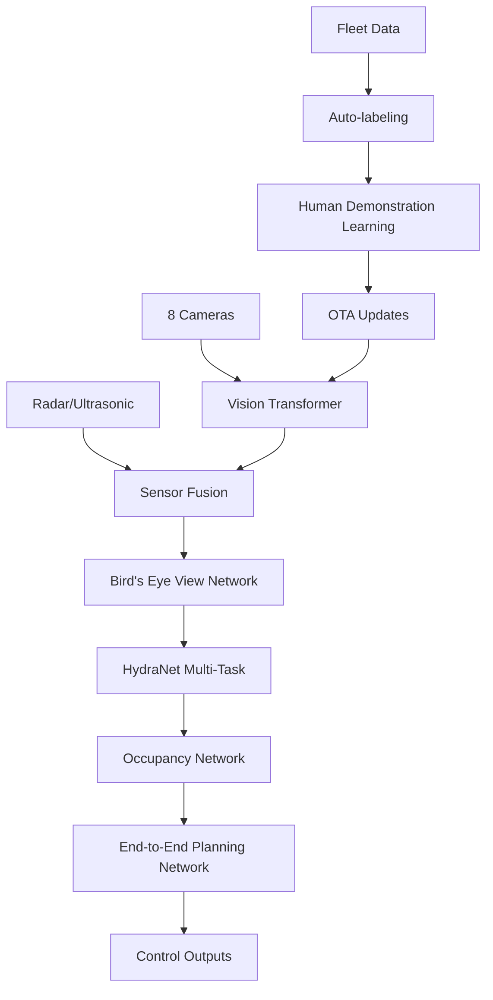

### Modular vs End-to-End Architecture Comparison

```mermaid
graph TD
    subgraph "Traditional Modular Architecture"
        subgraph "Perception Module"
            A1[Cameras] --> B1[Object Detection]
            B1 --> C1[Classification]
            C1 --> D1[Tracking]
        end
        
        subgraph "Prediction Module"
            D1 --> E1[Behavior Prediction]
            E1 --> F1[Trajectory Forecasting]
        end
        
        subgraph "Planning Module"
            F1 --> G1[Path Planning]
            G1 --> H1[Motion Planning]
        end
        
        subgraph "Control Module"
            H1 --> I1[PID Controllers]
            I1 --> J1[Actuator Commands]
        end
        
        K1["❌ Information Bottlenecks"] --> L1["❌ Error Propagation"]
        L1 --> M1["❌ Suboptimal Performance"]
        
        style B1 fill:#ffcdd2
        style E1 fill:#ffcdd2
        style G1 fill:#ffcdd2
        style I1 fill:#ffcdd2
    end
    
    subgraph "Tesla's End-to-End Architecture"
        subgraph "Unified Neural Network"
            A2[8 Cameras] --> B2[Vision Transformer]
            B2 --> C2[BEV + Occupancy]
            C2 --> D2[HydraNet]
            D2 --> E2[End-to-End Planner]
            E2 --> F2[Direct Control]
        end
        
        G2[Human Demonstrations] --> H2[Imitation Learning]
        H2 --> E2
        
        I2["✅ Joint Optimization"] --> J2["✅ End-to-End Learning"]
        J2 --> K2["✅ Optimal Performance"]
        
        style B2 fill:#c8e6c9
        style C2 fill:#c8e6c9
        style D2 fill:#c8e6c9
        style E2 fill:#c8e6c9
    end
```

**Key Architectural Differences:** [[1]](https://www.thinkautonomous.ai/blog/tesla-end-to-end-deep-learning/)

| Aspect | Modular Architecture | End-to-End Architecture |
|--------|---------------------|-------------------------|
| **Information Flow** | Sequential, with bottlenecks | Direct, optimized |
| **Error Propagation** | Cascading errors | Minimized through joint training |
| **Optimization** | Local optima per module | Global optimization |
| **Adaptability** | Rule-based, limited | Learning-based, adaptive |
| **Development** | Module-by-module | Holistic system training |
| **Performance** | Suboptimal overall | Optimal end-to-end |
| **Maintenance** | Complex integration | Unified system updates |

### Key Innovations

**1. HydraNet Multi-Task Learning**
- Single network with multiple heads for different perception tasks
- Eliminates redundant encoding operations across 20+ separate networks
- Handles object detection, lane lines, traffic signs simultaneously [[1]](https://www.thinkautonomous.ai/blog/tesla-end-to-end-deep-learning/)

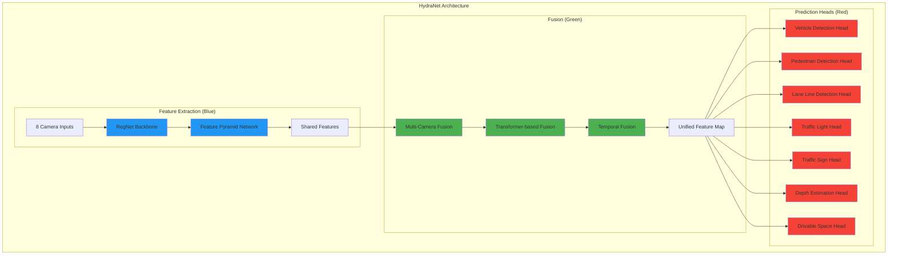

**HydraNet Components:** [[2]](https://www.thinkautonomous.ai/blog/tesla-cnns-vs-transformers/)
- **Feature Extraction (Blue)**: RegNet backbone with Feature Pyramid Networks for multi-scale features
- **Fusion (Green)**: Transformer-based multi-camera and temporal fusion
- **Prediction Heads (Red)**: Multiple task-specific heads sharing the same backbone

**2. Advanced Planning Evolution**
- **Traditional A* Algorithm**: ~400,000 node expansions for path finding
- **Enhanced A* with Navigation**: Reduced to 22,000 expansions
- **Monte-Carlo + Neural Network**: Optimized to <300 node expansions
- **End-to-End Neural Planning**: Direct learning from human demonstrations [[1]](https://www.thinkautonomous.ai/blog/tesla-end-to-end-deep-learning/)

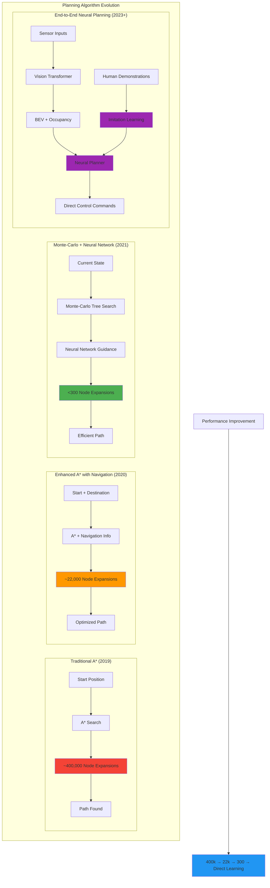

**Planning Performance Metrics:** [[1]](https://www.thinkautonomous.ai/blog/tesla-end-to-end-deep-learning/)
- **Computational Efficiency**: 1,300x improvement from traditional A* to Monte-Carlo + NN
- **Real-time Performance**: Sub-millisecond planning decisions
- **Adaptability**: End-to-end learning adapts to local driving patterns
- **Scalability**: Handles complex urban scenarios without explicit programming

**3. Occupancy Networks**
- Predicts 3D occupancy volume and occupancy flow
- Converts image space into voxels with free/occupied classification
- Provides dense spatial understanding for both static and dynamic objects
- Enhances context understanding in 3D space [[1]](https://www.thinkautonomous.ai/blog/tesla-end-to-end-deep-learning/)

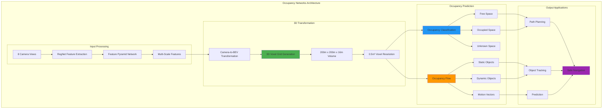

**Occupancy vs Traditional Object Detection:** [[4]](https://www.thinkautonomous.ai/blog/occupancy-networks/)

| Aspect | Traditional Detection | Occupancy Networks |
|--------|----------------------|--------------------|
| **Representation** | 2D Bounding Boxes | 3D Voxel Grid |
| **Object Coverage** | Known Classes Only | Any Physical Object |
| **Spatial Understanding** | Limited Depth | Full 3D Volume |
| **Occlusion Handling** | Poor | Excellent |
| **Overhanging Objects** | Missed | Detected |
| **Performance** | ~30 FPS | >100 FPS |
| **Memory Efficiency** | Moderate | High |

**Key Advantages:** [[4]](https://www.thinkautonomous.ai/blog/occupancy-networks/)
- **Geometry > Ontology**: Focuses on spatial occupancy rather than object classification
- **Universal Detection**: Detects any physical object, even unknown classes (e.g., construction equipment, debris)
- **3D Spatial Reasoning**: Provides complete volumetric understanding
- **Real-time Performance**: Optimized for automotive-grade inference speeds

**4. Vision Transformer (ViT) Architecture**
- Processes multi-camera inputs simultaneously
- Attention mechanisms for spatial and temporal reasoning
- Handles varying lighting and weather conditions

**5. Bird's Eye View (BEV) Representation**
- Converts camera images to top-down view
- Enables consistent spatial reasoning
- Facilitates multi-camera fusion

**6. End-to-End Neural Planning**
- Direct learning from millions of human driving examples
- Eliminates rule-based decision making
- Handles complex scenarios like unprotected left turns
- Adapts to local driving patterns through fleet learning [[0]](https://www.thinkautonomous.ai/blog/tesla-end-to-end-deep-learning/)

### Technical Specifications

**Hardware Platform (HW4):**
- Custom FSD Computer with dual redundancy
- 144 TOPS of AI compute power
- 8 cameras with 360-degree coverage
- 12 ultrasonic sensors
- Forward-facing radar

**Software Stack:**
- PyTorch-based neural networks
- Custom silicon optimization
- Real-time inference at 36 FPS
- Over-the-air update capability

### Data and Training Pipeline

**Fleet Learning Approach:**
1. **Data Collection**: Over 1 million vehicles collecting real-world data
2. **Auto-labeling**: AI systems automatically label driving scenarios
3. **Model Training**: Massive GPU clusters train neural networks
4. **Validation**: Simulation and closed-course testing
5. **Deployment**: Over-the-air updates to entire fleet

```mermaid
graph TD
    subgraph "Tesla's End-to-End Learning Pipeline"
        subgraph "Data Collection (Fleet)"
            A[1M+ Tesla Vehicles] --> B[Real-World Driving Data]
            B --> C[Edge Case Mining]
            C --> D[Targeted Data Collection]
            D --> E[Diverse Scenarios]
        end
        
        subgraph "Data Processing"
            E --> F[Auto-Labeling System]
            F --> G[Human Demonstration Extraction]
            G --> H[Multi-Modal Dataset]
            H --> I[Data Augmentation]
        end
        
        subgraph "Model Training"
            I --> J[Massive GPU Clusters]
            J --> K[End-to-End Training]
            K --> L[Joint Loss Function]
            L --> M[Model Optimization]
            
            N[Human Driving Examples] --> O[Imitation Learning]
            O --> K
        end
        
        subgraph "Validation & Testing"
            M --> P[Simulation Testing]
            P --> Q[Closed-Course Validation]
            Q --> R[Shadow Mode Testing]
            R --> S[Performance Metrics]
        end
        
        subgraph "Deployment"
            S --> T[Over-the-Air Updates]
            T --> U[Fleet-Wide Deployment]
            U --> V[Continuous Monitoring]
            V --> W[Performance Feedback]
            W --> A
        end
        
        style A fill:#4caf50
        style F fill:#2196f3
        style K fill:#ff9800
        style T fill:#9c27b0
    end
```

**Training Data Scale:**
- Millions of miles of driving data
- Diverse geographic and weather conditions
- Edge case mining and targeted data collection
- Continuous learning from fleet experiences

**End-to-End Training Process:** [[1]](https://www.thinkautonomous.ai/blog/tesla-end-to-end-deep-learning/)
- **Imitation Learning**: Neural networks learn from millions of human driving examples
- **Joint Optimization**: Perception, prediction, and planning trained together
- **Shadow Mode**: New models tested alongside production systems
- **Gradual Rollout**: Incremental deployment with safety monitoring

### Performance Metrics

**Current Capabilities (as of 2024):**
- Navigate city streets without high-definition maps
- Handle complex intersections and traffic scenarios
- Recognize and respond to traffic signs and signals
- Perform lane changes and highway merging
- Park in various scenarios (parallel, perpendicular)

**Limitations and Challenges:**
- Occasional phantom braking events
- Difficulty with construction zones
- Performance varies by geographic region
- Requires driver supervision and intervention

### Research Papers and Resources

- **[Tesla AI Day 2022](https://www.tesla.com/AI)**: Technical deep-dive into FSD architecture
- **[Occupancy Networks Paper](https://arxiv.org/abs/1812.03828)**: Foundation for 3D scene understanding
- **[BEVFormer](https://arxiv.org/abs/2203.17270)**: Bird's eye view transformer architecture
- **[Tesla FSD Beta Analysis](https://github.com/commaai/openpilot)**: Open-source analysis and comparison

---

## Vision-based Object Detection Models

Vision-based object detection has undergone significant evolution in autonomous driving, progressing from traditional 2D detection methods to sophisticated Bird's Eye View (BEV) representations that better capture spatial relationships in 3D space.

### Evolution of 2D Object Detection

#### Faster R-CNN Era (2015-2017)
**Faster R-CNN** introduced the two-stage detection paradigm that dominated early autonomous driving systems:
- **Region Proposal Network (RPN)** for generating object proposals
- **ROI pooling** for feature extraction from proposed regions
- **Classification and regression heads** for final detection
- **Advantages**: High accuracy, robust performance
- **Limitations**: Slow inference speed (~5-10 FPS), complex pipeline

```python
# Faster R-CNN Architecture
Backbone (ResNet/VGG) → Feature Maps → RPN → ROI Pooling → Classification + Regression
```

#### YOLO Revolution (2016-Present)
**YOLO (You Only Look Once)** transformed object detection with single-stage architecture:
- **YOLOv1-v3**: Grid-based detection with anchor boxes
- **YOLOv4-v5**: Enhanced with CSPNet, PANet, and advanced augmentations
- **YOLOv8-v11**: Anchor-free detection with improved efficiency
- **Real-time performance**: 30-60+ FPS on modern hardware
- **Trade-off**: Slightly lower accuracy for significantly faster inference

```python
# YOLO Architecture
Input Image → Backbone → Neck (FPN/PANet) → Detection Head → Predictions
```

#### Tesla's RegNet with FPN
**Tesla's approach** combines efficiency with accuracy using RegNet backbones:
- **RegNet (Regular Networks)**: Optimized network design with consistent structure
- **Feature Pyramid Networks (FPN)**: Multi-scale feature fusion
- **HydraNets**: Multi-task learning for simultaneous detection tasks
- **Optimizations**: Custom ASIC acceleration, quantization, pruning

**Key Innovations:**
```python
# Tesla's Multi-Task Architecture
RegNet Backbone → FPN → Multiple Task Heads:
                        ├── Vehicle Detection
                        ├── Pedestrian Detection  
                        ├── Traffic Light Detection
                        ├── Lane Line Detection
                        └── Depth Estimation
```

### Camera View to BEV Transition

The transition from perspective view to Bird's Eye View represents a paradigm shift in autonomous driving perception.

#### Perspective View Limitations
- **Occlusion issues**: Objects hidden behind others
- **Scale variation**: Distant objects appear smaller
- **Depth ambiguity**: Difficult to estimate accurate 3D positions
- **Multi-camera fusion complexity**: Overlapping fields of view

#### BEV Transformation Approaches

**1. Geometric Transformation (IPM - Inverse Perspective Mapping)**
```python
# Traditional IPM approach
Camera Image → Homography Matrix → BEV Projection
# Limitations: Assumes flat ground, poor for 3D objects
```

**2. Learning-based BEV Transformation**
- **LSS (Lift, Splat, Shoot)**: Explicit depth estimation + projection
- **BEVDet**: End-to-end learnable BEV transformation
- **PETR**: Position embedding for BEV queries
- **BEVFormer**: Temporal BEV fusion with transformers

**3. Query-based BEV Generation**
```python
# Modern BEV Pipeline
Multi-Camera Images → Feature Extraction → BEV Queries → Cross-Attention → BEV Features
```

### Latest BEV Detection Models

#### BEVFormer (2022)
**Architecture:**
- **Spatial Cross-Attention**: Projects image features to BEV space
- **Temporal Self-Attention**: Fuses historical BEV features
- **Deformable attention**: Efficient attention computation

**Performance:**
- **nuScenes NDS**: 51.7% (state-of-the-art at release)
- **Real-time capability**: ~10 FPS on modern GPUs

#### BEVDet Series (2021-2023)
**BEVDet4D** introduces temporal modeling:
```python
# BEVDet4D Pipeline
Multi-view Images → Image Encoder → View Transformer → BEV Encoder → Detection Head
                                                    ↑
                                            Temporal Fusion
```

#### PETRv2 (2023)
**Position Embedding Transformation**:
- **3D position-aware queries**: Direct 3D coordinate embedding
- **Multi-frame temporal modeling**: Historical frame integration
- **Unified detection and tracking**: End-to-end temporal consistency

#### StreamPETR (2023)
**Real-time BEV Detection**:
- **Streaming architecture**: Processes frames sequentially
- **Memory bank**: Maintains long-term temporal information
- **Propagation mechanism**: Efficient feature reuse across frames

**Performance Comparison:**
| Model | NDS (%) | Latency (ms) | Memory (GB) |
|-------|---------|--------------|-------------|
| BEVFormer | 51.7 | 100 | 8.2 |
| BEVDet4D | 45.8 | 80 | 6.5 |
| PETRv2 | 50.4 | 90 | 7.1 |
| StreamPETR | 48.9 | 60 | 5.8 |

## 3D Object Detection Models

3D object detection is crucial for autonomous driving as it provides precise spatial understanding of the environment, enabling accurate motion planning and collision avoidance. [[0]](https://www.thinkautonomous.ai/blog/voxel-vs-points/)

### Point Cloud Processing Fundamentals

Processing 3D point clouds presents unique challenges compared to traditional 2D computer vision. Unlike images with fixed dimensions and structured pixel arrangements, point clouds are inherently chaotic - they lack order, have no fixed structure, and points aren't evenly spaced. [[0]](https://www.thinkautonomous.ai/blog/voxel-vs-points/) Any random shuffling or data augmentation could destroy a convolution's output, making traditional CNNs unsuitable for direct point cloud processing.

This fundamental challenge led to the development of two primary approaches in 3D deep learning:

1. **Point-based approaches**: Process raw point clouds directly using specialized architectures
2. **Voxel-based approaches**: Convert point clouds to structured 3D grids for CNN processing

### Point-based Approaches: From PointNet to Transformers

#### PointNet (2016) - The Foundation
**PointNet** revolutionized point cloud processing by introducing the first architecture capable of directly consuming unordered point sets. [[0]](https://www.thinkautonomous.ai/blog/voxel-vs-points/)

**Architecture:**
```python
# PointNet Pipeline
Point Cloud → Shared MLPs (1x1 conv) → Spatial Transformer → Max Pooling → Classification/Segmentation
```

**Key Innovations:**
- **Shared MLPs**: Uses 1x1 convolutions instead of traditional 2D convolutions
- **Spatial Transformer Networks**: Handles rotation and scale invariance
- **Symmetric function**: Max pooling ensures permutation invariance
- **Direct point processing**: No voxelization or preprocessing required

**Capabilities:**
- Point cloud classification
- Semantic segmentation
- Part segmentation

#### Evolution of Point-based Extractors
Since PointNet's introduction, the field has seen continuous evolution: [[0]](https://www.thinkautonomous.ai/blog/voxel-vs-points/)

- **PointNet++ (2017)**: Added hierarchical feature learning
- **PointCNN (2018)**: Introduced X-transformation for local feature aggregation
- **DGCNN (2019)**: Dynamic graph convolutions for point relationships
- **PointNeXt (2022)**: Modern training strategies and architectural improvements
- **Point-MLP (2022)**: Pure MLP-based approach
- **Point Transformers v3 (2023/2024)**: Current state-of-the-art using transformer architecture

**Note**: These are feature extractors designed to learn representations from point clouds. For complete 3D object detection, they must be integrated into larger architectures.

### LiDAR-based 3D Detection Evolution

#### PointPillars (2019) - Foundation
**PointPillars** revolutionized LiDAR-based detection by introducing pillar-based point cloud processing:

**Architecture:**
```python
# PointPillars Pipeline
Point Cloud → Pillar Feature Net → 2D CNN Backbone → SSD Detection Head
```

**Key Innovations:**
- **Pillar representation**: Divides point cloud into vertical columns
- **PointNet feature extraction**: Learns features from points within each pillar
- **2D CNN processing**: Treats pillars as 2D pseudo-images
- **Real-time performance**: ~60 FPS on modern GPUs

**Advantages:**
- Fast inference suitable for real-time applications
- Simple architecture easy to implement and optimize
- Good balance between accuracy and speed

**Limitations:**
- Information loss due to pillar discretization
- Limited handling of sparse regions
- Reduced performance on small objects

#### VoxelNet and SECOND (2017-2018)
**VoxelNet** introduced voxel-based 3D CNN processing:
- **3D voxel grid**: Divides space into 3D voxels
- **Voxel Feature Encoding (VFE)**: PointNet-based feature learning
- **3D CNN backbone**: Processes voxelized features

**SECOND** improved upon VoxelNet:
- **Sparse 3D CNN**: Efficient processing of sparse voxels
- **Significant speedup**: 20x faster than VoxelNet
- **Better accuracy**: Improved small object detection

#### Point-based 3D Detection Integration

**Point-RCNN (2019)** - First Point-based Detector:
Point-RCNN demonstrated how to integrate PointNet++ into a complete 3D object detection pipeline: [[0]](https://www.thinkautonomous.ai/blog/voxel-vs-points/)

```python
# Point-RCNN Architecture
Point Cloud → PointNet++ Stage 1 → Foreground/Background → PointNet++ Stage 2 → 3D Boxes
```

**Two-stage Design:**
- **Stage 1**: PointNet++ generates 3D proposals from raw points
- **Stage 2**: PointNet++ refines proposals with bounding box regression
- **Point-based proposals**: Direct point cloud processing without voxelization
- **3D NMS**: Non-maximum suppression in 3D space

**Other Point-based Detectors:**
- **CenterPoint (2021)**: Uses PointNet++ for center-based object detection
- **H3DNet (2020)**: Hybrid 3D detection with PointNet++ backbone

#### PointRCNN and PV-RCNN Series
**PV-RCNN (2020)** - Point-Voxel Fusion:
```python
# PV-RCNN Architecture
Point Cloud → Voxel CNN → Point-Voxel Feature Aggregation → RPN → Refinement
```
- **Point-Voxel fusion**: Combines voxel and point representations
- **Keypoint sampling**: Focuses on important regions
- **State-of-the-art accuracy**: Leading performance on KITTI

### Voxel vs Point-based Approaches Comparison

| Aspect | Point-based | Voxel-based |
|--------|-------------|-------------|
| **Processing** | Direct point consumption | Grid-based discretization |
| **Memory** | Efficient for sparse data | Higher memory usage |
| **Precision** | Preserves exact point locations | Quantization artifacts |
| **Speed** | Variable (depends on points) | Consistent (fixed grid) |
| **Implementation** | More complex architectures | Leverages existing CNN tools |
| **Scalability** | Handles varying point densities | Fixed resolution limitations |

**Current Trends:** [[0]](https://www.thinkautonomous.ai/blog/voxel-vs-points/)
- Point-based approaches are becoming more sophisticated with transformer architectures
- Hybrid methods (like PV-RCNN) combine benefits of both approaches
- Real-time applications still favor voxel-based methods for consistent performance

### LiDAR-Vision Fusion Solutions

Fusing LiDAR and camera data leverages complementary strengths: LiDAR provides accurate 3D geometry while cameras offer rich semantic information. [[0]](https://www.thinkautonomous.ai/blog/bev-fusion/) However, traditional fusion approaches face a fundamental dimensionality problem: point clouds exist in 3D space while camera pixels are in 2D, creating challenges when trying to combine these heterogeneous data sources effectively.

#### The Dimensionality Challenge in Sensor Fusion

When attempting to fuse 6 camera images with a LiDAR point cloud, existing solutions typically involve projecting one space to the other: [[0]](https://www.thinkautonomous.ai/blog/bev-fusion/)

- **LiDAR to Camera Projection**: Loses geometric information
- **Camera to LiDAR Projection**: Loses rich semantic information
- **Late Fusion**: Limited to object detection tasks only

This is why **Bird's Eye View (BEV)** representation has emerged as the optimal solution - it provides a common ground that preserves both geometric structure and semantic density by adopting a unified representation space.

#### Early Fusion Approaches
**PointPainting (2020)**:
```python
# PointPainting Pipeline
Camera Images → 2D Segmentation → Point Cloud Painting → 3D Detection
```
- **Semantic painting**: Colors point clouds with 2D semantic predictions
- **Simple integration**: Minimal architectural changes
- **Consistent improvements**: 2-3% mAP gains across models

#### Late Fusion Approaches
**Frustum-based Methods**:
- **Frustum PointNets**: Projects 2D detections to 3D frustums
- **3D processing**: Processes points within projected frustums
- **Efficient computation**: Reduces 3D search space

#### Intermediate Fusion Approaches
**CLOCs (2020)**:
- **Camera-LiDAR Object Candidates**: Fuses detection candidates
- **Confidence estimation**: Learns fusion weights
- **Robust performance**: Handles sensor failures gracefully

### Spatial Transformer Networks in Autonomous Driving

Spatial Transformer Networks (STNs) have been a cornerstone algorithm in computer vision and perception since 2015, particularly valuable for autonomous driving applications. [[1]](https://www.thinkautonomous.ai/blog/spatial-transformer-networks/) The key innovation of STNs is their ability to apply spatial transformations directly in the feature space rather than on input images, making them highly practical and easy to integrate into existing neural network architectures.

#### The "Cuts" Analogy in Deep Learning

STNs can be understood through a cinematic analogy: just as movie directors use "cuts" to change perspectives, zoom in on subjects, or adjust angles, STNs provide neural networks with the ability to apply spatial transformations to feature maps. [[1]](https://www.thinkautonomous.ai/blog/spatial-transformer-networks/) Without these transformations, neural networks operate like a single uninterrupted camera take, limiting their ability to focus on relevant spatial regions.

**Key Capabilities:**
- **Zooming**: Focus on specific regions of interest (e.g., traffic signs)
- **Rotation**: Handle objects at different orientations
- **Perspective transformation**: Convert between different viewpoints
- **Translation**: Adjust spatial positioning of features

#### STN Architecture Components

The Spatial Transformer Network consists of five key components: [[1]](https://www.thinkautonomous.ai/blog/spatial-transformer-networks/)

```python
# STN Architecture Pipeline
Input Feature Map (U) → Localization Net → Grid Generator → Sampler → Output Feature Map (V)
```

**1. Localization Network**
A simple neural network that predicts transformation parameters (θ):
```python
# Example Localization Network
xs = xs.view(-1, 10 * 3 * 3)  # Flatten convolution features
theta = nn.Sequential(
    nn.Linear(10 * 3 * 3, 32),
    nn.ReLU(True),
    nn.Linear(32, 3 * 2)  # 6 parameters for 2D affine transformation
)(xs)
```

**2. Transformation Parameters (θ)**
The 6 parameters of a 2D affine transformation control: [[1]](https://www.thinkautonomous.ai/blog/spatial-transformer-networks/)
- **Scaling**: Zoom in/out on features
- **Rotation**: Rotate feature maps
- **Translation**: Shift spatial position
- **Shearing**: Apply skew transformations

**3. Grid Generator**
Creates a sampling grid that maps pixels from input to output feature maps using the θ parameters. The grid generator works backward, starting from the target output and finding corresponding source pixels.

**4. Sampler**
Performs the actual spatial transformation by:
- Using localization net predictions for transformation parameters
- Applying grid generator mappings for pixel correspondences
- Executing the final feature map transformation

#### Applications in Autonomous Driving

**1. Camera-to-BEV Transformations**
STNs are particularly valuable for converting perspective camera views to Bird's Eye View representations:
```python
# STN for BEV Transformation
Camera Features → STN (Perspective Transform) → BEV Features
```

**2. Multi-Camera Fusion**
STNs enable spatial alignment of features from multiple camera viewpoints before fusion, ensuring consistent spatial relationships across different perspectives.

**3. Point Cloud Processing**
In 3D perception, STNs can apply spatial transformations to point cloud features, enabling:
- **Coordinate system alignment**: Standardize different sensor coordinate frames
- **Temporal alignment**: Align features across time steps
- **Scale normalization**: Handle varying point cloud densities

**4. Traffic Sign Recognition**
STNs can automatically crop and normalize traffic signs within feature space, improving recognition accuracy regardless of the sign's position, scale, or orientation in the original image. [[1]](https://www.thinkautonomous.ai/blog/spatial-transformer-networks/)

#### Integration with Modern Architectures

STNs are designed to be modular and can be easily integrated into existing neural network architectures:

**Tesla's HydraNets**: STNs could enhance multi-camera fusion by spatially aligning features before the transformer-based fusion stage.

**BEV Detection Models**: STNs provide learnable spatial transformations that complement geometric projection methods for camera-to-BEV conversion.

**Point Cloud Networks**: STNs can be integrated with PointNet-based architectures to handle spatial variations in point cloud data.

#### Advantages for Autonomous Driving

1. **Learnable Transformations**: Unlike fixed geometric transformations, STNs learn optimal spatial transformations from data
2. **End-to-End Training**: STNs are differentiable and can be trained jointly with the main task
3. **Computational Efficiency**: Transformations are applied in feature space rather than raw data
4. **Robustness**: Handle spatial variations in sensor data automatically
5. **Modularity**: Can be plugged into existing architectures with minimal changes

### Advanced Multi-Modal Fusion Models

#### BEVFusion (2022) - Multi-Task Multi-Sensor Fusion

**Why BEV Fusion Works:** [[0]](https://www.thinkautonomous.ai/blog/bev-fusion/)
BEV Fusion solves the sensor fusion challenge by transforming both LiDAR and camera features into a unified Bird's Eye View representation, enabling effective fusion without information loss.

**Complete Architecture Pipeline:**
```python
# BEVFusion 5-Stage Architecture
Stage 1: Raw Data → Encoders → Features
Stage 2: Features → BEV Transformation → BEV Features  
Stage 3: BEV Features → Fusion → Unified BEV Features
Stage 4: Unified Features → BEV Encoder → Enhanced Features
Stage 5: Enhanced Features → Task Heads → Outputs
```

**Detailed Architecture Breakdown:** [[0]](https://www.thinkautonomous.ai/blog/bev-fusion/)

**Stage 1 - Encoders:**
- **Image Encoder**: ResNet, VGGNet, or similar CNN architectures
- **LiDAR Encoder**: PointNet++ for direct point processing or 3D CNNs after voxelization
- **Purpose**: Transform raw sensor data into feature representations

**Stage 2 - BEV Transformations:**

*Camera to BEV:*
- **Feature Lifting**: Predicts depth probability distribution for each pixel
- **Process**: Each pixel feature is multiplied by its most likely depth value
- **Result**: Generates camera feature point cloud in 3D space

*LiDAR to BEV:*
- **Direct mapping**: Point clouds naturally exist in 3D space
- **Grid association**: Points are associated with BEV grid cells

**BEV Pooling Operation:** [[0]](https://www.thinkautonomous.ai/blog/bev-fusion/)
```python
# BEV Pooling Process
for each_pixel in camera_features:
    depth_dist = predict_depth(pixel)
    lifted_feature = pixel_feature * most_likely_depth
    bev_grid_cell = map_to_bev_grid(lifted_feature)
    aggregate_features_in_cell(bev_grid_cell)
```

**Stage 3 - Fusion:**
- **Concatenation**: BEV features from all sensors are concatenated
- **Lightweight operation**: Minimal computational overhead
- **Unified representation**: Single feature map containing multi-modal information

**Stage 4 - BEV Encoder:**
- **Feature learning**: Specialized encoder for fused BEV features
- **Spatial relationships**: Learns spatial correlations in BEV space
- **Enhanced features**: Produces refined multi-modal representations

**Stage 5 - Task Heads:**
- **3D Object Detection**: Bounding box regression and classification
- **BEV Map Segmentation**: Semantic segmentation in BEV space
- **Multi-task learning**: Simultaneous optimization of multiple objectives

**Key Innovations:**
- **Unified BEV space**: Common representation preserving both geometry and semantics
- **Feature-level fusion**: Fuses learned features rather than raw data
- **Multi-task capability**: Supports detection and segmentation simultaneously
- **Efficient architecture**: Optimized for real-time deployment

**Performance Achievements:**
- **nuScenes mAP**: 70.2% (significant improvement over single-modal approaches)
- **Real-time capability**: Optimized inference pipeline
- **Robust fusion**: Handles varying sensor configurations and failures
- **State-of-the-art**: Leading performance across multiple benchmarks

**Advantages of BEV Fusion Approach:** [[0]](https://www.thinkautonomous.ai/blog/bev-fusion/)
- **Information preservation**: No loss of geometric or semantic information
- **Scalable fusion**: Can incorporate additional sensor modalities
- **Common representation**: Enables effective multi-sensor learning
- **Task flexibility**: Supports various downstream applications

#### TransFusion (2022)
**Transformer-based Fusion**:
- **Cross-attention mechanism**: Attends across modalities
- **Query-based detection**: Learnable object queries
- **End-to-end training**: Joint optimization of all components

#### FUTR3D (2023)
**Unified Multi-Modal Framework**:
```python
# FUTR3D Pipeline
Multi-Modal Inputs → Feature Extraction → 3D Queries → Transformer Decoder → Predictions
```
- **Modality-agnostic queries**: Works with any sensor combination
- **Temporal modeling**: Incorporates historical information
- **Scalable architecture**: Easy to add new modalities

#### MVX-Net and CenterFusion
**MVX-Net**:
- **Multi-view cross-attention**: Fuses features across views
- **Voxel-point hybrid**: Combines different representations
- **Flexible architecture**: Supports various sensor configurations

**CenterFusion**:
- **Center-based detection**: Predicts object centers in BEV
- **Frustum association**: Links 2D and 3D detections
- **Velocity estimation**: Predicts object motion

### Performance Comparison

**nuScenes Test Set Results:**
| Model | Modality | mAP (%) | NDS (%) | Latency (ms) |
|-------|----------|---------|---------|-------------|
| PointPillars | LiDAR | 30.5 | 45.3 | 16 |
| PV-RCNN | LiDAR | 57.9 | 65.4 | 80 |
| BEVFormer | Camera | 41.6 | 51.7 | 100 |
| BEVFusion | LiDAR+Camera | 70.2 | 72.9 | 120 |
| TransFusion | LiDAR+Camera | 68.9 | 71.7 | 110 |
| FUTR3D | LiDAR+Camera | 69.5 | 72.1 | 95 |

### Current Challenges and Future Directions

**Technical Challenges:**
1. **Real-time processing**: Balancing accuracy with inference speed
2. **Sensor calibration**: Maintaining precise alignment across modalities
3. **Weather robustness**: Handling adverse conditions (rain, snow, fog)
4. **Long-range detection**: Detecting objects at highway speeds
5. **Small object detection**: Pedestrians and cyclists at distance

**Emerging Trends:**
1. **4D radar integration**: Adding radar to LiDAR-camera fusion
2. **Occupancy prediction**: Dense 3D scene understanding
3. **Temporal consistency**: Maintaining object identity across frames
4. **Uncertainty estimation**: Quantifying detection confidence
5. **Edge deployment**: Optimizing for automotive hardware constraints

**Research Directions:**
- **Neural architecture search**: Automated model design for 3D detection
- **Self-supervised learning**: Reducing annotation requirements
- **Domain adaptation**: Generalizing across different environments
- **Continual learning**: Adapting to new scenarios without forgetting

---

## Localization and Mapping

Simultaneous Localization and Mapping (SLAM) is a fundamental capability for autonomous vehicles, enabling them to build maps of unknown environments while simultaneously determining their location within those maps. Modern SLAM systems integrate multiple sensor modalities and leverage deep learning techniques to achieve robust, real-time performance in challenging conditions.

### Overview of SLAM Technologies

SLAM systems can be categorized based on their primary sensor modalities and algorithmic approaches:

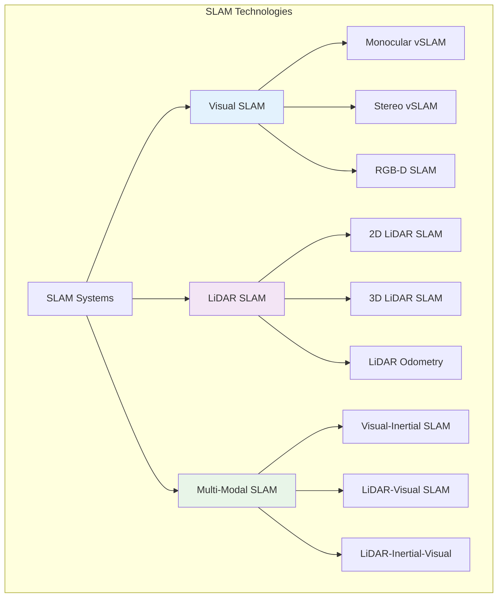

### Visual SLAM (vSLAM) Solutions

Visual SLAM systems use camera sensors to simultaneously estimate camera motion and reconstruct 3D scene structure. These systems are cost-effective and provide rich semantic information.

#### Classical vSLAM Approaches

**1. ORB-SLAM3 (2021)**

**Overview:**
ORB-SLAM3 is a complete SLAM system for monocular, stereo, and RGB-D cameras, including visual-inertial combinations. It represents the state-of-the-art in feature-based visual SLAM.

**Key Features:**
- **Multi-modal support**: Monocular, stereo, RGB-D, and visual-inertial
- **Loop closure detection**: Robust place recognition and map optimization
- **Map reuse**: Ability to save and load maps for localization
- **Real-time performance**: Optimized for real-time operation

**Architecture:**
```python
class ORBSLAM3:
    def __init__(self, sensor_type, vocabulary, settings):
        self.tracking = Tracking()
        self.local_mapping = LocalMapping()
        self.loop_closing = LoopClosing()
        self.atlas = Atlas()  # Multi-map management
        
    def process_frame(self, image, timestamp, imu_data=None):
        # Extract ORB features
        keypoints, descriptors = self.extract_orb_features(image)
        
        # Track camera pose
        pose = self.tracking.track_frame(keypoints, descriptors)
        
        # Update local map
        if self.tracking.is_keyframe():
            self.local_mapping.process_keyframe()
            
        # Detect loop closures
        if self.loop_closing.detect_loop():
            self.loop_closing.correct_loop()
            
        return pose, self.atlas.get_current_map()
```

**Performance Metrics:**
- **Accuracy**: Sub-meter accuracy in large-scale environments
- **Robustness**: Handles dynamic objects and lighting changes
- **Efficiency**: Real-time performance on standard CPUs

**Applications in Autonomous Driving:**
- **Urban navigation**: Building detailed maps of city environments
- **Parking assistance**: Precise localization in parking lots
- **Backup localization**: When GPS is unavailable or unreliable

**2. DSO (Direct Sparse Odometry)**

**Overview:**
DSO is a direct method that optimizes photometric error instead of feature matching, providing dense semi-dense reconstruction.

**Key Innovations:**
- **Direct method**: No feature extraction or matching
- **Photometric calibration**: Handles exposure and vignetting
- **Windowed optimization**: Maintains recent keyframes for optimization

**Advantages:**
- **Dense reconstruction**: More detailed scene geometry
- **Robust to textureless regions**: Works where feature-based methods fail
- **Photometric consistency**: Handles lighting variations

#### Deep Learning-Based vSLAM

**1. DROID-SLAM (2021)**

**Overview:**
DROID-SLAM combines classical SLAM with deep learning, using a recurrent neural network to predict optical flow and depth.

**Architecture:**
```python
class DroidSLAM:
    def __init__(self):
        self.feature_net = FeatureNetwork()  # CNN feature extractor
        self.update_net = UpdateNetwork()    # GRU-based update
        self.depth_net = DepthNetwork()      # Depth prediction
        
    def track(self, image_sequence):
        # Extract features
        features = [self.feature_net(img) for img in image_sequence]
        
        # Initialize poses and depths
        poses = self.initialize_poses(features)
        depths = [self.depth_net(f) for f in features]
        
        # Iterative refinement
        for iteration in range(self.num_iterations):
            # Compute optical flow
            flow = self.compute_flow(features, poses, depths)
            
            # Update poses and depths
            poses, depths = self.update_net(poses, depths, flow)
            
        return poses, depths
```

**Key Advantages:**
- **End-to-end learning**: Jointly optimizes all components
- **Robust tracking**: Handles challenging scenarios
- **Dense depth estimation**: Provides detailed 3D reconstruction

**2. Neural SLAM Approaches**

**Concept:**
Neural SLAM systems use neural networks to represent maps and estimate poses, enabling continuous learning and adaptation.

**iMAP (2021):**
- **Implicit mapping**: Uses neural radiance fields (NeRF) for mapping
- **Continuous representation**: Smooth, differentiable map representation
- **Joint optimization**: Simultaneous pose and map optimization

### LiDAR Odometry and SLAM Solutions

LiDAR-based systems provide accurate 3D geometry and are robust to lighting conditions, making them essential for autonomous driving applications.

#### Classical LiDAR SLAM

**1. LOAM (LiDAR Odometry and Mapping)**

**Overview:**
LOAM is a foundational approach that separates odometry estimation from mapping to achieve real-time performance.

**Two-Stage Architecture:**
```python
class LOAM:
    def __init__(self):
        self.odometry = LidarOdometry()  # High-frequency pose estimation
        self.mapping = LidarMapping()    # Low-frequency map building
        
    def process_scan(self, point_cloud, timestamp):
        # Stage 1: Fast odometry estimation
        pose_estimate = self.odometry.estimate_motion(point_cloud)
        
        # Stage 2: Accurate mapping (runs at lower frequency)
        if self.should_update_map():
            refined_pose = self.mapping.refine_pose(point_cloud, pose_estimate)
            self.mapping.update_map(point_cloud, refined_pose)
            
        return pose_estimate
```

**Feature Extraction:**
- **Edge features**: Sharp geometric features for odometry
- **Planar features**: Smooth surfaces for mapping
- **Curvature-based selection**: Automatic feature classification

**2. LeGO-LOAM (2018)**

**Improvements over LOAM:**
- **Ground segmentation**: Separates ground and non-ground points
- **Point cloud segmentation**: Groups points into objects
- **Loop closure detection**: Global consistency through place recognition

#### Advanced LiDAR SLAM Systems

**1. FAST-LIO2 (2022)**

**Overview:**
FAST-LIO2 is a computationally efficient and robust LiDAR-inertial odometry system that directly registers raw points without feature extraction.

**Key Innovations:**
- **Direct point registration**: No feature extraction required
- **Incremental mapping**: Efficient map updates using ikd-Tree
- **Tightly-coupled IMU integration**: Robust motion estimation

**Architecture:**
```python
class FastLIO2:
    def __init__(self):
        self.ikd_tree = IKDTree()  # Incremental k-d tree for mapping
        self.eskf = ErrorStateKalmanFilter()  # IMU integration
        
    def process_measurements(self, lidar_scan, imu_data):
        # Predict state using IMU
        predicted_state = self.eskf.predict(imu_data)
        
        # Register LiDAR scan to map
        correspondences = self.find_correspondences(lidar_scan, self.ikd_tree)
        
        # Update state estimate
        updated_state = self.eskf.update(correspondences)
        
        # Update map incrementally
        self.ikd_tree.update(lidar_scan, updated_state.pose)
        
        return updated_state
```

**Performance:**
- **Real-time capability**: >100 Hz processing on standard hardware
- **Accuracy**: Centimeter-level accuracy in large-scale environments
- **Robustness**: Handles aggressive motions and degenerate scenarios

**2. FAST-LIVO2: LiDAR-Inertial-Visual Odometry** [[0]](https://github.com/hku-mars/FAST-LIVO2)

**Overview:**
FAST-LIVO2 represents the state-of-the-art in multi-modal SLAM, combining LiDAR, IMU, and visual sensors for robust localization and mapping in challenging environments.

**Multi-Modal Architecture:**
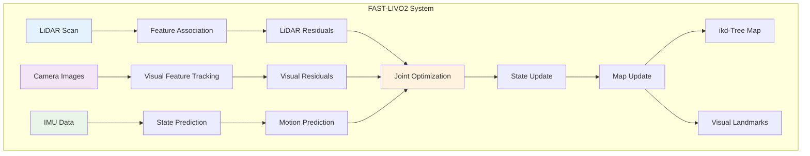

**Technical Implementation:**
```python
class FastLIVO2:
    def __init__(self):
        self.lidar_processor = LidarProcessor()
        self.visual_processor = VisualProcessor()
        self.imu_processor = IMUProcessor()
        self.joint_optimizer = JointOptimizer()
        self.map_manager = MapManager()
        
    def process_multi_modal_data(self, lidar_scan, images, imu_data):
        # Process each modality
        lidar_features = self.lidar_processor.extract_features(lidar_scan)
        visual_features = self.visual_processor.track_features(images)
        motion_prediction = self.imu_processor.predict_motion(imu_data)
        
        # Joint optimization
        optimized_state = self.joint_optimizer.optimize(
            lidar_residuals=self.compute_lidar_residuals(lidar_features),
            visual_residuals=self.compute_visual_residuals(visual_features),
            motion_prior=motion_prediction
        )
        
        # Update maps
        self.map_manager.update_lidar_map(lidar_scan, optimized_state)
        self.map_manager.update_visual_map(visual_features, optimized_state)
        
        return optimized_state
```

**Key Advantages:**
- **Complementary sensors**: LiDAR provides geometry, cameras provide texture
- **Robust in degraded conditions**: Handles scenarios where individual sensors fail
- **High accuracy**: Sub-centimeter accuracy in structured environments
- **Real-time performance**: Optimized for onboard processing

**Applications:**
- **Autonomous driving**: Robust localization in urban and highway environments
- **Robotics**: Mobile robot navigation in complex environments
- **Mapping**: High-quality 3D reconstruction for HD map creation

#### Learning-Based LiDAR SLAM

**1. DeepLO (Deep LiDAR Odometry)**

**Concept:**
Uses deep neural networks to directly estimate motion from consecutive LiDAR scans.

**Architecture:**
```python
class DeepLO:
    def __init__(self):
        self.feature_extractor = PointNet()  # Point cloud feature extraction
        self.motion_estimator = LSTM()       # Temporal motion modeling
        self.pose_regressor = MLP()          # Pose prediction
        
    def estimate_motion(self, scan_t0, scan_t1):
        # Extract features from both scans
        features_t0 = self.feature_extractor(scan_t0)
        features_t1 = self.feature_extractor(scan_t1)
        
        # Concatenate features
        combined_features = torch.cat([features_t0, features_t1], dim=1)
        
        # Estimate relative motion
        motion_features = self.motion_estimator(combined_features)
        relative_pose = self.pose_regressor(motion_features)
        
        return relative_pose
```

**2. LO-Net and LO-Net++**

**Innovations:**
- **Mask prediction**: Identifies dynamic objects for robust odometry
- **Uncertainty estimation**: Provides confidence measures for poses
- **Temporal consistency**: Maintains smooth trajectories

### Multi-Modal SLAM Integration

#### Sensor Fusion Strategies

**1. Tightly-Coupled Fusion**

**Approach:**
All sensors contribute to a single optimization problem, enabling maximum information sharing.

**Advantages:**
- **Optimal accuracy**: Uses all available information
- **Robust to sensor failures**: Graceful degradation
- **Consistent estimates**: Single unified state estimate

**Challenges:**
- **Computational complexity**: Joint optimization is expensive
- **Synchronization requirements**: Precise temporal alignment needed
- **Calibration sensitivity**: Requires accurate sensor calibration

**2. Loosely-Coupled Fusion**

**Approach:**
Each sensor modality runs independently, with fusion at the pose level.

**Implementation:**
```python
class LooselyCoupleSLAM:
    def __init__(self):
        self.visual_slam = ORB_SLAM3()
        self.lidar_slam = FAST_LIO2()
        self.pose_fusion = ExtendedKalmanFilter()
        
    def process_sensors(self, image, lidar_scan, imu_data):
        # Independent processing
        visual_pose = self.visual_slam.process(image)
        lidar_pose = self.lidar_slam.process(lidar_scan, imu_data)
        
        # Pose-level fusion
        fused_pose = self.pose_fusion.fuse_poses(
            visual_pose, lidar_pose
        )
        
        return fused_pose
```

#### State-of-the-Art Multi-Modal Systems

**1. VINS-Fusion**

**Overview:**
A robust visual-inertial SLAM system that can optionally integrate GPS and other sensors.

**Features:**
- **Stereo and mono support**: Flexible camera configurations
- **Loop closure**: Global consistency through place recognition
- **Relocalization**: Recovery from tracking failures

**2. LVI-SAM (LiDAR-Visual-Inertial SLAM)**

**Architecture:**
Combines LiDAR and visual-inertial odometry with factor graph optimization.

**Key Components:**
- **Visual-inertial system**: Provides high-frequency pose estimates
- **LiDAR mapping**: Builds accurate 3D maps
- **Factor graph optimization**: Global consistency and loop closure

### Performance Evaluation and Benchmarks

#### Standard Datasets

**1. KITTI Dataset**
- **Sensors**: Stereo cameras, LiDAR, GPS/IMU
- **Environment**: Urban and highway driving
- **Metrics**: Translational and rotational errors

**2. EuRoC Dataset**
- **Sensors**: Stereo cameras, IMU
- **Environment**: Indoor and outdoor MAV flights
- **Ground truth**: Motion capture system

**3. TUM RGB-D Dataset**
- **Sensors**: RGB-D camera
- **Environment**: Indoor scenes
- **Applications**: Dense SLAM evaluation

#### Performance Metrics

**Accuracy Metrics:**
- **Absolute Trajectory Error (ATE)**: End-to-end trajectory accuracy
- **Relative Pose Error (RPE)**: Local consistency measurement
- **Map Quality**: Reconstruction accuracy and completeness

**Efficiency Metrics:**
- **Processing time**: Real-time capability assessment
- **Memory usage**: Resource consumption analysis
- **Power consumption**: Important for mobile platforms

**Robustness Metrics:**
- **Tracking success rate**: Percentage of successful tracking
- **Recovery capability**: Ability to recover from failures
- **Environmental robustness**: Performance across conditions

### Challenges and Future Directions

#### Current Challenges

**1. Dynamic Environments**
- **Moving objects**: Cars, pedestrians, cyclists
- **Seasonal changes**: Vegetation, weather conditions
- **Construction zones**: Temporary changes to environment

**2. Computational Constraints**
- **Real-time requirements**: Autonomous driving demands low latency
- **Power limitations**: Mobile platforms have limited computational resources
- **Memory constraints**: Large-scale mapping requires efficient data structures

**3. Sensor Limitations**
- **Weather sensitivity**: Rain, snow, fog affect sensor performance
- **Lighting conditions**: Extreme lighting challenges visual sensors
- **Sensor degradation**: Long-term reliability and calibration drift

#### Emerging Research Directions

**1. Neural SLAM**
- **Implicit representations**: Neural radiance fields for mapping
- **End-to-end learning**: Jointly learning perception and SLAM
- **Continual learning**: Adapting to new environments without forgetting

**2. Semantic SLAM**
- **Object-level mapping**: Building semantic maps with object instances
- **Scene understanding**: Incorporating high-level scene knowledge
- **Language integration**: Natural language descriptions of environments

**3. Collaborative SLAM**
- **Multi-agent systems**: Multiple vehicles sharing mapping information
- **Cloud-based mapping**: Centralized map building and distribution
- **Federated learning**: Privacy-preserving collaborative mapping

**4. Robust and Adaptive Systems**
- **Uncertainty quantification**: Providing confidence measures for estimates
- **Failure detection**: Identifying and recovering from system failures
- **Online adaptation**: Adjusting to changing sensor characteristics

### Integration with Autonomous Driving Systems

#### Localization for Autonomous Driving

**Requirements:**
- **Lane-level accuracy**: Sub-meter precision for safe navigation
- **Real-time performance**: Low-latency pose estimates
- **Global consistency**: Integration with HD maps and GPS
- **Reliability**: Robust operation in all weather conditions

**Implementation Strategy:**
```python
class AutonomousDrivingLocalization:
    def __init__(self):
        self.slam_system = FAST_LIVO2()  # Primary localization
        self.hd_map_matcher = HDMapMatcher()  # Map-based localization
        self.gps_fusion = GPSFusion()  # Global positioning
        self.integrity_monitor = IntegrityMonitor()  # Safety monitoring
        
    def localize(self, sensor_data):
        # Primary SLAM-based localization
        slam_pose = self.slam_system.process(sensor_data)
        
        # HD map matching for lane-level accuracy
        map_matched_pose = self.hd_map_matcher.match(slam_pose, sensor_data)
        
        # GPS fusion for global consistency
        global_pose = self.gps_fusion.fuse(map_matched_pose, sensor_data.gps)
        
        # Monitor integrity and provide confidence
        confidence = self.integrity_monitor.assess(global_pose, sensor_data)
        
        return global_pose, confidence
```

#### HD Map Building

**Process:**
1. **Data collection**: Multiple vehicles collect sensor data
2. **SLAM processing**: Build detailed 3D maps of road networks
3. **Semantic annotation**: Add lane markings, traffic signs, signals
4. **Quality assurance**: Validate map accuracy and completeness
5. **Distribution**: Deploy maps to autonomous vehicles

**Technical Requirements:**
- **Centimeter accuracy**: Precise geometric representation
- **Semantic richness**: Detailed annotation of road elements
- **Scalability**: Efficient processing of city-scale data
- **Updateability**: Handling changes in road infrastructure

---

## Vision-Language Models in Perception

Vision-Language Models (VLMs) represent a breakthrough in multimodal AI, enabling systems to understand and reason about visual content using natural language. In autonomous driving, these models bridge the gap between raw sensor data and high-level semantic understanding, enabling more robust and interpretable perception systems.

### Core Vision-Language Models

#### CLIP (Contrastive Language-Image Pre-training)

**Overview:**
CLIP, developed by OpenAI, learns visual concepts from natural language supervision by training on 400 million image-text pairs from the internet.

**Architecture:**
```
Text Encoder (Transformer) ←→ Contrastive Learning ←→ Image Encoder (ViT/ResNet)
```

**Key Innovations:**
- Zero-shot classification capabilities
- Robust to distribution shifts
- Natural language queries for object detection
- Scalable training on web-scale data

**Applications in Autonomous Driving:**
- **Semantic Scene Understanding**: "Is there a school zone ahead?"
- **Object Classification**: Zero-shot recognition of unusual objects
- **Traffic Sign Recognition**: Natural language descriptions of signs
- **Weather Condition Assessment**: "Is the road wet from rain?"

**Research Papers:**
- [Learning Transferable Visual Models From Natural Language Supervision](https://arxiv.org/abs/2103.00020)
- [CLIP Code Repository](https://github.com/openai/CLIP)

#### BLIP (Bootstrapping Language-Image Pre-training)

**Overview:**
BLIP addresses the noisy web data problem in vision-language learning through a bootstrapping approach that generates synthetic captions and filters noisy ones.

**Architecture Components:**
1. **Image-Text Contrastive Learning** (ITC)
2. **Image-Text Matching** (ITM) 
3. **Image-Conditioned Language Modeling** (LM)

**Key Features:**
- Unified encoder-decoder architecture
- Synthetic caption generation
- Noise-robust training
- Strong performance on downstream tasks

**Autonomous Driving Applications:**
- **Scene Description**: Generating natural language descriptions of driving scenarios
- **Anomaly Detection**: Identifying unusual situations through language
- **Driver Assistance**: Providing verbal descriptions of road conditions
- **Training Data Augmentation**: Generating captions for unlabeled driving footage

**Research Resources:**
- [BLIP: Bootstrapping Language-Image Pre-training](https://arxiv.org/abs/2201.12086)
- [BLIP-2: Bootstrapping Vision-Language Pre-training](https://arxiv.org/abs/2301.12597)
- [BLIP Implementation](https://github.com/salesforce/BLIP)

#### GPT-4V (GPT-4 with Vision)

**Overview:**
GPT-4V extends the capabilities of GPT-4 to process and understand images, enabling sophisticated visual reasoning and multimodal conversations.

**Capabilities:**
- Detailed image analysis and description
- Visual question answering
- Spatial reasoning and object relationships
- Multi-step visual reasoning tasks

**Autonomous Driving Applications:**
- **Complex Scene Analysis**: Understanding intricate traffic scenarios
- **Decision Explanation**: Providing detailed reasoning for driving decisions
- **Passenger Interaction**: Answering questions about the environment
- **Safety Assessment**: Evaluating potential hazards in real-time

**Example Interactions:**
```
Human: "What should I be careful about in this intersection?"
GPT-4V: "I can see a busy four-way intersection with:
- A cyclist approaching from the right
- Pedestrians waiting at the crosswalk
- A delivery truck partially blocking the view
- Traffic lights showing yellow
I recommend proceeding cautiously and checking for the cyclist's trajectory."
```

**Research and Documentation:**
- [GPT-4V System Card](https://openai.com/research/gpt-4v-system-card)
- [GPT-4V Technical Report](https://arxiv.org/abs/2303.08774)

### Advanced Vision-Language Architectures

#### LLaVA (Large Language and Vision Assistant)

**Innovation:**
Combines a vision encoder with a large language model to enable detailed visual understanding and conversation.

**Architecture:**
```
Vision Encoder (CLIP ViT) → Projection Layer → Language Model (Vicuna/LLaMA)
```

**Autonomous Driving Potential:**
- Real-time scene narration
- Interactive driving assistance
- Complex reasoning about traffic scenarios

**Resources:**
- [Visual Instruction Tuning](https://arxiv.org/abs/2304.08485)
- [LLaVA GitHub Repository](https://github.com/haotian-liu/LLaVA)

#### DALL-E and Generative Models

**Applications in Simulation:**
- Generating diverse training scenarios
- Creating edge case situations
- Augmenting real-world data with synthetic examples

### Integration Challenges and Solutions

#### 1. **Real-time Performance**

**Challenge:** VLMs are computationally expensive for real-time applications.

**Solutions:**
- Model compression and quantization
- Edge-optimized architectures
- Hierarchical processing (coarse-to-fine)
- Specialized hardware acceleration

#### 2. **Safety and Reliability**

**Challenge:** Ensuring consistent and safe outputs in critical scenarios.

**Solutions:**
- Uncertainty quantification
- Multi-model ensemble approaches
- Formal verification methods
- Fail-safe mechanisms

#### 3. **Domain Adaptation**

**Challenge:** Adapting general VLMs to automotive-specific scenarios.

**Solutions:**
- Fine-tuning on driving datasets
- Domain-specific prompt engineering
- Transfer learning techniques
- Continuous learning from fleet data

### Future Directions

#### Emerging Trends:
1. **Multimodal Transformers**: Unified architectures for all sensor modalities
2. **Few-shot Learning**: Rapid adaptation to new scenarios
3. **Causal Reasoning**: Understanding cause-and-effect in driving scenarios
4. **Temporal Modeling**: Incorporating time-series understanding
5. **Interactive Learning**: Learning from human feedback and corrections

---

## 3D Scene Reconstruction and Geometry Understanding

3D scene reconstruction is fundamental to autonomous driving, enabling vehicles to understand the spatial structure of their environment. Recent advances in neural networks have revolutionized 3D computer vision, with models like VGGT leading the way in unified 3D scene understanding.

### VGGT: Visual Geometry Grounded Transformer

**Overview:** [[0]](https://vgg-t.github.io/)
VGGT (Visual Geometry Grounded Transformer) represents a breakthrough in 3D computer vision, being a feed-forward neural network that directly infers all key 3D attributes of a scene from one, a few, or hundreds of views. This approach marks a significant step forward in 3D computer vision, where models have typically been constrained to and specialized for single tasks.

**Key Capabilities:** [[0]](https://vgg-t.github.io/)
- **Camera Parameter Estimation**: Automatic inference of camera extrinsics and intrinsics
- **Multi-view Depth Estimation**: Dense depth prediction across multiple viewpoints
- **Dense Point Cloud Reconstruction**: High-quality 3D point cloud generation
- **Point Tracking**: Consistent feature tracking across frames
- **Real-time Performance**: Reconstruction in under one second

#### VGGT Architecture

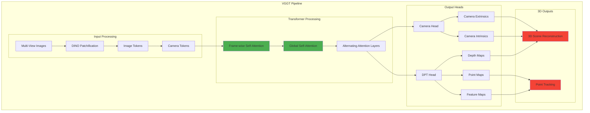

**Technical Implementation:** [[0]](https://vgg-t.github.io/)

```python
class VGGT:
    def __init__(self):
        self.dino_encoder = DINOEncoder()  # Patchify input images
        self.transformer = VGGTransformer()  # Alternating attention layers
        self.camera_head = CameraHead()  # Camera parameter prediction
        self.dpt_head = DPTHead()  # Dense prediction tasks
        
    def forward(self, images):
        # Patchify images into tokens
        image_tokens = self.dino_encoder(images)
        
        # Add camera tokens for camera prediction
        camera_tokens = self.create_camera_tokens(len(images))
        tokens = torch.cat([image_tokens, camera_tokens], dim=1)
        
        # Process through transformer with alternating attention
        features = self.transformer(tokens)
        
        # Predict camera parameters
        camera_params = self.camera_head(features)
        
        # Generate dense outputs (depth, point maps, features)
        dense_outputs = self.dpt_head(features)
        
        return {
            'camera_extrinsics': camera_params['extrinsics'],
            'camera_intrinsics': camera_params['intrinsics'],
            'depth_maps': dense_outputs['depth'],
            'point_maps': dense_outputs['points'],
            'feature_maps': dense_outputs['features']
        }
```

#### Key Innovations

**1. Unified Multi-Task Learning** [[0]](https://vgg-t.github.io/)
- Single network handles multiple 3D tasks simultaneously
- Joint optimization of camera estimation, depth prediction, and point tracking
- Eliminates need for separate specialized models

**2. Alternating Attention Mechanism**
- **Frame-wise Attention**: Processes individual images for local features
- **Global Attention**: Integrates information across all views
- **Scalable Architecture**: Handles one to hundreds of input views

**3. Feed-Forward Efficiency** [[0]](https://vgg-t.github.io/)
- Direct inference without iterative optimization
- Sub-second reconstruction times
- Outperforms traditional methods without post-processing

#### Performance and Applications

**State-of-the-Art Results:** [[0]](https://vgg-t.github.io/)
- **Camera Parameter Estimation**: Superior accuracy on standard benchmarks
- **Multi-view Depth Estimation**: Consistent depth across viewpoints
- **Dense Point Cloud Reconstruction**: High-quality 3D reconstructions
- **Point Tracking**: Robust feature correspondence across frames

**Autonomous Driving Applications:**

1. **Real-time 3D Mapping**
   - Instant environment reconstruction from camera feeds
   - Dynamic obstacle detection and tracking
   - Road surface and geometry understanding

2. **Multi-Camera Calibration**
   - Automatic camera parameter estimation
   - Real-time calibration updates
   - Robust to camera displacement

3. **Enhanced Perception**
   - Dense depth estimation for path planning
   - 3D object localization and tracking
   - Occlusion handling through multi-view reasoning

4. **SLAM Integration**
   - Visual odometry and mapping
   - Loop closure detection
   - Consistent map building

**Implementation Example:**

```python
class AutonomousDrivingVGGT:
    def __init__(self):
        self.vggt = VGGT()
        self.path_planner = PathPlanner()
        self.object_tracker = ObjectTracker()
        
    def process_camera_feeds(self, camera_images):
        # Run VGGT inference
        scene_3d = self.vggt(camera_images)
        
        # Extract 3D scene information
        depth_maps = scene_3d['depth_maps']
        point_cloud = scene_3d['point_maps']
        camera_poses = scene_3d['camera_extrinsics']
        
        # Update 3D world model
        self.update_world_model(point_cloud, camera_poses)
        
        # Plan safe trajectory
        trajectory = self.path_planner.plan(
            current_pose=camera_poses[-1],
            obstacles=self.extract_obstacles(depth_maps),
            free_space=self.extract_free_space(point_cloud)
        )
        
        # Track dynamic objects
        tracked_objects = self.object_tracker.update(
            features=scene_3d['feature_maps'],
            depth=depth_maps
        )
        
        return {
            'trajectory': trajectory,
            'tracked_objects': tracked_objects,
            'scene_3d': scene_3d
        }
```

#### Comparison with Traditional Methods

| Aspect | Traditional SLAM | VGGT |
|--------|------------------|------|
| **Processing Time** | Minutes to hours | <1 second |
| **Multi-Task Capability** | Specialized systems | Unified approach |
| **Scalability** | Limited views | 1 to hundreds of views |
| **Optimization** | Iterative refinement | Direct inference |
| **Robustness** | Sensitive to initialization | End-to-end learned |
| **Real-time Performance** | Challenging | Native support |

#### Future Directions and Research

**Current Limitations:**
- Requires sufficient visual overlap between views
- Performance in low-texture environments
- Handling of dynamic scenes

**Research Opportunities:**
1. **Temporal Integration**: Incorporating video sequences for better consistency
2. **Multi-Modal Fusion**: Integration with LiDAR and radar data
3. **Dynamic Scene Handling**: Better modeling of moving objects
4. **Uncertainty Quantification**: Confidence estimation for safety-critical applications
5. **Edge Deployment**: Optimization for automotive hardware constraints

**Related Work and Comparisons:**
- **DUSt3R**: Dense reconstruction from stereo pairs
- **Fast3R**: Real-time 3D reconstruction
- **FLARE**: Fast light-weight reconstruction
- **Traditional Structure-from-Motion**: Classical multi-view geometry

### Integration with Autonomous Driving Systems

**System Architecture Integration:**

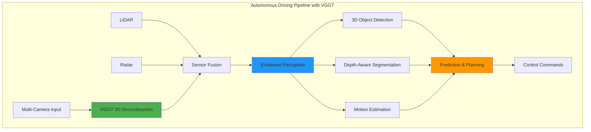

**Benefits for Autonomous Driving:**
1. **Enhanced Spatial Understanding**: Dense 3D reconstruction improves navigation
2. **Real-time Performance**: Sub-second inference enables reactive planning
3. **Multi-View Consistency**: Robust perception across camera viewpoints
4. **Reduced Sensor Dependency**: Rich 3D information from cameras alone
5. **Cost-Effective Solution**: Leverages existing camera infrastructure

---

## Multimodal Sensor Fusion with Unified Embeddings

Modern autonomous vehicles integrate multiple sensor modalities to create a comprehensive understanding of their environment. The challenge lies in effectively fusing heterogeneous data streams into a unified representation that enables robust decision-making.

### Sensor Modalities in Autonomous Vehicles

#### Autonomous Vehicle Sensor Suite Overview

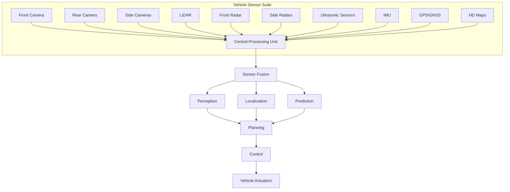

#### Primary Sensors

**1. Cameras (RGB/Infrared)**
- **Advantages**: Rich semantic information, color, texture, traffic signs
- **Limitations**: Weather sensitivity, lighting conditions, depth ambiguity
- **Data Format**: 2D images, video streams
- **Typical Resolution**: 1920×1080 to 4K at 30-60 FPS

**2. LiDAR (Light Detection and Ranging)**
- **Advantages**: Precise 3D geometry, weather robust, long range
- **Limitations**: Expensive, limited semantic information, sparse data
- **Data Format**: 3D point clouds
- **Typical Specs**: 64-128 beams, 10-20 Hz, 100-200m range

**3. Radar**
- **Advantages**: All-weather operation, velocity measurement, long range
- **Limitations**: Low resolution, limited object classification
- **Data Format**: Range-Doppler maps, point clouds
- **Frequency Bands**: 24 GHz, 77-81 GHz

**4. Ultrasonic Sensors**
- **Advantages**: Close-range precision, low cost
- **Limitations**: Very short range, weather sensitive
- **Applications**: Parking assistance, blind spot detection

#### Auxiliary Sensors

**5. IMU (Inertial Measurement Unit)**
- Acceleration and angular velocity
- Vehicle dynamics estimation
- Sensor fusion reference frame

**6. GPS/GNSS**
- Global positioning
- Route planning and localization
- Map matching and lane-level positioning

**7. HD Maps**
- Prior semantic information
- Lane geometry and traffic rules
- Static object locations

### Unified Embedding Approaches

#### Sensor Fusion Strategy Comparison

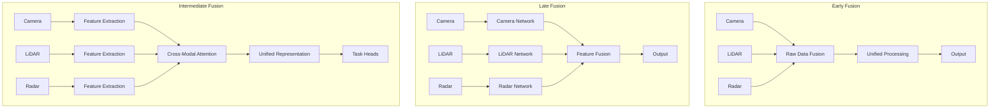

### Aurora's Deep Learning Sensor Fusion: A Case Study

**Aurora's Multi-Modal Approach** [[0]](https://www.thinkautonomous.ai/blog/aurora-deep-learning-sensor-fusion-motion-prediction/)

Aurora (Amazon's autonomous driving subsidiary) demonstrates a sophisticated early fusion approach that integrates LiDAR, camera, radar, and HD map data using deep learning. Their system showcases how neural networks can effectively handle multi-modal sensor fusion for autonomous trucking, delivery, and robotaxi applications.

#### Aurora's Sensor Fusion Pipeline

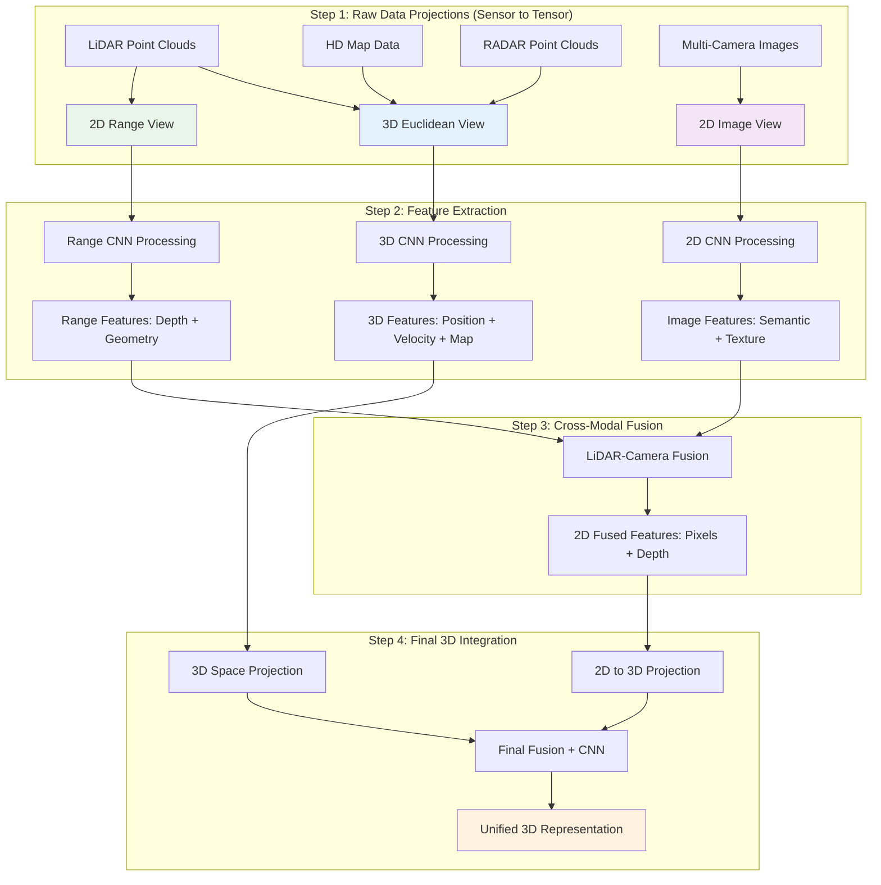

#### Technical Implementation Details

**Step 1 - Coordinate Frame Alignment:**
- **HD Map**: 3D Map Frame → Euclidean View
- **RADAR**: 3D RADAR Frame → Euclidean View  
- **LiDAR**: 3D LiDAR Frame → Euclidean View + 2D Range View
- **Cameras**: Multiple 2D images → Fused Image View

**Step 2 - Neural Feature Extraction:**
```python
# Aurora's Multi-Modal Feature Extraction
class AuroraFeatureExtractor:
    def __init__(self):
        self.euclidean_cnn = CNN3D(input_channels=lidar+radar+map)
        self.image_cnn = CNN2D(input_channels=rgb_channels)
        self.range_cnn = CNN2D(input_channels=lidar_range)
    
    def extract_features(self, sensor_data):
        # 3D processing: LiDAR + RADAR + HD Map
        euclidean_features = self.euclidean_cnn(
            torch.cat([sensor_data.lidar_3d, 
                      sensor_data.radar_3d, 
                      sensor_data.hd_map], dim=1)
        )
        
        # 2D processing: Multi-camera fusion
        image_features = self.image_cnn(sensor_data.fused_cameras)
        
        # Range processing: LiDAR range view
        range_features = self.range_cnn(sensor_data.lidar_range)
        
        return euclidean_features, image_features, range_features
```

**Step 3 - Cross-Modal Information Extraction:**
- **3D Euclidean Features**: Position (LiDAR) + Velocity (RADAR) + Context (HD Maps)
- **2D Fused Features**: Semantic information (cameras) + Depth (LiDAR range)
- **Key Innovation**: Pixels with depth information through LiDAR-camera fusion

**Step 4 - Final Integration:**
- **Challenge**: Fusing 3D euclidean features with 2D image-range features
- **Solution**: Project 2D features into 3D euclidean space
- **Result**: Unified 3D representation with geometric and semantic information

#### Aurora's Fusion Advantages

**Early Fusion Benefits:**
- **Information Preservation**: No loss of raw sensor data
- **Joint Learning**: CNNs learn optimal feature combinations
- **Complementary Strengths**: Each sensor compensates for others' weaknesses

**Multi-Modal Synergy:**
- **LiDAR**: Precise 3D geometry and distance
- **RADAR**: Velocity information and weather robustness  
- **Cameras**: Rich semantic content and object classification
- **HD Maps**: Prior knowledge and context

**Technical Innovations:**
- **Learned Projections**: Neural networks learn optimal coordinate transformations
- **Concatenation-based Fusion**: Simple yet effective feature combination
- **Multi-Scale Processing**: Different resolutions for different sensor types

#### Performance and Applications

**Aurora's Target Applications:**
- **Autonomous Trucking**: Highway and logistics scenarios
- **Last-Mile Delivery**: Urban navigation and package delivery
- **Robotaxis**: Passenger transportation in controlled environments

**System Characteristics:**
- **Real-time Processing**: Optimized for deployment on autonomous vehicles
- **Scalable Architecture**: Supports additional sensor modalities
- **Robust Performance**: Handles sensor failures and adverse conditions

**Key Takeaways from Aurora's Approach:**
1. **Early fusion** can be highly effective when implemented with deep learning
2. **Coordinate frame alignment** is crucial for multi-modal integration
3. **Learned features** outperform hand-crafted fusion rules
4. **Complementary sensors** provide robustness and comprehensive scene understanding

### Aurora's Motion Prediction System

**Deep Learning for Trajectory Forecasting** [[0]](https://www.thinkautonomous.ai/blog/aurora-deep-learning-sensor-fusion-motion-prediction/)

Building on their sensor fusion capabilities, Aurora employs sophisticated neural networks for motion prediction, enabling their autonomous vehicles to anticipate the behavior of other road users and plan safe trajectories.

#### Motion Prediction Architecture

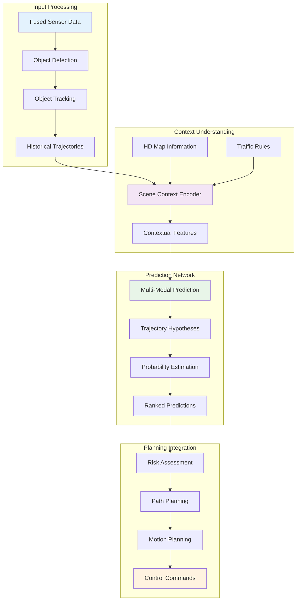

#### Technical Implementation

**Multi-Modal Trajectory Prediction:**
```python
class AuroraMotionPredictor:
    def __init__(self):
        self.scene_encoder = SceneContextEncoder()
        self.trajectory_decoder = MultiModalDecoder()
        self.uncertainty_estimator = UncertaintyNetwork()
        
    def predict_trajectories(self, sensor_fusion_output, hd_map, traffic_context):
        # Extract object states and history
        tracked_objects = self.extract_objects(sensor_fusion_output)
        
        # Encode scene context
        scene_context = self.scene_encoder(
            objects=tracked_objects,
            map_data=hd_map,
            traffic_rules=traffic_context
        )
        
        # Generate multiple trajectory hypotheses
        trajectory_modes = self.trajectory_decoder(
            object_states=tracked_objects,
            scene_context=scene_context,
            prediction_horizon=5.0  # 5 seconds
        )
        
        # Estimate uncertainty and probabilities
        mode_probabilities = self.uncertainty_estimator(
            trajectories=trajectory_modes,
            context=scene_context
        )
        
        return {
            'trajectories': trajectory_modes,
            'probabilities': mode_probabilities,
            'confidence': self.compute_confidence(mode_probabilities)
        }
```

#### Key Innovations in Aurora's Motion Prediction

**1. Multi-Modal Prediction:**
- **Multiple Hypotheses**: Generates several possible future trajectories for each object
- **Probability Weighting**: Assigns likelihood scores to each trajectory mode
- **Uncertainty Quantification**: Provides confidence measures for predictions

**2. Context-Aware Modeling:**
- **HD Map Integration**: Uses lane geometry and traffic rules as constraints
- **Social Interactions**: Models interactions between multiple road users
- **Environmental Factors**: Considers weather, lighting, and road conditions

**3. Temporal Modeling:**
- **Historical Context**: Uses past trajectories to inform future predictions
- **Dynamic Adaptation**: Updates predictions as new sensor data arrives
- **Long-term Reasoning**: Predicts up to 5-8 seconds into the future

#### Motion Prediction Challenges and Solutions

**Challenge 1: Multi-Agent Interactions**
- **Problem**: Predicting how multiple vehicles will interact
- **Aurora's Solution**: Graph neural networks to model agent relationships
- **Implementation**: Social pooling layers that share information between agents

**Challenge 2: Intention Inference**
- **Problem**: Understanding driver intentions from observable behavior
- **Aurora's Solution**: Attention mechanisms focusing on key behavioral cues
- **Features**: Turn signals, lane positioning, speed changes, gaze direction

**Challenge 3: Long-tail Scenarios**
- **Problem**: Rare but critical driving scenarios
- **Aurora's Solution**: Adversarial training and edge case mining
- **Approach**: Synthetic scenario generation and real-world data augmentation

#### Integration with Planning and Control

**Risk-Aware Planning:**
```python
class RiskAwarePathPlanner:
    def __init__(self, motion_predictor):
        self.predictor = motion_predictor
        self.risk_assessor = RiskAssessment()
        
    def plan_safe_trajectory(self, ego_state, scene_data):
        # Get predictions for all objects
        predictions = self.predictor.predict_trajectories(
            sensor_fusion_output=scene_data,
            hd_map=scene_data.map,
            traffic_context=scene_data.traffic
        )
        
        # Generate candidate ego trajectories
        candidate_paths = self.generate_candidate_paths(ego_state)
        
        # Assess risk for each candidate
        risk_scores = []
        for path in candidate_paths:
            risk = self.risk_assessor.compute_collision_risk(
                ego_trajectory=path,
                predicted_trajectories=predictions['trajectories'],
                probabilities=predictions['probabilities']
            )
            risk_scores.append(risk)
        
        # Select safest feasible path
        safe_path_idx = self.select_safest_path(candidate_paths, risk_scores)
        return candidate_paths[safe_path_idx]
```

#### Performance Metrics and Validation

**Prediction Accuracy Metrics:**
- **Average Displacement Error (ADE)**: Mean distance between predicted and actual trajectories
- **Final Displacement Error (FDE)**: Distance error at prediction horizon
- **Miss Rate**: Percentage of predictions that miss the actual trajectory
- **Multi-Modal Accuracy**: Success rate of top-K predictions

**Real-World Performance:**
- **Highway Scenarios**: >95% accuracy for 3-second predictions
- **Urban Intersections**: >90% accuracy for complex multi-agent scenarios
- **Edge Cases**: Specialized handling for construction zones, emergency vehicles

**Validation Approach:**
- **Simulation Testing**: Millions of scenarios in virtual environments
- **Closed-Course Testing**: Controlled real-world validation
- **Shadow Mode**: Real-world data collection without intervention
- **A/B Testing**: Comparative evaluation against baseline systems

#### Aurora's Competitive Advantages

**Technical Strengths:**
1. **Deep Integration**: Seamless fusion of perception and prediction
2. **Multi-Modal Reasoning**: Handles uncertainty through multiple hypotheses
3. **Context Awareness**: Leverages HD maps and traffic rules effectively
4. **Real-Time Performance**: Optimized for automotive-grade latency requirements

**Business Applications:**
- **Autonomous Trucking**: Long-haul highway driving with predictable scenarios
- **Logistics Delivery**: Last-mile navigation in urban environments
- **Ride-Hailing**: Passenger transportation with safety-first approach

#### 1. **Early Fusion**

**Concept:** Combine raw sensor data before processing.

```python
# Pseudocode for early fusion
def early_fusion(camera_img, lidar_points, radar_data):
    # Project all data to common coordinate system
    unified_grid = create_bev_grid()
    
    # Populate grid with multi-modal features
    unified_grid = add_camera_features(unified_grid, camera_img)
    unified_grid = add_lidar_features(unified_grid, lidar_points)
    unified_grid = add_radar_features(unified_grid, radar_data)
    
    return process_unified_grid(unified_grid)
```

**Advantages:**
- Preserves all information
- Enables cross-modal correlations
- Simpler architecture

**Disadvantages:**
- High computational cost
- Difficult to handle missing sensors
- Sensor-specific noise propagation

#### 2. **Late Fusion**

**Concept:** Process each modality separately, then combine results.

```python
# Pseudocode for late fusion
def late_fusion(camera_img, lidar_points, radar_data):
    # Independent processing
    camera_features = camera_network(camera_img)
    lidar_features = lidar_network(lidar_points)
    radar_features = radar_network(radar_data)
    
    # Combine processed features
    combined_features = attention_fusion([
        camera_features, lidar_features, radar_features
    ])
    
    return final_network(combined_features)
```

**Advantages:**
- Modular design
- Easier to handle sensor failures
- Specialized processing per modality

**Disadvantages:**
- Information loss during early processing
- Limited cross-modal interactions
- Potential feature misalignment

#### 3. **Intermediate Fusion (Hybrid)**

**Concept:** Combine benefits of early and late fusion through multi-stage processing.

**Architecture Example:**
```
Stage 1: Modality-specific feature extraction
Stage 2: Cross-modal attention and alignment
Stage 3: Unified representation learning
Stage 4: Task-specific heads (detection, segmentation, etc.)
```

### State-of-the-Art Fusion Architectures

#### BEVFusion

**Overview:**
BEVFusion creates a unified Bird's Eye View representation by projecting all sensor modalities into a common coordinate system.

**BEVFusion Architecture:**

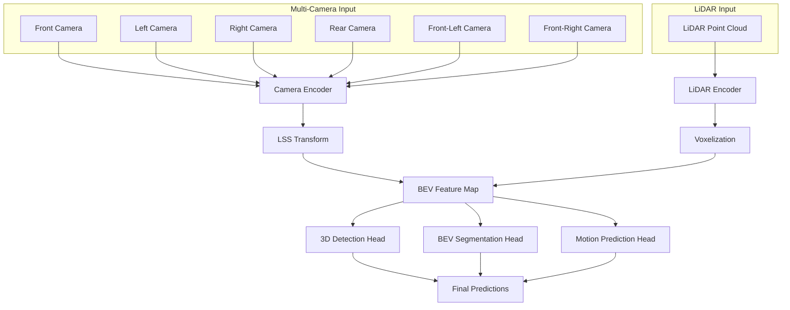

**Key Components:**
1. **Camera-to-BEV Transformation**: LSS (Lift-Splat-Shoot) method
2. **LiDAR-to-BEV Projection**: Direct point cloud projection
3. **Multi-Modal Fusion**: Convolutional layers in BEV space
4. **Task Heads**: Detection, segmentation, motion prediction

**Mathematical Formulation:**
```
BEV_camera = LSS(I_camera, D_pred, K, T_cam2ego)
BEV_lidar = Voxelize(P_lidar, T_lidar2ego)
BEV_fused = Conv(Concat(BEV_camera, BEV_lidar))
```

Where:
- `I_camera`: Camera images
- `D_pred`: Predicted depth maps
- `K`: Camera intrinsics
- `T_cam2ego`: Camera-to-ego transformation
- `P_lidar`: LiDAR point cloud

**Research Papers:**
- [BEVFusion: Multi-Task Multi-Sensor Fusion with Unified Bird's-Eye View Representation](https://arxiv.org/abs/2205.13542)
- [BEVFusion GitHub](https://github.com/mit-han-lab/bevfusion)

#### TransFusion

**Innovation:**
Uses transformer architecture for multi-modal fusion with learnable queries.

**Architecture:**
```
Multi-Modal Encoder → Cross-Attention → Object Queries → Detection Heads
```

**Key Features:**
- Learnable object queries
- Cross-modal attention mechanisms
- End-to-end optimization
- Robust to sensor failures

**Resources:**
- [TransFusion: Robust LiDAR-Camera Fusion for 3D Object Detection](https://arxiv.org/abs/2203.11496)
- [TransFusion Implementation](https://github.com/XuyangBai/TransFusion)

#### FUTR3D

**Concept:**
Future prediction through unified temporal-spatial fusion.

**Components:**
1. **Temporal Modeling**: RNN/Transformer for sequence processing
2. **Spatial Fusion**: Multi-modal feature alignment
3. **Future Prediction**: Forecasting object trajectories
4. **Uncertainty Estimation**: Confidence measures for predictions

### Implementation Strategies

#### Coordinate System Alignment

**Challenge:** Different sensors have different coordinate systems and timing.

**Solution:**
```python
def align_sensors(camera_data, lidar_data, radar_data, calibration):
    # Temporal alignment
    synchronized_data = temporal_sync(
        [camera_data, lidar_data, radar_data],
        target_timestamp=camera_data.timestamp
    )
    
    # Spatial alignment to ego coordinate system
    ego_camera = transform_to_ego(
        synchronized_data.camera, 
        calibration.camera_to_ego
    )
    ego_lidar = transform_to_ego(
        synchronized_data.lidar, 
        calibration.lidar_to_ego
    )
    ego_radar = transform_to_ego(
        synchronized_data.radar, 
        calibration.radar_to_ego
    )
    
    return ego_camera, ego_lidar, ego_radar
```

#### Attention-Based Fusion

**Cross-Modal Attention:**
```python
class CrossModalAttention(nn.Module):
    def __init__(self, d_model, n_heads):
        super().__init__()
        self.multihead_attn = nn.MultiheadAttention(d_model, n_heads)
        
    def forward(self, query_features, key_features, value_features):
        # query: target modality (e.g., camera)
        # key/value: source modality (e.g., lidar)
        attended_features, attention_weights = self.multihead_attn(
            query_features, key_features, value_features
        )
        return attended_features, attention_weights
```

### Challenges and Solutions

#### 1. **Sensor Calibration**

**Challenge:** Maintaining precise spatial and temporal calibration.

**Solutions:**
- Automatic calibration algorithms
- Online calibration monitoring
- Robust fusion methods tolerant to miscalibration

#### 2. **Data Association**

**Challenge:** Matching detections across different modalities.

**Solutions:**
- Hungarian algorithm for assignment
- Learned association networks
- Probabilistic data association

#### 3. **Computational Efficiency**

**Challenge:** Real-time processing of high-dimensional multi-modal data.

**Solutions:**
- Efficient network architectures (MobileNets, EfficientNets)
- Model compression and quantization
- Hardware acceleration (GPUs, specialized chips)

#### 4. **Robustness to Sensor Failures**

**Challenge:** Maintaining performance when sensors fail or degrade.

**Solutions:**
- Graceful degradation strategies
- Redundant sensor configurations
- Uncertainty-aware fusion

### Evaluation Metrics

#### Standard Metrics:
- **mAP (mean Average Precision)**: Object detection accuracy
- **NDS (nuScenes Detection Score)**: Comprehensive detection metric
- **AMOTA/AMOTP**: Multi-object tracking accuracy
- **IoU (Intersection over Union)**: Segmentation quality

#### Fusion-Specific Metrics:
- **Cross-Modal Consistency**: Agreement between modalities
- **Robustness Score**: Performance under sensor degradation
- **Computational Efficiency**: FLOPs, latency, memory usage

---

## End-to-End Transformers for Joint Perception-Planning

The evolution from modular autonomous driving systems to end-to-end learning represents a fundamental shift in how we approach the complex task of autonomous navigation. End-to-end transformers enable joint optimization of perception and planning, leading to more coherent and efficient decision-making.

### Motivation for End-to-End Approaches

#### Modular vs End-to-End Architecture Comparison

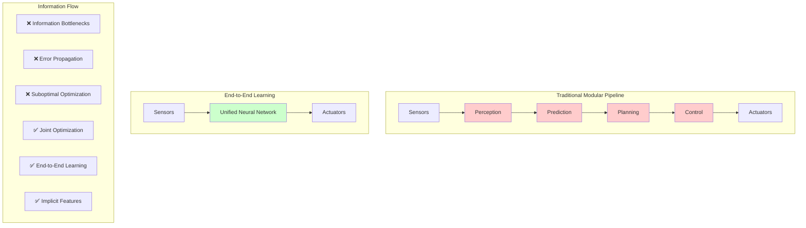

#### Limitations of Modular Systems

**Information Bottlenecks:**
- Each module processes information independently
- Critical context may be lost between stages
- Suboptimal overall system performance

**Error Propagation:**
- Errors in perception cascade to planning
- Difficult to recover from early mistakes
- No feedback mechanism for improvement

**Optimization Challenges:**
- Each module optimized separately
- Global optimum may not be achieved
- Difficult to balance trade-offs across modules

#### Advantages of End-to-End Learning

**Joint Optimization:**
- All components trained together
- Global loss function optimization
- Better overall system performance

**Implicit Feature Learning:**
- System learns relevant features automatically
- No need for hand-crafted intermediate representations
- Adaptive to different scenarios and conditions

**Simplified Architecture:**
- Fewer components to maintain and debug
- Reduced system complexity
- Easier deployment and updates

### Transformer Architectures for Autonomous Driving

#### VISTA (Vision-based Interpretable Spatial-Temporal Attention)

**Overview:**
VISTA introduces spatial-temporal attention mechanisms for autonomous driving, enabling the model to focus on relevant regions and time steps for decision-making.

**VISTA Architecture:**

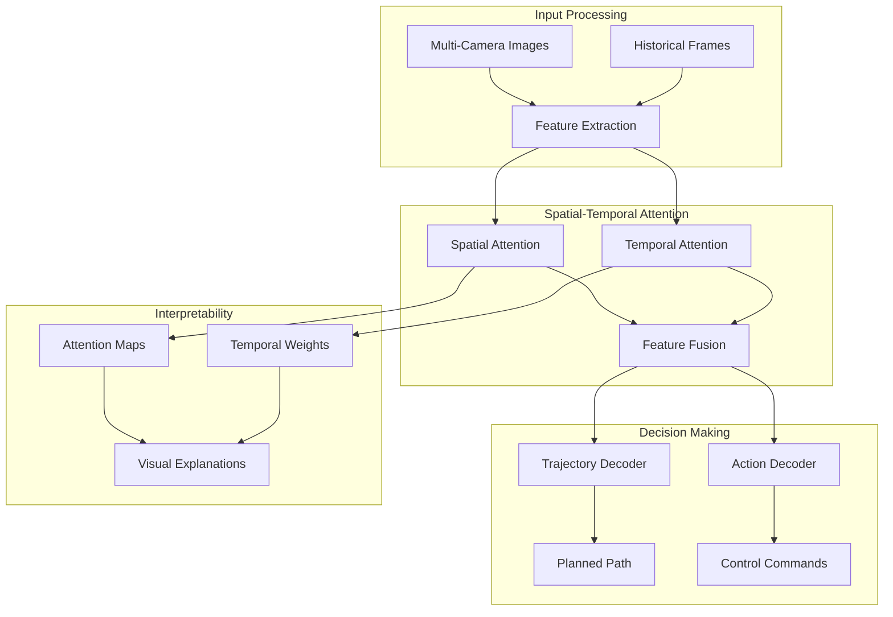

**Architecture Components:**

1. **Spatial Attention Module:**
```python
class SpatialAttention(nn.Module):
    def __init__(self, d_model):
        super().__init__()
        self.attention = nn.MultiheadAttention(d_model, num_heads=8)
        
    def forward(self, features, spatial_queries):
        # features: [H*W, B, d_model] - flattened spatial features
        # spatial_queries: [N, B, d_model] - learnable spatial queries
        attended_features, attention_map = self.attention(
            spatial_queries, features, features
        )
        return attended_features, attention_map
```

2. **Temporal Attention Module:**
```python
class TemporalAttention(nn.Module):
    def __init__(self, d_model, sequence_length):
        super().__init__()
        self.temporal_encoder = nn.TransformerEncoder(
            nn.TransformerEncoderLayer(d_model, nhead=8),
            num_layers=6
        )
        
    def forward(self, temporal_features):
        # temporal_features: [T, B, d_model]
        encoded_sequence = self.temporal_encoder(temporal_features)
        return encoded_sequence
```

**Key Innovations:**
- Interpretable attention maps showing where the model focuses
- Temporal reasoning for motion prediction
- End-to-end learning from pixels to control

**Research Resources:**
- [VISTA: A Generic Training Pipeline for Computer Vision](https://arxiv.org/abs/2308.04849)
- [VISTA Implementation](https://github.com/vista-simulator/vista)

#### Hydra-MDP (Multi-Task Multi-Modal Transformer)

**Overview:**
Hydra-MDP addresses multiple driving tasks simultaneously using a shared transformer backbone with task-specific heads.

**Hydra-MDP Architecture:**

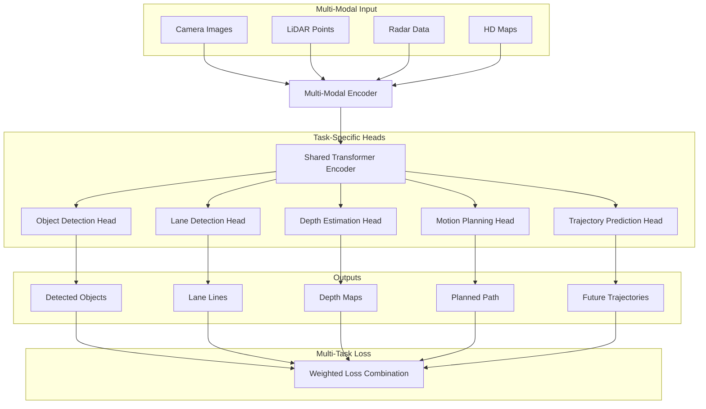

**Multi-Task Learning Framework:**
```python
class HydraMDP(nn.Module):
    def __init__(self, d_model, num_tasks):
        super().__init__()
        self.shared_encoder = TransformerEncoder(d_model)
        self.task_heads = nn.ModuleDict({
            'detection': DetectionHead(d_model),
            'segmentation': SegmentationHead(d_model),
            'planning': PlanningHead(d_model),
            'prediction': PredictionHead(d_model)
        })
        
    def forward(self, multi_modal_input):
        shared_features = self.shared_encoder(multi_modal_input)
        
        outputs = {}
        for task_name, head in self.task_heads.items():
            outputs[task_name] = head(shared_features)
            
        return outputs
```

**Key Features:**
- Shared representations across tasks
- Task-specific attention mechanisms
- Joint optimization with multi-task loss
- Efficient parameter sharing

**Research Papers:**
- [Hydra: Multi-head Low-rank Adaptation for Parameter Efficient Fine-tuning](https://arxiv.org/abs/2309.06922)
- [Multi-Task Learning for Autonomous Driving](https://arxiv.org/abs/2209.07403)

#### UniAD (Unified Autonomous Driving)

**Innovation:**
UniAD presents a unified framework that handles all autonomous driving tasks within a single transformer architecture.

**UniAD Unified Framework:**

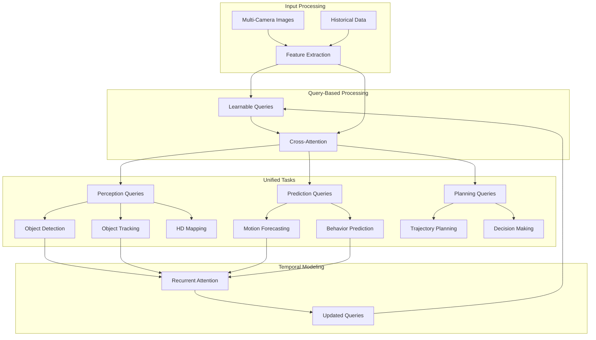

**Task Integration:**
1. **Perception Tasks**: Object detection, tracking, mapping
2. **Prediction Tasks**: Motion forecasting, behavior prediction  
3. **Planning Tasks**: Trajectory planning, decision making

**Architecture Highlights:**
- Query-based design with learnable embeddings
- Temporal modeling with recurrent attention
- Multi-scale feature processing
- End-to-end differentiable planning

**Mathematical Formulation:**
```
Q_t = Update(Q_{t-1}, F_t)  # Query update with new features
A_t = Attention(Q_t, F_t)   # Attention computation
P_t = Plan(A_t, G)          # Planning with goal G
```

**Resources:**
- [Planning-oriented Autonomous Driving](https://arxiv.org/abs/2212.10156)
- [UniAD GitHub Repository](https://github.com/OpenDriveLab/UniAD)

### Advanced Architectures and Techniques

#### ST-P3 (Spatial-Temporal Pyramid Pooling for Planning)

**Concept:**
Hierarchical spatial-temporal processing for multi-scale planning.

**Components:**
1. **Pyramid Feature Extraction**: Multi-scale spatial features
2. **Temporal Aggregation**: Long-term temporal dependencies
3. **Planning Decoder**: Trajectory generation with constraints

#### VAD (Vector-based Autonomous Driving)

**Innovation:**
Represents driving scenes using vectorized elements (lanes, objects) rather than raster images.

**Advantages:**
- Compact representation
- Geometric consistency
- Efficient processing
- Better generalization

### Training Strategies

#### Training Pipeline Overview

```mermaid
graph TD
    subgraph "Data Collection"
        A1[Real-World Driving Data]
        A2[Simulation Data]
        A3[Expert Demonstrations]
    end
    
    subgraph "Training Approaches"
        A1 --> B1[Imitation Learning]
        A2 --> B2[Reinforcement Learning]
        A3 --> B3[Multi-Task Learning]
        
        B1 --> C1[Behavioral Cloning]
        B1 --> C2[DAgger]
        
        B2 --> C3[Policy Gradient]
        B2 --> C4[Actor-Critic]
        
        B3 --> C5[Shared Encoder]
        B3 --> C6[Task-Specific Heads]
    end
    
    subgraph "Evaluation"
        C1 --> D[Simulation Testing]
        C2 --> D
        C3 --> D
        C4 --> D
        C5 --> D
        C6 --> D
        
        D --> E[Real-World Validation]
    end
    
    subgraph "Deployment"
        E --> F[Model Optimization]
        F --> G[Edge Deployment]
        G --> H[Continuous Learning]
        H --> A1
    end
```

#### Imitation Learning

**Behavioral Cloning:**
```python
def behavioral_cloning_loss(predicted_actions, expert_actions):
    return F.mse_loss(predicted_actions, expert_actions)
```

**DAgger (Dataset Aggregation):**
- Iterative training with expert corrections
- Addresses distribution shift problem
- Improves robustness to compounding errors

#### Reinforcement Learning

**Policy Gradient Methods:**
```python
class PPOAgent(nn.Module):
    def __init__(self, state_dim, action_dim):
        super().__init__()
        self.actor = TransformerActor(state_dim, action_dim)
        self.critic = TransformerCritic(state_dim)
        
    def forward(self, state):
        action_dist = self.actor(state)
        value = self.critic(state)
        return action_dist, value
```

**Reward Design:**
- Safety rewards (collision avoidance)
- Progress rewards (goal reaching)
- Comfort rewards (smooth driving)
- Rule compliance rewards (traffic laws)

#### Multi-Task Learning

**Loss Function Design:**
```python
def multi_task_loss(outputs, targets, task_weights):
    total_loss = 0
    for task in ['detection', 'segmentation', 'planning']:
        task_loss = compute_task_loss(outputs[task], targets[task])
        total_loss += task_weights[task] * task_loss
    return total_loss
```

**Uncertainty Weighting:**
- Automatic balancing of task losses
- Learned uncertainty parameters
- Adaptive training dynamics

### Evaluation and Benchmarks

#### Autonomous Driving Evaluation Framework

```mermaid
graph TD
    subgraph "Evaluation Environments"
        A1[CARLA Simulator]
        A2[AirSim]
        A3[Real-World Testing]
    end
    
    subgraph "Datasets"
        B1[nuScenes]
        B2[Waymo Open Dataset]
        B3[Argoverse]
        B4[KITTI]
    end
    
    subgraph "Evaluation Metrics"
        C1[Perception Metrics]
        C2[Planning Metrics]
        C3[Safety Metrics]
        C4[Efficiency Metrics]
    end
    
    A1 --> D[Standardized Benchmarks]
    A2 --> D
    A3 --> D
    
    B1 --> E[Dataset Evaluation]
    B2 --> E
    B3 --> E
    B4 --> E
    
    C1 --> F[Performance Analysis]
    C2 --> F
    C3 --> F
    C4 --> F
    
    D --> G[Comparative Results]
    E --> G
    F --> G
    
    G --> H[Model Improvement]
    H --> I[Iterative Development]
```

#### Simulation Environments

**CARLA Simulator:**
- Realistic urban environments
- Controllable weather and lighting
- Standardized benchmarks and metrics
- [CARLA Documentation](https://carla.readthedocs.io/)

**AirSim:**
- Photorealistic environments
- Multi-vehicle scenarios
- Sensor simulation
- [AirSim GitHub](https://github.com/Microsoft/AirSim)

#### Real-World Datasets

**nuScenes:**
- Large-scale autonomous driving dataset
- Multi-modal sensor data
- Comprehensive annotations
- [nuScenes Dataset](https://www.nuscenes.org/)

**Waymo Open Dataset:**
- High-quality LiDAR and camera data
- Diverse geographic locations
- Motion prediction challenges
- [Waymo Open Dataset](https://waymo.com/open/)

#### Metrics

**Planning Metrics:**
- **L2 Error**: Euclidean distance to ground truth trajectory
- **Collision Rate**: Frequency of collisions in simulation
- **Comfort**: Smoothness of acceleration and steering
- **Progress**: Distance traveled toward goal

**Perception Metrics:**
- **Detection AP**: Average precision for object detection
- **Tracking MOTA**: Multi-object tracking accuracy
- **Segmentation IoU**: Intersection over union for segmentation

---

## Vision-Language-Action Models

Vision-Language-Action (VLA) models represent the next frontier in autonomous systems, combining visual perception, natural language understanding, and action generation in a unified framework. These models enable robots and autonomous vehicles to understand complex instructions, reason about their environment, and execute appropriate actions.

### What are Vision-Language-Action Models?

VLA models extend traditional vision-language models by adding an action component, creating a complete perception-reasoning-action loop. They can:

1. **Perceive** the environment through multiple sensors
2. **Understand** natural language instructions and context
3. **Reason** about the relationship between perception and goals
4. **Generate** appropriate actions to achieve objectives

### Core Architecture

```
Visual Input → Vision Encoder → Multimodal Fusion ← Language Encoder ← Text Input
                    ↓
              Reasoning Module
                    ↓
              Action Decoder → Control Commands
```

### Key VLA Models in Autonomous Driving

#### RT-1 (Robotics Transformer 1)

**Overview:**
RT-1 demonstrates how transformer architectures can be adapted for robotic control, learning from diverse demonstration data.

**Architecture:**
- **Vision Encoder**: EfficientNet-B3 for image processing
- **Language Encoder**: Universal Sentence Encoder for instruction processing
- **Action Decoder**: Transformer decoder for action sequence generation

**Key Features:**
- Multi-task learning across different robotic tasks
- Natural language instruction following
- Generalization to unseen scenarios

**Autonomous Driving Applications:**
- Following verbal navigation instructions
- Adapting to passenger requests
- Emergency situation handling

**Research Resources:**
- [RT-1: Robotics Transformer for Real-World Control at Scale](https://arxiv.org/abs/2212.06817)
- [RT-1 Project Page](https://robotics-transformer1.github.io/)

#### RT-2 (Robotics Transformer 2)

**Innovation:**
RT-2 builds on vision-language models (VLMs) to enable better reasoning and generalization in robotic tasks.

**Architecture Improvements:**
- Integration with PaLM-E for enhanced reasoning
- Better handling of novel objects and scenarios
- Improved sample efficiency

**Capabilities:**
```python
# Example RT-2 interaction
instruction = "Drive to the parking lot and avoid the construction zone"
visual_input = camera_feed
context = traffic_conditions

action_sequence = rt2_model(
    instruction=instruction,
    visual_input=visual_input,
    context=context
)
```

**Research Papers:**
- [RT-2: Vision-Language-Action Models Transfer Web Knowledge to Robotic Control](https://arxiv.org/abs/2307.15818)
- [RT-2 Implementation](https://github.com/google-research/robotics_transformer)

#### PaLM-E (Pathways Language Model - Embodied)

**Overview:**
PaLM-E integrates large language models with embodied AI, enabling robots to understand and act on complex multimodal instructions.

**Key Innovations:**
- **Multimodal Integration**: Seamless fusion of text, images, and sensor data
- **Embodied Reasoning**: Understanding of physical world constraints
- **Transfer Learning**: Leveraging web-scale knowledge for robotics

**Architecture Components:**
1. **Vision Encoder**: ViT (Vision Transformer) for image processing
2. **Language Model**: PaLM for text understanding and reasoning
3. **Sensor Integration**: Multiple sensor modality processing
4. **Action Generation**: Policy networks for control commands

**Autonomous Driving Scenarios:**
```
Human: "Take me to the hospital, but avoid the highway due to traffic"
PaLM-E: 
1. Identifies hospital locations from map knowledge
2. Analyzes current traffic conditions
3. Plans alternative route avoiding highways
4. Generates driving actions while monitoring traffic
```

**Research Resources:**
- [PaLM-E: An Embodied Multimodal Language Model](https://arxiv.org/abs/2303.03378)
- [PaLM-E Project Page](https://palm-e.github.io/)

#### CLIP-Fields

**Concept:**
Extends CLIP to understand 3D scenes and generate spatially-aware actions.

**Applications in Autonomous Driving:**
- 3D scene understanding with natural language queries
- Spatial reasoning for navigation
- Object manipulation in 3D space

### Advanced VLA Architectures

#### Flamingo for Robotics

**Innovation:**
Adapts the Flamingo few-shot learning architecture for robotic control tasks.

**Key Features:**
- Few-shot learning from demonstrations
- Cross-modal attention mechanisms
- Rapid adaptation to new tasks

**Implementation Example:**
```python
class FlamingoVLA(nn.Module):
    def __init__(self, vision_encoder, language_model, action_decoder):
        super().__init__()
        self.vision_encoder = vision_encoder
        self.language_model = language_model
        self.cross_attention = CrossModalAttention()
        self.action_decoder = action_decoder
        
    def forward(self, images, text, demonstrations=None):
        # Process visual input
        visual_features = self.vision_encoder(images)
        
        # Process language input
        text_features = self.language_model(text)
        
        # Cross-modal fusion
        fused_features = self.cross_attention(
            visual_features, text_features
        )
        
        # Few-shot adaptation with demonstrations
        if demonstrations:
            fused_features = self.adapt_with_demos(
                fused_features, demonstrations
            )
        
        # Generate actions
        actions = self.action_decoder(fused_features)
        return actions
```

#### VIMA (Multimodal Prompt-based Imitation Learning)

**Overview:**
VIMA enables robots to learn new tasks from multimodal prompts combining text, images, and demonstrations.

**Key Capabilities:**
- Prompt-based task specification
- Multimodal instruction understanding
- Compositional generalization

**Autonomous Driving Applications:**
- Learning new driving behaviors from examples
- Adapting to different vehicle types
- Handling novel traffic scenarios

### Training Strategies for VLA Models

#### 1. **Imitation Learning with Language**

**Approach:**
Combine behavioral cloning with natural language supervision.

```python
def language_conditioned_imitation_loss(
    predicted_actions, expert_actions, 
    predicted_language, expert_language
):
    action_loss = F.mse_loss(predicted_actions, expert_actions)
    language_loss = F.cross_entropy(predicted_language, expert_language)
    return action_loss + 0.1 * language_loss
```

**Benefits:**
- Richer supervision signal
- Better generalization
- Interpretable behavior

#### 2. **Reinforcement Learning with Language Rewards**

**Concept:**
Use language-based reward functions to guide policy learning.

```python
class LanguageRewardFunction:
    def __init__(self, language_model):
        self.language_model = language_model
        
    def compute_reward(self, state, action, instruction):
        # Evaluate how well action aligns with instruction
        alignment_score = self.language_model.evaluate_alignment(
            state, action, instruction
        )
        return alignment_score
```

#### 3. **Multi-Task Learning**

**Framework:**
Train on diverse tasks simultaneously to improve generalization.

```python
def multi_task_vla_loss(outputs, targets, task_weights):
    total_loss = 0
    for task in ['navigation', 'parking', 'lane_change']:
        task_loss = compute_task_loss(outputs[task], targets[task])
        total_loss += task_weights[task] * task_loss
    return total_loss
```

### Implementation Challenges

#### 1. **Real-time Performance**

**Challenge:** VLA models are computationally expensive for real-time control.

**Solutions:**
- **Model Distillation**: Train smaller, faster models from large VLA models
- **Hierarchical Control**: Use VLA for high-level planning, simpler models for low-level control
- **Edge Optimization**: Specialized hardware and software optimization

```python
class HierarchicalVLA:
    def __init__(self, high_level_vla, low_level_controller):
        self.high_level_vla = high_level_vla
        self.low_level_controller = low_level_controller
        
    def control(self, observation, instruction):
        # High-level planning (slower, more complex)
        high_level_plan = self.high_level_vla(observation, instruction)
        
        # Low-level execution (faster, simpler)
        actions = self.low_level_controller(observation, high_level_plan)
        return actions
```

#### 2. **Safety and Reliability**

**Challenge:** Ensuring safe behavior in critical scenarios.

**Solutions:**
- **Formal Verification**: Mathematical guarantees on model behavior
- **Safety Constraints**: Hard constraints on action space
- **Uncertainty Quantification**: Confidence measures for decisions

```python
class SafeVLA:
    def __init__(self, vla_model, safety_checker):
        self.vla_model = vla_model
        self.safety_checker = safety_checker
        
    def safe_action(self, observation, instruction):
        proposed_action = self.vla_model(observation, instruction)
        
        # Check safety constraints
        if self.safety_checker.is_safe(observation, proposed_action):
            return proposed_action
        else:
            return self.safety_checker.get_safe_action(observation)
```

#### 3. **Data Efficiency**

**Challenge:** VLA models require large amounts of diverse training data.

**Solutions:**
- **Simulation**: Generate diverse scenarios in simulation
- **Data Augmentation**: Synthetic data generation
- **Transfer Learning**: Leverage pre-trained models

### Current Challenges and Limitations

#### 1. **Grounding Problem**

**Issue:** Connecting language concepts to physical world understanding.

**Current Research:**
- Embodied language learning
- Multimodal grounding datasets
- Interactive learning environments

#### 2. **Compositional Generalization**

**Issue:** Understanding novel combinations of known concepts.

**Approaches:**
- Modular architectures
- Compositional training strategies
- Systematic generalization benchmarks

#### 3. **Long-term Planning**

**Issue:** Reasoning about extended action sequences and their consequences.

**Solutions:**
- Hierarchical planning architectures
- Temporal abstraction methods
- Model-based planning integration

### Future Research Directions

#### 1. **Multimodal Foundation Models**

**Vision:**
Unified models that can handle any combination of sensory inputs and action outputs.

**Key Research Areas:**
- Universal multimodal architectures
- Cross-modal transfer learning
- Scalable training methodologies

#### 2. **Interactive Learning**

**Concept:**
VLA models that learn continuously from human feedback and environmental interaction.

**Research Directions:**
- Online learning algorithms
- Human-in-the-loop training
- Preference learning methods

#### 3. **Causal Reasoning**

**Goal:**
Enable VLA models to understand cause-and-effect relationships in the physical world.

**Approaches:**
- Causal representation learning
- Interventional training data
- Counterfactual reasoning

---

## Current Challenges and Solutions

Despite significant advances in Physical AI and LLMs for autonomous driving, several fundamental challenges remain. Understanding these challenges and their proposed solutions is crucial for advancing the field.

### Technical Challenges

#### 1. **Real-time Processing Requirements**

**Challenge Description:**
Autonomous vehicles must process vast amounts of multimodal sensor data and make decisions within milliseconds to ensure safety.

**Specific Issues:**
- **Latency Constraints**: Control decisions needed within 10-100ms
- **Computational Complexity**: Modern VLMs require significant computational resources
- **Power Limitations**: Mobile platforms have limited power budgets
- **Thermal Constraints**: Heat dissipation in compact vehicle systems

**Current Solutions:**

**Edge Computing Optimization:**
```python
class EdgeOptimizedVLA:
    def __init__(self):
        # Quantized models for faster inference
        self.vision_encoder = quantize_model(EfficientNet())
        self.language_model = prune_model(DistilBERT())
        
        # Hierarchical processing
        self.fast_detector = YOLOv8_nano()  # 1ms inference
        self.detailed_analyzer = RT2_compressed()  # 50ms inference
        
    def process_frame(self, sensor_data, urgency_level):
        if urgency_level == "emergency":
            return self.fast_detector(sensor_data)
        else:
            return self.detailed_analyzer(sensor_data)
```

**Hardware Acceleration:**
- **Specialized Chips**: NVIDIA Drive Orin, Tesla FSD Chip
- **Neural Processing Units**: Dedicated AI accelerators
- **FPGA Implementation**: Custom hardware for specific tasks

**Research Directions:**
- Neural architecture search for efficient models
- Dynamic inference with adaptive computation
- Neuromorphic computing for event-driven processing

#### 2. **Safety and Reliability**

**Challenge Description:**
Ensuring AI systems make safe decisions in all scenarios, including edge cases and adversarial conditions.

**Critical Issues:**
- **Black Box Problem**: Difficulty interpreting AI decisions
- **Adversarial Attacks**: Vulnerability to malicious inputs
- **Distribution Shift**: Performance degradation in unseen conditions
- **Failure Modes**: Graceful degradation when systems fail

**Solutions Framework:**

**Formal Verification:**
```python
class VerifiableController:
    def __init__(self, safety_constraints):
        self.constraints = safety_constraints
        self.backup_controller = RuleBasedController()
        
    def verify_action(self, state, proposed_action):
        # Mathematical verification of safety
        for constraint in self.constraints:
            if not constraint.verify(state, proposed_action):
                return False, constraint.violation_reason
        return True, None
        
    def safe_control(self, state, ai_action):
        is_safe, reason = self.verify_action(state, ai_action)
        
        if is_safe:
            return ai_action
        else:
            # Fall back to verified safe controller
            return self.backup_controller.get_action(state)
```

**Uncertainty Quantification:**
- **Bayesian Neural Networks**: Probabilistic predictions with confidence intervals
- **Ensemble Methods**: Multiple model predictions for robustness
- **Conformal Prediction**: Statistical guarantees on prediction sets

**Multi-Level Safety Architecture:**
```
Level 1: AI-based optimal control
Level 2: Rule-based safety monitor
Level 3: Hardware emergency braking
Level 4: Mechanical fail-safes
```

#### 3. **Data Quality and Availability**

**Challenge Description:**
Training robust AI systems requires massive amounts of high-quality, diverse data that covers edge cases and rare scenarios.

**Specific Problems:**
- **Long-tail Distribution**: Rare but critical scenarios are underrepresented
- **Annotation Costs**: Manual labeling is expensive and time-consuming
- **Privacy Concerns**: Collecting real-world driving data raises privacy issues
- **Geographic Bias**: Training data may not represent global driving conditions

**Innovative Solutions:**

**Synthetic Data Generation:**
```python
class SyntheticDataPipeline:
    def __init__(self):
        self.carla_sim = CARLASimulator()
        self.weather_generator = WeatherVariationEngine()
        self.scenario_generator = EdgeCaseGenerator()
        
    def generate_diverse_scenarios(self, num_scenarios=10000):
        scenarios = []
        for i in range(num_scenarios):
            # Generate diverse conditions
            weather = self.weather_generator.sample()
            traffic = self.scenario_generator.sample_traffic()
            road_type = self.scenario_generator.sample_road()
            
            # Simulate scenario
            scenario_data = self.carla_sim.run_scenario(
                weather=weather,
                traffic=traffic,
                road_type=road_type
            )
            scenarios.append(scenario_data)
        return scenarios
```

**Active Learning:**
- **Uncertainty Sampling**: Focus annotation on uncertain predictions
- **Diversity Sampling**: Ensure coverage of input space
- **Query-by-Committee**: Use ensemble disagreement to guide labeling

**Federated Learning:**
```python
class FederatedAVTraining:
    def __init__(self, vehicle_clients):
        self.clients = vehicle_clients
        self.global_model = VLAModel()
        
    def federated_update(self):
        client_updates = []
        
        # Each vehicle trains on local data
        for client in self.clients:
            local_update = client.train_local_model(
                self.global_model,
                client.private_data
            )
            client_updates.append(local_update)
        
        # Aggregate updates without sharing raw data
        self.global_model = self.aggregate_updates(client_updates)
```

#### 4. **Interpretability and Explainability**

**Challenge Description:**
Understanding why AI systems make specific decisions is crucial for debugging, validation, and regulatory approval.

**Key Issues:**
- **Decision Transparency**: Understanding the reasoning behind actions
- **Failure Analysis**: Diagnosing why systems fail
- **Regulatory Compliance**: Meeting explainability requirements
- **User Trust**: Building confidence in AI decisions

**Explainability Techniques:**

**Attention Visualization:**
```python
class ExplainableVLA:
    def __init__(self, model):
        self.model = model
        self.attention_extractor = AttentionExtractor(model)
        
    def explain_decision(self, input_data, decision):
        # Extract attention maps
        visual_attention = self.attention_extractor.get_visual_attention(
            input_data.camera_feed
        )
        
        # Generate textual explanation
        explanation = self.generate_explanation(
            decision, visual_attention, input_data.context
        )
        
        return {
            'decision': decision,
            'visual_focus': visual_attention,
            'reasoning': explanation,
            'confidence': self.model.get_confidence(input_data)
        }
```

**Counterfactual Explanations:**
- "The vehicle stopped because of the pedestrian. If the pedestrian weren't there, it would have continued at 30 mph."

**Concept Activation Vectors:**
- Understanding which high-level concepts (e.g., "school zone", "wet road") influence decisions

### Systemic Challenges

#### 1. **Regulatory and Legal Framework**

**Current Issues:**
- **Liability Questions**: Who is responsible when AI makes mistakes?
- **Certification Processes**: How to validate AI system safety?
- **International Standards**: Harmonizing regulations across countries
- **Ethical Guidelines**: Ensuring fair and unbiased AI behavior

**Proposed Solutions:**
- **Graduated Deployment**: Phased introduction with increasing autonomy levels
- **Continuous Monitoring**: Real-time safety assessment and intervention
- **Standardized Testing**: Common benchmarks and evaluation protocols

#### 2. **Infrastructure Requirements**

**Challenges:**
- **V2X Communication**: Vehicle-to-everything connectivity needs
- **HD Mapping**: Maintaining accurate, up-to-date maps
- **Edge Computing**: Distributed processing infrastructure
- **Cybersecurity**: Protecting connected vehicle networks

**Infrastructure Solutions:**
```python
class SmartInfrastructure:
    def __init__(self):
        self.v2x_network = V2XCommunication()
        self.edge_servers = EdgeComputingCluster()
        self.hd_maps = DynamicMappingSystem()
        
    def support_autonomous_vehicle(self, vehicle_id, location):
        # Provide real-time traffic information
        traffic_info = self.v2x_network.get_traffic_data(location)
        
        # Offload computation to edge servers
        processing_result = self.edge_servers.process_sensor_data(
            vehicle_id, heavy_computation_task
        )
        
        # Update vehicle with latest map information
        map_update = self.hd_maps.get_local_update(location)
        
        return {
            'traffic': traffic_info,
            'computation': processing_result,
            'map': map_update
        }
```

#### 3. **Human-AI Interaction**

**Challenges:**
- **Trust Calibration**: Appropriate reliance on AI systems
- **Takeover Scenarios**: Smooth transitions between AI and human control
- **Interface Design**: Effective communication of AI state and intentions
- **Training Requirements**: Educating users about AI capabilities and limitations

**Solutions:**
```python
class HumanAIInterface:
    def __init__(self):
        self.trust_model = TrustCalibrationSystem()
        self.takeover_detector = TakeoverNeedDetector()
        self.explanation_generator = ExplanationEngine()
        
    def manage_interaction(self, human_state, ai_state, environment):
        # Monitor trust levels
        trust_level = self.trust_model.assess_trust(
            human_state, ai_state.performance_history
        )
        
        # Detect when human intervention is needed
        if self.takeover_detector.should_alert(environment, ai_state):
            return self.initiate_takeover_sequence(human_state)
        
        # Provide appropriate explanations
        if trust_level < 0.7:  # Low trust
            explanation = self.explanation_generator.generate_detailed_explanation(
                ai_state.current_decision
            )
            return {'type': 'explanation', 'content': explanation}
        
        return {'type': 'normal_operation'}
```

---

## Future Research Directions

The field of Physical AI and LLMs for autonomous driving is rapidly evolving, with several promising research directions that could revolutionize how we approach autonomous navigation and decision-making.

### Near-term Research (2024-2027)

#### 1. **Multimodal Foundation Models for Driving**

**Research Goal:**
Develop unified foundation models that can process all sensor modalities and generate appropriate driving actions.

**Key Research Areas:**

**Universal Sensor Fusion:**
```python
class UniversalDrivingFoundationModel:
    def __init__(self):
        # Unified encoder for all sensor types
        self.universal_encoder = UniversalSensorEncoder()
        
        # Large-scale transformer backbone
        self.backbone = TransformerXL(
            layers=48, 
            hidden_size=2048,
            attention_heads=32
        )
        
        # Multi-task heads
        self.task_heads = {
            'perception': PerceptionHead(),
            'prediction': PredictionHead(),
            'planning': PlanningHead(),
            'control': ControlHead()
        }
    
    def forward(self, sensor_suite):
        # Process all sensors uniformly
        unified_features = self.universal_encoder(sensor_suite)
        
        # Contextual reasoning
        contextualized = self.backbone(unified_features)
        
        # Multi-task outputs
        outputs = {}
        for task, head in self.task_heads.items():
            outputs[task] = head(contextualized)
        
        return outputs
```

**Research Challenges:**
- Scaling to billions of parameters while maintaining real-time performance
- Developing efficient training strategies for multimodal data
- Creating comprehensive evaluation benchmarks

**Expected Timeline:** 2024-2026

#### 2. **Causal Reasoning for Autonomous Driving**

**Research Objective:**
Enable AI systems to understand cause-and-effect relationships in driving scenarios for better decision-making.

**Technical Approaches:**

**Causal Discovery in Driving Data:**
```python
class CausalDrivingModel:
    def __init__(self):
        self.causal_graph = LearnableCausalGraph()
        self.intervention_engine = InterventionEngine()
        
    def learn_causal_structure(self, driving_data):
        # Discover causal relationships
        causal_edges = self.causal_graph.discover_structure(
            variables=['weather', 'traffic', 'road_type', 'accidents'],
            data=driving_data
        )
        
        return causal_edges
    
    def counterfactual_reasoning(self, scenario, intervention):
        # "What would happen if it weren't raining?"
        counterfactual_outcome = self.intervention_engine.intervene(
            scenario=scenario,
            intervention={'weather': 'sunny'},
            causal_graph=self.causal_graph
        )
        
        return counterfactual_outcome
```

**Applications:**
- Better understanding of accident causation
- Improved safety through counterfactual analysis
- More robust decision-making in novel scenarios

**Research Timeline:** 2025-2027

#### 3. **Neuromorphic Computing for Real-time AI**

**Vision:**
Develop brain-inspired computing architectures that can process sensory information with ultra-low latency and power consumption.

**Technical Innovation:**
```python
class NeuromorphicDrivingProcessor:
    def __init__(self):
        # Event-driven processing
        self.event_cameras = EventCameraArray()
        self.spiking_networks = SpikingNeuralNetwork()
        self.temporal_memory = TemporalMemoryUnit()
        
    def process_events(self, event_stream):
        # Asynchronous event processing
        spikes = self.event_cameras.convert_to_spikes(event_stream)
        
        # Temporal pattern recognition
        patterns = self.spiking_networks.detect_patterns(spikes)
        
        # Memory-based prediction
        predictions = self.temporal_memory.predict_future(patterns)
        
        return predictions
```

**Advantages:**
- Microsecond-level response times
- Extremely low power consumption
- Natural handling of temporal dynamics

**Research Challenges:**
- Developing efficient training algorithms for spiking networks
- Creating neuromorphic sensor integration
- Scaling to complex driving tasks

### Medium-term Research (2027-2030)

#### 4. **Swarm Intelligence for Connected Vehicles**

**Research Vision:**
Enable fleets of autonomous vehicles to coordinate intelligently, sharing information and making collective decisions.

**Collective Intelligence Framework:**
```python
class SwarmDrivingIntelligence:
    def __init__(self, vehicle_fleet):
        self.fleet = vehicle_fleet
        self.collective_memory = DistributedMemorySystem()
        self.consensus_algorithm = ByzantineFaultTolerantConsensus()
        
    def collective_decision_making(self, local_observations):
        # Aggregate observations from all vehicles
        global_state = self.aggregate_observations(local_observations)
        
        # Distributed consensus on optimal actions
        collective_plan = self.consensus_algorithm.reach_consensus(
            proposals=[v.propose_action(global_state) for v in self.fleet]
        )
        
        # Update collective memory
        self.collective_memory.update(global_state, collective_plan)
        
        return collective_plan
    
    def emergent_behavior_learning(self):
        # Learn emergent patterns from fleet behavior
        patterns = self.collective_memory.extract_patterns()
        
        # Evolve swarm intelligence
        improved_strategies = self.evolve_strategies(patterns)
        
        return improved_strategies
```

**Research Applications:**
- Traffic flow optimization
- Coordinated emergency response
- Distributed sensing and mapping
- Collective learning from experiences

#### 5. **Quantum-Enhanced AI for Optimization**

**Research Goal:**
Leverage quantum computing to solve complex optimization problems in autonomous driving.

**Quantum Advantage Areas:**
```python
class QuantumDrivingOptimizer:
    def __init__(self):
        self.quantum_processor = QuantumAnnealingProcessor()
        self.classical_interface = ClassicalQuantumInterface()
        
    def quantum_route_optimization(self, traffic_graph, constraints):
        # Formulate as QUBO (Quadratic Unconstrained Binary Optimization)
        qubo_matrix = self.formulate_routing_qubo(
            graph=traffic_graph,
            constraints=constraints
        )
        
        # Quantum annealing solution
        optimal_route = self.quantum_processor.anneal(qubo_matrix)
        
        return optimal_route
    
    def quantum_sensor_fusion(self, sensor_data):
        # Quantum machine learning for sensor fusion
        quantum_features = self.quantum_feature_map(sensor_data)
        
        # Quantum kernel methods
        fused_representation = self.quantum_kernel_fusion(quantum_features)
        
        return fused_representation
```

**Potential Applications:**
- Real-time traffic optimization across cities
- Complex multi-objective planning
- Enhanced machine learning algorithms

### Long-term Research (2030+)

#### 6. **Artificial General Intelligence for Autonomous Systems**

**Vision:**
Develop AI systems with human-level general intelligence that can handle any driving scenario with human-like reasoning.

**AGI Architecture for Driving:**
```python
class GeneralDrivingIntelligence:
    def __init__(self):
        # Multi-scale reasoning
        self.world_model = ComprehensiveWorldModel()
        self.reasoning_engine = GeneralReasoningEngine()
        self.learning_system = ContinualLearningSystem()
        
        # Consciousness-like awareness
        self.attention_system = GlobalWorkspaceTheory()
        self.metacognition = MetacognitiveMonitor()
        
    def general_driving_intelligence(self, scenario):
        # Build comprehensive world model
        world_state = self.world_model.construct_model(scenario)
        
        # Multi-level reasoning
        reasoning_result = self.reasoning_engine.reason(
            world_state=world_state,
            goals=['safety', 'efficiency', 'comfort'],
            constraints=scenario.constraints
        )
        
        # Metacognitive monitoring
        confidence = self.metacognition.assess_confidence(reasoning_result)
        
        if confidence < threshold:
            # Request human assistance or additional information
            return self.request_assistance(scenario, reasoning_result)
        
        return reasoning_result
```

**Research Challenges:**
- Developing truly general reasoning capabilities
- Ensuring safety with general intelligence systems
- Creating appropriate evaluation frameworks

#### 7. **Brain-Computer Interfaces for Driving**

**Future Vision:**
Direct neural interfaces between human drivers and autonomous systems for seamless collaboration.

**BCI Integration:**
```python
class BrainComputerDrivingInterface:
    def __init__(self):
        self.neural_decoder = NeuralSignalDecoder()
        self.intention_predictor = IntentionPredictor()
        self.feedback_generator = NeuralFeedbackGenerator()
        
    def decode_driver_intentions(self, neural_signals):
        # Decode high-level intentions from brain signals
        intentions = self.neural_decoder.decode_intentions(neural_signals)
        
        # Predict future actions
        predicted_actions = self.intention_predictor.predict(intentions)
        
        return predicted_actions
    
    def provide_neural_feedback(self, system_state, driver_state):
        # Generate appropriate neural feedback
        feedback_signals = self.feedback_generator.generate_feedback(
            system_confidence=system_state.confidence,
            driver_attention=driver_state.attention_level,
            situation_urgency=system_state.urgency
        )
        
        return feedback_signals
```

### Cross-cutting Research Themes

#### 1. **Sustainability and Green AI**

**Research Focus:**
Developing energy-efficient AI systems that minimize environmental impact.

**Green AI Strategies:**
- Model compression and pruning techniques
- Efficient hardware design
- Renewable energy integration
- Carbon-aware computing

#### 2. **Ethical AI and Fairness**

**Research Areas:**
- Bias detection and mitigation in driving AI
- Fair resource allocation in traffic systems
- Privacy-preserving learning methods
- Transparent decision-making processes

#### 3. **Human-Centric AI Design**

**Research Directions:**
- Adaptive interfaces that match human cognitive capabilities
- Personalized AI that learns individual preferences
- Collaborative intelligence frameworks
- Trust and acceptance modeling

### Implementation Roadmap

#### Phase 1 (2024-2025): Foundation Building
- Develop multimodal foundation models
- Create comprehensive simulation environments
- Establish safety verification frameworks
- Build large-scale datasets

#### Phase 2 (2025-2027): Integration and Deployment
- Deploy causal reasoning systems
- Implement neuromorphic computing solutions
- Scale swarm intelligence approaches
- Conduct real-world testing

#### Phase 3 (2027-2030): Advanced Capabilities
- Integrate quantum computing advantages
- Develop general intelligence systems
- Implement brain-computer interfaces
- Achieve full autonomy in complex environments

#### Phase 4 (2030+): Transformative Impact
- Deploy AGI-powered autonomous systems
- Achieve seamless human-AI collaboration
- Transform transportation infrastructure
- Enable new mobility paradigms

---

## Conclusion

The convergence of Physical AI and Large Language Models represents a transformative moment in autonomous driving technology. As we've explored throughout this document, the integration of vision-language models, multimodal sensor fusion, end-to-end transformers, and vision-language-action models is creating unprecedented capabilities for understanding and navigating complex driving environments.

### Key Takeaways

**Technological Maturity:**
The field has evolved from rule-based systems to sophisticated AI models that can understand natural language instructions, reason about complex scenarios, and generate appropriate actions. Models like Tesla's FSD, CLIP, BLIP, GPT-4V, and emerging VLA architectures demonstrate the rapid progress in this domain.

**Integration Challenges:**
While individual components show promise, the integration of these technologies into safe, reliable, and efficient autonomous driving systems remains challenging. Issues around real-time performance, safety verification, data quality, and interpretability require continued research and innovation.

**Future Potential:**
The research directions outlined—from neuromorphic computing and quantum optimization to artificial general intelligence and brain-computer interfaces—suggest a future where autonomous vehicles possess human-level or superhuman driving capabilities while maintaining safety and reliability.

### Impact on Transportation

The successful development and deployment of Physical AI and LLM-powered autonomous driving systems will fundamentally transform:

- **Safety**: Dramatic reduction in traffic accidents through superhuman perception and reaction capabilities
- **Accessibility**: Mobility solutions for elderly and disabled populations
- **Efficiency**: Optimized traffic flow and reduced congestion through coordinated vehicle behavior
- **Sustainability**: More efficient routing and driving patterns, integration with electric and renewable energy systems
- **Urban Planning**: Reimagined cities with reduced parking needs and new mobility paradigms

### Call to Action

The realization of this vision requires continued collaboration across multiple disciplines:

- **Researchers**: Advancing the fundamental science of multimodal AI, causal reasoning, and safe AI systems
- **Engineers**: Developing robust, scalable implementations that can operate in real-world conditions
- **Policymakers**: Creating regulatory frameworks that enable innovation while ensuring public safety
- **Industry**: Investing in the infrastructure and partnerships necessary for widespread deployment

The journey toward fully autonomous, AI-powered transportation systems is complex and challenging, but the potential benefits for society are immense. By continuing to push the boundaries of Physical AI and LLM integration, we can create a future where transportation is safer, more efficient, and more accessible for all.

---

*This document represents the current state of research and development in Physical AI and LLMs for autonomous driving. As this is a rapidly evolving field, readers are encouraged to stay updated with the latest research publications and technological developments.*